目录

# 邮件配置

本章节，介绍项目的邮件功能。它在管理后台有三个菜单，分别是：

**① 邮箱账号：配置邮件的发送账号**

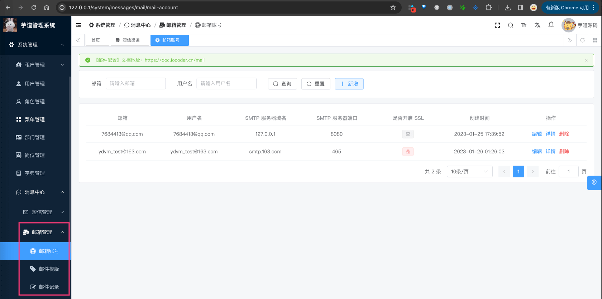

**② 邮件模版：管理邮件的内容模版**

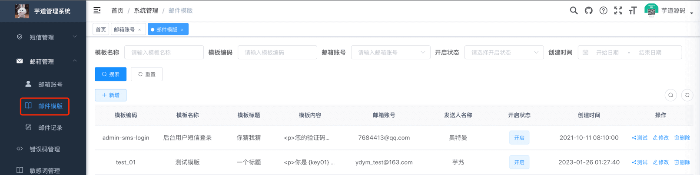

**③ 邮件记录：查看邮件的发送记录**

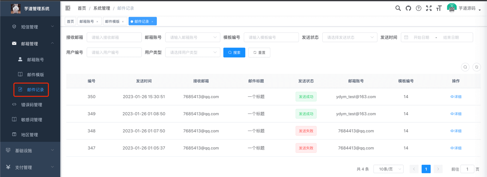

## [#](#_1-表结构) 1. 表结构


## [#](#_2-实现原理) 2. 实现原理

邮件功能提供统一的 API 给其它模块，使它们可以快速实现发送邮件的功能，无需关心不同邮件平台的具体对接。

邮件采用异步发送，基于 [消息队列](/message-queue/event)，如下图所示：

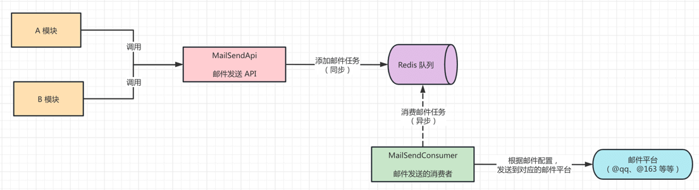

*   前端代码：[views/system/mail (opens new window)](https://github.com/yudaocode/yudao-ui-admin-vue2/blob/master/src/views/system/mail/)
*   后端代码：[controller/admin/mail (opens new window)](https://github.com/YunaiV/ruoyi-vue-pro/blob/master/yudao-module-system/yudao-module-system-biz/src/main/java/cn/iocoder/yudao/module/system/controller/admin/mail/)

最终使用 Hutool 的 [MailUtil (opens new window)](https://apidoc.gitee.com/dromara/hutool/cn/hutool/extra/mail/MailUtil.html) 发送邮件。

## [#](#_3-邮箱配置) 3. 邮箱配置

本小节，讲解如何配置邮件功能，整个过程如下：

1.  新建一个邮箱【账号】，配置邮件的发送账号
2.  新建一个邮件【模版】，配置邮件的内容模版
3.  测试该邮件模板，查看对应的邮件【日志】，确认是否发送成功

### [#](#_3-1-新建邮箱账号) 3.1 新建邮箱账号

① 点击 \[系统管理 -> 消息中心 -> 邮件管理 -> 邮箱账号\] 菜单，查看邮箱账号的列表。如下图所示：


② 点击 \[新增\] 按钮，添加一个邮箱账号，并填写信息如下图：

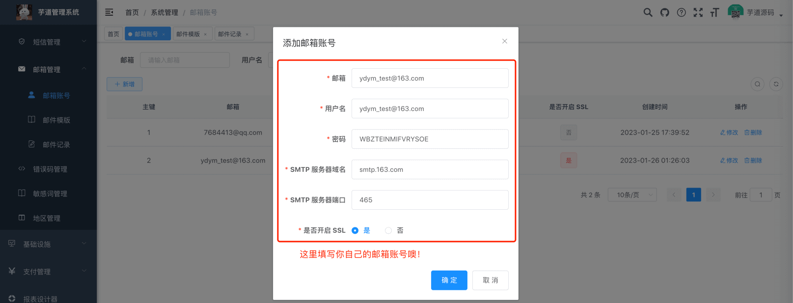

友情提示：

邮件发送基于 [SMTP (opens new window)](https://baike.baidu.com/item/SMTP/175887) 协议实现，需要开通账号的 STMP 服务。例如说：

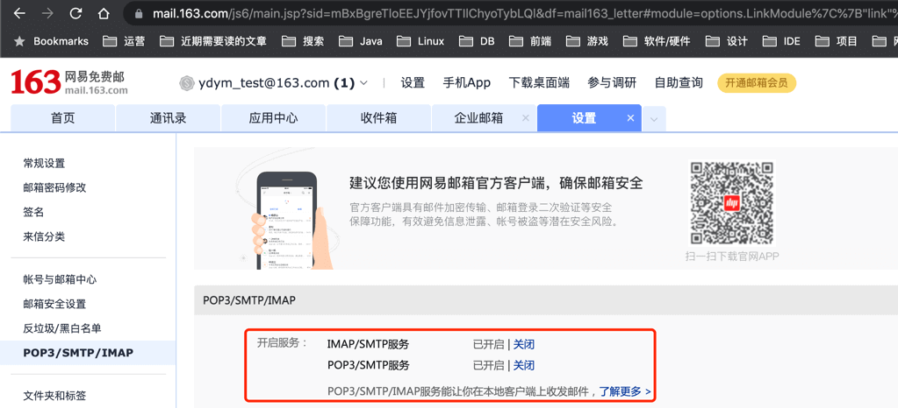

不同邮件平台的 SMTP 配置，可见 [「5. 邮箱平台附录」](#_5-%E9%82%AE%E7%AE%B1%E5%B9%B3%E5%8F%B0%E9%99%84%E5%BD%95) 小节。

③ 新增完成后，确认你的邮箱账号是否可以发送邮件，可通过如下代码：

```java
import cn.hutool.extra.mail.MailAccount;
import cn.hutool.extra.mail.MailUtil;

@Test
public void testDemo() {
    MailAccount mailAccount = new MailAccount()
//                .setFrom("奥特曼 <ydym_test@163.com>")
            .setFrom("ydym_test@163.com") // 邮箱地址
            .setHost("smtp.163.com").setPort(465).setSslEnable(true) // SMTP 服务器
            .setAuth(true).setUser("ydym_test@163.com").setPass("WBZTEINMIFVRYSOE"); // 登录账号密码
    String messageId = MailUtil.send(mailAccount, "7685413@qq.com", "主题", "内容", false);
    System.out.println("发送结果：" + messageId);
}

```

### [#](#_3-2-新建邮箱模版) 3.2 新建邮箱模版

① 点击 \[系统管理 -> 消息中心 -> 邮箱管理 -> 邮件模板\] 菜单，查看邮件模板的列表。如下图所示：


② 点击 \[新增\] 按钮，选择刚创建的邮箱账号，并填写信息如下图：

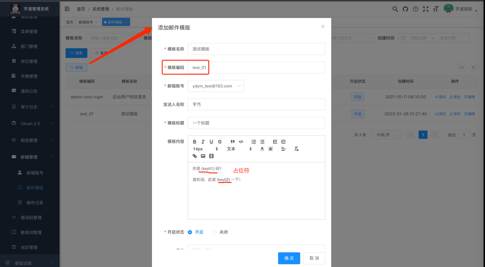

*   邮箱账号：发送该邮件模板时，使用的邮件账号，即使用哪个邮箱进行发送邮件
*   模版编号：邮件模板的唯一标识，使用邮件 API 时，通过它标识使用的邮件模板
*   发件人名称：发送邮件显示的发件人名字
*   模板内容：邮件模板的内容，使用 `{var}` 作为占位符，例如说 `{name}`、`{code}` 等
*   开启状态：邮件模板被禁用时，该邮件模板将不发送邮件，只记录邮件日志

疑问：为什么设计邮件模板的功能？

在一些场景下，产品会希望修改发送邮件的标题、内容，甚至邮箱账号，此时只需要修改邮件模版的对应属性，无需重启应用。

### [#](#_3-3-查看邮件日志) 3.3 查看邮件日志

① 点击 \[测试\] 按钮，输入测试的收件邮箱地址，进行该邮件模板的模拟发送。如下图所示：

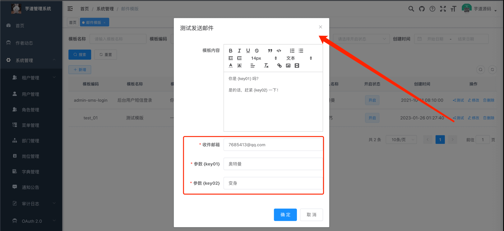

② 打开收件邮箱，查看邮件是否发送成功。如下图所示：

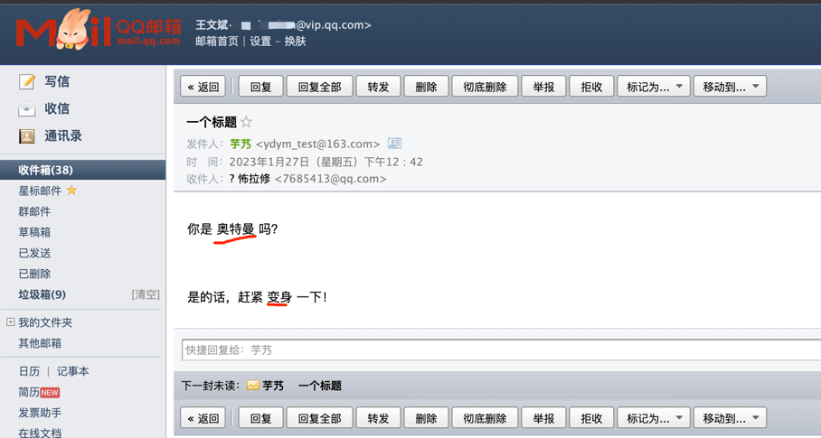

③ 点击 \[系统管理 -> 消息中心 -> 邮箱管理 -> 邮件日志\] 采单，可以查看到每条邮件的发送状态。如下图所示：

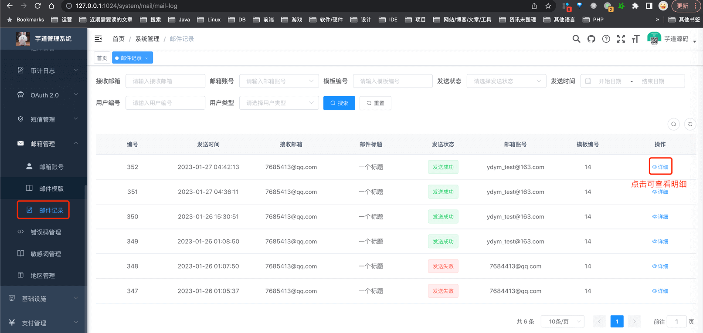

## [#](#_4-邮件发送) 4. 邮件发送
### [#](#_4-1-mailsendapi) 4.1 MailSendApi

[邮箱配置](#_3-%E9%82%AE%E7%AE%B1%E9%85%8D%E7%BD%AE)完成后，可使用 [MailSendApi (opens new window)](https://github.com/YunaiV/ruoyi-vue-pro/blob/master/yudao-module-system/yudao-module-system-api/src/main/java/cn/iocoder/yudao/module/system/api/mail/MailSendApi.java) 进行邮件的发送，支持多种用户类型。它的方法如下：

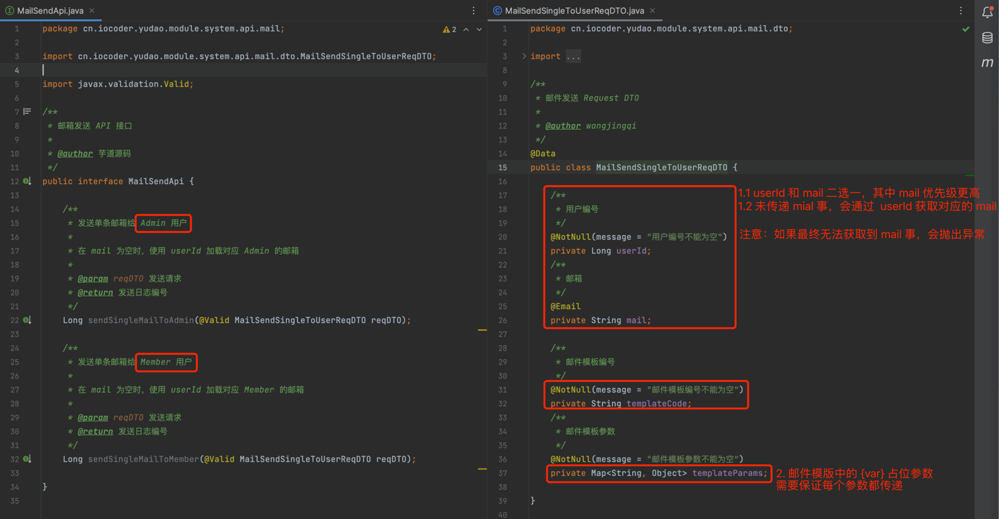

### [#](#_4-2-接入示例) 4.2 接入示例

以 `yudao-module-infra` 模块，需要发邮件为例子，讲解 SmsCodeApi 的使用。

① 在 `yudao-module-infra-biz` 模块的 [`pom.xml` (opens new window)](https://github.com/YunaiV/ruoyi-vue-pro/blob/master/yudao-module-infra/yudao-module-infra-biz/pom.xml) 引入 `yudao-module-system-api` 依赖，如所示：

```xml
<dependency>
    <groupId>cn.iocoder.boot</groupId>
    <artifactId>yudao-module-system-api</artifactId>
    <version>${revision}</version>
</dependency>

```

② 在代码中注入 SmsCodeApi Bean，并调用发送邮件的方法。代码如下：

```java
public class TestDemoServiceImpl implements TestDemoService {

    // 0. 注入 MailSendApi Bean
    @Resource
    private MailSendApi mailSendApi;

    public void sendDemo() {
        // 1. 准备参数
        Long userId = 1L; // 示例中写死，你可以改成你业务中的 userId 噢
        String templateCode = "test_01"; // 邮件模版，记得在【邮箱管理】中配置噢
        Map<String, Object> templateParams = new HashMap<>();
        templateParams.put("key1", "奥特曼");
        templateParams.put("key2", "变身");

        // 2. 发送邮件
        mailSendApi.sendSingleMailToAdmin(new MailSendSingleToUserReqDTO()
                .setUserId(userId).setTemplateCode(templateCode).setTemplateParams(templateParams));
    }
    
}

```

## [#](#_5-邮箱平台附录) 5. 邮箱平台附录

*   [《QQ 邮箱的 SMTP 设置》 (opens new window)](http://t.zoukankan.com/kimsbo-p-10671851.html)
*   [《网易 163 邮箱的 SMTP 设置》 (opens new window)](https://blog.csdn.net/qq_39933045/article/details/126957074)
*   [《QQ 邮箱、网易邮箱、腾讯企业邮箱、网易企业邮箱的 SMTP 设置》 (opens new window)](https://zhuanlan.zhihu.com/p/551399559)