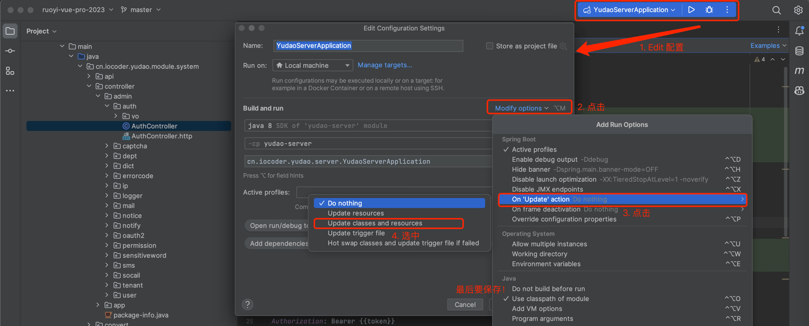
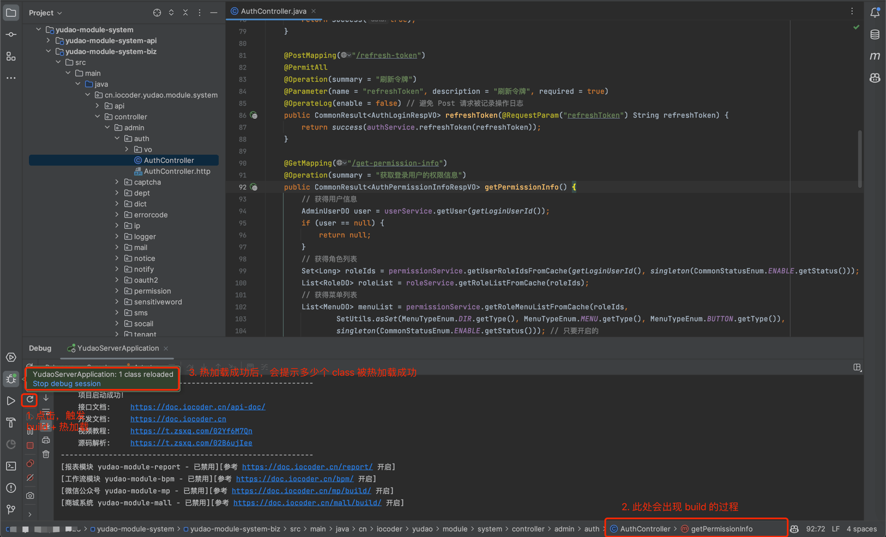
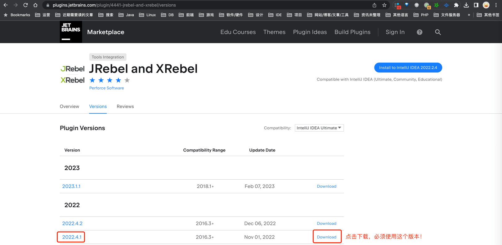
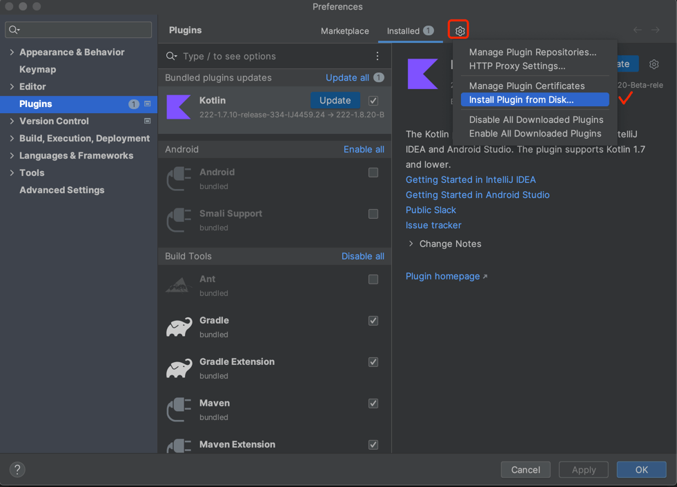
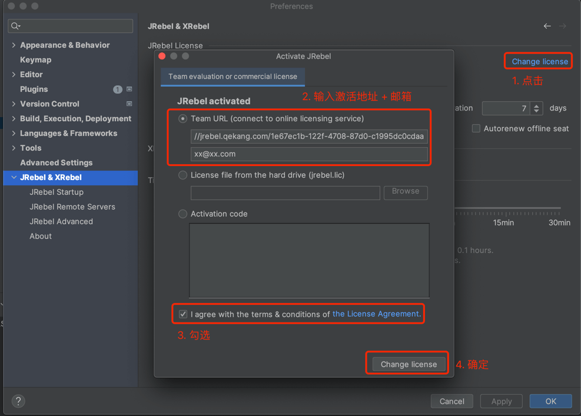
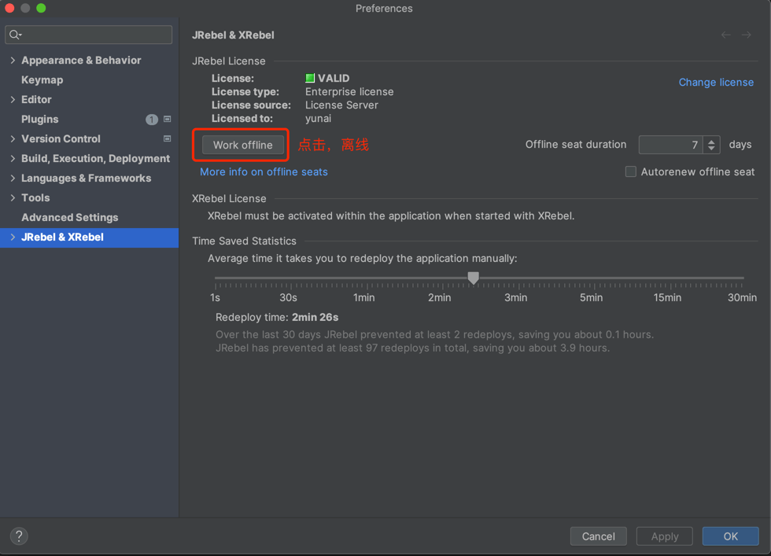
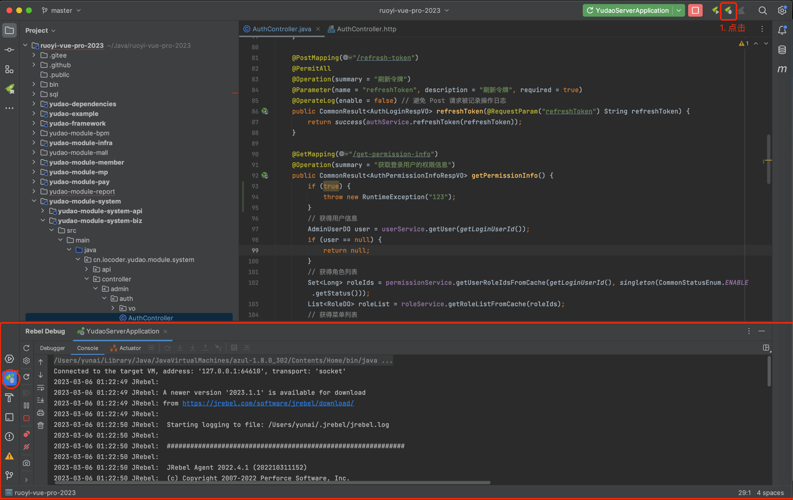
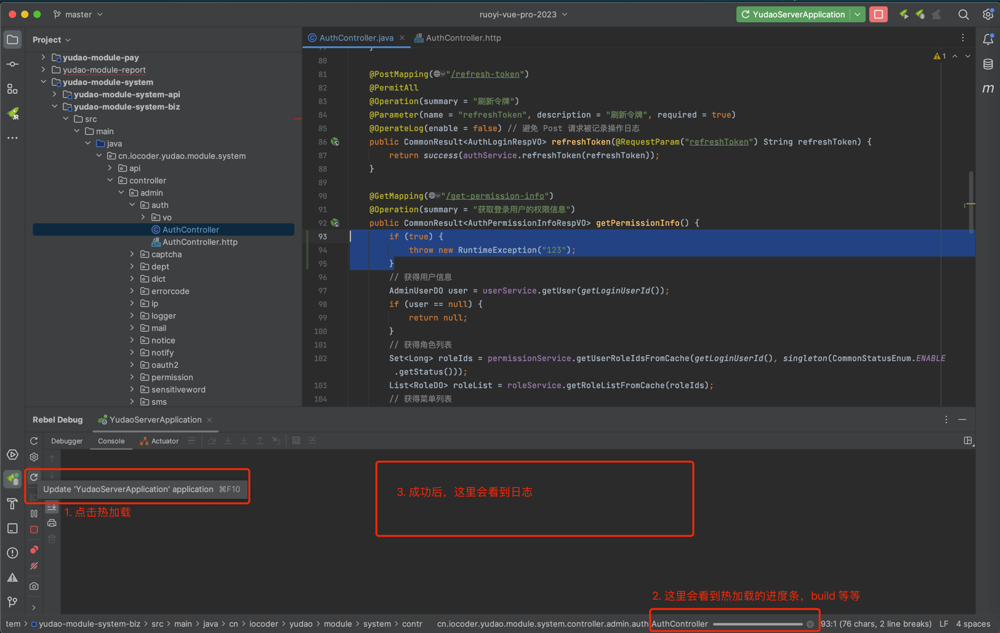

目录

# 代码热加载

在日常开发中，我们需要经常修改 Java 代码，手动重启项目，查看修改后的效果。如果在项目小时，重启速度比较快，等待的时间是较短的。但是随着项目逐渐变大，重启的速度变慢，等待时间 1-2 min 是比较常见的。

这样就导致我们开发效率降低，影响我们的下班时间，哈哈哈~

那么是否有方式能够实现，在我们修改完 Java 代码之后，能够不重启项目呢？答案是有的，通过 **代码热加载** 的方式。实现方案有三种：

1.  spring-boot-devtools【不推荐】
2.  IDEA 自带 HowSwap 功能【推荐】
3.  JRebel 插件【最推荐】

## [#](#_1-spring-boot-devtools) 1. spring-boot-devtools

[spring-boot-devtools (opens new window)](https://docs.spring.io/spring-boot/docs/current/reference/htmlsingle/#using.running-your-application.hot-swapping) 是 Spring Boot 提供的开发者工具，它会监控当前应用所在的 classpath 下的文件发生变化，进行**自动重启**。

devtools 存在重启速度较慢的问题，所以不推荐！

## [#](#_2-idea-自带-howswap-功能) 2. IDEA 自带 HowSwap 功能

该功能是 IDEA Ultimate 旗舰版的专属功能，不支持 IDEA Community 社区版。

### [#](#_2-1-如何使用) 2.1 如何使用

① 设置 Spring Boot 启动类，开启 HotSwap 功能。如下图所示：

② Debug 运行该启动类，等待项目启动完成。

③ 每次修改 Java 代码后，点击左下角的「热加载」按钮，即可实现代码热加载。如下图所示：

### [#](#_2-2-存在问题) 2.2 存在问题

IDEA 自带 HowSwap 功能，支持比较有限，很多修改都不支持。例如说：

*   只能增加方法或字段但不可以减少方法或字段
*   只能增加可见性不能减少
*   只能维持已有方法的签名而不能修改等等。

你可以认为，只支持方法内的代码修改热加载。

如果想要相对完美的方案，建议使用 JRebel 插件。

## [#](#_3-jrebel-插件【最推荐】) 3. JRebel 插件【最推荐】

JRebel 插件是目前最好用的热加载插件，它支持 IDEA Ultimate 旗舰版、Community 社区版。

### [#](#_3-1-如何安装) 3.1 如何安装

友情提示：不同的 JetBrains 版本，JRebel 插件的激活方式不同：

*   2022.4.1 版本：阅读本文即可。
*   2024.1.2 版本：[https://www.cnblogs.com/Flat-White/p/18090651 (opens new window)](https://www.cnblogs.com/Flat-White/p/18090651) （别的版本，应该也可以）

① 点击 [https://plugins.jetbrains.com/plugin/4441-jrebel-and-xrebel/versions (opens new window)](https://plugins.jetbrains.com/plugin/4441-jrebel-and-xrebel/versions) 地址，必须下载 **2022.4.1** 版本。如下图所示：

② 打开 \[Preference -> Plugins\] 菜单，点击「Install Plugin from Disk...」按钮，选择刚下载的 JRebel 插件的压缩包。如下图所示：

安装完成后，需要重启 IDEA 生效。

③ 打开 \[Preference -> JRebel & XRebel\] 菜单，输入 GUID address 为 `https://jrebel.qekang.com/1e67ec1b-122f-4708-87d0-c1995dc0cdaa` ，邮件随便写，完成 JRebel 的激活。如下图所示：

之后，点击「Work Offline」按钮，设置 JRebel 为离线，避免因为网络问题导致激活失效。如下图所示：

### [#](#_3-2-如何使用) 3.2 如何使用

① 点击「Debug With JRebel」按钮，使用 JRebel 启动项目。如下图所示：

② 每次修改 Java 代码后，点击左下角的「热加载」按钮，即可实现代码热加载。如下图所示：

