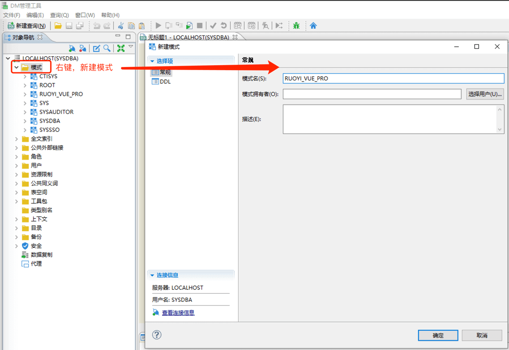
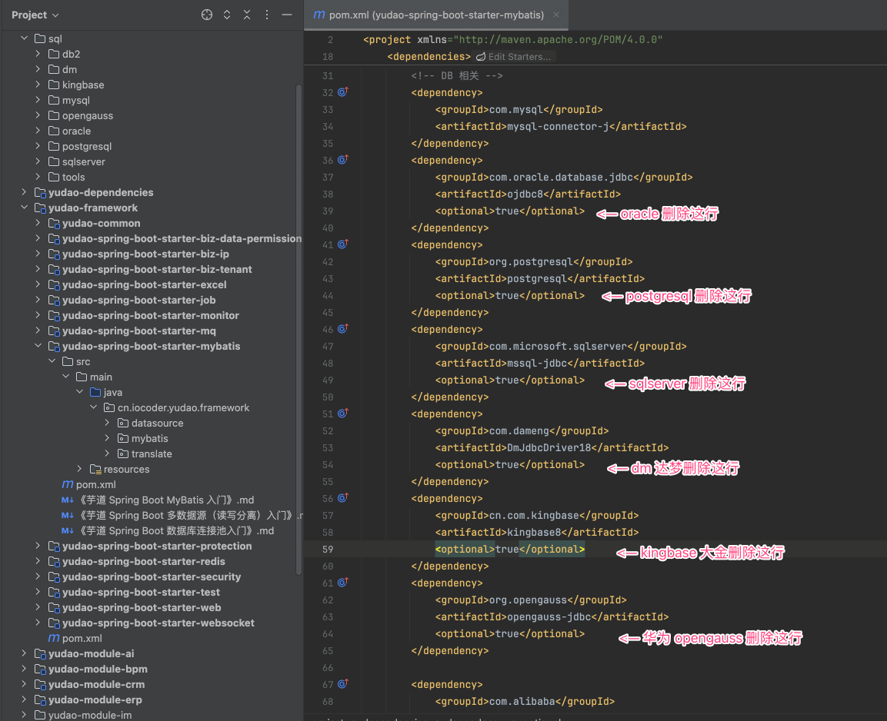
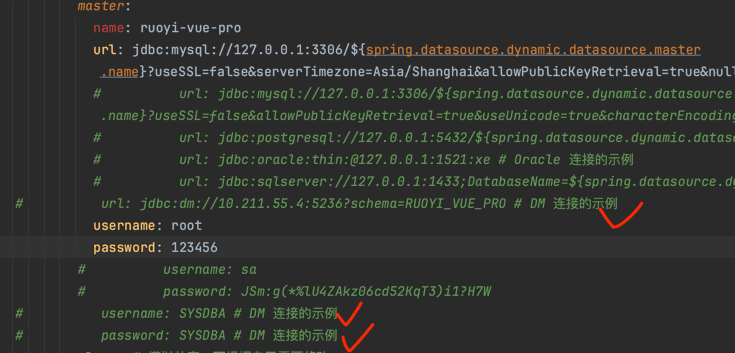
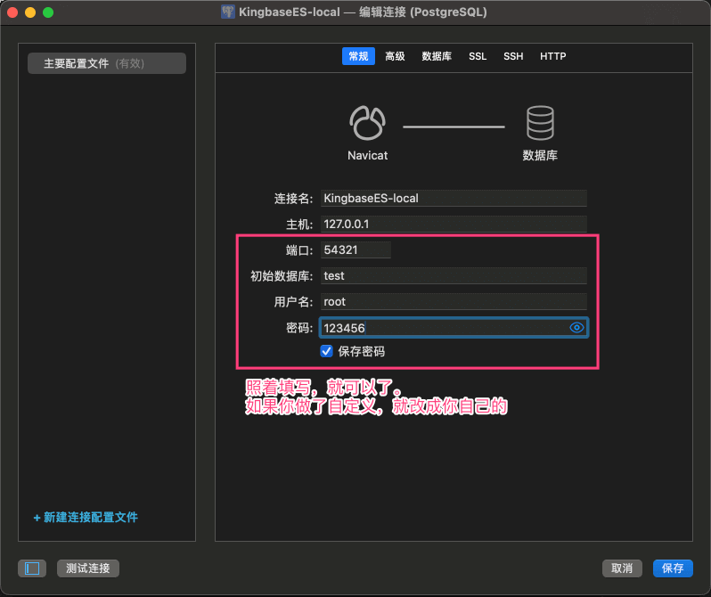
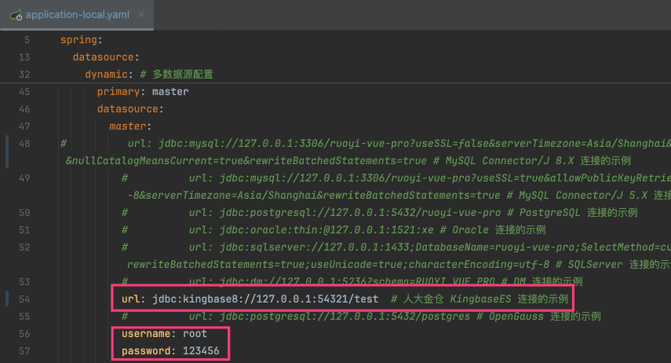
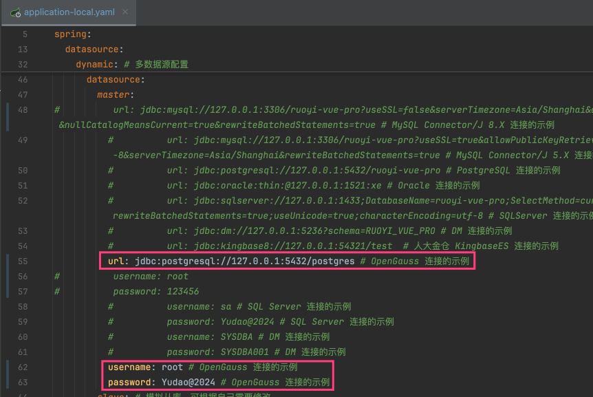

目录

# 国产信创数据库（DM 达梦、大金、OpenGauss）

## [#](#_1-dm-达梦数据库) 1. DM 达梦数据库
### [#](#_1-1-如何安装) 1.1 如何安装？

可以使用 Windows 或 Docker 等多种方式。

注意，目前我们使用的是 DM 8.0 的版本。

#### [#](#_1-1-windows-方式) 1.1 Windows 方式

参考 [官方文档 (opens new window)](https://eco.dameng.com/document/dm/zh-cn/start/install-dm-windows-prepare.html)

① 访问 [https://eco.dameng.com/download/ (opens new window)](https://eco.dameng.com/download/) 地址，点击“开发版 (X86平台)”选项，进行下载。

② 傻瓜式安装、数据库实例化，一路下去就好，不用修改任何参数。

#### [#](#_1-2-docker-方式) 1.2 Docker 方式

参考 [官方文档 (opens new window)](https://eco.dameng.com/document/dm/zh-cn/start/dm-install-docker.html)

① 访问 [https://eco.dameng.com/download/ (opens new window)](https://eco.dameng.com/download/) 地址，点击“Docker 镜像”选项，进行下载。

② 执行如下脚本，启动 Docker 服务：

```bash
docker load -i dm8_20240715_x86_rh6_rq_single.tar

docker run -d -p 5236:5236 \
    --restart=unless-stopped \
    --name dm8_test \
    --privileged=true \
    -e PAGE_SIZE=16 \
    -e LD_LIBRARY_PATH=/opt/dmdbms/binn \
    -e EXTENT_SIZE=32 \
    -e BLANK_PAD_MODE=1 \
    -e LOG_SIZE=1024 \
    -e UNICODE_FLAG=1 \
    -e LENGTH_IN_CHAR=1 \
    -e INSTANCE_NAME=dm8_test \
    -v $PWD/dm8_test:/opt/dmdbms/data \
    dm8_single:dm8_20240715_rev232765_x86_rh6_64

```

备注：可以尝试使用大小写不敏感配置 `-e CASE_SENSITIVE=N`。需要停止并删除容器后，删除 `dm8_test` 目录，重新`docker run`。

### [#](#_1-2-如何导入数据) 1.2 如何导入数据？

使用 [DM 管理工具 (opens new window)](https://eco.dameng.com/document/dm/zh-cn/start/tool-dm-manager.html) 进行数据的导入。如果你不是很了解，已可以看看文档：

*   [《达梦数据库（二）DM Manager 管理工具》 (opens new window)](https://www.modb.pro/db/432934)
*   [《达梦数据库导入 SQL》 (opens new window)](https://blog.51cto.com/u_16213594/7289559)

具体步骤如下：

① 使用 DM 管理工具，新建一个名字为 `RUOYI_VUE_PRO` 的 schema 模式。如下图所示：



为什么名字是 RUOYI\_VUE\_PRO 呢？

因为稍后使用的 `sql/dm/ruoyi-vue-pro-dm8.sql` 文件，使用的 schema 是它噢。后续跑通了，你可以按照自己的修改。

② 点击 DM 管理工具的 \[执行 -> 执行脚本\] 菜单，选中项目中的 `sql/dm/ruoyi-vue-pro-dm8.sql` 文件，之后点击 \[绿色箭头\] 进行执行即可。

友情提示：如果你不想 DM 管理工具，也可以使用其它工具：

*   [《DataGrip 连接达梦数据库》 (opens new window)](https://blog.csdn.net/Downton97/article/details/108470881)
*   [《DBeaver 连接达梦数据库 》 (opens new window)](https://blog.csdn.net/qq_45363655/article/details/135456705)

### [#](#_1-3-如何启动项目) 1.3 如何启动项目？

① 修改 `yudao-spring-boot-starter-mybatis` 模块的 `pom.xml` 文件，将 DM 依赖的 `DmJdbcDriver18` 的 `optional` 移除（注意，需要使用 IDEA 刷新下 Maven 的依赖）。如下图所示：



② 修改 `application-local.yaml` 配置文件，将数据库的 `url`、`username`、`password` 修改为 DM 数据库。例如说：



③ 后续启动项目，就可以了。

疑问：启动报“无效的模式名\[RUOYI\_VUE\_PRO\]”错误，怎么解决？

可以把上图的 `url` 中的 `?schema=RUOYI_VUE_PRO` 部分去掉后，再重启下，试试看。

### [#](#_1-4-常见问题) 1.4 常见问题？
#### [#](#_1-4-1-大小写敏感) 1.4.1 大小写敏感？

参考 [《详解 DM 数据库字符串大小写敏感》 (opens new window)](https://eco.dameng.com/community/article/df11811a02de8e923c2e57ef6597bc62) 文档

#### [#](#_1-4-2-quartz-定时任务) 1.4.2 Quartz 定时任务？

Quartz 定时任务，已经适配，直接参考 [《定时任务》](/job) 使用。

实现思路非常简单：

*   Quartz 初始化使用 [`tables_oracle` (opens new window)](https://github.com/quartznet/quartznet/blob/main/database/tables/tables_oracle.sql) 脚本，去掉前面的 `delete` 和 `drop` 部分
*   `spring.quartz.properties.org.quartz.jobStore.driverDelegateClass` 使用 `org.quartz.impl.jdbcjobstore.StdJDBCDelegate` 类。不过网上也有人说使用 `org.quartz.impl.jdbcjobstore.oracle.OracleDelegate` 类，我暂时没跑成功

#### [#](#_1-4-3-flowable-工作流) 1.4.3 Flowable 工作流？

Flowable 工作流的适配，可参考 [《工作流（达梦适配）》](/bpm/dameng/)。

短期内暂时没时间适配，欢迎你搞了之后，pull request 贡献给项目，从而帮助到更多人！

## [#](#_2-kingbasees-大金数据库) 2. KingbaseES 大金数据库
### [#](#_1-1-如何安装-2) 1.1 如何安装？

可以使用 Windows 或 Docker 等多种方式。

注意，目前我们使用的是 V008R006C008B0020 的版本。

#### [#](#_1-1-windows-方式-2) 1.1 Windows 方式

参考 [官方文档 (opens new window)](https://help.kingbase.com.cn/v8/install-updata/install-windows/index.html)

#### [#](#_1-2-docker-方式-2) 1.2 Docker 方式

参考 [官方文档 (opens new window)](https://help.kingbase.com.cn/v8/install-updata/install-docker/index.html)

① 访问 [https://www.kingbase.com.cn/xzzx/index.htm (opens new window)](https://www.kingbase.com.cn/xzzx/index.htm) 地址，点击左侧的“软件版本 -> 数据库” 菜单，再点击“docker镜像”选项，进行下载：

*   [x86\_64 版本 (opens new window)](https://kingbase.oss-cn-beijing.aliyuncs.com/KESV8R3/V009R001C001B0025-%E5%AE%89%E8%A3%85%E5%8C%85-docker/x86_64/kdb_x86_64_V009R001C001B0025.tar) 【Windows 选择这个】
*   [aarch64 版本 (opens new window)](https://kingbase.oss-cn-beijing.aliyuncs.com/KESV8R3/V009R001C001B0025-%E5%AE%89%E8%A3%85%E5%8C%85-docker/aarch64/kdb_aarch64_V009R001C001B0025.tar) 【MacBook Apple Silicon 选择这个】

② 执行如下脚本，启动 Docker 服务：

```bash
docker load -i kdb_x86_64_V009R001C001B0025.tar

docker run -d -p 54321:54321 \
    --restart=unless-stopped \
    --name kingbase_test \
    --privileged=true \
    -e NEED_START=yes  \
    -e DB_USER=root  \
    -e DB_PASSWORD=123456  \
    -e DB_MODE=oracle  \
    kingbase_v009r001c001b0025_single_x86:v1

```

### [#](#_2-2-如何导入数据) 2.2 如何导入数据？

① 使用 Navicat 工具，选择 PostgreSQL 数据库，即可连接。如下图所示：



② 选择 `test` 数据库的 `public` 模式，右键选择“运行 SQL 文件”，选择项目中的 `sql/kingbasees/ruoyi-vue-pro.sql` 文件，之后点击 \[开始\] 按钮。

### [#](#_2-3-如何启动项目) 2.3 如何启动项目？

① 修改 `yudao-spring-boot-starter-mybatis` 模块的 `pom.xml` 文件，将 KingbaseES 依赖的 `kingbasees-jdbc` 的 `optional` 移除（注意，需要使用 IDEA 刷新下 Maven 的依赖）。如下图所示：


② 修改 `application-local.yaml` 配置文件，将数据库的 `url`、`username`、`password` 修改为 KingbaseES 数据库。例如说：



③ 后续启动项目，就可以了。

### [#](#_2-4-常见问题) 2.4 常见问题？
#### [#](#_2-4-1-quartz-定时任务) 2.4.1 Quartz 定时任务？

Quartz 定时任务，已经适配，直接参考 [《定时任务》](/job) 使用。

实现思路非常简单：

*   Quartz 初始化使用 [`tables_postgres` (opens new window)](https://github.com/quartznet/quartznet/blob/main/database/tables/tables_postgres.sql) 脚本
*   `spring.quartz.properties.org.quartz.jobStore.driverDelegateClass` 使用 `org.quartz.impl.jdbcjobstore.StdJDBCDelegate` 类。

#### [#](#_2-4-2-flowable-工作流) 2.4.2 Flowable 工作流？

Flowable 工作流的适配，可参考如下文章：

*   [《flowable 6.7.2 在 spring boot 项目中兼容人大金仓》 (opens new window)](https://blog.csdn.net/LuoGuoHua_Xin/article/details/129898193)
*   [《flowable 适配人大金仓 Kingbase 数据库》 (opens new window)](https://www.cnblogs.com/montaro/p/17956719)
*   [《【Kingbase8 数据库】flowable兼容人大金仓 Kingbase8 过程》 (opens new window)](https://juejin.cn/post/7349791638111354890)

短期内暂时没时间适配，欢迎你搞了之后，pull request 贡献给项目，从而帮助到更多人！

## [#](#_3-华为-opengauss) 3. 华为 OpenGauss
### [#](#_3-1-如何安装) 3.1 如何安装？

可以使用 Linux 或 Docker 等多种方式。

注意，目前我们使用的是 openGauss 5.0.0 的版本。

友情提示：openGauss 不支持 Windows 系统，所以请使用 Linux 或 Docker 等方式。

#### [#](#_3-1-docker-方式) 3.1 Docker 方式

执行如下脚本，启动 Docker 服务：

```bash
docker run -d \
  --name opengauss-test \
  --restart unless-stopped \
  -e GS_USERNAME=root \
  -e GS_PASSWORD=Yudao@2024 \
  -e LD_LIBRARY_PATH=/usr/local/opengauss/lib:/usr/lib \
  -p 5432:5432 \
  opengauss/opengauss:5.0.0

```

### [#](#_3-2-如何导入数据) 3.2 如何导入数据？

① 参考 [《用 JetBrains DataGrip 连接 Huawei openGauss》 (opens new window)](https://blog.itdevwu.com/post/1632/) 文档，连接 openGauss 数据库。

疑问：为什么不使用 Navicat 进行连接？

因为 Navicat 不支持 openGauss 数据库，而使用 PostgreSQL 进行连接，会出现 “none of the server's SASL authentication mechanisms are supported” 报错。

② 选择 `postgres` 数据库，右键选择“SQL Scripts -> Run SQL Script...”，选择项目中的 `sql/opengauss/ruoyi-vue-pro.sql` 文件，之后执行。

### [#](#_3-3-如何启动项目) 3.3 如何启动项目？

① 修改 `yudao-spring-boot-starter-mybatis` 模块的 `pom.xml` 文件，将 openGauss 依赖的 `opengauss` 的 `optional` 移除（注意，需要使用 IDEA 刷新下 Maven 的依赖）。如下图所示：


② 修改 `application-local.yaml` 配置文件，将数据库的 `url`、`username`、`password` 修改为 openGauss 数据库。例如说：



::: 疑问：为什么 jdbc 使用 postgres 数据库连接？

因为 openGauss 是兼容 PostgreSQL 的，所以 JDBC 驱动使用的是 `org.postgresql.Driver`。这样，后续和 Quartz 定时任务、Flowable 工作流等等，都是可以兼容的。 :::

③ 后续启动项目，就可以了。

### [#](#_3-4-常见问题) 3.4 常见问题？
#### [#](#_3-4-1-quartz-定时任务) 3.4.1 Quartz 定时任务？

Quartz 定时任务，已经适配，直接参考 [《定时任务》](/job) 使用。

实现思路非常简单（因为 jdbc 使用 postgres 数据库连接）：

*   Quartz 初始化使用 [`tables_postgres` (opens new window)](https://github.com/quartznet/quartznet/blob/main/database/tables/tables_postgres.sql) 脚本

#### [#](#_3-4-2-flowable-工作流) 3.4.2 Flowable 工作流？

Flowable 工作流，已经适配，直接参考 [《工作流》](/bpm/) 使用。

也是因为 jdbc 使用 postgres 数据库连接，所以无需去兼容。