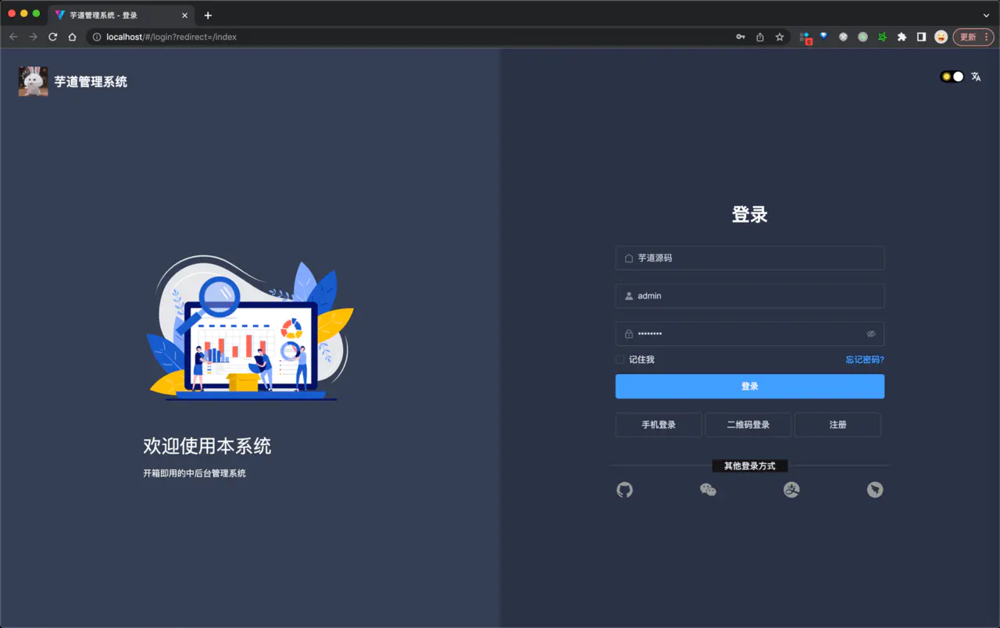
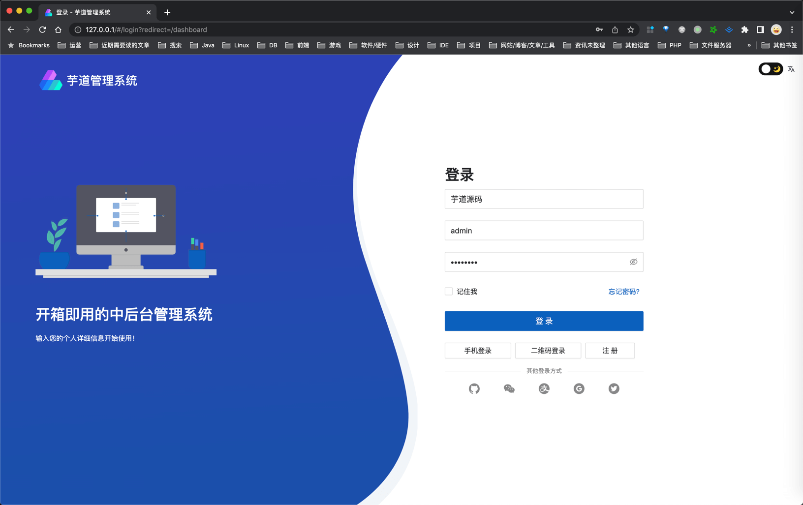
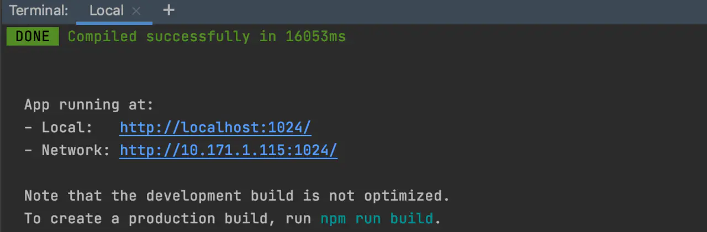
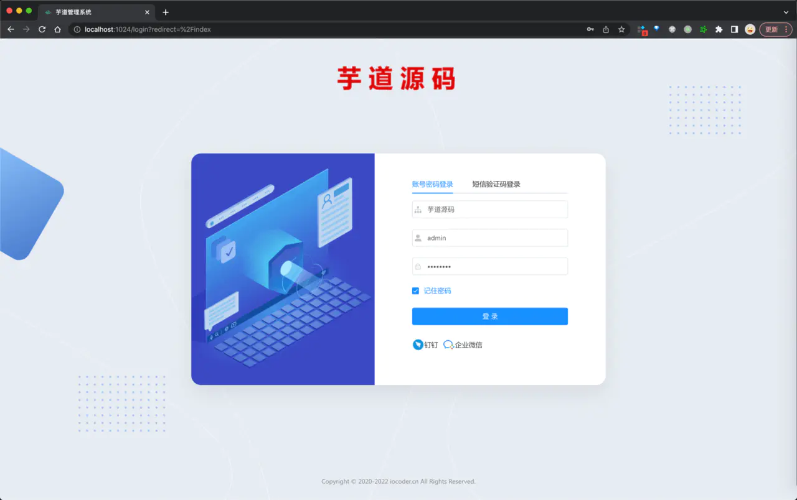
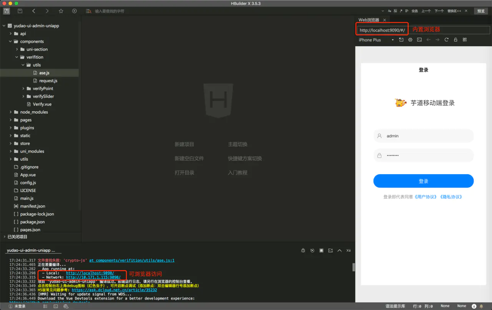
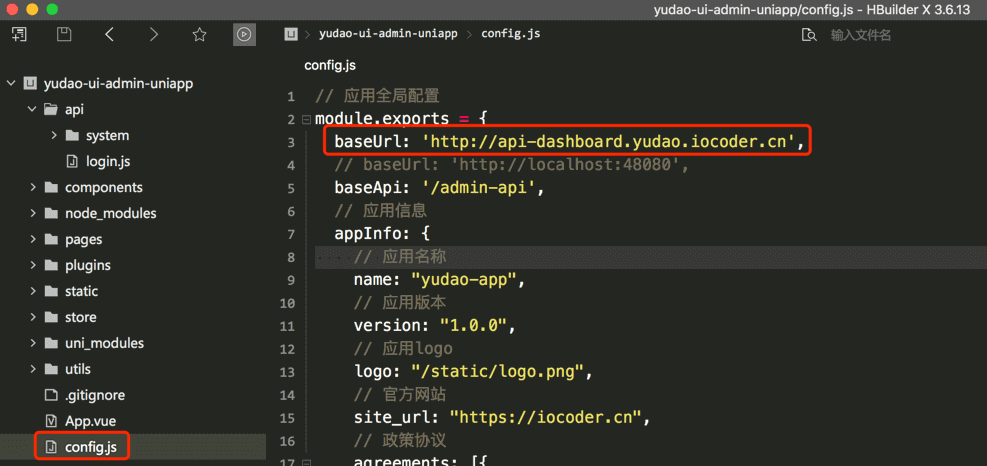
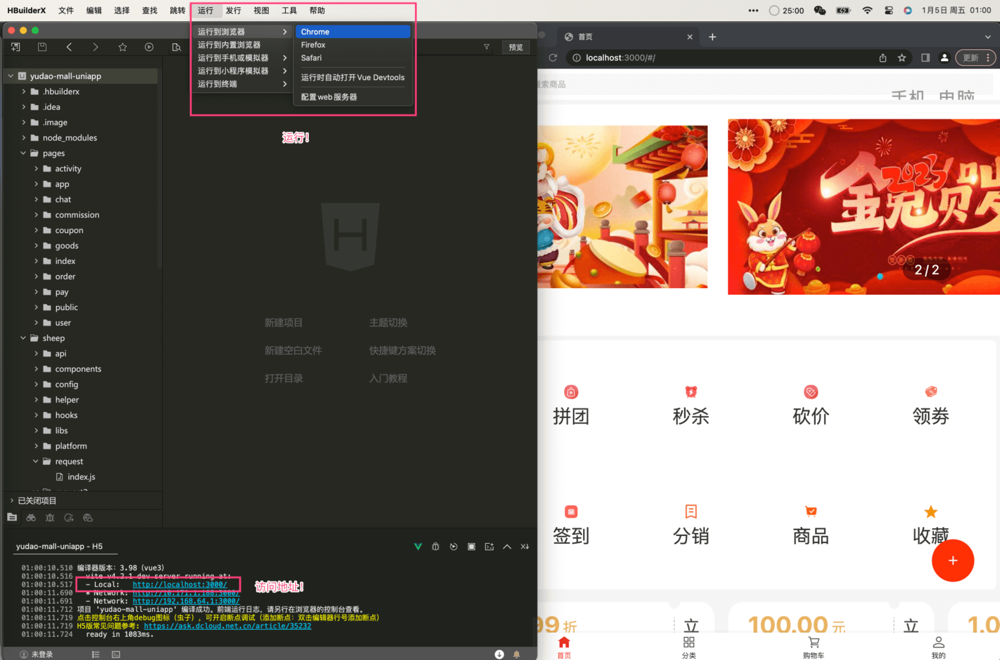
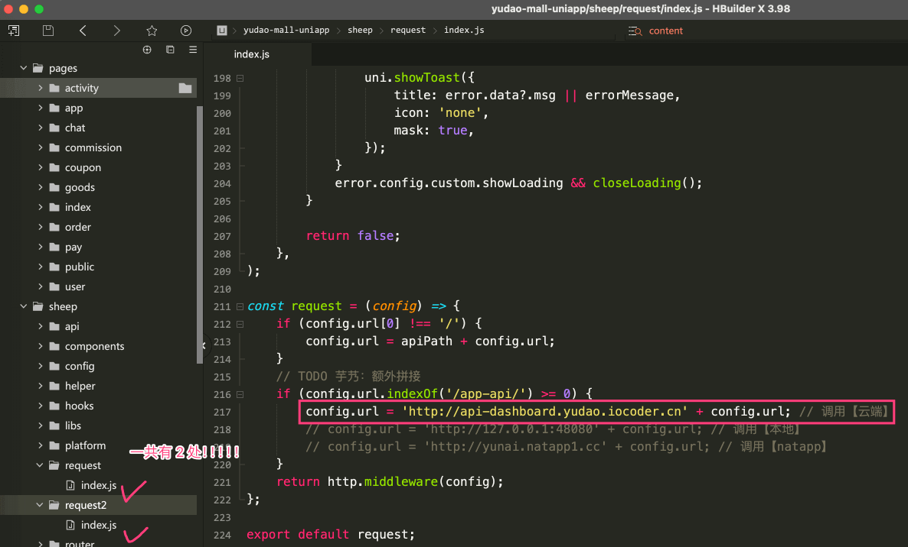

目录

# 快速启动（前端项目）

目标：将项目 [ruoyi-vue-pro (opens new window)](https://github.com/YunaiV/ruoyi-vue-pro) 的前端项目运行起来 🛫

整个过程非常简单，预计 5 分钟就可以完成，取决于大家的网速。

> ↓↓↓ 技术交流群，一起苦练技术基本功，每日精进 30 公里！↓↓↓


> 友情提示：可能胖友本地没有安装 Node.js 的环境，导致报错。可以参考如下文档安装：
> 
> *   Windows 安装 Node.js 指南：[http://www.iocoder.cn/NodeJS/windows-install (opens new window)](http://www.iocoder.cn/NodeJS/windows-install)
> *   Mac 安装 Node.js 指南：[http://www.iocoder.cn/NodeJS/mac-install (opens new window)](http://www.iocoder.cn/NodeJS/mac-install)

## [#](#👍-相关视频教程) 👍 相关视频教程

*   [从零开始 02：在 Windows 环境下，如何运行前后端项目？ (opens new window)](https://t.zsxq.com/07BeiEA6Q)
*   [从零开始 03：在 MacOS 环境下，如何运行前后端项目？ (opens new window)](https://t.zsxq.com/07FUNnYFm)

## [#](#_1-管理后台) 1. 管理后台

项目的管理后台有 4 个版本：

*   [`yudao-ui-admin-vue3` (opens new window)](https://github.com/yudaocode/yudao-ui-admin-vue3/)：基于 Vue3 + element-plus
*   [`yudao-ui-admin-vben` (opens new window)](https://github.com/yudaocode/yudao-ui-admin-vben/)：基于 Vue3 + vben(ant-design-vue)
*   [`yudao-ui-admin-vue2` (opens new window)](https://github.com/yudaocode/yudao-ui-admin-vue2/)：基于 Vue2 + element-ui
*   [`yudao-ui-admin-uniapp` (opens new window)](https://github.com/yudaocode/yudao-ui-admin-uniapp/)：基于 Vue2 + uni-app

### [#](#_1-1-vue3-element-plus-版本) 1.1 Vue3 + element-plus 版本

[`yudao-ui-admin-vue3` (opens new window)](https://github.com/yudaocode/yudao-ui-admin-vue3/) 是前端 Vue3 管理后台项目。

① 克隆 [https://github.com/yudaocode/yudao-ui-admin-vue3.git (opens new window)](https://github.com/yudaocode/yudao-ui-admin-vue3.git) 项目，并 Star 关注下该项目。

② 在根目录执行如下命令，进行启动：

```bash
# 安装 pnpm，提升依赖的安装速度
npm config set registry https://registry.npmmirror.com
npm install -g pnpm
# 安装依赖
pnpm install

# 启动服务
npm run dev

```

③ 启动完成后，浏览器会自动打开 [http://localhost:80 (opens new window)](http://localhost:80) 地址，可以看到前端界面。



友情提示：Vue3 使用 Vite 构建，所以它存在如下的情况，都是正常的：

1.  项目启动很快，浏览器打开需要等待 1 分钟左右，请保持耐心。
2.  点击菜单，感觉会有一点卡顿，因为 Vite 采用懒加载机制。不用担心，最终部署到生产环境，就不存在这个问题了。

详细说明，可见 [《为什么有人说 Vite 快，有人却说 Vite 慢？》 (opens new window)](https://juejin.cn/post/7129041114174062628) 文章。

疑问：我是前端工程师，不想启动后端项目，怎么办？

可以将上述的 `npm run dev` 命令，替代成 `npm run dev-server` 命令。

**远程** 演示环境的后端服务，只允许 `GET` 请求，不允许 `POST`、`PUT`、`DELETE` 等请求。

### [#](#_1-2-vue3-vben-ant-design-vue-版本) 1.2 Vue3 + vben(ant-design-vue) 版本

[`yudao-ui-admin-vue3` (opens new window)](https://github.com/yudaocode/yudao-ui-admin-vben/) 是前端 Vue3 + vben(ant-design-vue) 管理后台项目。

① 克隆 [https://github.com/yudaocode/yudao-ui-admin-vben.git (opens new window)](https://github.com/yudaocode/yudao-ui-admin-vben.git) 项目，并 Star 关注下该项目。

② 在根目录执行如下命令，进行启动：

```bash
# 安装 pnpm，提升依赖的安装速度
npm config set registry https://registry.npmmirror.com
npm install -g pnpm
# 安装依赖
pnpm install

# 启动服务
npm run dev

```

③ 启动完成后，浏览器会自动打开 [http://localhost:80 (opens new window)](http://localhost:80) 地址，可以看到前端界面。



疑问：我是前端工程师，不想启动后端项目，怎么办？

可以将上述的 `npm run dev` 命令，替代成 `npm run front` 命令。

**远程** 演示环境的后端服务，只允许 `GET` 请求，不允许 `POST`、`PUT`、`DELETE` 等请求。

### [#](#_1-3-vue2-element-ui-版本) 1.3 Vue2 + element-ui 版本

[`yudao-ui-admin-vue2` (opens new window)](https://github.com/yudaocode/yudao-ui-admin-vue2/) 是前端 Vue2 管理后台项目。

① 克隆 [https://github.com/yudaocode/yudao-ui-admin-vue2.git (opens new window)](https://github.com/yudaocode/yudao-ui-admin-vue2.git) 项目，并 Star 关注下该项目。

② 在根目录执行如下命令，进行启动：

```bash
# 安装 Yarn，提升依赖的安装速度
npm install --global yarn
# 安装依赖
yarn install

# 启动服务
npm run local

```



② 启动完成后，浏览器会自动打开 [http://localhost:1024 (opens new window)](http://localhost:1024) 地址，可以看到前端界面。



疑问：我是前端工程师，不想启动后端项目，怎么办？

可以将上述的 `npm run local` 命令，替代成 `npm run front` 命令。

**远程** 演示环境的后端服务，只允许 `GET` 请求，不允许 `POST`、`PUT`、`DELETE` 等请求。

### [#](#_1-4-vue2-uni-app-版本) 1.4 Vue2 + uni-app 版本

[`yudao-ui-admin-uniapp` (opens new window)](https://github.com/yudaocode/yudao-ui-admin-uniapp/) 是前端 uni-app 管理后台项目。

① 克隆 [https://github.com/yudaocode/yudao-ui-admin-uniapp.git (opens new window)](https://github.com/yudaocode/yudao-ui-admin-uniapp.git) 项目，并 Star 关注下该项目。

② 下载 [HBuilder (opens new window)](https://www.dcloud.io/hbuilderx.html) 工具，并进行安装。

③ 点击 HBuilder 的 \[文件 -> 导入 -> 从本地项目导入...\] 菜单，选择项目的 `yudao-ui-admin-uniapp` 目录。

④ 执行如下命令，安装 npm 依赖：

```bash
# 安装 npm 依赖
npm i

```

⑤ 点击 HBuilder 的 \[运行 -> 运行到内置浏览器\] 菜单，使用 H5 的方式运行。成功后，界面如下图所示：



友情提示：登录时，滑块验证码，在内存浏览器可能存在兼容性的问题，此时使用 Chrome 浏览器，并使用“开发者工具”，设置为 iPhone 12 Pro 模式！

疑问：我是前端工程师，不想启动后端项目，怎么办？

修改 `config.js` 配置文件的 `baseUrl` 后端服务的地址为 `'http://api-dashboard.yudao.iocoder.cn`。如下图所示：



**远程** 演示环境的后端服务，只允许 `GET` 请求，不允许 `POST`、`PUT`、`DELETE` 等请求。

## [#](#_2-uni-app-商城移动端) 2. uni-app 商城移动端

[`yudao-mall-uniapp` (opens new window)](https://github.com/yudaocode/yudao-mall-uniapp) 是前端 uni-app 商城移动端项目。

前置任务：

需要参考 [《商城手册 —— 功能开启》](/mall/build/) 文档，将商城的后端启动。

① 克隆 [https://github.com/yudaocode/yudao-mall-uniapp (opens new window)](https://github.com/yudaocode/yudao-mall-uniapp) 项目，并 Star 关注下该项目。

② 下载 [HBuilder (opens new window)](https://www.dcloud.io/hbuilderx.html) 工具，并进行安装。

③ 点击 HBuilder 的 \[文件 -> 导入 -> 从本地项目导入...\] 菜单，选择克隆的 `yudao-mall-uniapp` 目录

④ 执行如下命令，安装 npm 依赖：

```bash
# 安装 npm 依赖
npm i

```

⑤ 点击 HBuilder 的 \[运行 -> 运行到浏览器 -> Chrome\] 菜单，使用 H5 的方式运行。成功后，界面如下图所示：



疑问：我是前端工程师，不想启动后端项目，怎么办？

搜索 `http://127.0.0.1:48080` 关键字，修改后端服务的地址为 `'http://api-dashboard.yudao.iocoder.cn/`。如下图所示：



## [#](#_666-参与项目) 666. 参与项目

如果你想参与到前端项目的开发，可以微信 wangwenbin-server 噢。

近期，重点开发 Vue3 管理后台、uniapp 商城，欢迎大家参与进来。