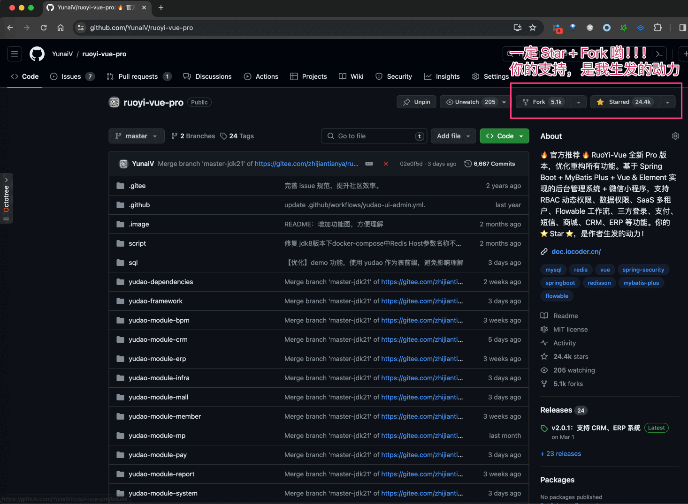
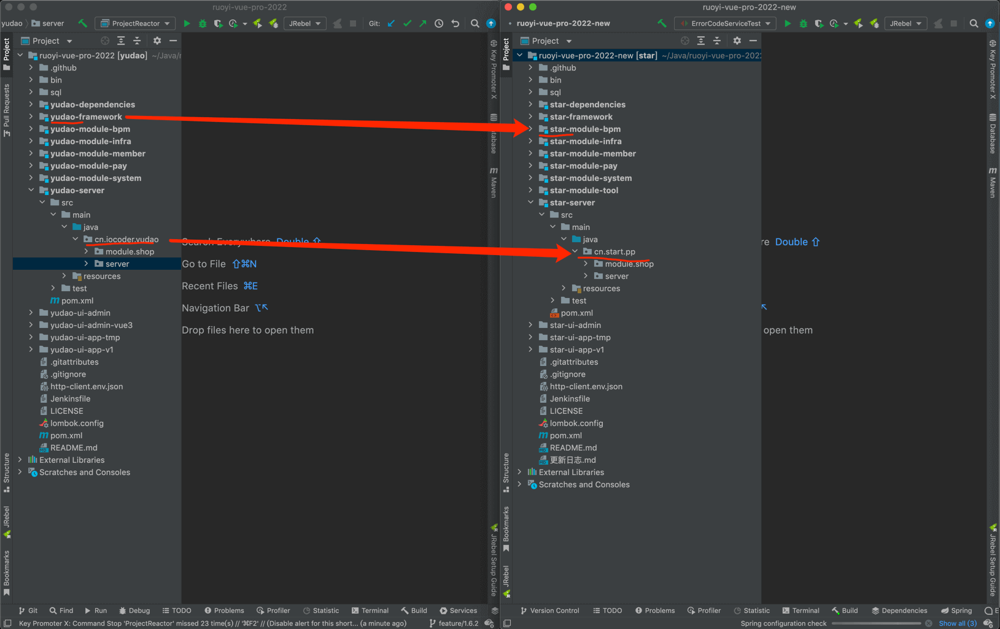
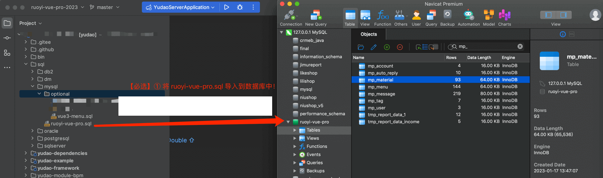
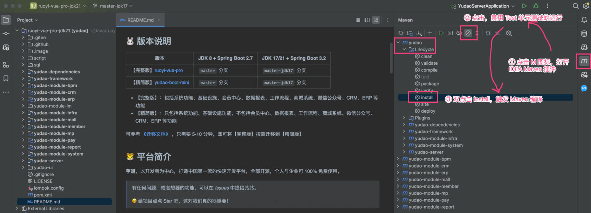
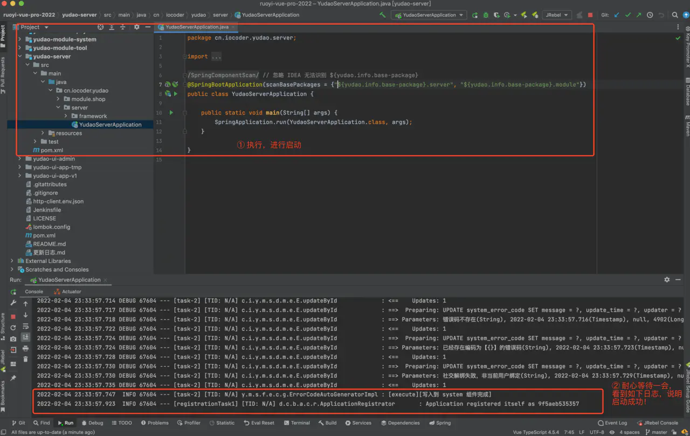
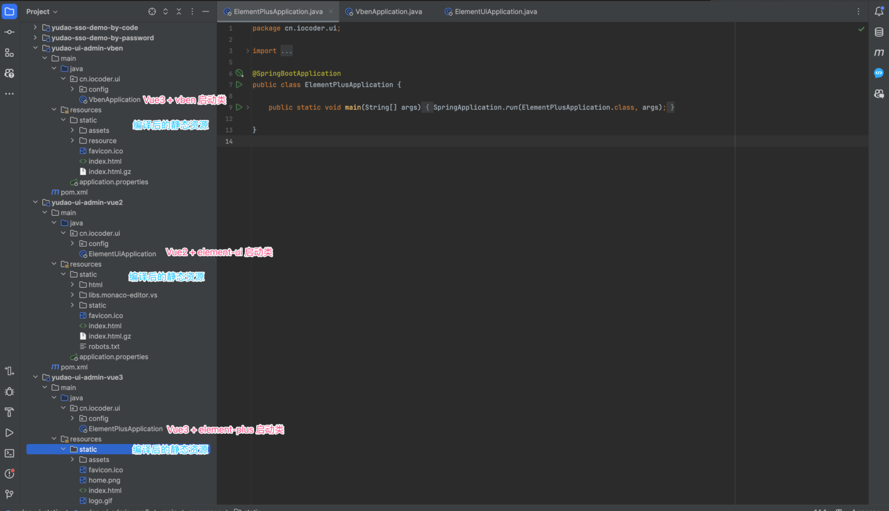
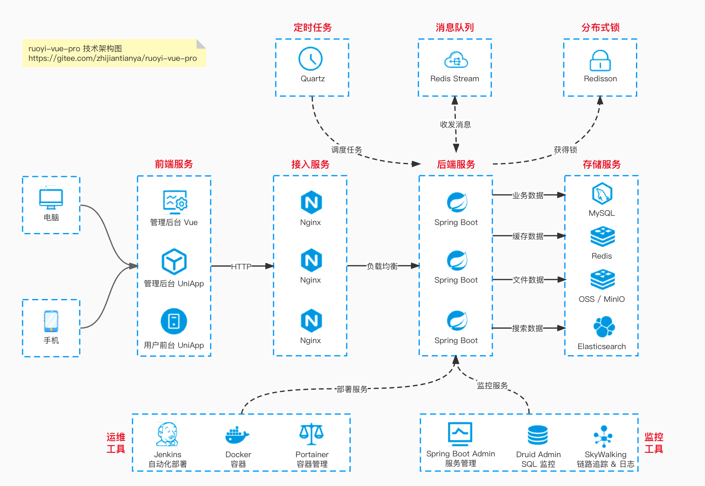

目录

# 快速启动（后端项目）

目标：使用 IDEA 工具，将项目 [ruoyi-vue-pro (opens new window)](https://github.com/YunaiV/ruoyi-vue-pro) 的后端项目运行起来 🛫

整个过程非常简单，预计 10 分钟就可以完成，取决于大家的网速。

> ↓↓↓ 技术交流群，一起苦练技术基本功，每日精进 30 公里！↓↓↓


## [#](#👍-相关视频教程) 👍 相关视频教程

*   [从零开始 02：在 Windows 环境下，如何运行前后端项目？ (opens new window)](https://t.zsxq.com/07BeiEA6Q)
*   [从零开始 03：在 MacOS 环境下，如何运行前后端项目？ (opens new window)](https://t.zsxq.com/07FUNnYFm)

## [#](#_1-克隆代码) 1. 克隆代码

使用 [IDEA (opens new window)](http://www.iocoder.cn/categories/IDEA/?self) 克隆 [https://github.com/YunaiV/ruoyi-vue-pro (opens new window)](https://github.com/YunaiV/ruoyi-vue-pro) 仓库的最新代码，并给该仓库一个 [Star (opens new window)](https://github.com/YunaiV/ruoyi-vue-pro)。

> 注意：不建议使用 Eclipse，因为它没有支持 Lombok 和 Mapstruct 插件。

克隆完成后，耐心等待 Maven 下载完相关的依赖。一定要注意：

*   ① 默认情况下，使用 `master` 分支，它对应 JDK 8 + Spring Boot 2.7 版本。
*   ② 如果你想体验 JDK 17/21 + Spring Boot 3.2 版本，需要切换到 `master-jdk17` 分支。

> 友情提示：项目的每个模块的作用，可见 [《开发指南 —— 项目结构》](/project-intro/) 文档。

使用的 Spring Boot 版本较新，所以需要下载一段时间。趁着这个时间，胖友可以给项目添加一个 [Star (opens new window)](https://github.com/YunaiV/ruoyi-vue-pro)，支持下艿艿。



## [#](#_2-apifox-接口工具) 2. Apifox 接口工具

点击 [Apifox (opens new window)](http://mtw.so/5NZLsX) 首页，下载对应的 Apifox 桌面版。如下图所示：

为什么要下载 Apifox 桌面版？

艿艿已经卸载 Postman，使用 Apifox 进行替代。国产软件，yyds 永远滴神！

国内很多互联网公司，包括百度、阿里、腾讯、字节跳动等等在内，都在使用 Apifox 作为 API 工具。



解压后，双击进行安装即可。黑色界面，非常酷炫。


接口文档？

阅读 [《开发指南 —— 接口文档》](/api-doc) 呀~~

## [#](#_3-初始化-mysql) 3. 初始化 MySQL

友情提示？

如果你是 PostgreSQL、Oracle、SQL Server、DM、大金 等其它数据库，也是可以的。

因为我主要使用 MySQL数据库为主，所以其它数据库的 SQL 文件可能存在滞后，可以加入 [用户群](/qun) 反馈。

项目使用 MySQL 存储数据，所以需要启动一个 MySQL 服务。

① 创建一个名字为 `ruoyi-vue-pro` 数据库，**【只要】** 执行对应数据库类型的 [`sql` (opens new window)](https://github.com/YunaiV/ruoyi-vue-pro/tree/master/sql) 目录下的 `ruoyi-vue-pro.sql` SQL 文件，进行初始化。



② 默认配置下，MySQL 需要启动在 3306 端口，并且账号是 root，密码是 123456。如果不一致，需要修改 `application-local.yaml` 配置文件。


* * *

疑问：如果我不是 MySQL，想用其它数据库，怎么办？？？

*   1、【如果是 PostgreSQL、Oracle、SQL Server 数据库】，修改 `yudao-spring-boot-starter-mybatis` 模块的 `pom.xml` 文件，将对应的 JDBC Driver 的 `optional` 移除（注意，需要使用 IDEA 刷新下 Maven 的依赖）。如下图所示： 
    
*   2、【如果是 DM 达梦、大金、OpenGauss 等国产信创数据库】建议先使用 MySQL 跑通，然后再阅读 [《国产信创数据库（DM 达梦、大金、OpenGauss）》](/xinchuang-db) 文档。
    

## [#](#_4-初始化-redis) 4. 初始化 Redis

项目使用 Redis 缓存数据，所以需要启动一个 Redis 服务。

> 不会安装的胖友，可以选择阅读下文，良心的艿艿。
> 
> *   Windows 安装 Redis 指南：[http://www.iocoder.cn/Redis/windows-install (opens new window)](http://www.iocoder.cn/Redis/windows-install)
> *   Mac 安装 Redis 指南：[http://www.iocoder.cn/Redis/mac-install (opens new window)](http://www.iocoder.cn/Redis/mac-install)

默认配置下，Redis 启动在 6379 端口，不设置账号密码。如果不一致，需要修改 `application-local.yaml` 配置文件。


友情提示：

如果你的项目部希望使用 Redis，可以参考文档 [《如何去除 Redis 缓存》](/remove-redis)。

## [#](#_5-启动后端项目) 5. 启动后端项目

[`yudao-server` (opens new window)](https://github.com/YunaiV/ruoyi-vue-pro/blob/master/yudao-server) 是后端项目，提供管理后台、用户 APP 的 RESTful API 接口。

### [#](#_5-1-编译项目) 5.1 编译项目

第一步，使用 IDEA 自带的 Maven 插件，进行项目的编译。如下图所示：



【可选】也可以使用 Maven 命令编译：

*   使用 IDEA 打开 Terminal 终端，在 **根目录** 下直接执行 `mvn clean install package '-Dmaven.test.skip=true'` 命令。
*   如果执行报 `Unknown lifecycle phase “.test.skip=true”` 错误，使用 `mvn clean install package -Dmaven.test.skip=true` 即可。

ps：只有首次需要执行 Maven 命令，解决基础 `pom.xml` 不存在，导致报 BaseDbUnitTest 类不存在的问题。

整个过程，预计需要 1 分钟左右。成功后，控制台日志如下：

```bash
[INFO] ------------------------------------------------------------------------
[INFO] BUILD SUCCESS
[INFO] ------------------------------------------------------------------------
[INFO] Total time:  9.139 s (Wall Clock)
[INFO] Finished at: 2024-05-03T18:56:03+08:00
[INFO] ------------------------------------------------------------------------

```

### [#](#_5-2-启动项目) 5.2 启动项目

第二步，执行 [YudaoServerApplication (opens new window)](https://github.com/YunaiV/ruoyi-vue-pro/blob/master/yudao-server/src/main/java/cn/iocoder/yudao/server/YudaoServerApplication.java) 类，进行启动。

启动还是报类不存在？

可能是 IDEA 的 bug，点击 \[File -> Invalidate Caches\] 菜单，清空下缓存，重启后在试试看。



启动完成后，使用浏览器访问 [http://127.0.0.1:48080 (opens new window)](http://127.0.0.1:48080) 地址，返回如下 JSON 字符串，说明成功。

> 友情提示：注意，默认配置下，后端项目启动在 48080 端口。

```json
{
    "code": 401,
    "data": null,
    "msg": "账号未登录"
}

```

如果报 “Command line is too long” 错误，参考 [《Intellij IDEA 运行时报 Command line is too long 解决方法 》 (opens new window)](https://www.iocoder.cn/Fight/Intellij-IDEA-Indicates-that-Command-Line-is-too-long/?yudao) 文章解决，或者直接点击 YudaoServerApplication **蓝字**部分！


### [#](#_5-3-启动其它模块) 5.3 启动其它模块

考虑到启动速度，默认值启动 `system` 系统服务，`infra` 基础设施两个模块。如果你需要启动其它模块，可以参考下面的文档：

*   [《工作流手册 —— 工作流》](/bpm/)
*   [《公众号手册 —— 功能开启》](/mp/build/)
*   [《支付手册 —— 功能开启》](/pay/build/)
*   [《大屏手册 —— 报表设计器》](/report/)
*   [《商城手册 —— 功能开启》](/mall/build/)

## [#](#_6-启动前端项目【简易】) 6. 启动前端项目【简易】

友情提示：这是可选步骤，想要完整启动前端，可以直接看「7. 启动前端项目【完整】」小节噢！

在 [yudao-demo (opens new window)](https://gitee.com/yudaocode/yudao-demo) 项目中，提前编译好了前端项目的静态资源，无需安装 Node 等前端环境，可以直接体验和使用。操作步骤如下：

① 克隆 [https://gitee.com/yudaocode/yudao-demo (opens new window)](https://gitee.com/yudaocode/yudao-demo) 项目，运行对应的启动类：



*   [Vue3 + element-plus (opens new window)](https://github.com/yudaocode/yudao-ui-admin-vue3) ：ElementPlusApplication
*   [Vue3 + vben (opens new window)](https://github.com/yudaocode/yudao-ui-admin-vben) ：VbenApplication
*   [Vue2 + element-ui (opens new window)](https://github.com/yudaocode/yudao-ui-admin-vben) ：ElementUIApplication

② 访问 [http://127.0.0.1:2048/ (opens new window)](http://127.0.0.1:2048/) 地址，即可看到对应的管理后台。

补充说明：

前端项目是不定期编译，可能不是最新版本。

如果需要最新版本，请继续往下看。

## [#](#_7-启动前端项目【完整】) 7. 启动前端项目【完整】

参考 [《快速启动（前端项目）》](/quick-start-front) 文档

## [#](#_666-彩蛋) 666. 彩蛋

至此，我们已经完成了项目 [ruoyi-vue-pro (opens new window)](https://github.com/YunaiV/ruoyi-vue-pro) 的启动。

胖友可以根据自己的兴趣，阅读相关源码。如果你想更快速的学习，可以看看 [《视频教程 》](/video/) 教程哟。



后面，艿艿会花大量的时间，继续优化这个项目。同时，输出与项目匹配的技术博客，方便胖友更好的学习与理解。

还是那句话，😆 为开源继绝学，我辈义不容辞！

* * *

嘿嘿嘿，记得一定要给 [https://github.com/YunaiV/ruoyi-vue-pro (opens new window)](https://github.com/YunaiV/ruoyi-vue-pro) 一个 star，这对艿艿真的很重要。

