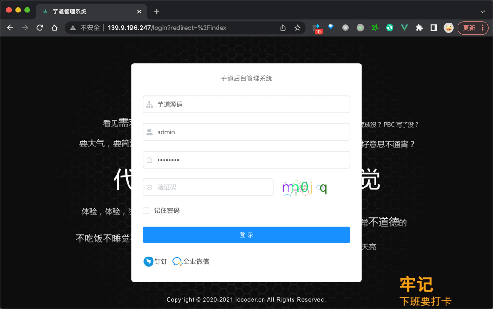

目录

# Docker 部署

本小节，讲解如何将前端 + 后端项目，**使用 Docker 容器**，部署到 dev 开发环境下的一台 Linux 服务器上。如下图所示：


注意：服务器的 IP 地址。

*   外网 IP：139.9.196.247
*   内网 IP：192.168.0.213

下属所有涉及到 IP 的配置，需要替换成你自己的。

## [#](#_1-安装-docker) 1. 安装 Docker

执行如下命令，进行 Docker 的安装。

```bash
## ① 使用 DaoCloud 的 Docker 高速安装脚本。参考 https://get.daocloud.io/#install-docker
curl -sSL https://get.daocloud.io/docker | sh

## ② 设置 DaoCloud 的 Docker 镜像中心，加速镜像的下载速度。参考 https://www.daocloud.io/mirror
curl -sSL https://get.daocloud.io/daotools/set_mirror.sh | sh -s http://f1361db2.m.daocloud.io

## ③ 启动 Docker 服务
systemctl start docker

```

补充说明：由于访问 Docker 镜像不稳定，一般建议加速访问！！！

问题反馈：

*   [https://t.zsxq.com/sfdMJ (opens new window)](https://t.zsxq.com/sfdMJ)

可参考加速方式：

*   [DaoCloud / public-image-mirror (opens new window)](https://github.com/DaoCloud/public-image-mirror)
*   [kubesre / docker-registry-mirrors (opens new window)](https://github.com/kubesre/docker-registry-mirrors)

## [#](#_2-配置-mysql) 2. 配置 MySQL
### [#](#_2-1-安装-mysql-可选) 2.1 安装 MySQL（可选）

友情提示：使用 Docker 安装 MySQL 是可选步骤，也可以直接安装 MySQL，或者购买 MySQL 云服务。

① 执行如下命令，使用 Docker 启动 MySQL 容器。

```bash
docker run -v /work/mysql/:/var/lib/mysql \
-p 3306:3306 -e MYSQL_ROOT_PASSWORD=123456 \
--restart=always --name mysql -d mysql

```

*   数据库文件，挂载到服务器的的 `/work/mysql/` 目录下
*   端口是 3306，密码是 123456

② 执行 `ls /work/mysql` 命令，查看 `/work/mysql/` 目录的数据库文件。


### [#](#_2-2-导入-sql-脚本) 2.2 导入 SQL 脚本

创建一个名字为 `ruoyi-vue-pro` 数据库，执行数据库对应的 [`sql` (opens new window)](https://github.com/YunaiV/ruoyi-vue-pro/tree/master/sql) 目录下的 SQL 文件，进行初始化。


## [#](#_3-配置-redis) 3. 配置 Redis

友情提示：使用 Docker 安装 Redis 是可选步骤，也可以直接安装 Redis，或者购买 Redis 云服务。

执行如下命令，使用 Docker 启动 Redis 容器。

```bash
docker run -d --name redis --restart=always -p 6379:6379 redis:5.0.14-alpine

```

*   端口是 6379，密码未设置

## [#](#_4-部署后端) 4. 部署后端
### [#](#_4-1-修改配置) 4.1 修改配置

后端 dev 开发环境对应的是 [`application-dev.yaml` (opens new window)](https://github.com/YunaiV/ruoyi-vue-pro/blob/master/yudao-server/src/main/resources/application-dev.yaml) 配置文件，主要是修改 MySQL 和 Redis 为你的地址。如下图所示：


### [#](#_4-2-编译后端) 4.2 编译后端

在项目的根目录下，执行 `mvn clean package -Dmaven.test.skip=true` 命令，编译后端项目，构建出它的 Jar 包。如下图所示：


疑问：-Dmaven.test.skip=true 是什么意思？

跳过单元测试的执行。如果你项目的单元测试写的不错，建议使用 `mvn clean package` 命令，执行单元测试，保证交付的质量。

### [#](#_4-3-上传-jar-包) 4.3 上传 Jar 包

在 Linux 服务器上创建 `/work/projects/yudao-server` 目录，使用 `scp` 命令或者 FTP 工具，将 `yudao-server.jar` 上传到该目录下。如下图所示：


### [#](#_4-4-构建镜像) 4.4 构建镜像

① 在 `/work/projects/yudao-server` 目录下，新建 [Dockerfile (opens new window)](https://github.com/YunaiV/ruoyi-vue-pro/blob/master/yudao-server/Dockerfile) 文件，用于制作后端项目的 Docker 镜像。编写内容如下：

```bash
## AdoptOpenJDK 停止发布 OpenJDK 二进制，而 Eclipse Temurin 是它的延伸，提供更好的稳定性
## 感谢复旦核博士的建议！灰子哥，牛皮！
FROM eclipse-temurin:8-jre

## 创建目录，并使用它作为工作目录
RUN mkdir -p /yudao-server
WORKDIR /yudao-server
## 将后端项目的 Jar 文件，复制到镜像中
COPY yudao-server.jar app.jar

## 设置 TZ 时区
## 设置 JAVA_OPTS 环境变量，可通过 docker run -e "JAVA_OPTS=" 进行覆盖
ENV TZ=Asia/Shanghai JAVA_OPTS="-Xms512m -Xmx512m"

## 暴露后端项目的 48080 端口
EXPOSE 48080

## 启动后端项目
ENTRYPOINT java ${JAVA_OPTS} -Djava.security.egd=file:/dev/./urandom -jar app.jar

```

② 执行如下命令，构建名字为 `yudao-server` 的 Docker 镜像。

```bash
cd /work/projects/yudao-server
docker build -t yudao-server .

```


③ 在 `/work/projects/yudao-server` 目录下，新建 Shell 脚本 `deploy.sh`，使用 Docker 启动后端项目。编写内容如下：

```bash
#!/bin/bash
set -e

## 第一步：删除可能启动的老 yudao-server 容器
echo "开始删除 yudao-server 容器"
docker stop yudao-server || true
docker rm yudao-server || true
echo "完成删除 yudao-server 容器"

## 第二步：启动新的 yudao-server 容器 \
echo "开始启动 yudao-server 容器"
docker run -d \
--name yudao-server \
-p 48080:48080 \
-e "SPRING_PROFILES_ACTIVE=dev" \
-v /work/projects/yudao-server:/root/logs/ \
yudao-server
echo "正在启动 yudao-server 容器中，需要等待 60 秒左右"

```

*   应用日志文件，挂载到服务器的的 `/work/projects/yudao-server` 目录下
*   通过 `SPRING_PROFILES_ACTIVE` 设置为 `dev` 开发环境

### [#](#_4-5-启动后端) 4.5 启动后端

① 执行 `sh deploy.sh` 命令，使用 Docker 启动后端项目。日志如下：

```bash
开始删除 yudao-server 容器
yudao-server
yudao-server
完成删除 yudao-server 容器
开始启动 yudao-server 容器
0dfd3dc409a53ae6b5e7c5662602cf5dcb52fd4d7f673bd74af7d21da8ead9d5
正在启动 yudao-server 容器中，需要等待 60 秒左右

```

② 执行 `docker logs yudao-server` 命令，查看启动日志。看到如下内容，说明启动完成：

友情提示：如果日志比较多，可以使用 grep 进行过滤。

例如说：使用 `docker logs yudao-server | grep 48080`

```bash
2022-04-15 00:34:19.647  INFO 8 --- [main] [TID: N/A] o.s.b.w.embedded.tomcat.TomcatWebServer  : Tomcat initialized with port(s): 48080 (http)

```

## [#](#_5-部署前端) 5. 部署前端

友情提示：

本小节的内容，和 [《开发指南 —— Linux 部署》](/deployment-linux) 的「部署前端」是基本一致的。

### [#](#_5-1-修改配置) 5.1 修改配置

前端 dev 开发环境对应的是 [`.env.dev` (opens new window)](https://github.com/yudaocode/yudao-ui-admin-vue2/blob/master/.env.dev) 配置文件，主要是修改 `VUE_APP_BASE_API` 为你的后端项目的访问地址。如下图所示：


### [#](#_5-2-编译前端) 5.2 编译前端

友情提示：

下文的 `yudao-ui-admin` 目录，指的是你克隆前端项目后的地址！

在 `yudao-ui-admin` 目录下，执行 `npm run build:dev` 命令，编译前端项目，构建出它的 `dist` 文件，里面是 HTML、CSS、JavaScript 等静态文件。如下图所示：


如下想要打包其它环境，可使用如下命令：

```bash
npm run build:prod ## 打包 prod 生产环境
npm run build:stage ## 打包 stage 预发布环境

```

其它高级参数说明【可暂时不看】：

① `PUBLIC_PATH`：静态资源地址，可用于七牛等 CDN 服务回源读取前端的静态文件，提升访问速度，建议 prod 生产环境使用。示例如下：


② `VUE_APP_APP_NAME`：二级部署路径，默认为 `/` 根目录，一般不用修改。

③ `mode`：前端路由的模式，默认采用 `history` 路由，一般不用修改。可以通过修改 [`router/index.js` (opens new window)](https://github.com/yudaocode/yudao-ui-admin-vue2/blob/master/src/router/index.js#L173-L178) 来设置为 `hash` 路由，示例如下：


### [#](#_5-3-上传-dist-文件) 5.3 上传 `dist` 文件

在 Linux 服务器上创建 `/work/projects/yudao-ui-admin` 目录，使用 `scp` 命令或者 FTP 工具，将 `dist` 上传到 `/work/nginx/html` 目录下。如下图所示：


### [#](#_5-4-启动前端) 5.4 启动前端？

前端无法直接启动，而是通过 Nginx 转发读取 `/work/projects/yudao-ui-admin` 目录的静态文件。

## [#](#_6-配置-nginx) 6. 配置 Nginx
### [#](#_6-1-安装-nginx) 6.1 安装 Nginx

Nginx 挂载到服务器的目录：

*   `/work/nginx/conf.d` 用于存放配置文件
*   `/work/nginx/html` 用于存放网页文件
*   `/work/nginx/logs` 用于存放日志
*   `/work/nginx/cert` 用于存放 HTTPS 证书

① 创建 `/work/nginx` 目录，并在该目录下新建 `nginx.conf` 文件，避免稍后安装 Nginx 报错。内容如下：

```bash
user  nginx;
worker_processes  1;

events {
    worker_connections  1024;
}

error_log  /var/log/nginx/error.log warn;
pid        /var/run/nginx.pid;

http {
    include       /etc/nginx/mime.types;
    default_type  application/octet-stream;
    sendfile        on;
    keepalive_timeout  65;

    log_format  main  '$remote_addr - $remote_user [$time_local] "$request" '
                      '$status $body_bytes_sent "$http_referer" '
                      '"$http_user_agent" "$http_x_forwarded_for"';
#    access_log  /var/log/nginx/access.log  main;

    gzip on;
    gzip_min_length 1k;     # 设置允许压缩的页面最小字节数
    gzip_buffers 4 16k;     # 用来存储 gzip 的压缩结果
    gzip_http_version 1.1;  # 识别 HTTP 协议版本
    gzip_comp_level 2;      # 设置 gzip 的压缩比 1-9。1 压缩比最小但最快，而 9 相反
    gzip_types text/plain application/x-javascript text/css application/xml application/javascript; # 指定压缩类型
    gzip_proxied any;       # 无论后端服务器的 headers 头返回什么信息，都无条件启用压缩

    include /etc/nginx/conf.d/*.conf; ## 加载该目录下的其它 Nginx 配置文件
}

```

② 执行如下命令，使用 Docker 启动 Nginx 容器。

```bash
docker run -d \
--name nginx --restart always \
-p 80:80 -p 443:443 \
-e "TZ=Asia/Shanghai" \
-v /work/nginx/nginx.conf:/etc/nginx/nginx.conf \
-v /work/nginx/conf.d:/etc/nginx/conf.d \
-v /work/nginx/logs:/var/log/nginx \
-v /work/nginx/cert:/etc/nginx/cert \
-v /work/nginx/html:/usr/share/nginx/html \
nginx:alpine

```

③ 执行 `docker ps` 命令，查看到 Nginx 容器的状态是 `UP` 的。

* * *

下面，来看两种 Nginx 的配置，分别满足服务器 IP、独立域名的不同场景。

### [#](#_6-2-方式一-服务器-ip-访问) 6.2 方式一：服务器 IP 访问

① 在 `/work/nginx/conf.d` 目录下，创建 `ruoyi-vue-pro.conf`，内容如下：

```bash
server {
    listen       80;
    server_name  139.9.196.247; ## 重要！！！修改成你的外网 IP/域名

    location / { ## 前端项目
        root   /usr/share/nginx/html/yudao-admin-ui;
        index  index.html index.htm;
        try_files $uri $uri/ /index.html;
    }

    location /admin-api/ { ## 后端项目 - 管理后台
        proxy_pass http://192.168.0.213:48080/admin-api/; ## 重要！！！proxy_pass 需要设置为后端项目所在服务器的 IP
        proxy_set_header Host $http_host;
        proxy_set_header X-Real-IP $remote_addr;
        proxy_set_header REMOTE-HOST $remote_addr;
        proxy_set_header X-Forwarded-For $proxy_add_x_forwarded_for;
    }

    location /app-api/ { ## 后端项目 - 用户 App
        proxy_pass http://192.168.0.213:48080/app-api/; ## 重要！！！proxy_pass 需要设置为后端项目所在服务器的 IP
        proxy_set_header Host $http_host;
        proxy_set_header X-Real-IP $remote_addr;
        proxy_set_header REMOTE-HOST $remote_addr;
        proxy_set_header X-Forwarded-For $proxy_add_x_forwarded_for;
    }

}

```

友情提示：

`[root]` 指令在本地文件时，要使用 Nginx Docker 容器内的路径，即 `/usr/share/nginx/html/yudao-admin-ui`，否则会报 404 的错误。

② 执行 `docker exec nginx nginx -s reload` 命令，重新加载 Nginx 配置。

友情提示：如果你担心 Nginx 配置不正确，可以执行 docker exec nginx nginx -t 命令。

③ 执行 `curl http://192.168.0.213/admin-api/` 命令，成功访问后端项目的内网地址，返回结果如下：

```json
{"code":401,"data":null,"msg":"账号未登录"}

```

执行 `curl http://139.9.196.247:48080/admin-api/` 命令，成功访问后端项目的外网地址，返回结果一致。

④ 请求 [http://139.9.196.247:48080 (opens new window)](http://139.9.196.247:48080) 地址，成功访问前端项目的外网地址，，返回前端界面如下：



⑤ 如果你使用到 WebSocket 的话，需要额外对 `/infra/ws` 路径进行配置，具体可见 [https://t.zsxq.com/LQEfC (opens new window)](https://t.zsxq.com/LQEfC) 链接。

### [#](#_6-3-方式二-独立域名访问) 6.3 方式二：独立域名访问

友情提示：在前端项目的编译时，需要把 \`VUE\_APP\_BASE\_API\` 修改为后端项目对应的域名。

例如说，这里使用的是 `http://api.iocoder.cn`

① 在 `/work/nginx/conf.d` 目录下，创建 `ruoyi-vue-pro2.conf`，内容如下：

```bash
server { ## 前端项目
    listen       80;
    server_name  admin.iocoder.cn; ## 重要！！！修改成你的前端域名

    location / { ## 前端项目
        root   /usr/share/nginx/html/yudao-admin-ui;
        index  index.html index.htm;
        try_files $uri $uri/ /index.html;
    }

}

server { ## 后端项目
    listen       80;
    server_name  api.iocoder.cn; ## 重要！！！修改成你的外网 IP/域名

    ## 不要使用 location / 转发到后端项目，因为 druid、admin 等监控，不需要外网可访问。或者增加 Nginx IP 白名单限制也可以。

    location /admin-api/ { ## 后端项目 - 管理后台
        proxy_pass http://192.168.0.213:48080/admin-api/; ## 重要！！！proxy_pass 需要设置为后端项目所在服务器的 IP
        proxy_set_header Host $http_host;
        proxy_set_header X-Real-IP $remote_addr;
        proxy_set_header REMOTE-HOST $remote_addr;
        proxy_set_header X-Forwarded-For $proxy_add_x_forwarded_for;
    }

    location /app-api/ { ## 后端项目 - 用户 App
        proxy_pass http://192.168.0.213:48080/app-api/; ## 重要！！！proxy_pass 需要设置为后端项目所在服务器的 IP
        proxy_set_header Host $http_host;
        proxy_set_header X-Real-IP $remote_addr;
        proxy_set_header REMOTE-HOST $remote_addr;
        proxy_set_header X-Forwarded-For $proxy_add_x_forwarded_for;
    }

}

```

② 执行 `docker exec nginx nginx -s reload` 命令，重新加载 Nginx 配置。

③ 请求 [http://api.iocoder.cn/admin-api/ (opens new window)](http://api.iocoder.cn/admin-api/) 地址，成功访问后端项目，返回结果如下：

```json
{"code":401,"data":null,"msg":"账号未登录"}

```

④ 请求 [http://admin.iocoder.cn (opens new window)](http://admin.iocoder.cn) 地址，成功访问前端项目，返回前端界面如下：

