目录

# Linux 部署

本小节，讲解如何将前端 + 后端项目，**使用 Shell 脚本**，部署到 dev 开发环境下的一台 Linux 服务器上。如下图所示：

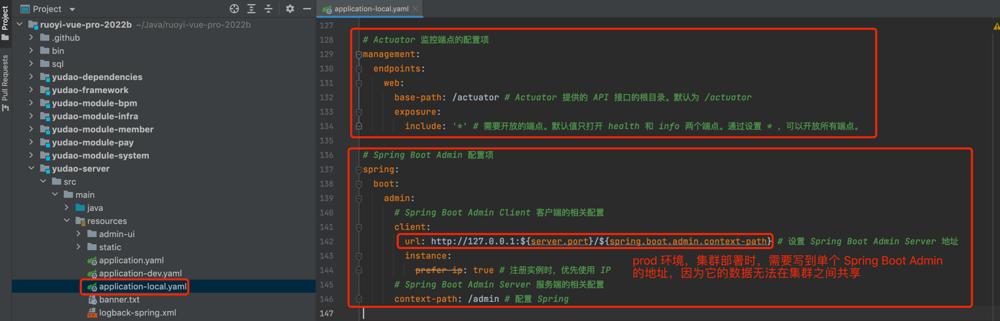

## [#](#_1-配置-mysql) 1. 配置 MySQL
### [#](#_1-1-安装-mysql-可选) 1.1 安装 MySQL（可选）

友情提示：安装 MySQL 是可选步骤，也可以购买 MySQL 云服务。

① 执行如下命令，进行 MySQL 的安装。

```bash
## ① 安装 MySQL 5.7 版本的软件源 https://dev.mysql.com/downloads/repo/yum/
rpm -Uvh https://dev.mysql.com/get/mysql57-community-release-el7-11.noarch.rpm

## ② 安装 MySQL Server 5.7 版本
yum install mysql-server --nogpgcheck

## ③ 查看 MySQL 的安装版本。结果是 mysqld  Ver 5.7.37 for Linux on x86_64 (MySQL Community Server (GPL))
mysqld --version

```

② 修改 `/etc/my.cnf` 文件，在文末加上 `lower_case_table_names=1` 和 `validate_password=off` 配置，执行 `systemctl restart mysqld` 命令重启。

③ 执行 `grep password /var/log/mysqld.log` 命令，获得 MySQL 临时密码。

```bash
2022-04-16T09:39:57.365086Z 1 [Note] A temporary password is generated for root@localhost: ZOKUaehW2e.e

```

④ 执行如下命令，修改 MySQL 的密码，设置允许远程连接。

```bash
## ① 连接 MySQL Server 服务，并输入临时密码
mysql -uroot -p

## ② 修改密码，123456 可改成你想要的密码
alter user 'root'@'localhost' identified by '123456';

## ③ 设置允许远程连接
use mysql;
update user set host = '%' where user = 'root';
FLUSH PRIVILEGES;

```

### [#](#_1-2-导入-sql-脚本) 1.2 导入 SQL 脚本

创建一个名字为 `ruoyi-vue-pro` 数据库，执行数据库对应的 [`sql` (opens new window)](https://github.com/YunaiV/ruoyi-vue-pro/tree/master/sql) 目录下的 SQL 文件，进行初始化。

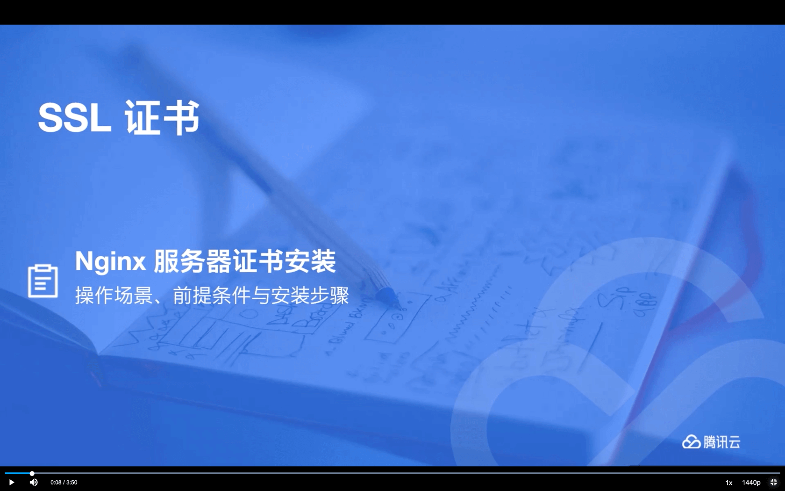

## [#](#_2-配置-redis) 2. 配置 Redis

友情提示：安装 Redis 是可选步骤，也可以购买 Redis 云服务。

执行如下命令，进行 Redis 的安装。

```bash
## ① 安装 remi 软件源
yum install http://rpms.famillecollet.com/enterprise/remi-release-7.rpm

## ② 安装最新 Redis 版本。如果想要安装指定版本，可使用 yum --enablerepo=remi install redis-6.0.6 -y 命令
yum --enablerepo=remi install redis 

## ③ 查看 Redis 的安装版本。结果是 Redis server v=6.2.6 sha=00000000:0 malloc=jemalloc-5.1.0 bits=64 build=4ab9a06393930489
redis-server --version

## ④ 启动 Redis 服务
systemctl restart redis

```

*   端口是 6379，密码未设置

## [#](#_3-部署后端) 3. 部署后端
### [#](#_3-1-修改配置) 3.1 修改配置

后端 dev 开发环境对应的是 [`application-dev.yaml` (opens new window)](https://github.com/YunaiV/ruoyi-vue-pro/blob/master/yudao-server/src/main/resources/application-dev.yaml) 配置文件，主要是修改 MySQL 和 Redis 为你的地址。如下图所示：

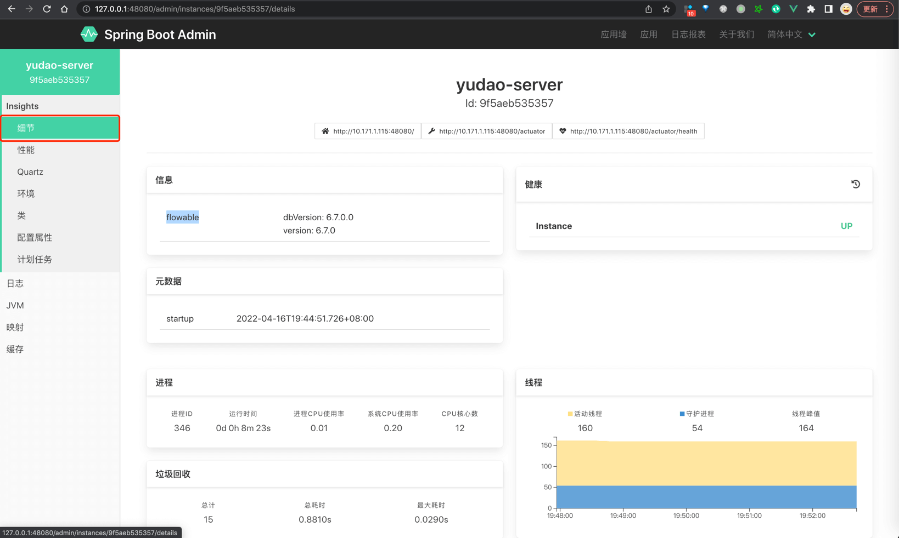

### [#](#_3-2-编译后端) 3.2 编译后端

在项目的根目录下，执行 `mvn clean package -Dmaven.test.skip=true` 命令，编译后端项目，构建出它的 Jar 包。如下图所示：


疑问：-Dmaven.test.skip=true 是什么意思？

跳过单元测试的执行。如果你项目的单元测试写的不错，建议使用 `mvn clean package` 命令，执行单元测试，保证交付的质量。

### [#](#_3-3-上传-jar-包) 3.3 上传 Jar 包

在 Linux 服务器上创建 `/work/projects/yudao-server` 目录，使用 `scp` 命令或者 FTP 工具，将 `yudao-server.jar` 上传到该目录下。如下图所示：

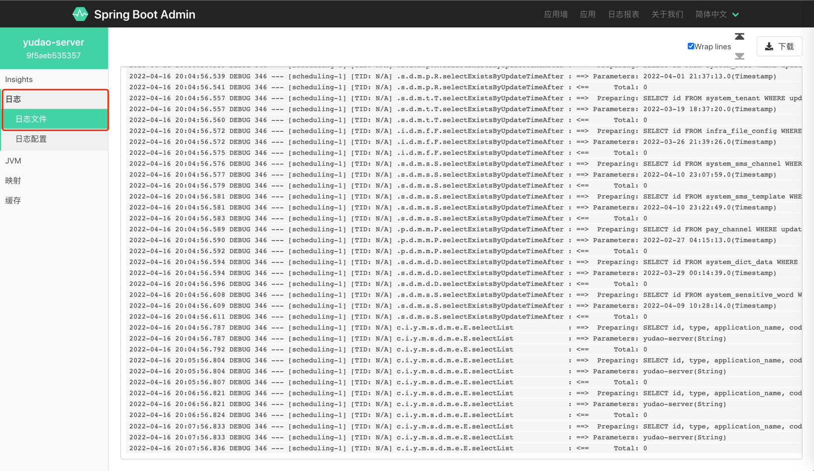

疑问：如果构建 War 包，部署到 Tomcat 下？

并不推荐采用 War 包部署到 Tomcat 下。如果真的需要，可以参考 [《Deploy a Spring Boot WAR into a Tomcat Server》 (opens new window)](https://www.baeldung.com/spring-boot-war-tomcat-deploy) 文章。

### [#](#_3-4-编写脚本) 3.4 编写脚本

在 `/work/projects/yudao-server` 目录下，新建 Shell 脚本 `deploy.sh`，用于启动后端项目。编写内容如下：

```bash
#!/bin/bash
set -e

DATE=$(date +%Y%m%d%H%M)
# 基础路径
BASE_PATH=/work/projects/yudao-server
# 服务名称。同时约定部署服务的 jar 包名字也为它。
SERVER_NAME=yudao-server
# 环境
PROFILES_ACTIVE=dev

# heapError 存放路径
HEAP_ERROR_PATH=$BASE_PATH/heapError
# JVM 参数
JAVA_OPS="-Xms512m -Xmx512m -XX:+HeapDumpOnOutOfMemoryError -XX:HeapDumpPath=$HEAP_ERROR_PATH"

# SkyWalking Agent 配置
#export SW_AGENT_NAME=$SERVER_NAME
#export SW_AGENT_COLLECTOR_BACKEND_SERVICES=192.168.0.84:11800
#export SW_GRPC_LOG_SERVER_HOST=192.168.0.84
#export SW_AGENT_TRACE_IGNORE_PATH="Redisson/PING,/actuator/**,/admin/**"
#export JAVA_AGENT=-javaagent:/work/skywalking/apache-skywalking-apm-bin/agent/skywalking-agent.jar

# 停止：优雅关闭之前已经启动的服务
function stop() {
    echo "[stop] 开始停止 $BASE_PATH/$SERVER_NAME"
    PID=$(ps -ef | grep $BASE_PATH/$SERVER_NAME | grep -v "grep" | awk '{print $2}')
    # 如果 Java 服务启动中，则进行关闭
    if [ -n "$PID" ]; then
        # 正常关闭
        echo "[stop] $BASE_PATH/$SERVER_NAME 运行中，开始 kill [$PID]"
        kill -15 $PID
        # 等待最大 120 秒，直到关闭完成。
        for ((i = 0; i < 120; i++))
            do
                sleep 1
                PID=$(ps -ef | grep $BASE_PATH/$SERVER_NAME | grep -v "grep" | awk '{print $2}')
                if [ -n "$PID" ]; then
                    echo -e ".\c"
                else
                    echo '[stop] 停止 $BASE_PATH/$SERVER_NAME 成功'
                    break
                fi
		    done

        # 如果正常关闭失败，那么进行强制 kill -9 进行关闭
        if [ -n "$PID" ]; then
            echo "[stop] $BASE_PATH/$SERVER_NAME 失败，强制 kill -9 $PID"
            kill -9 $PID
        fi
    # 如果 Java 服务未启动，则无需关闭
    else
        echo "[stop] $BASE_PATH/$SERVER_NAME 未启动，无需停止"
    fi
}

# 启动：启动后端项目
function start() {
    # 开启启动前，打印启动参数
    echo "[start] 开始启动 $BASE_PATH/$SERVER_NAME"
    echo "[start] JAVA_OPS: $JAVA_OPS"
    echo "[start] JAVA_AGENT: $JAVA_AGENT"
    echo "[start] PROFILES: $PROFILES_ACTIVE"

    # 开始启动
    nohup java -server $JAVA_OPS $JAVA_AGENT -jar $BASE_PATH/$SERVER_NAME.jar --spring.profiles.active=$PROFILES_ACTIVE > nohup.out 2>&1 &
    echo "[start] 启动 $BASE_PATH/$SERVER_NAME 完成"
}

# 部署
function deploy() {
    cd $BASE_PATH
    # 第一步：停止 Java 服务
    stop
    # 第二步：启动 Java 服务
    start
}

deploy

```

友情提示：

脚本的详细讲解，可见 [《芋道 Jenkins 极简入门 》 (opens new window)](https://www.iocoder.cn/Jenkins/install/?yudao) 的「2.3 远程服务器配置 」小节。

如果你想要修改脚本，主要关注 `BASE_PATH`、`PROFILES_ACTIVE`、`JAVA_OPS` 三个参数。如下图所示：

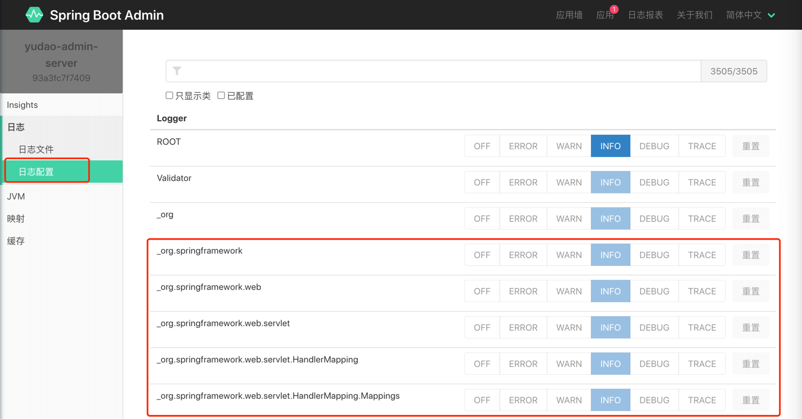

### [#](#_3-5-启动后端) 3.5 启动后端

① 【可选】执行 `yum install -y java-1.8.0-openjdk` 命令，安装 OpenJDK **8**。

友情提示：如果已经安装 JDK，可不安装。建议使用的 JDK 版本为 8、11、17 这三个。

② 执行 `sh deploy.sh` 命令，启动后端项目。日志如下：

```bash
[stop] 开始停止 /work/projects/yudao-server/yudao-server
[stop] /work/projects/yudao-server/yudao-server 未启动，无需停止
[start] 开始启动 /work/projects/yudao-server/yudao-server
[start] JAVA_OPS: -Xms512m -Xmx512m -XX:+HeapDumpOnOutOfMemoryError -XX:HeapDumpPath=/work/projects/yudao-server/heapError
[start] JAVA_AGENT:
[start] PROFILES: dev
[start] 启动 /work/projects/yudao-server/yudao-server 完成

```

③ 执行 `tail -f nohup.out` 命令，查看启动日志。看到如下内容，说明启动完成：

```bash
2022-04-13 00:06:20.049  INFO 1395 --- [main] [TID: N/A] c.i.yudao.server.YudaoServerApplication  : Started YudaoServerApplication in 35.315 seconds (JVM running for 36.282)

```

## [#](#_4-部署前端) 4. 部署前端
### [#](#_4-1-修改配置) 4.1 修改配置

前端 dev 开发环境对应的是 [`.env.dev` (opens new window)](https://github.com/yudaocode/yudao-ui-admin-vue2/blob/master/.env.dev) 配置文件，主要是修改 `VUE_APP_BASE_API` 为你的后端项目的访问地址。如下图所示：

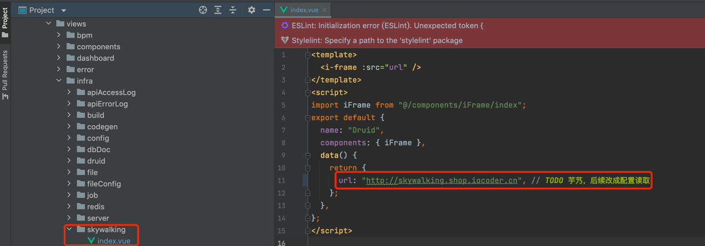

### [#](#_4-2-编译前端) 4.2 编译前端

友情提示：

下文的 `yudao-ui-admin` 目录，指的是你克隆前端项目后的地址！

在 `yudao-ui-admin` 目录下，执行 `npm run build:dev` 命令，编译前端项目，构建出它的 `dist` 文件，里面是 HTML、CSS、JavaScript 等静态文件。如下图所示：

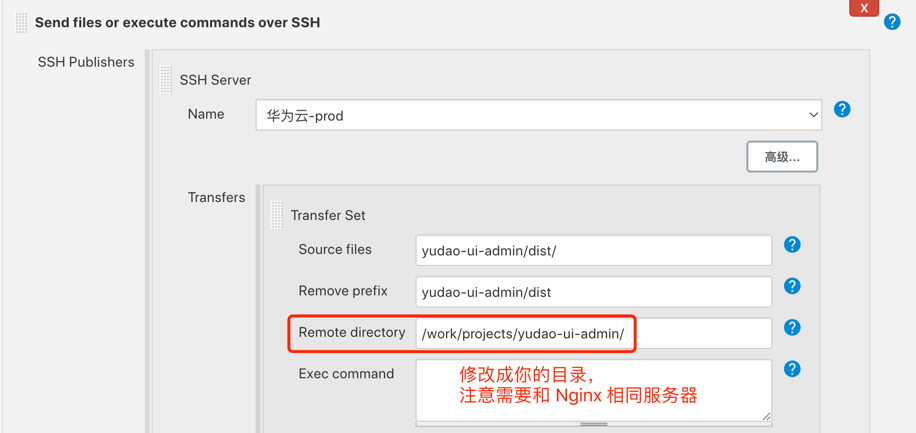

如下想要打包其它环境，可使用如下命令：

```bash
npm run build:prod ## 打包 prod 生产环境
npm run build:stage ## 打包 stage 预发布环境

```

其它高级参数说明【可暂时不看】：

① `PUBLIC_PATH`：静态资源地址，可用于七牛等 CDN 服务回源读取前端的静态文件，提升访问速度，建议 prod 生产环境使用。示例如下：

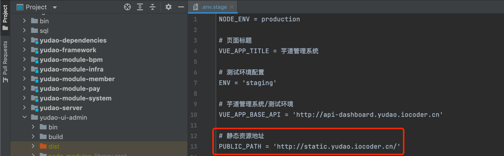

② `VUE_APP_APP_NAME`：二级部署路径，默认为 `/` 根目录，一般不用修改。

③ `mode`：前端路由的模式，默认采用 `history` 路由，一般不用修改。可以通过修改 [`router/index.js` (opens new window)](https://github.com/yudaocode/yudao-ui-admin-vue2/blob/master/src/router/index.js#L173-L178) 来设置为 `hash` 路由，示例如下：

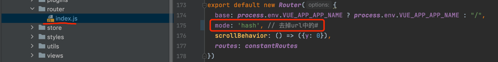

### [#](#_4-3-上传-dist-文件) 4.3 上传 `dist` 文件

在 Linux 服务器上创建 `/work/projects/yudao-ui-admin` 目录，使用 `scp` 命令或者 FTP 工具，将 `dist` 上传到该目录下。如下图所示：

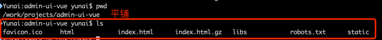

### [#](#_4-4-启动前端) 4.4 启动前端？

前端无法直接启动，而是通过 Nginx 转发读取 `/work/projects/yudao-ui-admin` 目录的静态文件。

## [#](#_5-配置-nginx) 5. 配置 Nginx
### [#](#_5-1-安装-nginx) 5.1 安装 Nginx

参考 [Nginx 官方文档 (opens new window)](https://docs.nginx.com/nginx/admin-guide/installing-nginx/installing-nginx-open-source/)，安装 Nginx 服务。命令如下：

```bash
## 添加 yum 源
yum install epel-release
yum update
## 安装 nginx
yum install nginx
## 启动 nginx 
nginx

```

Nginx 默认配置文件是 `/etc/nginx/nginx.conf`。

* * *

下面，来看两种 Nginx 的配置，分别满足服务器 IP、独立域名的不同场景。

### [#](#_5-2-方式一-服务器-ip-访问) 5.2 方式一：服务器 IP 访问

① 修改 Nginx 配置，内容如下：

```nginx
worker_processes  1;

events {
    worker_connections  1024;
}

http {
    include       mime.types;
    default_type  application/octet-stream;
    sendfile        on;
    keepalive_timeout  65;

    gzip on;
    gzip_min_length 1k;     # 设置允许压缩的页面最小字节数
    gzip_buffers 4 16k;     # 用来存储 gzip 的压缩结果
    gzip_http_version 1.1;  # 识别 HTTP 协议版本
    gzip_comp_level 2;      # 设置 gzip 的压缩比 1-9。1 压缩比最小但最快，而 9 相反
    gzip_types gzip_types text/plain text/css application/json application/javascript text/xml application/xml application/xml+rss text/javascript; # 指定压缩类型
    gzip_proxied any;       # 无论后端服务器的 headers 头返回什么信息，都无条件启用压缩

    server {
        listen       80;
        server_name  192.168.225.2; ## 重要！！！修改成你的外网 IP/域名

        location / { ## 前端项目
            root   /work/projects/yudao-ui-admin;
            index  index.html index.htm;
            try_files $uri $uri/ /index.html;
        }

        location /admin-api/ { ## 后端项目 - 管理后台
            proxy_pass http://localhost:48080/admin-api/; ## 重要！！！proxy_pass 需要设置为后端项目所在服务器的 IP
            proxy_set_header Host $http_host;
            proxy_set_header X-Real-IP $remote_addr;
            proxy_set_header REMOTE-HOST $remote_addr;
            proxy_set_header X-Forwarded-For $proxy_add_x_forwarded_for;
        }

        location /app-api/ { ## 后端项目 - 用户 App
            proxy_pass http://localhost:48080/app-api/; ## 重要！！！proxy_pass 需要设置为后端项目所在服务器的 IP
            proxy_set_header Host $http_host;
            proxy_set_header X-Real-IP $remote_addr;
            proxy_set_header REMOTE-HOST $remote_addr;
            proxy_set_header X-Forwarded-For $proxy_add_x_forwarded_for;
        }

    }

}

```

② 执行 `nginx -s reload` 命令，重新加载 Nginx 配置。

③ 请求 [http://192.168.225.2/admin-api/ (opens new window)](http://192.168.225.2/admin-api/) 地址，成功访问后端项目，返回结果如下：

```json
{"code":401,"data":null,"msg":"账号未登录"}

```

④ 请求 [http://192.168.225.2 (opens new window)](http://192.168.225.2) 地址，成功访问前端项目，返回前端界面如下：

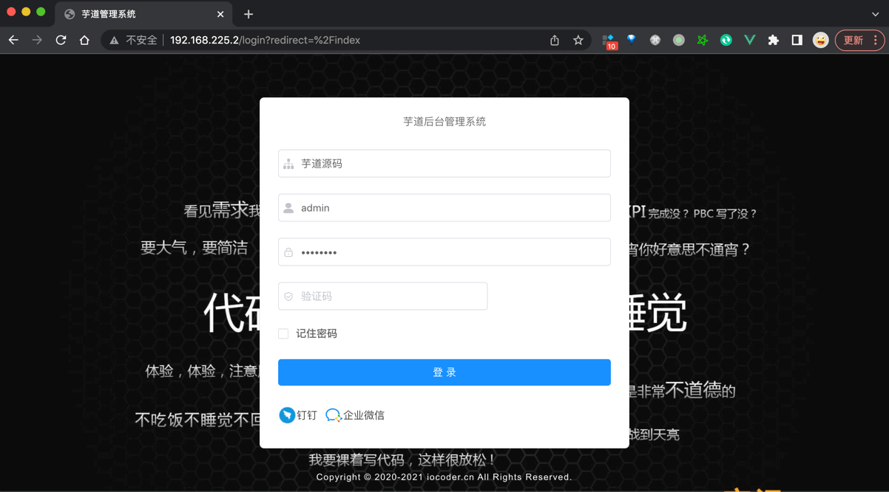

⑤ 如果你使用到 WebSocket 的话，需要额外对 `/infra/ws` 路径进行配置，具体可见 [https://t.zsxq.com/LQEfC (opens new window)](https://t.zsxq.com/LQEfC) 链接。

### [#](#_5-3-方式二-独立域名访问) 5.3 方式二：独立域名访问

友情提示：在前端项目的编译时，需要把 \`VUE\_APP\_BASE\_API\` 修改为后端项目对应的域名。

例如说，这里使用的是 `http://api.iocoder.cn`

① 修改 Nginx 配置，内容如下：

```bash
worker_processes  1;

events {
    worker_connections  1024;
}

http {
    include       mime.types;
    default_type  application/octet-stream;
    sendfile        on;
    keepalive_timeout  65;

    gzip on;
    gzip_min_length 1k;     # 设置允许压缩的页面最小字节数
    gzip_buffers 4 16k;     # 用来存储 gzip 的压缩结果
    gzip_http_version 1.1;  # 识别 HTTP 协议版本
    gzip_comp_level 2;      # 设置 gzip 的压缩比 1-9。1 压缩比最小但最快，而 9 相反
    gzip_types text/plain application/x-javascript text/css application/xml application/javascript; # 指定压缩类型
    gzip_proxied any;       # 无论后端服务器的 headers 头返回什么信息，都无条件启用压缩

    server { ## 前端项目
        listen       80;
        server_name  admin.iocoder.cn; ## 重要！！！修改成你的前端域名

        location / { ## 前端项目
            root   /work/projects/yudao-ui-admin;
            index  index.html index.htm;
            try_files $uri $uri/ /index.html;
        }

    }

    server { ## 后端项目
        listen       80;
        server_name  api.iocoder.cn; ## 重要！！！修改成你的外网 IP/域名

        ## 不要使用 location / 转发到后端项目，因为 druid、admin 等监控，不需要外网可访问。或者增加 Nginx IP 白名单限制也可以。

        location /admin-api/ { ## 后端项目 - 管理后台
            proxy_pass http://localhost:48080/admin-api/; ## 重要！！！proxy_pass 需要设置为后端项目所在服务器的 IP
            proxy_set_header Host $http_host;
            proxy_set_header X-Real-IP $remote_addr;
            proxy_set_header REMOTE-HOST $remote_addr;
            proxy_set_header X-Forwarded-For $proxy_add_x_forwarded_for;
        }

        location /app-api/ { ## 后端项目 - 用户 App
            proxy_pass http://localhost:48080/app-api/; ## 重要！！！proxy_pass 需要设置为后端项目所在服务器的 IP
            proxy_set_header Host $http_host;
            proxy_set_header X-Real-IP $remote_addr;
            proxy_set_header REMOTE-HOST $remote_addr;
            proxy_set_header X-Forwarded-For $proxy_add_x_forwarded_for;
        }

    }
}

```

② 执行 `nginx -s reload` 命令，重新加载 Nginx 配置。

③ 请求 [http://api.iocoder.cn/admin-api/ (opens new window)](http://api.iocoder.cn/admin-api/) 地址，成功访问后端项目，返回结果如下：

```json
{"code":401,"data":null,"msg":"账号未登录"}

```

④ 请求 [http://admin.iocoder.cn (opens new window)](http://admin.iocoder.cn) 地址，成功访问前端项目，返回前端界面如下：

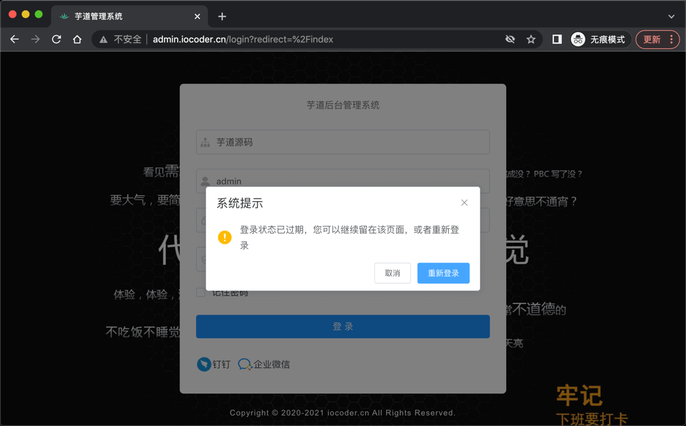