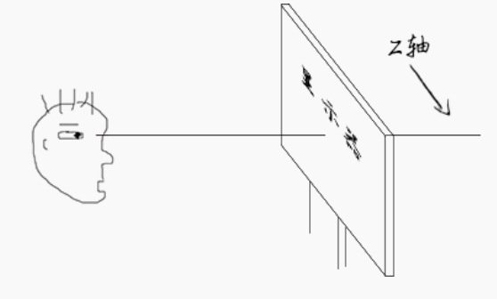
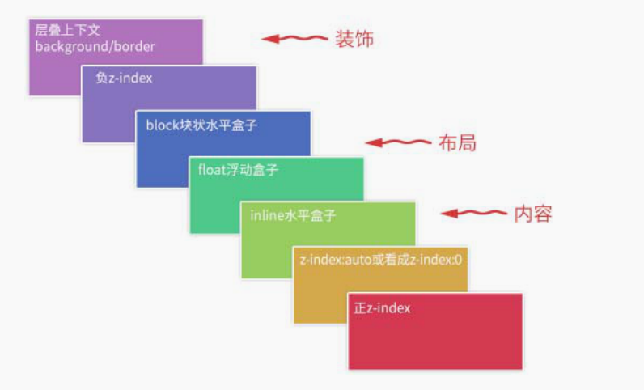
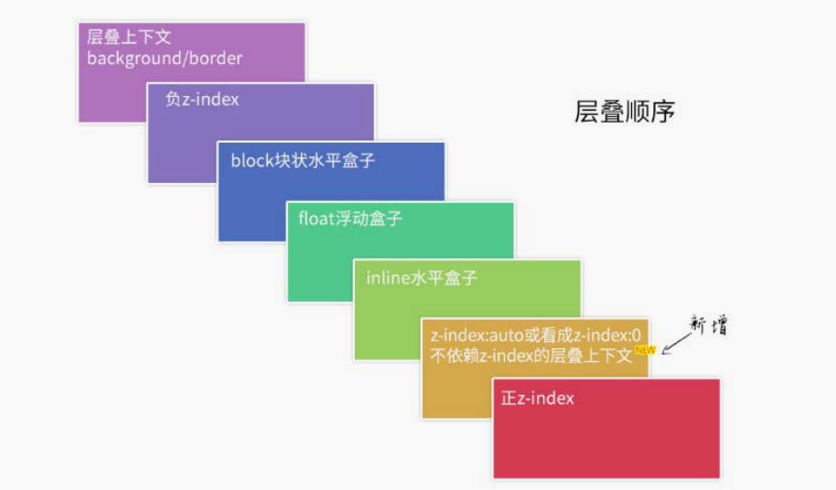
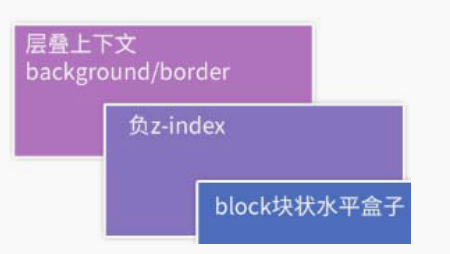
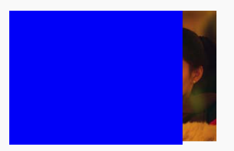

# css 世界的层叠规则

## z-index 与层叠规则

`z-index` 属性只有和`定位元素（position 不为 static 的元素）`在一起的时候才有作用，可以是正数也可以是负数，在 CSS3 新世界里，z-index 已经并非只对定位元素有效，flex 盒子的子元素也可以设置 z-index 属性

影响层叠顺序的属性远不止 z-index 一个，因此大家千万不要以为 z-index 属性就可以代表 CSS 世界的层叠规则，实际上 z-index 只是 CSS 层叠规则中的一叶小舟，CSS 层叠规则的体量要比大家想象的要大得多。

## 层叠上下文

层叠上下文是 HTML 中的一个三维的概念。如果一个元素含有层叠上下文，我们可以理解为这个元素在 z 轴上就`“高人一等”`。

我们可以把层叠上下文理解为一种“层叠结界”，自成一个小世界




### 层叠上下文的创建

- 天生派：页面根元素天生具有层叠上下文，称为根层叠上下文。
- 正统派：z-index 值为数值的定位元素的传统“层叠上下文”。
- 扩招派：其他 CSS3 属性。

让我们分别介绍下这三种

1. 根层叠上下文

   根层叠上下文指的是页面根元素，可以看成是`<html>`元素。因此，页面中所有的元素一定处于至少一个“层叠结界”中。

2. 定位元素与传统层叠上下文

   对于 position 值为 relative/absolute 以及 Firefox/IE 浏览器（不包括 Chrome 浏览器）下含有 position:fixed 声明的定位元素，当其 z-index 值不是 auto 的时候，会创建层叠上下文。
   > Chrome 等 WebKit 内核浏览器下，position:fixed 元素天然层叠上下文元素，无须 z-index 为数值。
   > IE6 和 IE7 浏览器有个 bug，就是 z-index:auto 的定位元素也会创建层叠上下文。

   

3. 其他 CSS3 属性

   - 元素为 flex 布局元素（父元素 display:flex|inline-flex），同时 z-index 值不是 auto。
   - 元素的 opacity 值不是 1。
   - 元素的 transform 值不是 none。
   - 元素 mix-blend-mode 值不是 normal。
   - 元素的 filter 值不是 none。
   - 元素的 isolation 值是 isolate。
   - 元素的 will-change 属性值为上面 2 ～ 6 的任意一个（如 will-change:opacity、will-chang:transform 等）。
   - 元素的-webkit-overflow-scrolling 设为 touch


### 层叠上下文的特性


- 层叠上下文的层叠水平要比普通元素高（原因后面会说明）。
- 层叠上下文可以阻断元素的混合模式（参见 http://www.zhangxinxu.com/wordpress/?p=5155 的这篇文章的第二部分说明）。
- 层叠上下文可以嵌套，`内部层叠上下文`及其所有子元素均受制于`外部层叠上下文`。
- 每个层叠上下文和兄弟元素独立，也就是说，当进行层叠变化或渲染的时候，只需要考虑后代元素。
- 每个层叠上下文是自成体系的，当元素发生层叠的时候，整个元素被认为是在父层叠上下文的层叠顺序中。

## 层叠水平

层叠水平决定了同一个层叠上下文中元素在 z 轴上的显示顺序

千万不要把层叠水平和 CSS 的 z-index 属性混为一谈。尽管某些情况下 z-index 确实可以影响层叠水平，但是只限于定位元素以及 flex 盒子的孩子元素，而层叠水平所有的元素都存在。

## 层叠顺序

层叠顺序表示元素发生层叠时有这特定的垂直显示顺序。



关于上图这里有一些补充说明。

- 位于最下面的 background/border 特指层叠上下文元素的边框和背景色。每一个层叠顺序规则仅适用于当前层叠上下文元素的小世界。
- inline 水平盒子指的是包括 inline/inline-block/inline-table 元素的“层叠顺序”，它们都是同等级别的。
- 单纯从`层叠水平`上看，实际上 z-index:0 和 z-index:auto 是可以看成是一样的。注意这里的措辞—“单纯从层叠水平上看”，实际上，两者在层叠上下文领域有着根本性的差异。

## 层叠准则

当元素发生层叠的时候，其覆盖关系遵循下面两条准则

- 谁大谁上：当具有明显的`层叠水平`标识的时候，如生效的 z-index 属性值，在同一个层叠上下文领域，层叠水平值大的那一个覆盖小的那一个。
- 后来居上：当元素的`层叠水平`一致、层叠顺序相同的时候，在 DOM 流中处于后面的元素会覆盖前面的元素。

  exp:
  ```html
    <div style="position:relative; z-index:auto;">
      <!-- 美女 -->
      
    </div>
    <div style="position:relative; z-index:auto;">
      <!-- 美景 -->
      
    </div>
    ```

    

    由于 z-index:auto 不会生成层叠上下文，根据`谁大谁上`所以美女在美景上面显示

    ```html
    <div style="position:relative; z-index:0;">
      <!-- 美女 -->
      
    </div>
    <div style="position:relative; z-index:0;">
      <!-- 美景 -->
      
    </div>
    ```

    

    z-index:0 会创建新的层叠上下文，`后来居上`，由于两个图片的父级层叠上下文已经有了层级区分，每个层叠上下文是自成体系的，所以美景在美女上面
## 层叠上下文与层叠顺序

一旦普通元素具有了层叠上下文，其层叠顺序就会变高

- 如果层叠上下文元素不依赖 z-index 数值，则其层叠顺序是 z-index:auto，可看成 z:index:0 级别；
- 如果层叠上下文元素依赖 z-index 数值，则其层叠顺序由 z-index 值决定。
  

元素一旦成为定位元素，其 z-index 就会自动生效，此时其 z-index 就是默认的 auto，也就是 0 级别，根据上面的层叠顺序表，就会覆盖 inline 或 block 或 float 元素[示例](https://demo.cssworld.cn/7/5-2.php)

## z-index 负值深入理解

z-index 负值的最终表现并不是单一的，而是与“层叠上下文”和“层叠顺序”密切相关”



z-index 负值元素的层级是在层叠上下文元素上面、block 元素的下面，也就是 z-index 虽然名为负数层级，但依然无法突破当前层叠上下文所包裹的小世界。

exp:
```html
<style>
  .box {
    background-color: blue;
  }
  .box > img {
    position: relative;
    z-index: -1;
    right: -50px;
  }
</style>
<div class="box">
  
</div>
```

此时 `.box` 是一个普普通通的元素，图片元素所在的层叠上下文元素一定是 `.box` 的某个祖先元素。



我们给.box 元素加个样式，使其具有层叠上下文。

```css
.box {
  background-color: blue;
  transform: scale(1); /* 元素创建新的层叠上下文*/
}
.box > img {
  position: relative;
  z-index: -1;
  right: -50px;
}
```

最终表现如下图


可以这么说，z-index 负值渲染的过程就是一个寻找第一个层叠上下文元素的过程，然后层叠顺序止步于这个层叠上下文元素。

那 z-index 负值在实际项目中有什么用呢？

- 可访问性隐藏
  z-index 负值可以隐藏元素，只需要层叠上下文内的某一个父元素加个背景色就可以。它与 clip 隐藏相比的一个优势是，元素无须绝对定位，设置 position:relative 也可以隐藏，另一个优势是它对原来的布局以及元素的行为没有任何影响，而 clip 隐藏会导致控件 focus 的焦点发生细微的变化，在特定条件下是有体验问题的。它的不足之处就是不具有普遍适用性，需要其他元素配合进行隐藏。

- IE8 下的多背景模拟

  CSS3 中有一个多背景特性，就是一个 background 可以写多
  个背景图。虽然 IE8 浏览器不支持多背景特性，但是 IE8 浏览器支持伪元素，于是，IE8 理论上也能实现多背景，这个背景最多 3 个，好在绝大多数场景 3 个背景图足矣

  ```css
  .box {
    background-image: (1png);
    position: relative;
    z-index: 0; /* 创建层叠上下文 */
  }
  .box:before,
  .box:after {
    content: "";
    position: absolute;
    z-index: -1;
  }
  .box:before {
    background-image: (2png);
  }
  .box:after {
    background-image: (3png);
  }
  ```

- 定位在元素的后面

## z-index“不犯二”准则

此准则内容如下：对于非浮层元素，避免设置 z-index 值，z-index 值没有任何道理需要超过 2。由于 z-index 不能超过 2，因此，我称其为“不犯二”准则。这是一条经验准则，可以有效降低日后遇到 z-index 样式问题的风险。

先讲一下为什么需要这个准则。

- 定位元素一旦设置了 z-index 值，就从普通定位元素变成了层叠上下文元素，相互间的层叠顺序就发生了根本的变化，很容易出现设置了巨大的 z-index 值也无法覆盖其他元素的问题。
- 避免 z-index“一山比一山高”的样式混乱问题。

很重要的一点，我这里的“不犯二”准则，并不包括那些在页面上飘来飘去的元素定位，弹框、出错提示、一些下拉效果等都不受这一准则限制。
对于这类 JavaScript 驱动的浮层组件，我会借助“层级计数器”来管理，原因如下：
（1）总会遇到意想不到的高层级元素；
（2）组件的覆盖规则具有动态性。

所谓“层级计数器”，实际上就是一段 JavaScript 脚本，会遍历所有`<body>`处于显示状态的子元素，并得到最大 z-index 值，和默认的 z-index 做比较。如果超出，则显示的组件的 z-index 自动加 1，这样就不会出现有组件被其他组件覆盖的问题
