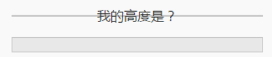
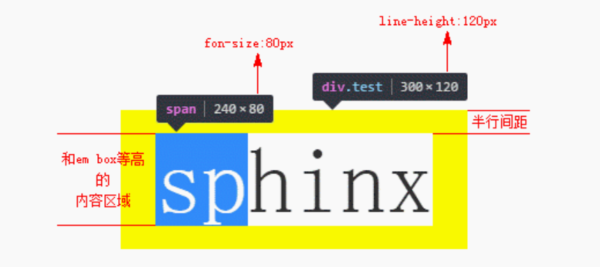
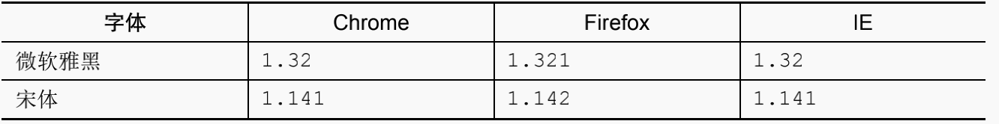

# line-height

## line-height 与内联元素的高度

在实际开发中，如果仅仅通过表象来确认，估计不少人会认为`<div>`高度是由里面的文字撑开的，也就是 font-size 决定的，但本质上是由 `line-height` 属性全权决定的，尽管某些场景确实与 `font-size` 大小和`vertical-align`值的设置有关。

exp:

```html
<style>
  .test1 {
    font-size: 16px;
    line-height: 0;
    border: 1px solid #ccc;
    background: #eee;
  }
</style>
<div class="test1">我的高度是？</div>
<!--最终表现如下图上面部分-->
```



```html
<!--最终表现如上图下面部分-->
<style>
  .test1 {
    font-size: 0;
    line-height: 16px;
    border: 1px solid #ccc;
    background: #eee;
  }
</style>
<div class="test1">我的高度是？</div>
```

很显然，从上面这个例子可以看出，`<div>`高度是由行高决定的，而非文字大小。

内联元素的高度由`固定高度`和`不固定高度`组成，这个不固定的部分就是这里的`“行距”`。在 CSS 中，`“行距”`分散在当前文字的上方和下方，也就是即使是第一行文字，其上方也是有“行距”的，只不过这个“行距”的高度仅仅是完整`“行距”`高度的一半，因此，也被称为`“半行距”`。行距计算公式如下：

> 行距 = line-height - em-box

> 半行距=1/2 个行距

`em-box` 在 css 中我们无法感知，但是他的高度 1em 相当于当前的一个 `font-size` 大小

> 行距=line-height - font-size

`em-box`有时候也可以和`内容区域`这种可以感知的东西想关联，`内容区域`近似理解为 Firefox/IE 浏览器下文本选中带背景色的区域，大多数场景下，内容区域和 `em-box` 是不一样的，内容区域高度受 `font-family` 和 `font-size` 双重影响，而`em-box` 仅受 `font-size` 影响，通常内容区域高度要更高一些，但是当我们的字体是`宋体`的时候，`内容区域`和 `em-box` 是等同的

利用我们平常不待见的宋体，就能准确揪出“半行距”的藏身之所了

```html
<style>
  .test {
    font-family: simsun; /**宋体的英文写法*/
    font-size: 80px;
    line-height: 120px;
    background-color: yellow;
  }
  .test > span {
    background-color: white;
  }
</style>
<div class="test">
  <span>sphinx</span>
</div>
<!--最终表现如下图下面部分-->
```



## line-height 行距与设计师

可能是由于 CSS 开发人员不够专注细致，外加规范设计本身的原因，设计师往往会对各个元素间的距离间隙标注得很清晰。但是，设计师并不是开发人员，他们并没有把网页中无处不在`行间距`考虑在内，所有与文字相关的间距都是从文字的上边缘和下边缘开始标注的。除非我们全局行高设置为 `line-height:1`，否则这些标注的距离和我们使用的间距都是不一致的。

但是，如果我们理解了`半行距`，结合我们网页中的设置的 `line-height` 大小，就能根据设计师的标注获取准确的间距值。

举个例子，假设 `line-height` 是 1.5，`font-size` 大小是 14px，那么我们的`半行距`大小就是`(14px * 1.5 - 14px) / 2 = 3.5px`。`border 以及 line-height 等传统 CSS 属性并没有小数像素的概念`（从 CSS3 动画的细腻程度可以看出），因此，这里的 3.5px 需要取整处理，如果标注的是文字上边距，则向下取整；如果是文字下边距，则向上取整，因为绝大多数的字体在内容区域中都是偏下的。所以，假设设计师标注了文字字形上边缘到图片下边缘间距 20px，因为 3.5px 向下取整是 3px。所以我们实际的 margin-top 值应该是` 20px - 3px =17px`

## line-height 对各种元素的影响

- `非替换元素的纯内联元素`：高度完全由 line-height 决定

- `替换元素`：line-height 无法影响高度，但是像 img 这样的内联替换元素会产生行框盒子，从而产生幽灵空白节点

- `混合元素`（内联替换元素和内联非替换元素混合）：line-height 在这个混合元素的“行框盒子”中扮演的角色是决定这个`行盒的最小高度`,原因一是替换元素的高度不受 line-height 影响，二是 vertical-align 属性在背后作祟。

- `块级元素`：line-height 不起任何作用

## line-height 与内联元素“垂直居中”

元素设置 line-height 可以让单行文本垂直`近似居中`，也可以让多行文本垂直`近似居中`

居中机制：行高可以实现“垂直居中”原因在于 CSS 中`“行距的上下等分机制”`，如果行距的添加规则是在文字的上方或者下方，则行高是无法让文字垂直居中的

为何近似居中：说“近似”是因为`文字字形的垂直中线位置`（等同于 x 的中心点）普遍要比真正的`“行框盒子”`的`垂直中线`位置低

单行居中 exp：

```css
.title {
  line-height: 24px;
  /*无需设置height:24px,便可实现单行近似居中效果*/
}
```

多行居中 exp：

```html
<style>
  .box {
    line-height: 120px;
    background-color: #f0f3f9;
  }
  .content {
    display: inline-block;
    /* inline-block元素会创建一个独立的行框盒子*/
    /* 并且行框盒子的中线和前面的幽灵空白节点的文字字形中线对齐（内联盒子高度120px），
    最终达到多行近似居中的效果*/
    line-height: 20px;
    margin: 0 20px;
    vertical-align: middle;
  }
</style>
<div class="box">
  <div class="content">基于行高实现的...</div>
</div>
```

## line-height 的各类属性值

`line-height` 的默认值是 `normal`，还支持`数值`、`百分比值`以及`长度值`。

- 默认值 normal

  默认值 normal 是一个和 font-family 有着密切关联的变量值。
  

  根据上表可以看出，只要字体确定，各个浏览器下的默认 line-height 解析值基本上都是一样的,但是不同的浏览器所使用的默认中英文字体并不是一样的，并且不同操作系统的默认字体也不一样，也就是说，不同系统不同浏览器的默认 line-height 都是有差异的。所以对 `line-height 的默认值进行重置是势在必行的`

  ```css
  * {
    line-height: 1.5;
  }
  ```

- 数值

  如 line-height:1.5，其最终的计算值是和当前 font-size 相乘后的值。

- 百分比值

  百分比值，如 line-height:150%，其最终的计算值是和当前 font-size 相乘后的值。

- 长度值

  也就是带单位的值，如 line-height:21px 或者 line-height:1.5em 等，此处 em 是一个相对于 font-size 的相对单位，因此，line-height:1.5em 最终的计算值也是和当前 font-size 相乘后的值。

数值和其他两种的不同：

根据上面可以看出似乎 `line-height:1.5`、`line-height:150%`和 `line-height:1.5em` 这 3 种用法是一模一样的，最终的行高大小都是和 font-size 计算值，但是，实际上，`line-height:1.5` 和另外两个有一点儿不同，那就是继承细节有所差别。

> 如果使用数值作为 line-height 的属性值，那么所有的子元素继承的都是这个值；
>
> 如果使用百分比值或者长度值作为属性值，那么所有的子元素继承的是最终的计值。

```css
body {
  font-size: 14px;
  line-height: 1.5;
  line-height: 150%;
  line-height: 1.5em;
  /* 最终的line-height计算后的结果都是21px*/
}

body > div {
  font-size: 32px;
  /* 当没有设置line-height,默认情况下时会继承上面的21px*/
  /* 但是当父级元素设置时数值时，会继承数值，最终的line-height为32*1.5=48px*/
}
```

## line-height 的“大值特性”

先来两段代码，请问下面两段代码最终 box 盒子的高度是多少？

```html
<style>
  .box {
    line-height: 96px;
  }
  .box span {
    line-height: 20px;
  }
</style>
<div class="box">
  <span>内容...</span>
</div>
```

```html
<style>
  .box {
    line-height: 20px;
  }
  .box span {
    line-height: 96px;
  }
</style>
<div class="box">
  <span>内容...</span>
</div>
```

上面两个代码最终的 box 盒子的高度都是 96px，因为有内联元素定有行框盒子，而每个行框盒子前必定会产生`幽灵空白节点`，当 .box 元素设置 line-height:96px 时，`幽灵空白节点`高度 96px；当 .box 元素设置 line-height:20px 时，`<span>`元素的高度则变成了 96px，而`行框盒子的高度`是由高度最高的那个“内联盒子”决定的，这就是.box 元素高度永远都是最大的那个 line-height 的原因。


那么如何让第一段代码的 span 的`line-height: 20px`生效呢?

可以通过设置`<span>` 元素 `display:inline-block`，创建一个独立的“行框盒子”，这样`<span>`元素设置的 line-height:20px 就可以生效了，这也是多行文字垂直居中示例中这么设置的原因。
