# vertical-align

## vertical-align 属性

vertical-align 属性值分为以下 4 类：

- `线类`，如 baseline（默认值）、top、middle、bottom；
- `文本类`，如 text-top、text-bottom；
- `上标下标类`，如 sub、super；
- `数值百分比类`
  如 20px、-2em、20%等。如果是负值，从基线往下偏移，如果是正值，从基线往上偏移。em 时相对于当前的 font-size 进行计算的，百分比是相对于当前的 line-height 计算值计算的。

## vertical-align 作用前提

vertical-align 起作用是有前提条件的，这个前提条件就是：`只能应用于内联元素以及 display 值为 table-cell 的元素。`

换句话说，vertical-align 属性只能作用在 display 计算值为 inline、inlineblock，inline-table 或 table-cell 的元素上。因此，默认情况下，`<span>`、`<strong>`、`<em>`等内联元素，``、`<button>`、`<input>`等替换元素，非 HTML 规范的自定义标签元素，以及`<td>`单元格，都是支持 vertical-align 属性的，其他块级元素则不支持。

内联元素设置 vertical-align 只设置在内联元素身上就可以了，但是 table-cell 设置 vertical-align 的位置比较特殊，那是因为对 table-cell 元素而言，vertical-align 起作用的是 table-cell 元素自身。所以必须设置在自身才起作用

```html
<style>
  .cell {
    height: 128px;
    display: table-cell;
    vertical-align: middle; /*必须设置在自身才起作用*/
  }
  .cell > img {
    height: 96px;
  }
</style>
<div class="cell">
  
</div>
```

在 CSS 世界中，有一些 CSS 属性值会在背后默默地改变元素 display 属性的计算值，从而导致 vertical-align 不起作用。比方说，浮动和绝对定位会让元素块状化，

```css
.example {
  float: left;
  vertical-align: middle; /* 没有作用 */
}
.example {
  position: absolute;
  vertical-align: middle; /* 没有作用 */
}
```

## vertical-align 和 line-height

> 记住只要出现内联元素，vertical-align 和 line-height 一定同时出现

在上面的前提下我们来解决几个常见的疑问

---

疑问一

很多人都有这样一个错误的认知，认为对于单行文本，只要行高设置多少，其占据高度就是多少。比方说，对于下面非常简单的 CSS 和 HTML 代码：

```html
<style>
  .box {
    line-height: 32px;
  }
  .box > span {
    font-size: 24px;
  }
</style>
<div class="box">
  <span>x文字</span>
</div>
```

.box 元素的高度是多少？答案并非时 32px,而是要大几像素。而这大的几像素就是由于 vertical-align 在背后默默地下了黑手。

对字符而言，`font-size 越大字符的基线位置越往下`，因为文字默认全部都是基线对齐，所以当字号大小不一样的两个文字在一起的时候，彼此就会发生上下位移，如果位移距离足够大，就会超过行高的限制，而导致出现意料之外的高度，
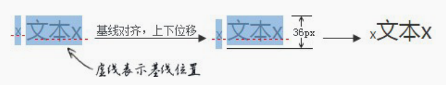

知道了问题发生的原因，那问题就很好解决了。我们可以让“幽灵空白节点”和后面`<span>`元素字号一样大，或者改变垂直对齐方式，如顶部对齐，这样就不会有参差位移了

```css
.box {
  line-height: 32px;
  font-size: 24px;
}
.box > span {
}
```

---

疑问二

任意一个块级元素，里面若有图片，则块级元素高度基本上都要比图片的高度高

```html
<style>
  .box {
    width: 280px;
    outline: 1px solid #aaa;
    text-align: center;
  }
  .box > img {
    height: 96px;
  }
</style>
<div class="box">
  
</div>
```

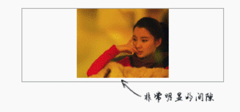

通过结果会发现,底部会有明显的间隙，间隙产生的三大元凶就是“幽灵空白节点”、line-height 和 vertical-align 属性。我们不妨在图片前添加一个 x 字符

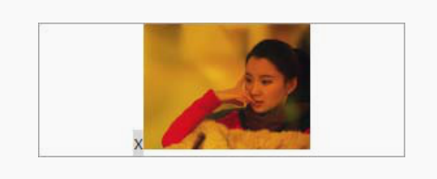

“幽灵空白节点”使图片的这种替换元素的下边缘和幽灵节点 x 的基线对齐，当前 line-height 计算值是 20px，而 font-size 只有 14px，因此，字母 x 往下一定有至少 3px 的半行间距（具体大小与字体有关）

如何清除这个间隙呢？

- `图片块状化`可以一口气干掉“幽灵空白节点”、line-height 和 vertical-align。
- ` 容器 line-height 足够小`。只要半行间距小到字母 x 的下边缘位置或者再往上，自然就没有了撑开底部间隙高度空间了。比方说，容器设置 line-height:0。
- `容器 font-size 足够小`。此方法要想生效，需要容器的 line-height 属性值基于当前 font-size 计算，也就是说不能是 16px,这样只会让下面的间隙变得更大
- `图片设置其他 vertical-align 属性值`。间隙的产生原因之一就是基线对齐，所以我们设置 vertical-align 的值为 top、middle、bottom 中的任意一个都是可以的。

---

疑问三

内联特性导致的 margin 无效问题

```html
<style>
  .box > img {
    height: 96px;
    margin-top: -200px;
  }
</style>
<div class="box">
  
</div>
```

按照理解，-200px 远远超过图片的高度，图片应该完全跑到容器的外面，但是，图片依然有部分在.box 元素中，而且就算 margin-top 设置成-99999px，图片也不会继续往上移动，完全失效。
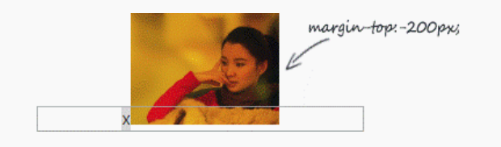

而在 CSS 世界中，非主动触发位移的内联元素是不可能跑到计算容器外面的，导致图片的位置被“幽灵空白节点”的 vertical-align:baseline 给限死了

## vertical-align 线性类属性值

### inline-block 与 baseline

vertical-align 属性的默认值 baseline 在文本之类的内联元素那里就是字符 x 的下边缘，对于替换元素则是替换元素的下边缘。但是，如果是 inline-block 元素，则规则要复杂了：一个 inline-block 元素，如果里面没有内联元素，或者 overflow 不是 visible，则该元素的基线就是其 margin 底边缘；否则其基线就是元素里面最后一行内联元素的基线。

```html
<style>
  .dib-baseline {
    display: inline-block;
    width: 150px;
    height: 150px;
    border: 1px solid #cad5eb;
    background-color: #f0f3f9;
  }
</style>
<span class="dib-baseline"></span>
<span class="dib-baseline">x-baseline</span>
```

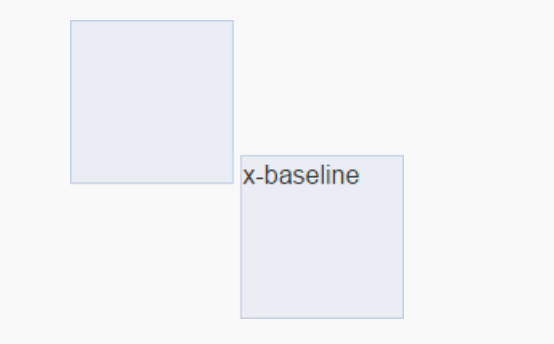

当我们把 dib-baseline 的 line-height 设置为 0 时

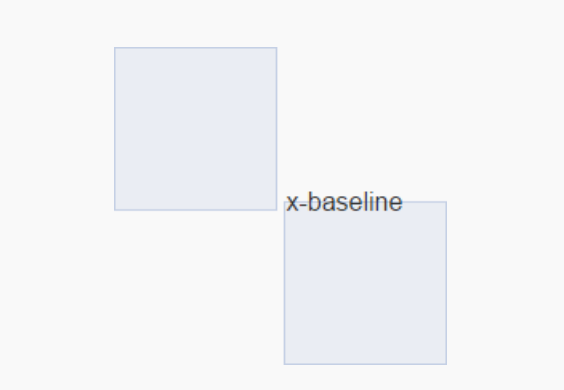

因为字符实际占据的高度是由 line-height 决定的，当 line-height 变成 0 的时候，字符占据的高度也是 0，此时，高度的起始位置就变成了字符内容区域的垂直中心位置，于是文字就有一半落在框的外面了

在看一个例子

```html
<style>
  .box {
    width: 300px;
    text-align: justify;
    border: 1px solid;
    background: yellow;
  }
  .justify-fix {
    display: inline-block;
    width: 96px;
  }
</style>
<div class="box">
  
  
  
  
  <i class="justify-fix"></i>
  <i class="justify-fix"></i>
  <i class="justify-fix"></i>
</div>
```

空的 inline-block 元素的高度是 0，按照通常的理解，下面应该是一马平川，结果却有非常大的空隙存在

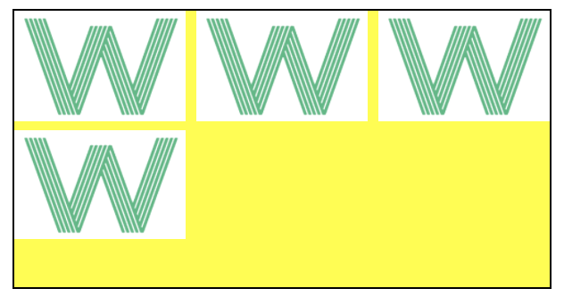

为了便于大家看个究竟，我把占位`<i>`元素的 outline 属性用虚外框标示一下,同时在最后一个占位的`<i>`元素后面新增同样的 x-baseline 字符

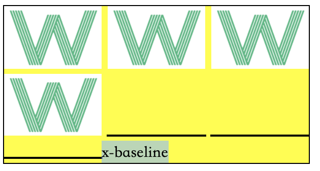

我们可以知道这又是`幽灵空白节点`在作祟,如果我们把.box 元素的 line-height 设置为 0，去除幽灵空白节点的影响，按理说应该是上下没有间距，但是事实却不是如此，如下图

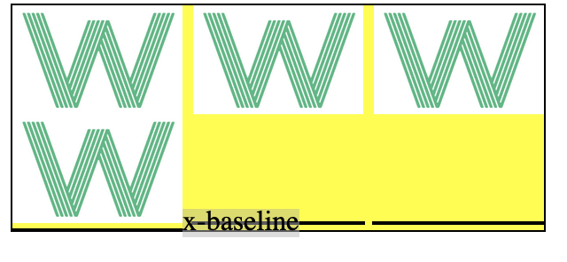

现在行高 line-height 是 0，则字符 x-baseline 行间距就是-1em，也就是高度为 0，由于 CSS 世界中的行间距是上下等分的，因此，此时字符 x-baseline 的对齐点就是 x-baseline 内容区域（可以看成文字选中背景区域，如上图，截自 Firefox 浏览器）的垂直中心位置。由于 x-baseline 使用的是微软雅黑字体，字形下沉明显，因此，内容区域的垂直中心位置大约在字符 x 的上面 1/4 处，而这个位置就是字符 x-baseline 和最后一行图片下边缘交汇的地方。理解了 x-baseline 的垂直位置表现，间隙问题就很好理解了。由于前面的`<i class= "justify-fix"></i>`是一个 inline-block 的空元素，因此基线就是是自身的底部，于是下移了差不多 3/4 个 x 的高度，这个下移的高度就是上面产生的间隙高度。

解决方案

1. 在空的`<i>`元素里面随便放几个字符，改变 inline-block 基线的位置
2. 设置 font-size:0,改造“幽灵空白节点”的基线位置,当设置为 0 时，基线和中线会重合在一起。

应用：基于 20px 图标对齐的处理技巧

```css
.icon {
  display: inline-block;
  width: 20px;
  height: 20px;
  background: url(sprite.png) no-repeat;
  white-space: nowrap;
  letter-spacing: -1em;
  text-indent: -999em;
}
.icon:before {
  content: "\3000";
}
/* 具体图标 */
.icon-xxx {
  background-position: 0 -20px;
}
```

### vertical-align:top/bottom

vertical-align:top(bottom)
- 内联元素：元素顶部(底部)和当前行框盒子的顶部(底部)对齐。
- table-cell 元素：元素顶部(底部) padding 边缘和表格行的顶部(底部)对齐。

已知一个`<div>`元素中有两张图片，其中后面一张图片设置了 vertical-align:bottom，请问这两张图片的底边缘是对齐的吗？答案是由于幽灵空白节点的原因不对齐，如下图


### vertical-align:middle 与近似垂直居中

- 内联元素：元素的垂直中心点和行框盒子基线往上 1/2 x-height 处对齐。
- table-cell 元素：单元格填充盒子相对于外面的表格行居中对齐。

定义中“基线往上 1/2 x-height 处”，指的就是 middle 的位置，仔细品味一下，“基线”就是字符 x 底边缘，而 x-height 就是字符 x 的高度。考虑到大部分字体的字符 x 上下是等分的，因此，从“基线往上 1/2x-height 处”我们就可以看出是字符 x 中心交叉点的位置。换句话说就是，vertial-align:middle 可以让内联元素的真正意义上的垂直中心位置和字符 x 的交叉点对齐。基本上所有的字体中，字符 x 的位置都是偏下一点儿的，font-size 越大偏移越明显，这才导致默认状态下的 vertial-align:middle 实现的都是“近似垂直居中”。

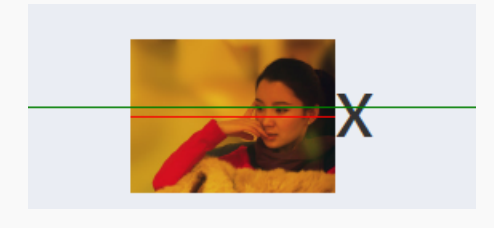

如果想要实现真正意义上的垂直居中对齐，只要想办法让字符 x 的中心位置就是容器的垂直中心位置即可，通常的做法是设置 `font-size:0`，整个字符 x 缩小成了一个看不见的点，根据 line-height 的半行间距上下等分规则，这个点就正好是整个容器的垂直中心位置，这样就可以实现真正意义上的垂直居中对齐了

## 简单了解 vertical-align 的其他属性

### 文本类属性

- vertical-align:text-top：盒子的顶部和父级内容区域的顶部对齐。
- vertical-align:text-bottom：盒子的底部和父级内容区域的底部对齐。

而所谓“父级内容区域”指的就是在父级元素当前 font-size 和 font-family 下应有的内容区域大小。[示例](https://demo.cssworld.cn/5/3-9.php)

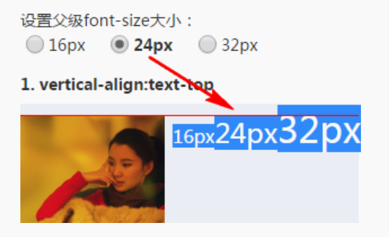

### 上下标属性

- vertical-align:super：提高盒子的基线到父级合适的上标基线位置。
- vertical-align:sub：降低盒子的基线到父级合适的下标基线位置。

  sub（上标）,super（下标），分别对应 html 中的`<sub>`和`<sup>`两个标签

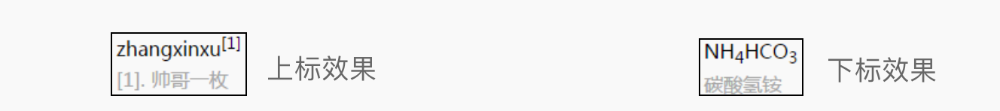

vertical-align 上标下标类属性值并不会改变当前元素的文字大小，千万不要被 HTML 标签中的`<sup`>和`<sup>`误导，因为这两个 HTML 标签默认 font-size 是 smaller

## 基于 vertical-align 属性的水平垂直居中弹框

最后，推荐一个我自己觉得非常棒的 vertical-align 属性实践，就是使用纯 CSS 实现大小不固定的弹框永远居中的效果，并且如果伪元素换成普通元素，连 IE7 浏览器都可以兼容。

```html
<style>
.container {
 position: fixed;
 top: 0; right: 0; bottom: 0; left: 0;
 background-color: rgba(0,0,0,.5);
 text-align: center;
 font-size: 0;
 white-space: nowrap;
 overflow: auto;
}
.container:after {
 content: '';
 display: inline-block;
 height: 100%;
 vertical-align: middle;
}
.dialog {
 display: inline-block;
 vertical-align: middle;
 text-align: left;
 font-size: 14px;
 white-space: normal;
}
</style>
<div class="container">
 <div class="dialog"></dialog>
</div>
```
