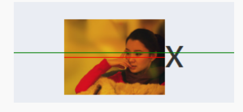

# 字母 x

## 字母 x 与 CSS 世界的基线

在各种内联相关模型中，凡是涉及垂直方向的排版或者对齐的，都离不开最基本的`基线`（baseline）。例如，`line-height` 行高的定义就是两`基线`的间距，`vertical-align` 的`默认值`就是`基线`，`小写字母 x` 的下边缘（线）就是我们的`基线`。


各种元素基线位置：

`内联非替换元素`：基线为 x 的下边缘

`替换元素`：基线为 margin 的底边缘

`display:inline-block元素`：当元素内无内联元素或 overflow 的值不为 visible 时，基线为 margin 的底边缘，否则为最后一行内联元素的基线

## 字母 x 与 CSS 中的 x-height

`x-height`指的是小写字母 x 的高度。也就是基线和等分线（mean line）（也称作中线，midline）之间的距离。如下图


- ascender height: 上下线高度。
- cap height: 大写字母高度。
- median: 中线。
- descender height: 下行线高度。

x-height 的作用：

在属性`vertical-align:middle`中，这里的 middle 是中间的意思。注意，跟上面的 median（中线）不是一个意思。在 CSS 世界中，middle 指的是基线往上 `1/2 x-height` 高度。

由于不同的字体在行内盒子中的位置是不一样的，比如，“微软雅黑”就是一个字符下沉比较明显的字体，所有字符的基线位置都比其他字体要偏下一点儿。除非 x 的位置在中间，才能和行内盒子`容器中分线`等分，否则 `vertical-align:middle` 并不可以绝对的垂直居中对齐



## 字母 x 与 CSS 中的 ex

ex 是 css 种的一种尺寸单位，由 `x-height` 衍生而来，代表小写字母 x 的高度

ex 的作用：

由于字母 x 受字体等 CSS 属性影响大，不稳定，因此 ex 不太适合用来限定元素的尺寸。但是利用 ex 却可以实现`不受字体和字号影响的内联元素的垂直居中对齐效果`。

```css
.icon-arrow {
  display: inline-block;
  width: 20px;
  height: 1ex;
  background: url(arrow.png) no-repeat center;
}
/*无内容的或者overflow不是visible的inline-block默认元素的基线为margin低边缘（下面会写）*/
/*图标高度就是 1ex，同时背景图片居中，由于vertical默认值的影响，最终x的基线和图标的基线相同，
图标和文字垂直居中，而且完全不受字体和字号的影响*/
```
