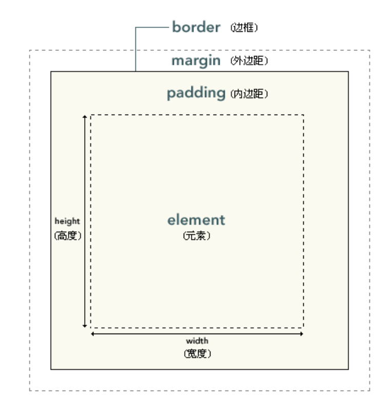

# 盒子与基本尺寸


## 外在盒子和容器盒子


css的造物主创造了`块级盒子`和`内联盒子`，块级盒子主要实现布局，内联盒子主要负责内容

除了以上两种盒子，造物主又实现了两个盒子`外在盒子`和`容器盒子`，外在盒子负责元素在一行显示还是换行显示，容器盒子用来控制宽高和内容呈现

按照属性display的属性值不同，我们可以把的盒子进行以下区分
<table role="table">
    <tbody>
        <tr>
            <th>属性值</th>
            <th>臆想值</th>
        </tr>
        <tr>
            <td>block</td>
            <td>外在盒子:block（块状盒子）,容器盒子:block（块状盒子）</td>
        </tr>
        <tr>
            <td>table</td>
            <td>外在盒子:block（块状盒子）,容器盒子:table（块状盒子）</td>
        </tr>
         <tr>
            <td>inline</td>
            <td>外在盒子:inline（内联盒子）,容器盒子:inline（内联盒子）</td>
        </tr>
         <tr>
            <td>inline-table</td>
            <td>外在盒子:inline（内联盒子）,容器盒子:table（块状盒子）</td>
        </tr>
    </tbody>
</table>


## 块状元素

从定义上来说，块状元素是display为`block`,`list-item`,`table`的元素，为常见块状元素有`div`,`li`,`table`等

由于块状元素有换行特性，可以配合 clear 属性清除浮动带来父级高度坍塌的影响（后面会讲）

```css
.clear:after {
  content: "";
  display: table; //或者block
  clear: both; //后续会讲
}
```
display 尽量不要用 list-item 来解决浮动影响，因为在 IE 浏览器不支持伪元素设置 display:list-item，并且 list-item 还有一个特性，就是前面会出现项目符号，因为块状盒子都有一个块级盒子，list-item 除此之外还有一个`标记盒子`，专门用来存放符号


## 内联元素

### 基本定义

从定义上来说，内联元素的内联特指外在盒子，display 为 `inline-block`,`inline-table`,`inline` 的元素都是内联元素

从表现上来说，内联元素典型的特征就是可以和文字在一行显示（浮动元素虽然在一行，但是浮动元素在文档流之外，实际和后面的文字并不在同一水平上）

针对下面普通的 html 代码，我们总结下其中的盒子

```html
<p>这是一行普通的文字，这里有个 <em>em</em> 标签。</p>
```

-  内容区域（字符盒子）：围绕文字的看不见的盒子，大小仅受字符本身特性控制，本质上是一个`字符盒子`，但是像图片这样的替换元素，不在字符盒子之类，内容区域可以堪称元素自身，在 IE 和 Firefox 下可以看成文本选中的区域

- 内联盒子（外在盒子）:用来决定元素是内联还是块级，该盒子又分为`内联盒子`和`匿名内联盒子`,
如果外部含内联标签（`<span>`、`<a>`和`<em>`等），则属于“内联盒子”（ `<em>em</em>`）；如果是个光秃秃的文字，则属于“匿名内联盒子”（`这是一行普通的文字，这里有个`）。

- 行框盒子:每一行就是一个行框盒子，每个行框盒子又是由一个个内联盒子组成

- 包含盒子（包含块）:`<p>`标签就是一个包含盒子

### 幽灵空白节点

在 HTML5 文档声明中(`<!DOCTYPE html>`),内联元素在解析和渲染前都会在每个`行框盒子`前生成一个空白节点，此节点没有宽度，没有内容，不可通过脚本获取，称之曰`幽灵空白节点`

```html
<style>
    div { background-color: #cd0000; } span { display: inline-block; }
</style>
<!--此时div盒子的高度为18，就是由于幽灵空白节点在作祟，至于为什么是18，等待后续分享-->
<div><span></span></div>
```


## width/height 作用细节

### width 默认值 auto

当width为auto时宽度有4种不同表现：
- 充分利用可用空间
- 包裹性
- 收缩到最小
- 超出容器限制

而这四种不同的表现除了`充分利用可用空间`是由外部元素决定，其余三种都是由内部元素进行决定，我们又把由内部元素决定的尺寸叫`内部尺寸`，由外部元素决定的尺寸叫`外部尺寸`

#### 外部尺寸与流体特征

(1) 正常流宽度

当块级元素没有设置宽度时，会自动表现为流动性，流满整个父级容器，但是一旦设置了宽度，则流动性就会丢失.

::: run {open: true}

``` html

<template>
  <div>
    <h4>无宽度，借助流动性</h4>
    <div class="nav">
      <a href="" class="nav-a">导航1</a>
      <a href="" class="nav-a">导航2</a>
      <a href="" class="nav-a">导航3</a>
    </div>
    <h4>width:100%</h4>
    <div class="nav">
      <a href="" class="nav-a width">导航1</a>
      <a href="" class="nav-a width">导航2</a>
      <a href="" class="nav-a width">导航3</a>
    </div>
  </div>
</template>
<style>
  .width {
    width: 100%;
  }
  .nav {
    width:500px;
    background-color: #cd0000;
  }
  .nav-a {
    display: block;
    margin: 0 10px;
    padding: 9px 10px;
    border-bottom: 1px solid #b70000;
    border-top: 1px solid #de3636;
    color: #fff;
  }
  .nav-a:first-child { border-top: 0; }
  .nav-a + .nav-a + .nav-a { border-bottom: 0;}
</style>
```
:::

(2) 格式化宽度

默认情况下，当属性 position 的值为 absolute 或 fixed 时，宽度表现为包裹性，宽度由内部尺寸决定

对于`非替换元素`,当属性 position 的值为 absolute 或 fixed 时，当对立方位（left/right 或 top/bottom）的属性值同时存在的时候，元素表现为格式化宽度，也就是具有流动性，流满最近的具有定位元素（position 不为 static）的祖先元素计算

例如：

```css
div {
  position: absolute;
  left: 20px;
  right: 20px;
}
/*假如div元素最新的具有定位特性的祖先元素的宽度时1000像素，则div的宽度为960（1000-20-20）像素 */
```


我们在实际开发过程中尽量尽量采用`无宽度原则`，保证块级元素的流动性，这样会让布局更加灵活，同时提高容错性
#### 内部尺寸与流体特性

内部尺寸：元素宽度由内部元素决定，最简单判断内部尺寸的方法就是当这个元素里面没有内容时，容器盒子的宽度为 0

内部尺寸有以下三种表现形式

- 包裹性
- 首选最小宽度
- 最大宽度

##### 包裹性

包裹性除了`包裹`的意思外还有`自适应`的意思，指的是元素尺寸有内部元素决定，但是永远小于`包含块`容器的尺寸

那什么是包含块呢？下面写下关于包含块的定义： 
- 根元素是初始的包含块，尺寸等于浏览器可是窗口的大小 window.innerWidth 
- 对于其他元素，如果该元素的 position 是 relative 或 static，包含块为最近的块状容器祖先元素的 content-box 
- 如果元素 position：fixed ，包含块为初始包含块 
- 如果元素 position:absolute，包含块为最近的 position 不为 static 的祖先元素
  如果该祖先元素是纯 inline 元素，则规则略复杂：
    - 假设给内联元素的前后各生成一个宽度为 0 的内联盒子（inline box），则这两个内联盒子的 padding box 外面的包围盒就是内联元素的“包含块”； 
    - 如果该内联元素被跨行分割了，那么“包含块”是未定义的，也就是 CSS2.1规范并没有明确定义，浏览器自行发挥。
  否则，“包含块”由该祖先的 padding box 边界形成

  如果没有符合条件的祖先元素，则“包含块”是“初始包含块”。

##### 首选最小宽度

指元素适合的最小宽度，假如包含块盒子的 width=0;当前元素的 width=auto;则 css 不会让图文在 width:auto 时候宽度变为 0，而是表现为首选最小宽度。


::: run {open: true,row:true}

``` html
<template>
  <div>
    <div class="box">
      <span>中国世界第一</span>
    </div>
    <div class="box">
     <span>hello-word</span>
    </div>
  </div>
</template>
<style>
  .box {
    width: 0;
    margin-top:30px;
  }
  .box > span{
    background:red
  }
</style>
```
:::

<table role="table">
    <tbody>
        <tr>
            <th>类型</th>
            <th>首选最小宽度</th>
        </tr>
        <tr>
            <td>中文</td>
            <td>每个汉字宽度</td>
        </tr>
        <tr>
            <td>西方文字</td>
            <td>连续的英文字符单元（一般终止于空格，短横线，问号以及其他非英文字符）</td>
        </tr>
    </tbody>
</table>

如果想要让英文字符和中文一样，每个字符作为最小宽度单元，可以设置 word-break:break-all


##### 最大宽度

最大宽度等同于包裹性元素设置 white-space:nowrap,如果内部没有块级元素或者块级元素没有设定宽度值，则“最大宽度”实际上是最大的连续内联盒子的宽度。

### width 值作用的细节

在 css 中 宽度是作用在容器盒子中的，容器盒子有很多部分构成，如下图



容器盒子被分为了四个盒子：content box、padding box、border box 和 margin box。对应 css 的关键字 content-box,padding-box,border-box,但是 margin box 没有关键字

在 css2.1 规范中，定义 width 和 height 是设置在 content box 上的

```css
div {
  width: 100px;
  padding: 20px;
  border: 20px solid;
}
//所以此div盒子的宽度(offsetWidth)为100+20*2+20*2=180px
```

当块状元素设置宽度时会有以下两个问题：

(1)流动性丢失

(2)与现实世界表现不一致的困惑

包含 padding 或 border 会让元素宽度变大的这种 CSS 表现往往会让 CSS 使用者困惑：我设置宽度为 100 像素，其实是希望整个最终的宽度是 100 像素，这样才符合现实理解嘛。这对一些 CSS 新手的布局造成了一定的障碍，因为这些 CSS 从业者眼中的 CSS 结构是砖块，而不是水流。因此，布局讲求尺寸精确计算。这就导致在一些 CSS 属性值发生变化的时候（如 padding 值变大，元素尺寸也变大），空间不足，出现页面布局错位的问题。但是我们可以使用 box-sizing 来改变这个现状

### 改变 width/height 作用细节的 box-sizing

#### box-sizing 的作用
box-sizing 虽然是 CSS3 属性，但是，让人受宠若惊的是 IE8 浏览器也是支持它的，不过需要加-ms-私有前缀，但 IE9 浏览器开始就不需要私有前缀了。

box-sizing 默认值是content-box,也就是宽高默认作用在 content box 上

box-sizing设置为border-box,让宽高作用在 border box 上，会形成局部的流动性

```css
.box {
  width: 100px;
  box-sizing: border-box;
  padding: 20px;
  border: 1px solid;
}
//盒子的宽度依旧是100px
```

#### 如何评价 `* {box-sizing:border-box}`
(1)这种写法容易产生没必要的消耗

通配符*应该是一个慎用的选择器，因为它会选择所有的标签元素。

对于普通内联元素（非图片等替换元素），box-sizing 无论是什么值，对其渲染表现都没有影响，因此，`*`对这些元素而言就是没有必要的消耗；

同时有些元素，如 search类型的搜索框，其默认的 box-sizing 就是 border-box（如果浏览器支持），因此，*对search 类型的`<input>`而言也是没有必要的消耗。

(2)这种写法并不能解决所有问题

box-sizing 不支持 margin-box，只有当元素没有水平 margin 时候，box-sizing 才能真正无计算，而“宽度分离”等策略则可以底解决所有的宽度计算的问题。

#### box-sizing 发明的初衷
CSS 世界中，唯一离不开 `box-sizing:border-box` 的就是原生普通文本框`<input>`和文本域`<textarea>`的 100%自适应父容器宽度。

拿`<textarea>`来说，`<textarea>`为替换元素，替换元素的特性之一就是尺寸由内部元素决定，无论 display 的值时 inline 还是 block,都不会具有流动性，并且默认`<textarea>`是由 border 和一定的 padding 的，只有借助 `box-sizing:border-box` 才能实现 100%自适应父容器宽度

### css 流体布局下的宽度分离原则

所谓“宽度分离原则”，就是 CSS 中的 width 属性不与影响宽度的 padding/border（有时候包括 margin）属性共存，也就是不能出现以下的组合：

```css
.box {
  width: 100px;
  border: 1px solid;
}
//或者
.box {
  width: 100px;
  padding: 20px;
}
```

width 独立占用一层标签，而 padding、border、margin 利用流动性在内部自适应呈现。

```css
.father {
  width: 180px;
}
.son {
  margin: 0 20px;
  padding: 20px;
  border: 1px solid;
}
```

优势：
便于维护，因为当一件事情的发展可以被多个因素所左右的时候，这个事情最终的结果就会变数很大而不可预期。可以解决 box-sizing 无法设置 margin-box 问题

### 相对简单而单纯的 height:auto

内部尺寸决定：`height:auto`的高度是所有子元素盒子高度累加后的值

外部尺寸决定：在绝对定位模型中，和格式化宽度类似

### 关于 height:100%

#### 百分比和默认值的兼容性
height 和 width 还有一个比较明显的区别就是对百分比单位的支持。对于 width 属性，就算父元素 width 为 auto，其百分比值也是支持的；但是，对于 height 属性，如果父元素 height 为 auto，只要子元素在`文档流中`，其百分比值完全就被忽略了。

规范指出：如果包含块的高度没有显式指定（即高度由内容决定），并且该元素不是绝对定位，则计算值为 auto

如何让元素支持 height:100%效果?
根据规范

(1) 显式设定父级的高度值

```css
html,
body {
  height: 100%;
}
```

(2) 使用绝对定位

```css
div {
  height: 100%;
  position: absolute;
}
```

使用以上两种方法百分比会有计算值，但是绝对定位的百分比计算和非绝对定位是有区别的

<table role="table">
    <tbody>
        <tr>
            <th>类型</th>
            <th>宽高百分比计算方式</th>
        </tr>
        <tr>
            <td>绝对定位</td>
            <td>包含块的padding box</td>
        </tr>
        <tr>
            <td>非绝对定位</td>
            <td>包含块的content box</td>
        </tr>
    </tbody>
</table>


::: run {open: true,row:true}

``` html
<template>
  <div>
    <div class="box">
      <div class="child">高度100px</div>
    </div>
    <div class="box rel">
      <div class="child">高度160px</div>
    </div>
  </div>
</template>
<style>
  .box {
    height: 160px;
    padding: 30px;
    box-sizing: border-box;
    background-color: #beceeb;
    margin-top:30px;
  }
  .child {
    height: 100%;
    background: #cd0000;
  }
  .rel {
    position: relative;
  }
  .rel > .child {
    width: 100%;
    position: absolute;
  }
</style>
```
:::

## min-width/max-width 和 min-height/max-height

### 与众不同的初始值

min-width/min-height 的初始时为 auto

max-width/max-height 的初始之为 none

### 超越!important，超越最大

- 超越!important

max-width/max-height 会覆盖 width/height,这种覆盖是超级覆盖，比!important 的权重要高

```html
<style>
    img { max-width: 256px; }
</style>
<!--最终图片的宽度为256px-->
 
```

- 超越最大

指 min-width 覆盖 max-width,发生在两者冲突时

```css
.container {
  min-width: 1400px;
  max-width: 1200px;
}
//最终container的宽度至少为1400px
```

### 任意高度元素的展开收起动画技术

`展开收起`效果是网页中比较常见的一种交互形式，通常的做法是控制 display 属性值在 none 和其他值之间切换，虽说功能可以实现，但是效果略显生硬，所以就会有这样的需求—>希望元素展开收起时能有明显的高度滑动效果。[示例](https://demo.cssworld.cn/3/3-2.php)

```css
.element {
  max-height: 0;
  overflow: hidden;
  transition: max-height 0.25s;
}
.element.active {
  max-height: 666px; /* 一个足够大的最大高度值 */
}
```

注意：如果 max-height 值太大，在收起的时候可能会有“效果延迟”的问题


## 尺寸相关概念
- 元素尺寸 

指`border box`的尺寸，也就是`offsetWidth`,`offsetHeight`
- 元素内部尺寸

指`padding box`的尺寸，也就是`clientWidth`,`clientHeight`
- 元素外部尺寸

指`margin box`的尺寸，没有原生DOM API对应,可能是`负数`

更多关于offset-client-scroll可以看
[offset-client-scroll三剑客](../HTML/client-offset-scroll.html#offset-偏移量)
