# position:absolute

## 基本特性

和 float 一样具有`包裹性`，`破坏性`，`块状话及BFC`，但是当 absolute 和 float 同时存在时候，float 属性无任何效果，但是包裹性的最大宽度和 float 一样，都是针对于当前元素的包含块决定的

## absolute 的包含块

### 包含块的定义

在以前的章节我们讲过包含块，今天我们再次复习下

- 根元素是初始的包含块，尺寸等于浏览器可是窗口的大小 window.innerWidth
- 对于其他元素，如果该元素的 position 是 relative 或 static，包含块为最近的`块状容器祖先元素`的 `content-box`
- 如果元素 position:fixed ，包含块为初始包含块
- 如果元素 position:absolute，包含块为最近的 position 不为 static 的祖先元素

  如果该祖先元素是纯 inline 元素，则规则略复杂：

  - 假设给内联元素的前后各生成一个宽度为 0 的内联盒子（inline box），则这两个内联盒子的 padding box 外面的包围盒就是内联元素的“包含块”；
  - 如果该内联元素被跨行分割了，那么“包含块”是未定义的，也就是 CSS2.1 规范并没有明确定义，浏览器自行发挥。

    否则，“包含块”由该祖先的 padding box 边界形成

  如果没有符合条件的祖先元素，则“包含块”是“初始包含块”。

### 绝对定位元素的“包含块”的 3 个差异

#### 1.内联元素也可以作为“包含块”所在的元素；

```html
<span style="position:relative;">
  我是<big style="font-size:200%;">字号很大</big>的文字！
</span>
```

此时`<span>`元素的“包含块”范围是什么？

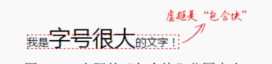

记住内联元素的“包含块”是由“生成的”前后内联盒子决定的，与里面的内联盒子细节没有任何关系。

内联元素作为包含块有兼容性问题

- 针对于单行的兼容性，当包含块是一个空的内联元素的时候

  ```html
  <style>
    p {
      text-align: right;
    }
    p > span {
      position: relative;
    }
    p > span > img {
      position: absolute;
      right: 0;
    }
  </style>
  <p>
    <span>
      
    </span>
  </p>
  ```

  按照我们的理解，上面的代码实现的效果应该是图片在容器的右上角对齐，但是 IE8 至 IE10 浏览器下，图片完全在`<p>`容器的左侧外部显示了,需要给空的`<span>`元素设置 border 或 padding 让“幽灵空白节点”显现或者直接插入字符才能表现一致。

- 跨行的兼容性问题在于规范对此行为并未定义，导致浏览器在实现上各有差异。

  主要差异在于，Firefox 浏览器的“包含块”仅覆盖第一行，而 IE 和 Chrome 浏览器“包含块”的表现完全符合定义，由第一行开头和最后一行结尾的内联盒子共同决定

  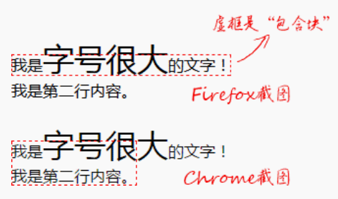

#### 2. “包含块”所在的元素不是父块级元素，而是最近的 position 不为 static 的祖先元素或根元素；

height:100%和 height:inherit 的区别？

对于普通元素，两者确实没什么区别，但是对于绝对定位元素就不一样了。height:100%是第一个具有定位属性值的祖先元素的高度，而 height:inherit 则是单纯的父元素的高度继承，在某些场景下非常好用。然后就是很多人并没有注意到的，也是本节的重点内容，那就是`绝对定位元素的“包裹性”中的“宽度自适应性”其实也是相对于“包含块”来计算的`

如果我们想要实现下面效果：

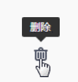

我们可以利用 `::before` 和 `::after` 伪元素实现我们想要的效果，一个实现三角，一个实现矩形区。为了不干扰布局，显然实现提示效果的两个伪元素会使用 absolute 绝对定位，为了定位准确，我们会给小图标元素设置 `position:relative`。此时问题来了：由于提示信息的内容有长有短，我们不可能给提示元素设置一个特定的宽度，于是宽度表现走“包裹性”，也就是最大宽度不超过“包含块”的宽度，但是恰好此时“包含块”就是我们的小图标元素，并且宽度往往都不超过 20 像素，也就是我们的提示信息只能够在 20 像素宽的区域内显示，这就导致了最终的文字内容“一柱擎天”，如下图所示。


要修复这一问题其实很简单，只要改变默认的宽度显示类型就可以，添加 `white-space: nowrap`，让宽度表现从“包裹性”变成“最大可用宽度”即可

#### 3. 边界是 padding box 而不是 content box。

这是由于使用场景决定的，举个例子，在移动端，为了实现良好的视觉感受，列表或者模块的信息内容主体距离窗体两侧都有一定的空白，这个空白一般都会使用 padding 撑开的，而不是 margin，原因在于这些列表是链接，外部一定会使用`<a>`元素，而为了准确反馈响应区域，`<a>`元素在 tap 的时候会由加深的背景块示意（参见微信列表 tap 时候的反馈），所以，如果左右的间距使用 margin 撑开，就会出现列表的点击反馈背景区域左右边距透明的问题，视觉效果和体验都是不好的，因为 margin box 永远是透明的。

现在来需求了：需要在列表或者模块的右上角显示一个明显的标签

```css
.list {
  padding: 1rem;
}
.tag {
  position: absolute;
  top: 0;
  right: 0;
}
```

但是，如果我们的定位是相对于 content box 计算的，

```css
.list {
  padding: 1rem;
}
.tag {
  position: absolute;
  top: -1rem;
  right: -1rem;
}
```

看上去好像没什么问题，但实际上增加了我们日后开发维护的成本，因为绝对定位元素的定位值和列表容器的 padding 值耦合在一起了

实际项目场景千变万化，有时候，我们需要的效果并不是定位在列表的边缘，而是定位在内容的边缘,这时候 padding 就要和 top,right 耦合在一起，有个解藕的小技巧，间距不是使用 padding 撑开，而是使用透明的 border 撑开。

```css
.list {
  border: 1rem solid transparent;
}
.tag {
  position: absolute;
  top: 0;
  right: 0;
}
```

## 无依赖 absolute 绝对定位

### “无依赖绝对定位”的基本概念

absolute 定位效果实现完全不需要父元素设置 position 为 relative 或其他什么属性就可以实现，我把这种没有设置 left/right 或 top/bottom 对立方位属性值的绝对定位称为“无依赖绝对定位”

> 只要有一个对立方位的属性值没设置，则这个方向就是“无依赖绝对定位”

“无依赖绝对定位”有两个特性，分别是`“相对定位特性”`和`“不占据空间”`

### “无依赖绝对定位”的常见应用

应用一：各类图标定位

实现在导航文字右上方的定位，直接对加图标这个元素进行样式设定就可以了，原来纯文字导航时的样式完全不需要有一丁点儿的修改。

```css
.icon-hot {
  position: absolute;
  margin: -6px 0 0 2px;
  width: 28px;
  height: 11px;
  background: url(hot.gif);
}
```

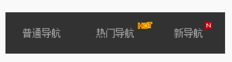

普通的水平对齐的图标也可以使用“无依赖绝对定位”实现

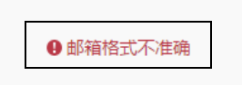

```html
<style>
  .icon-x {
    line-height: 20px;
    padding-left: 20px;
  }
  .icon-warn {
    position: absolute;
    margin-left: -20px;
    width: 20px;
    height: 20px;
    background: url(warn.png) no-repeat center;
  }
</style>
<span class="icon-x"> <i class="icon-warn"></i>邮箱格式不准确 </span>
```

同样是 position:absolute，然后简单的 margin 偏移实现。此方法兼容性很好，与 inline-block 对齐相比的好处在于，inline-block 对齐最终行框高度并不是 20px，因为中文下沉，图标居中，要想视觉上水平，图标 vertical-align 对齐要比实际低一点儿，这就会导致最终整个行框的高度不是预期的 20px，而是 21px 或者更大。但是，如果使用“无依赖绝对定位”实现，则完全不要担心这一问题，因为绝对定位元素不会改变正常流的尺寸空间，就算我们的图标有 30px 大小，行框高度依然是纯文本所在的 20px 高度。

应用二：下拉列表的定位

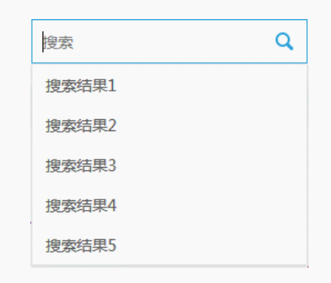

```html
<style>
  /* 下拉列表的无依赖绝对定位 */
  .datalist {
    position: absolute;
  }
  /* 列表的显隐控制 */
  .search-result {
    display: none;
  }
  input:focus ~ .search-result {
    display: block;
  }
</style>
<input />
<div class="result">
  <div class="datalist">
    <a href>搜索结果 1</a>
    ...
  </div>
</div>
```

---

虽然说元素 position:absolute 后的 display 计算值都是块状的，但是其定位的位置和没有设置 position:absolute 时候的位置相关

```html
<style>
  .follow {
    position: absolute;
  }
</style>
<h3>标题<span class="follow">span</span></h3>
<h3>
  标题
  <div class="follow">div</div>
</h3>
```

虽然此时.follow 无论是内联的`<span>`还是块状的`<div>`，计算值都是 block，但是它们的位置还和没有应用 position:absolute 的时候一样，一个在后面，一个在下面

### “无依赖绝对定位”的兼容性问题

1. IE7 浏览器下，块状的`<div>`“无依赖绝对定位”的定位表现如同内联的`<span>`，也就是无论是块级元素还是内联元素，“无依赖绝对定位”后都和内联元素一行显示。

2. 前文提到浮动和绝对定位是死对头，当“浮动”和“无依赖绝对定位”相遇的时候，就会发生一些不愉快的事情

```html
<style>
  .follow {
    position: absolute;
  }
  .nav {
    width: 100px;
    line-height: 40px;
    background-color: #333;
    color: #fff;
    text-align: center;
    float: left;
  }
</style>
<div class="nav">导航 1</div>

<div class="nav">导航 2</div>
```

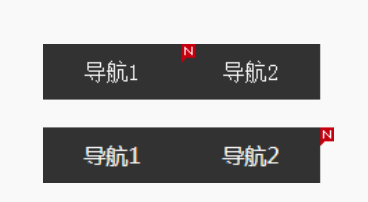

结果在 IE 和 Chrome 浏览器下，夹在中间的``在中间显示（见图上），但是 Firefox 浏览器却是在最后显示,此处的浏览器不一致的行为表现应该属于`“未定义行为”`

## absolute 与 text-align

按道理讲，absolute 和 float 一样，都可以让元素块状化，应该不会受控制内联元素对齐的 text-align 属性影响，但是最后的结果却出人意料，text-align 居然可以改变 absolute 元素的位置。

```html
<style>
  p {
    text-align: center;
  }
  img {
    position: absolute;
  }
</style>
<p></p>
```

在 Chrome 和 Firefox 浏览器下，图片在中间位置显示了，但是仅仅是在中间区域显示，并不是水平居中

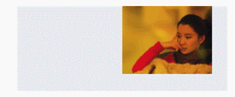

虽然本示例中图片位置确实受 text-align 属性影响，但是并不是 text-align 和 absolute 元素直接发生关系，absolute 元素的 display 计算值是块状的，text-align 是不会有作用的。这里之所以产生了位置变化，本质上是`“幽灵空白节点”`和`“无依赖绝对定位”`共同作用的结果。

然而，IE 浏览器的支持不一样导致此方法的场景实用性打了折扣。当然，有小技巧可以使所有浏览器都完美支持，如果只需要兼容 IE Edge（移动端开发时候），额外加下面这一段 CSS 语句就可以了：

```css
p:before {
  content: "\2002";
}
```

其中，`\2002` 表示某一种空格。通过插入显式的内联字符，而非借助飘渺的“幽灵空白节点”实现所有浏览器下的一致表现。

利用 text-align 控制 absolute 元素的定位最适合的使用场景就是主窗体右侧的“返回顶部”以及“反馈”等小布局的实现

```html
<style>
  .alignright {
    text-align: right;
    height: 0;
    overflow: hidden; /*设置height：0，overflow:hidden是为了解决空格占用高度的问题*/
  }
  .alignright:before {
    content: "\2002";
  }
  .follow {
    position: fixed;
    bottom: 100px;
    z-index: 1;
  }
</style>
<div class="alignright">
  <span class="follow"></span>
</div>
```

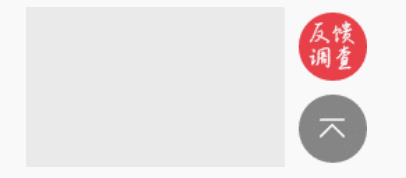

此时，有人可能会惊呼：什么？设置 height:0 同时 overflow:hidden？那岂不是里面所有元素都被剪裁看不见啦？

如果是普通元素确实会如此，但是对于 absolute 绝对定位以及 fixed 固定定位元素，规则要更复杂！

## absolute 与 overflow

overflow 对 absolute 元素的剪裁规则用一句话表述就是:绝对定位元素不总是被父级 overflow 属性剪裁，尤其当 overflow 在绝对定位元素及其包含块之间的时候。

exp1:

```html
<!--此图片不会被剪裁-->
<div style="position: relative;">
  <div style="overflow: hidden;">
    
  </div>
</div>
```

exp2:

```html
<!-- 下面图片会被剪裁 -->
<div style="position: relative;overflow: hidden;">
  
</div>
<!-- 下面图片会被剪裁 -->
<div style="overflow: hidden;">
  <div style="position: relative;">
    
  </div>
</div>
```

根据 exp1 代码，如果 overflow 的属性值不是 hidden 而是 auto 或者 scroll，即使绝对定位元素高宽比 overflow 元素高宽还要大，也都不会出现滚动条。

实际开发的时候，绝对定位元素和非绝对定位元素往往可能混杂在一起，虽然绝对定位元素不能让滚动条出现，但是非绝对定位元素可以，于是，就可能出现另外一种很有特色的现象，即当容器滚动的时候，绝对定位元素微丝不动，不跟着滚动，表现类似 fixed 固定定位。

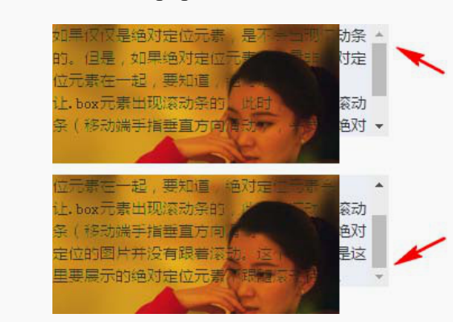

我们可以利用这一特性实现在局部滚动的容器中模拟近似 position:fixed 的效果，如如表头固定等。

针对于 `position:fixed`，由于 `position:fixed` 固定定位元素的包含块是根元素，因此，除非是窗体滚动，否则上面讨论的所有 overflow 剪裁规则对固定定位都不适用。


在 CSS 世界中，上面说的这些几乎都是完美无瑕的，但是，随着 CSS3 新世界到来的冲击，规则在不经意间发生了一些变化，其中最明显的就是 transform 属性对 overflow 剪裁规则的影响，
overflow 元素自身 transform 的时候，Chrome 和 Opera 浏览器下的 overflow 剪裁是无效的

## absolute 与 clip

> 语法：clip: rect(top right bottom left),只支持数值 

`clip: rect(30px 200px 200px 20px)`

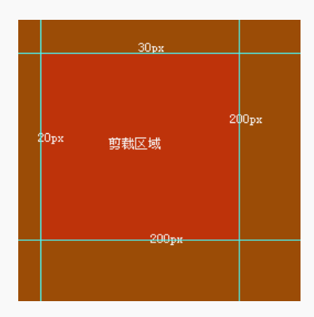

### 重新认识 clip

1. fixed 固定定位的剪裁

   对于普通元素或者绝对定位元素，想要对其进行剪裁，我们可以利用语义更明显的 overflow 属性，但是对于 position:fixed 元素，overflow 属性往往就力不能及了，因为 fixed 固定定位元素的包含块是根元素，除非是根元素滚动条

    ```css
    .fixed-clip {
      position: fixed;
      clip: rect(30px 200px 200px 20px);
    }
    ```

2. 最佳可访问性隐藏

    所谓“可访问性隐藏”，指的是虽然内容肉眼看不见，但是其他辅助设备却能够进行识别和访问的隐藏。

    假如我们要隐藏下面的 h1 标签，我们看下辅助设备的识别情况

    ```html
    <a href="/" class="logo">
      <h1>CSS 世界</h1>
    </a>
    ```

    - display:none 或 visibility:hidden:屏幕阅读设备会忽略
    - text-indent:文字锁进量大到屏幕之外，也会忽略
    - color:transparent:可以被读取，但是无法阻止文本被框选
    - clip:既能满足视觉上的隐藏，也可以被读取

    ```css
    .clip {
      position: absolute;
      clip: rect(0 0 0 0);
    }
    ```

众所周知，如果`<form>`表单元素里面有一个 `type:submit` 或者 image 类型的按钮，那么表单自动有回车提交行为，可以节约大量啰嗦的键盘相关的事件的代码。但是，submit 类型按钮在不同的浏览器下的样式兼容性有问题,所以我们使用下面语法

```html
<form>
  <input type="submit" id="someID" class="clip" />
  <label for="someID">提交</label>
</form>
```

### 深入认识 clip

我们先来看一段代码：

```css
.box {
  width: 300px;
  height: 100px;
  background-color: #f0f3f9;
  position: relative;
  overflow: auto;
}
.box > img {
  width: 256px;
  height: 192px;
  position: absolute;
  clip: rect(0 0 0 0);
}
```

上面代码在 IE 和 Firefox 浏览器下是没有滚动条的，只有光秃秃的一小撮背景色在那里，在 Chrome 浏览器下，clip 仅仅是决定了哪一部分是可见的，对于原来占据的空间并无影响。这又是`“未定义行为”`的表现。

最后总结一下：clip 隐藏仅仅是决定了哪部分是可见的，非可见部分无法响应点击事件等；然后，虽然视觉上隐藏，但是元素的尺寸（clientWidth 和 clientHeight 包括样式计算的宽高）依然是原本的尺寸，在 IE 浏览器和 Firefox 浏览器下抹掉了不可见区域尺寸对布局的影响，Chrome 浏览器却保留了。

## absolute 的流体特性

### absolute 与 left/top/right/bottom

当 absolute 遇到 left/top/right/bottom 属性的时候，absolute 元素才真正变成绝对定位元素。

```css
.box {
  position: absolute;
  left: 0;
  top: 0;
}
```

表示相对于绝对定位元素包含块的左上角对齐，此时原本的相对特性丢失，但是，如果我们仅设置了一个方向的绝对定位，则另一个方向依然保持`相对特性`

### absolute 与流体特性

当 absolute 对立方向同时发生定位的时候，该元素在这个方向就具有了流体特性

```html
<style>
  .box {
    position: absolute;
    left: 0;
    right: 0;
  }
</style>
<div class="box"></div>
```

因为 left 和 right 同时存在，所以宽度就不是 0，而是表现为`“格式化宽度”`，宽度大小自适应于`.box` 包含块的 `padding box`

因此，假设 `.box` 元素的包含块是根元素，则下面的代码可以让.box 元素正好完全覆盖浏览器的可视窗口，并且如果改变浏览器窗口大小，`.box` 会自动跟着一起变化

```css
.box {
  position: absolute;
  left: 0;
  right: 0;
  top: 0;
  bottom: 0;
}
```

### absolute 与 margin:auto 居中

当绝对定位元素处于流体状态的时候，各个盒模型相关属性的解析和普通流体元素都是一模一样的，margin 负值可以让元素的尺寸更大，并且可以使用 margin:auto 让绝对定位元素保持居中

绝对定位元素的 margin:auto 的填充规则和普通流体元素的一模一样：

- 如果一侧定值，一侧 auto，auto 为剩余空间大小；
- 如果两侧均是 auto，则平分剩余空间。

```css
.element {
  width: 300px;
  height: 200px;
  position: absolute;
  left: 0;
  right: 0;
  top: 0;
  bottom: 0;
  margin: auto;
}
```
