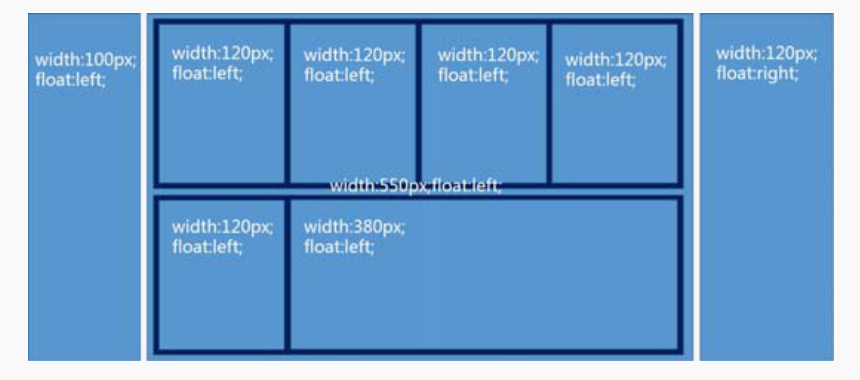
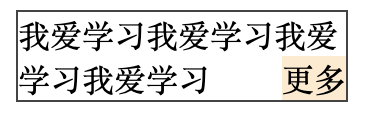
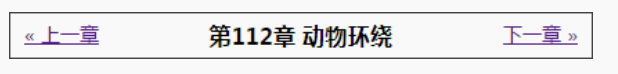

# 魔鬼属性 float

## float 的本质

CSS2 属性的设计都是为图文展示服务的，float 的本质也是这样，float 就是为了`实现文字环绕效果`而出现的。

现在很多人滥用 float 属性，违背了 float 的本质，本来是让文字围绕图片环绕，偏要实现各种布局，结果在老版本的 IE 浏览器下浮动的 bug 一火车

理论上可以通过一个 `float：left` 声明可以把整个页面结构弄出来，如下图，而且没有 margin 合并问题，没有内联元素的间隙问题，但是这种布局是不具有流动性，不稳固的，比如容器的宽度一改变，整个样式就会错乱


所以浮动是魔鬼，少浮动，要更多的挖掘 css 世界本身的流动性和自适应性，以构建能否适用于各种环境的高质量的网页布局

## float 的特性

- 包裹性

  包裹性由`包裹`和`自适应性`两部分组成，当然想要最大宽度自适应父级元素宽度，一定是浮动元素的首选最小宽度比父元素的宽度要小的情况下

- 块状化并格式化上下文

  元素一旦 float 的属性值不为 none，则其 display 计算值就是 block 或者 table。具体的 float 属性与 display 属性的转换关系如下表

  <table>
      <tr><td>设定值</td><td>计算值</td></tr>
      <tr><td>inline</td><td>block</td></tr>
      <tr><td>inline-block</td><td>block</td></tr>
      <tr><td>inline-table</td><td>table</td></tr>
      <tr><td>table-row</td><td>block</td></tr>
      <tr><td>table-row-group</td><td>block</td></tr>
      <tr><td>table-column</td><td>block</td></tr>
      <tr><td>table-column-group</td><td>block</td></tr>
      <tr><td>table-cell</td><td>block</td></tr>
      <tr><td>table-caption</td><td>block</td></tr>
      <tr><td>table-header-group</td><td>block</td></tr>
      <tr><td>table-footer-group</td><td>block</td></tr>
  </table>

  格式化上下文，没有任何 margin 合并

- 破坏文档流

  破坏正常的文档流，最著名的表现就是使父元素的高度坍塌

## float 的作用机制

上文说到，float 有个破坏文档流的特性，会让父元素的高度坍塌，这是 css 的标准，并不是 bug，因为坍塌的原因是为了实现文字环绕效果

float 实现文字环绕的两个必要条件：

1.  高度坍塌

    让跟随内容可以和浮动元素在一个水平线上
2.  行框盒子和浮动元素的不可重叠性

    行框盒子（每行内联元素所在的那个盒子)如果和浮动元素的垂直高度有重叠，则行框盒子在正常定位状态下只会跟随浮动元素，而不会发生重叠,这种“限制”是根深蒂固的，也就是“行框盒子”的区域永远就这么大，只要不改变当前布局方式，我们是无法通过其他 CSS 属性改变这个区域大小的。

    ```html
    <style>
    .container {
        width: 200px;
        border: 1px solid;
        margin: auto;
    }
    img {
        float: left;
        width: 120px;
    }
    p {
        margin-left: -100px
    }
    p:first-line {
        background: red;
        color: white;
    }
    </style>
    <div class="container">
        
        <p>学习网站学习网站学习网站学习网站学习网站学习网站学习网站学习网站学习网站</p>
    </div>
    ```

    

设置高度可以避免高度坍塌问题吗？

```html
<style>
  .father {
    height: 64px;
    width: 200px;
    border: 1px solid #444;
  }

  .float {
    float: left;
  }

  .float img {
    width: 60px;
    height: 64px;
  }
</style>
<div class="father">
  <div class="float">
    
  </div>
  学习网站学习网站学习网站学习网站学习网站
</div>
<div>我爱学习我爱学习我爱学习我爱学习我爱学习</div>
```


答案是并不能，大家都知道，内联状态下图片底部是有间隙的，`.float` 的元素实际高度要比 64px 大几像素，带来的问题就是浮动元素的高度超出 `.father` 几像素。因为“文字环绕效果”是由两个特性（即“父级高度塌陷”和“行框盒子区域限制”）共同作用的结果，定高只能解决“父级高度塌陷”带来的影响，但是对“行框盒子区域限制”却没有任何效果，结果导致的问题是浮动元素垂直区域一旦超出高度范围，或者下面元素 margin-top 负值上偏移，就很容易使后面的元素发生“环绕效果”

## float 的更深作用机制

我们看一个例子：
```html
<style>
  .father {
    width: 164px;
    border: 1px solid #444;
  }
  .float {
    float: right;
    background: blanchedalmond;
  }
</style>
<div class="father">我爱学习<span class="float">更多</span></div>
```

当`我爱学习`只有一行的时候大家都可以知道更多在第一行的右侧展示，那如果多几个`我爱学习`呢，占多行的时候，那`更多`的位置应该何去何从呢？真正效果如下图



想要知道原因，我们需要了解两个和 float 相关的术语，一是“浮动锚点”（float anchor），二是“浮动参考”（float reference）。

- 浮动锚点

  浮动锚点是 float 元素所在的“流”中的一个点，这个点本身并不浮动，就表现而言更像一个没有 margin、border 和 padding 的空的内联元素。（有内联元素就会产生行框盒子）
- 浮动参考

  浮动参考指的是浮动元素对齐参考的实体，也就是 float 元素在当前行框盒子中的定位


如果`我爱学习`正好占用两行，则`更多`的显示效果如下图所示


## float 与流体布局

float 通过破坏正常 CSS 流实现 CSS 环绕，带来了烦人的“高度塌陷”的问题，然而，凡事都具有两面性，只要了解透彻，说不定就可以变废为宝、化腐朽为神奇。

应用一：实现成一侧定宽的两栏自适应布局

```html
<style>
  .father {
    overflow: hidden;
  }
  .father > img {
    width: 60px;
    height: 64px;
    float: left;
  }
  .animal {
    margin-left: 70px;
  }
</style>
<div class="father">
  
  <p class="animal">小猫 1，小猫 2，...</p>
</div>
```

和文字环绕效果相比，区别就在于.animal 多了一个 margin-left:70px，也就是所有小动物都要跟男主保持至少 70px 的距离，由于图片宽度就 60px，因此不会发生环绕，自适应效果达成

多栏自适应布局也可以

```html
<style>
  .prev {
    float: left;
  }
  .next {
    float: right;
  }
  .title {
    margin: 0 70px;
    text-align: center;
  }
</style>
<div class="box">
  <a href class="prev">&laquo; 上一章</a>
  <a href class="next">下一章 &raquo;</a>
  <h3 class="title">第 112 章 动物环绕</h3>
</div>
```


