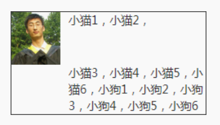

# 魔鬼属性 float 的克星 clear

## 什么是 clear

`clear` 专门用来处理 float 带来的高度坍塌的问题，官方对 `clear` 属性的解释是：元素盒子的边不能和`前面`的浮动元素相邻。

> clear 属性只有块级元素才有效的,而且 clear 并不是清除浮动，因为浮动一直都在

clear 属性值：

- none：默认值，左右浮动来就来。
- left：左侧抗浮动。
- right：右侧抗浮动。
- both：两侧抗浮动。

示例 1:左侧抗浮动

```html
<style>
  .clear-box {
    padding: 5px;
    margin: 8px auto;
    background-color: #eee;
  }
  .left {
    float: left;
  }
  .clear-left {
    clear: left;
  }
</style>
<div class="clear-box">
  
  <div class="clear-left">我不喜欢你，我不要和你在一起~</div>
</div>
```


示例 2:右侧抗浮动

```html
<style>
  .clear-box {
    padding: 5px;
    margin: 8px auto;
    background-color: #eee;
  }
  .right {
    float: right;
  }
  .clear-right {
    clear: right;
  }
</style>
<div class="clear-box">
  
  <div class="clear-right">我不喜欢你，我不要和你在一起~</div>
</div>
```


而针对于 `float: right` 和 `float: left` 都可以用 `clear:both` 进行替换,所以基本上 right 和 left 两个属性是没有作用的

## 成事不足败事有余的 clear

clear 属性只有块级元素才有效的，而::after 等伪元素默认都是内联水平，这就是借助伪元素清除浮动影响时需要设置 display 属性值的原因。

```css
.clear:after {
  content: "";
  display: table; /** 也可以是'block'，或者'list-item'*/
  clear: both;
}
```

然而，利用伪元素或者直接使用下面 HTML，有时候也会产生一些意想不到的问题：

```html
<div style="clear:both;"></div>
```

```html
<style>
  .father {
    overflow: hidden;
  }
  .father > img {
    width: 60px;
    height: 64px;
    float: left;
  }
  .animal {
    margin-left: 70px;
  }
</style>
<div class="father">
  
  <div class="animal">
    小猫 1，小猫 2，
    <div class="clear"></div>
    小猫 3，小猫 4，...
  </div>
</div>
```



由于 clear:both 的作用本质是让自己不和 float 元素在一行显示，并不是真正意义上的清除浮动，因此 float 元素一些不好的特性依然存在，主要有以下两点：

1. 如果 clear:both 元素前面的元素就是 float 元素，则 margin-top 负值即使设成-9999px，也不见任何效果。
2. clear:both 后面的元素依旧可能会发生文字环绕的现象。举个例子，如下 HTML
   和 CSS：

```html
<style>
  .father:after {
    content: "";
    display: table;
    clear: both;
  }
  .father img {
    float: left;
    width: 60px;
    height: 64px;
  }
  .father + div {
    margin-top: -2px;
  }
</style>
<div class="father">
  
  我是帅哥，好巧啊，我也是帅哥，原来看这本书的人都是帅哥~
</div>
<div>虽然你很帅，但是我对你不感兴趣。</div>
```


由此可见，clear:both 只能在一定程度上消除浮动的影响，要想完美地去除浮动元素的影响，还需要使用其他 CSS 声明。
