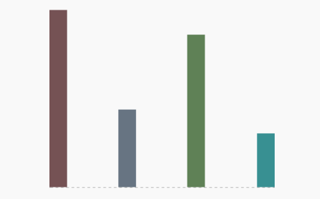
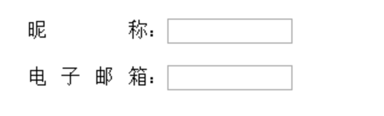
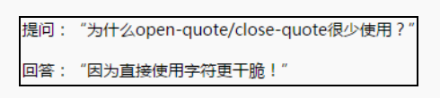
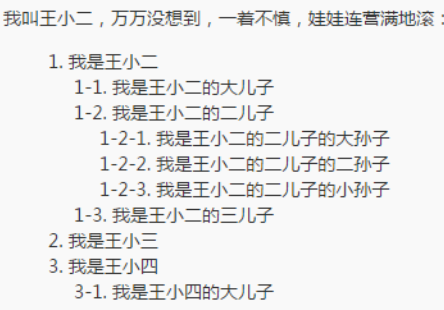

# Content

## content 与替换元素

### 什么是替换元素

替换元素，顾名思义，内容可以被替换，比如说``如果我们把上面的 1.jpg 换成 2.jpg，是不是图片就会替换了?这种通过修改某个属性值呈现的内容就可以被替换的元素就称为“替换元素”

常见的替换元素以及在各浏览器下的 display 属性值：

<table role="table">
    <tbody>
        <tr>   
            <th>元素</th><th>Chrome</th><th>Firefox</th><th>IE</th>
        </tr>
        <tr>
            <td>img</td><td>inline</td><td>inline</td><td>inline</td>
        </tr>
        <tr>
           <td>iframe</td><td>inline</td><td>inline</td><td>inline</td>
        </tr>
        <tr>
           <td>video</td><td>inline</td><td>inline</td><td>inline</td>
        </tr>
        <tr>
          <td>select</td><td>inline-block</td><td>inline-block</td><td>inline-block</td>
        </tr>
        <tr>
           <td>input</td><td>inline-block</td><td>inline</td><td>inline-block</td>
        </tr>
        <tr>
           <td>input(range|file)</td><td>inline-block</td><td> inline-block</td><td>inline-block</td>
        </tr>
        <tr>
           <td>input(hidden)</td><td>none</td><td>none</td><td>none</td>
        </tr>
        <tr>
           <td>button</td><td>inline-block</td><td>inline-block</td><td>inline-block</td>
        </tr>
        <tr>
           <td>textarea</td><td>inline-block</td><td>inline</td><td>inline-block</td>
        </tr>
    </tbody>
</table>

### 替换元素特征

- 内容可根据属性进行替换
- 内容的外观不受页面上的 CSS 的影响

  简单来说，它们的内容不受当前文档的样式的影响。CSS 可以影响可替换元素的位置，但不会影响到可替换元素自身的内容。有些可替换元素浏览器自身会暴露一些样式接口进行修改

- 有自己的尺寸

  在 Web 中，很多替换元素在没有明确尺寸设定的情况下，其默认的尺寸（不包括边框）是 300 像素 ×150 像素，如`<video>`、`<iframe>`或者`<canvas>`等

- 在很多 CSS 属性上有自己的一套表现规则

  对于非替换元素来说，vertical-align 默认值是 baseline,也就是字符 x 的下边缘，但是替换元素不会有字符 x，则定义为元素的下边缘

- 宽高计算方式和非替换元素不同

### 替换元素的尺寸计算规则

虽然替换元素在不同的浏览器下对应的 display 值不同，但是我们没有必要深究为什么一个是 `inline` 一个是 `inline-block`，因为对于替换元素而言，这是没有意义的。替换元素有很多表现规则和非替换元素不一样，其中之一是宽度和高度的尺寸计算规则，不管 display 为何值，尺寸的计算规则都是相同的

exp:

```html
img { display: block; }

//虽然图片此时变成了块级,但是尺寸规则还是和内联状态下一致，因此，图片呈现的,宽高还是
256 像素×192 像素
```

替换元素的尺寸从内而外分为 3 类：

- 固有尺寸

  替换内容原本的尺寸，比如`图片`作为一个独立文件查看文件属性上的尺寸值，又或是 `input` 不加任何修饰时的尺寸

- HTML 原生属性尺寸

  只能通过改变 HTML 原生属性而改变的尺寸，比如 `img` 标签上的 `width` , `height` 属性， `input` 上的 `size` 属性， `textarea` 的 `clos` 和 `rows` 属性

- CSS 尺寸

  利用 css 修改的作用在 content box 上的尺寸

尺寸计算规则

1. 如果没有 `CSS 尺寸`和 `HTML 尺寸`，则使用固有尺寸作为最终的宽高。
2. 如果没有 `CSS 尺寸`，则使用 `HTML尺寸`作为最终的宽高。
3. 如果有 `CSS 尺寸`，则最终尺寸由 `CSS 属性`决定。
4. 如果“固有尺寸”含有固有的宽高比例，同时仅设置了宽度或仅设置了高度，则元素依然按照固有的宽高比例显示。
5. 如果上面的条件都不符合，则最终宽度表现为 300 像素，高度为 150 像素，宽高比 2:1。
6. 内联替换元素和块级替换元素使用上面同一套尺寸计算规则

`请记住`我们是无法改变替换元素内容的固有尺寸的，之所以设定替换元素的尺寸会影响宽高，是因为替换元素的 content 替换内容的适配方式默认时填充`（fill）`，在 css3 中可以通过修改`object-fit`属性进行修改

### 特立独行的替换元素 img

当设置一个没有替换内容也没有尺寸设定的裸露``元素时，按照替换元素的尺寸计算规则，元素应该是 300\*150，但是实际尺寸表现却如下表

<table role="table">
    <tbody>
        <tr>   
            <th>元素</th><th>Chrome</th><th>Firefox</th><th>IE</th>
        </tr>
        <tr>
            <td>裸露的img</td><td>0*0</td><td>0*0</td><td>28*30</td>
        </tr>
    </tbody>
</table>

针对于老版本 Firefox(新版本的已经和 Chrome 一样)，img 在缺省 src 属性的时候会认为是一个普通内联元素，针对于 chrome 在缺省 src 但是 alt 有值时，也会认为是一个普通内联元素

懒加载时图片占位技巧：

```css
img {
  visibility: hidden;
  display: inline-block; //解决宽高无效问题
  width: 100px;
  height: 100px;
}
img[src] {
  visibility: visible;
}
```

### 替换元素和非替换元素的距离

图片可以说是最典型最常用的替换元素了，我们以图片为代表来深入替换元素和非替换元素的距离

#### 观点 1：替换元素和非替换元素之间只隔了一个 src 属性！

```html
img { display: block; outline: 1px solid; } 
```

当图片没有 src 时，上面代码中 img 的宽度时多少？根据上面我们说的，在老版本的火狐中宽度时 100%流满父级容器，在 Chrome 中也会有此表现，只是需要特定的触发条件，需要不为空的 alt 属性值,这两种表现都为非替换元素

```html

```

基于伪元素的图片内容生成技术[示例](https://demo.cssworld.cn/4/1-2.php)
我们可以对 img 元素设置::before 和::after 伪元素进行内容生成以及样式构建，但是这种做法在 IE 时不兼容的，想让 Chrome 和 Firefox 生效，还需要以下几个条件：
不能有 src 属性（证明观点关键）
不能使用 content 属性生成图片（针对 Chrome）
需要有 alt 属性必须有值（针对 Chrome）
Firefox 要使用::after（::before 伪元素的 content 会被无视）

核心代码

```css
img::after {
  /* 生成 alt 信息 */
  content: attr(alt);
  /* 尺寸和定位 */
  position: absolute;
  bottom: 0;
  width: 100%;
  background-color: rgba(0, 0, 0, 0.5);
  transform: translateY(100%);
  /* 来点过渡动画效果 */
  transition: transform 0.2s;
}
img:hover::after {
  /* alt 信息显示 */
  transform: translateY(0);
}
```

当图片的 src 属性有的时候，会让普通元素变成替换元素，这时伪元素的内容就会失效，达到我们想要的效果

#### 观点 2：替换元素和非替换元素之间只隔了一个 CSS content 属性！

替换元素之所以为替换元素，就是因为其内容可替换，而这个内容就是 content box，所以，从理论层面讲，content 属性决定了是替换元素还是非替换元素。

在 Chrome 浏览器下，所有的元素都支持 content 属性，而其他浏览器仅在::before/::after 伪元素中才有支持。

前面已经证明了，没有 src 属性的是非替换元素，但是，如果我们此时使用 content 属性给它生成一张图片呢？

```html
img { content: url(1.jpg); } 
```

结果和下面 HTML 视觉效果相同

```html

```

且各种表现都符合替换元素，如尺寸规则，或者不支持::before/::after 伪元素等

不仅如此，使用 content 属性可以让我们把普通标签元素变成替换元素

```html
<!--替换h1文本内容为图片-->
<style>
  /* 普通写法 */
  h1 {
    width: 180px;
    height: 36px;
    background: url(logo.png);
    /* 隐藏文字 */
    text-indent: -999px;
  }
  /* 变为替换元素，替换h1的内容 */
  h1 {
    content: url(logo.png);
  }
</style>
<h1>《CSS 世界》</h1>
```

> 说明：content 属性改变的仅仅是视觉呈现，搜索引擎 SEO 抓取的还是原始的文本信息

### content 与替换元素关系剖析

由 `content` 属性生成的对象称之为`匿名替换元素`,也是替换元素
匿名替换元素和普通元素的不同：

1. 我们使用 content 生成的文本是无法选中、无法复制的，好像设置了 userselect:none 声明一般，无法被 SEO 抓取到，替换的仅仅是视觉层，所以我们常常用来生成一些无关紧要的东西
2. 不能左右:empty 伪类，尽管空的元素里设置了 content 属性。
3. content 动态生成的值无法获取。比如我们接下来要讲的 counter 统计数量，根据 getComputedStyle 方法获取伪元素的计算样式，只能获取到存粹的字符串,`counter(icecream)`，而不是计算过的值

```css
.total::after {
  content: counter(icecream);
}
```

## content 内容生成技术

### content 辅助元素生成

生成辅助元素的核心点在伪元素，通常我们会设置 content 属性值是空字符串

```css
.element:before {
  content: "";
}
```

应用 1：清除浮动带来的影响

```css
.clear:after {
  content: "";
  display: table; /* 也可以是'block' */
  clear: both;
}
```

应用 2:辅助实现两端对齐（text-align:justify）


```html
<style>
  .box {
    width: 256px;
    height: 256px;
    /* 两端对齐关键 */
    text-align: justify;
  }
  .box:before {
    content: "";
    display: inline-block;
    height: 100%;
  }
  .box:after {
    content: "";
    display: inline-block;
    width: 100%;
  }
  .bar {
    display: inline-block;
    width: 20px;
  }
</style>
<div class="box">
  <i class="bar"></i>
  <i class="bar"></i>
  <i class="bar"></i>
  <i class="bar"></i>
</div>
```



```html
<style>
  span {
    width: 100px;
    text-align: justify;
    float: left;
  }
  span:after {
    content: ".";
    width: 100%;
    display: inline-block;
    overflow: hidden;
    height: 0;
  }
  input {
    width: 100px;
  }
</style>
<div class="demo">
  <span>昵称：</span><input type="text" style="width: 100px" /><br /><br />
  <span>电子邮箱：</span><input type="email" style="width: 100px;" />
</div>
```

### content 字符内容生成

content 字符内容生成就是直接写入字符内容，中英文都可以，比较常见的应用就是配合@font-face 规则实现图标字体效果。例如，下面这个例子：

```html
<style>
  @font-face {
    font-family: "myico";
    src: url("/fonts/4/myico.eot");
    src: url("/fonts/4/myico.eot#iefix") format("embedded-opentype"), url("/fonts/4/myico.ttf")
        format("truetype"), url("/fonts/4/myico.woff") format("woff");
  }
  .icon-home:before {
    font-size: 64px;
    font-family: myico;
    content: "家";
  }
</style>
<span class="icon-home"></span>
```

出了常规字符外，我们还可以插入 Unicode 字符，`content:'\A'`. `\A` 指的是换行符中的 LF 字符

应用

```html
<!--loading后dot的动态效果-->
<style>
  dot {
    display: inline-block;
    height: 1em;
    line-height: 1;
    text-align: left;
    vertical-align: -0.25em;
    overflow: hidden;
  }
  dot::before {
    display: block;
    content: "...\A..\A.";
    white-space: pre-wrap;
    animation: dot 3s infinite step-start both;
  }
  @keyframes dot {
    33% {
      transform: translateY(-2em);
    }
    66% {
      transform: translateY(-1em);
    }
  }
</style>
正在加载中<dot>...</dot>
```

### content 图片生成

content 图片生成指的是直接用 url 功能符显示图片

```css
div:before {
  content: url(1.jpg);
}
```

虽然支持的图片格式多种多样，但是实际项目中，content 图片生成用得并不多，主要原因在于图片的尺寸不好控制，我们设置宽高无法改变图片的固有尺寸。除非这个生成的图片是 base64URL 地址。base64 图片由于内联在 CSS 文件中，而且会直接出现，不会像 0\*0 变成图片真实尺寸那样影响体验

```css
a[target="_blank"]:after {
  content: url(data:image/gif;base64...);
}
a[target="_blank"]:after {
  content: "";
  display: inline-block;
  width: 6px;
  height: 6px;
  background: url("blank.gif");
}
/* 相同的实现可以看到明显前者使用的 CSS 声明数量少很多。*/
```

### content 开启闭合符号生成

css 不常用的两个属性 `open-quote(开启的符号)` 和 `close-quote(关闭的符号)`

```html
<!--loading后dot的动态效果-->
<style>
  .ask {
    quotes: "提问：“" "”";
  }
  .answer {
    quotes: "回答：“" "”";
  }
  .ask:before,
  .answer:before {
    content: open-quote;
  }
  .ask:after,
  .answer:after {
    content: close-quote;
  }
</style>
<p class="ask">为什么 open-quote/close-quote 很少使用？</p>
<p class="answer">因为直接使用字符更干脆！</p>
```



### content attr 属性值内容生成

```css
img::after {
  /* 生成 alt 信息 */
  content: attr(alt);
}
/*除了原生的 HTML 属性，自定义的 HTML 属性也是可以生产的*/
.icon:before {
  content: attr(data-title);
}
```

### content 计数器

所谓 CSS 计数器效果，指的是使用 CSS 代码实现随着元素数目增多，数值也跟着变
大的效果。主要有以下四个属性：

- counter-reset 属性

重置计数器，主要作用是给技术器起名字，同时赋予默认值（默认是 0）,也可以同时设置多个计数器

> 语法：counter-reset:name [defaultValue] [name defaultValue;...]

> 示例：counter-reset:num1 1 num2 2;(设置两个技术器，默认值分别是 1，2)

- counter-increment 属性

使技术器递增(或递减)，可以同时设置多个技术器递增，默认递增数量为 1,无论 counter-increment 在哪里，只要出现，则对应的计数器的值就会递增（递减）

> 语法: counter-increment:name [num] [name num];

> 示例：counter-increment:num1 -1 num2;(使 num1 技术器每次递减 1，num2 技术器每次递增 1)

```css
.counter {
  counter-reset: num1 2 num2 3;
  counter-increment: num1 num2;
}
.counter:before {
  content: counter(num1);
}
.counter:after {
  content: counter(num2);
}
/*页面上会出现3 4*/
```

- counter 方法

> 语法：counter(name,style) name 为计数器名，style 为 list-style-type 支持的关键字

- counters 方法

counters()是一个嵌套计数器，返回表示指定计数器当前值的连接字符串，例如可以下图目录效果


> 语法：counter(name,string) name 为计数器名，string 为子序列号连接字符串

counters 可以实现计数嵌套效果，但是一定要让保证每个子容器内只能拥有一个 counter-reset，通过子辈对父辈的 counter-reset 重置，配合 counters()方法才能实现
[正确示例](https://demo.cssworld.cn/4/1-18.php)
[错误示例](https://demo.cssworld.cn/4/1-19.php)

### content 内容生成的混合特性

所谓“content 内容生成的混合特性”指的是各种 content 内容生成语法是可以混合在一起使用的

```css
a:after {
  content: "(" attr(href) ")";
}
q:before {
  content: open-quote url(1.jpg);
}
.counter:before {
  content: counters(wangxiaoer, "-") ". " counters(name1, "-");
}
```
