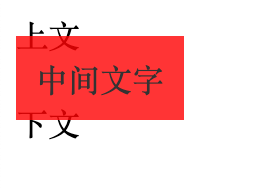
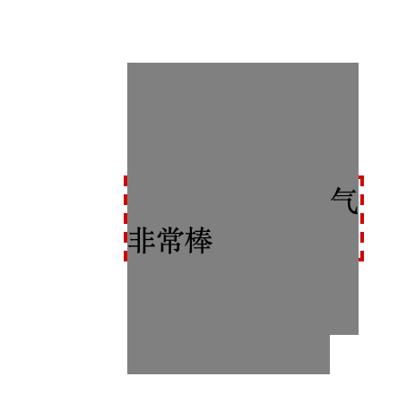
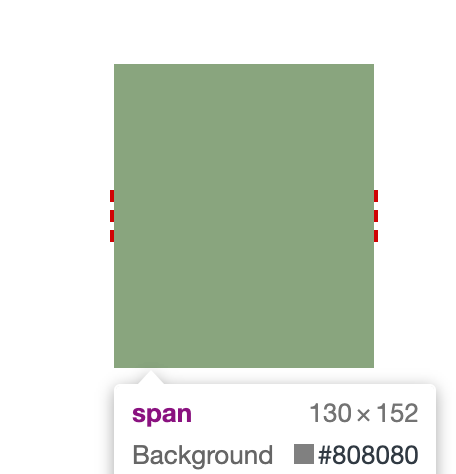
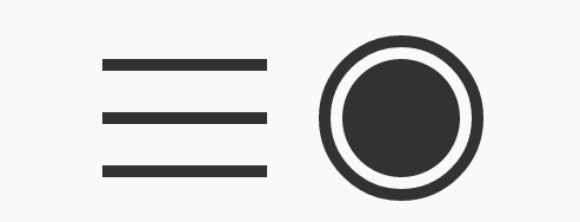

# Padding

## Padding 与块级元素

总所周知，box-sizing 默认的盒子是 content，所以当添加 padding 的时候会自动的增加元素的尺寸

```css
.box {
  width: 80px;
  padding: 20px;
}
/* box最终宽度为80+20*2=120px */
```

我们可以设置 box-sizing 为 border-box,形成局部的流动性，则元素的尺寸就不会变化，但是当 padding 足够大时，就会产生意想不到的现象

```css
.box {
  width: 80px;
  padding: 20px 60px;
  box-sizing: border-box;
}
/* box最终宽度为60*2=120px，里面的内容表现为首选最小宽度 */
```

## Padding 与内联元素

在讲解 padding 与内联元素之前，我们看一个问题：内联元素
的 padding 只会影响水平方向，不会影响垂直方向。这句话时对的吗？
显然这是一个错误的认知，内联元素的 padding 在垂直方向同样会影响布局，只是视觉表现上没有改变上一行，下一行的内容

> 内联元素没有可视宽度和可视高度的说法（clientHeight,clientWidth 为 0）,垂直方向行为完全受 line-height 和 vertical-align 的影响（下节会写）

```html
<style>
  span {
    padding: 10px;
    background: red;
    opacity: 0.8;
  }
</style>
<div>上文</div>
<span>中间文字</span>
<div>下文</div>
```



代码运行后上图可以看到，尺寸虽有效，但是对上下元素的原本布局却没有任何影响，仅仅是垂直方向发生了层叠

> css 中还有很多场景会出现这种不影响其他元素布局而是出现层叠效果的现象，比如 relative，box-shadow,outline 等，这种是存视觉层的，不会影响外部尺寸。而 padding 会影响外部尺寸，当不元素 overflow：auto,层叠区域超出父级容器的时候会出现滚动条

常见应用：

应用 1:

在不影响当前布局的情况下，优雅地增加链接或按钮的点击区域大小

```css
a {
  padding: 0.25em 0;
}
```

应用 2:

实现管道符效果`登录｜注册`

```html
<style>
  a + a:before {
    content: "";
    font-size: 0;
    padding: 10px 3px 1px;
    margin-left: 6px;
    border-left: 1px solid gray;
  }
</style>
<a href="">登录</a><a href="">注册</a>
```

应用 3:

内联元素设置 padding 针对传统的浏览器锚点定位，会相对于浏览器顶部有响应的 padding-top 距离，又不回影响原本布局，达到意想不到的好处

> 不仅 padding 不会加入行盒高度的计算，margin 和 border 也都是如此，都是不计算高度，但实际上在内联盒周围发生了渲染。

## Padding 的百分比值与块状盒子

padding 不支持负数，同时该属性的百分比不管是水平方向还是垂直方向都是基于包含块盒子的宽度计算的

```css
/* 利用padding百分比实现一个宽高5:1的固定轮播图片效果*/
.box {
  padding: 10% 50%;
  position: relative;
}
.box > img {
  position: absolute; //absolute的参考边界是父级的padding-box
  width: 100%;
  height: 100%;
  left: 0;
  top: 0;
}
```

## Padding 的百分比值与内联盒子

内联盒子的 padding 百分比有如下几个特性

- 和块级盒子相同的计算规则
- 默认的高度和宽度细节有差异
- padding 会出现断行

首先看下断行

```html
<style>
  .box {
    width: 130px;
    border: 2px dashed #cd0000;
    margin: 100px;
  }
  span {
    padding: 50%;
    background-color: gray;
  }
</style>
<div class="box">
  <span>今天天气非常棒</span>
</div>
```



对于内联元素，其 padding 是会断行的，也就是 padding 区域是跟着内联盒模型中的行框盒子走的，上面的例子由于文字比较多，一行显示不了，于是“非常棒”三个字换到了下一行，于是，原本的 padding 区域也跟着一起掉下来了，根据后来居上的层叠规则，“今天天”三个字自然就正好被覆盖，于是看不见了；同时，规则的矩形区域因为换行，也变成了五条边；至于宽度和外部容器盒子不一样宽，那是自然的，如果没有任何文字内容，那自然宽度正好和容器一致；现在有“内有文字若干”这 6 个字，实际宽度是容器宽度和这 6 个字宽度的总和，换行后的宽度要想和容器宽度一样，那可真要靠极好的人品了。

当我们去掉`今天天气非常棒`的文字后,如下图，按理说 padding 为 50%，应该是一个正方形，但是图片明显不是，这是因为内联盒子的垂直 padding 会让`幽灵空白节点`呈现，我们只要设置 font-size:0,便会变成一个正方形



## 标签元素内置的 Padding

(1) `ol/ul` 列表内置 padding-left,但是单位是 px,而不是 `em`，默认应该是 40px,这就会导致 font-size 很大时前面的`符号盒子`会跑到 ul 外面，很小时离边界很远

(2) 很多表单元素都有内置的 padding

- 所有浏览器`<input>/<textarea>`输入框内置 padding；
- 所-有浏览器`<button>`按钮内置 padding；
- 部分浏览器`<select>`下拉内置 padding，如 Firefox、IE8 及以上版本浏览器可以设置 padding；
- 所有浏览器`<radio>/<checkbox>`单复选框无内置 padding；
- `<button>`按钮元素的 padding 最难控制！

为什么`<button>`按钮元素最难控制呢？

`button { padding: 0; }`这么设置后在 Firefox 下是不起作用的,需要`button::-moz-focus-inner { padding: 0; }`，但是在 IE7 浏览器下，文字变多，左右的 padding 还会逐渐变大，需要设置`button { overflow: visible; }`, 而且`<button>`按钮 padding 与高度计算不同浏览器下也是千差万别

所以实现样式稳定，且保留`<button>`按钮行为的解决办法：

```html
<style>
  button {
    position: absolute;
    clip: rect(0 0 0 0);
  }
  label {
    display: inline-block;
    line-height: 20px;
    padding: 10px;
  }
</style>
<button id="btn"></button>
<label for="btn">按钮</label>
```


## padding与图形绘制

padding 属性和 background-clip 属性配合，可以在有限的标签下实现一些 CSS 图形绘制效果

实例1:不使用伪元素，仅一层标签实现大队长的“三道杠”分类图标效果。

```css
.icon-menu { 
 display: inline-block; 
 width: 140px; height: 10px; 
 padding: 35px 0; 
 border-top: 10px solid; /*border-color 属性的默认值是 color 属性的值*/ 
 border-bottom: 10px solid; 
 background-color: currentColor; /*color的属性值 */
 background-clip: content-box; 
}
```

实例2:不使用伪元素，仅一层标签实现双层圆点效果
```css
.icon-dot { 
 display: inline-block; 
 width: 100px; height: 100px; 
 padding: 10px; 
 border: 10px solid; 
 border-radius: 50%; 
 background-color: currentColor; 
 background-clip: content-box; 
}
```

两种实现效果图

