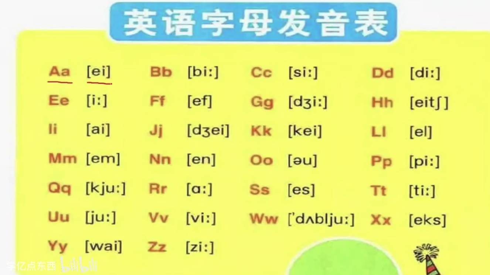
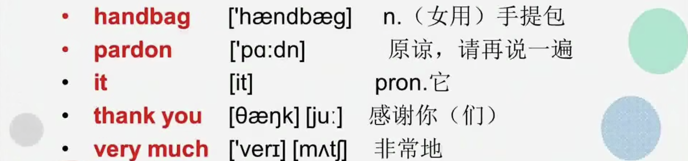

# Excuse me!

## 26 个英文字母

## New Words and expressions

### yes

- adv. 是的（对一般疑问句的肯定回答）
  Are you mad?  
  Yes,I am.  

- 表示应答
  Excuse me! Yes?  
  Wendy? Yes?  

### is

> be : are/am/is 都表示是，用在不同的人称（你我他-单数，你们我们他们-复数）后面

- v.be 动词现在时的第三人称（它）单数形式  
  He is a student

### this

- pron. 这  
  this is a dog  

### that

- pron. 那  
  that is a map  

### your

- det. 你的，你们的(物主代词)(具体翻译成你的还是你们的要看语境)  
  This is your key 这是你的钥匙  
  That is your book  
  That is your room  

### handbag

- n.（女用）手提包  
  That is your handbag  

### pardon

- n.原谅
- int.对不起，请再说一遍  
  pardon？ = pardon me？ = I beg your pardon？（我乞求你再说一遍）（三个发音都要升调，表示没听清）

### it

- pron. 它（用于指一切单数事物）  
  It is an egg  
  Is this your Pencil? Yes, it is  

### thank you

- 感谢你（们）
  - thank v.感谢  
  - you 代词（你，你们）

> 语法：主格，做主语（一般是句子开头的单词）
> 例子: You are a good student 你是一个好学生 ; you 主格 做主语
> 例子: You are good students 你们是好学生 ; you 主格 做主语

> 语法：宾格，做宾语（一般是放在动词后面的是宾语）
> 例子: Thank you ; thank v.感谢
> 例子: I miss you ; miss v.想

### very much

- adv.非常的
  Thank you very much  
  I love you very much  

## Article

M:Excuse me!  
W:Yes?  
M:Is this your handbag? //第一次要升调  
W:Pardon?  
M:Is this your handbag? //第二次再次可以降调  
W:Yes,It is.  
W:Thank you very much.  

### Excuse me 的用法

可以被翻译成`对不起`，`劳驾`，`打扰一下`等常常在表示打扰到别人的时候使用，并不是代表你有什么过错

1. 为了引起别人注意  
   Excuse me! Is this your pencil?
2. 要打扰某人，或者打断别人的话  
   Excuse me. May I ask you question? 对不起，我可以问你个问题吗？
3. 向陌生人问路  
   Excuse me. Could you please tell me the way to the railway station?
   劳驾，能请你告诉我到地铁站的路吗？  
4. 向某人借东西  
   Excuse me.Can I borrow your pen? 打扰一下，我能借用你的笔吗？
5. 需要从别人身边挤过或让别人给自己让路时  
   Excuse me.Could you please make some room for me?
   对不起，你能让我过去吗？  
6. 在宴会或会议中途要离开一会  
   Excuse me.May I leave for a little while? 对不起，我失陪一会

> 如果你真的做错了事情，用`sorry` 

## Grammar

### 肯定句
肯定句变一般疑问句，需要把系动词be（are/am/is）置于句首

This is a handbag. 这是一个手提包(肯定句)  
Is this a handbag? 这是一个手提包吗？(一般疑问句)  
Yes,it is. (肯定回答，it代指手提包)  
No,it isn't（否定回答，isn't == is not）  

### 否定句
肯定句变否定句，把not 加在系动词后面  
is not == isn't  
are not == aren't  
am not(无缩写)  

This is my handbag.（肯定句）  
This isn't my handbag. (否定句) 

## Is this your..? 

这是你的...吗？

Is this your pencil?
Is this your watch?
Is this your school?
Is this your coat? coat v.衣服