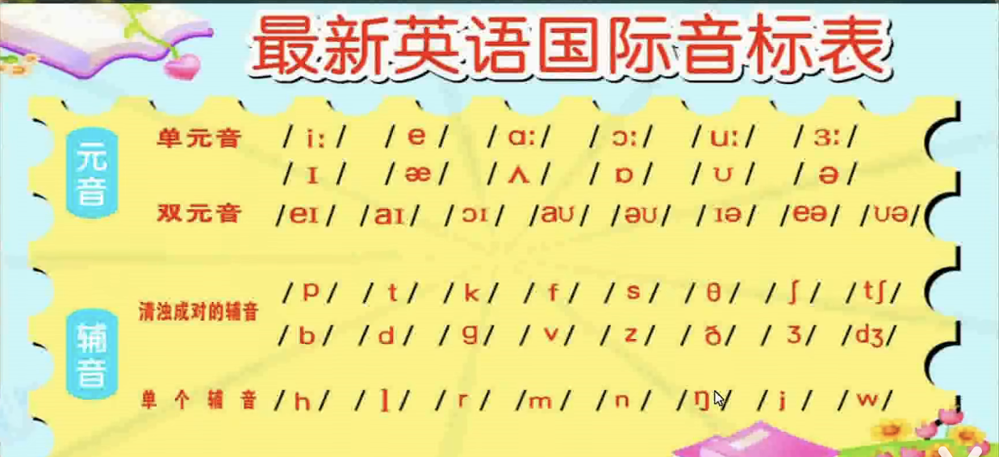
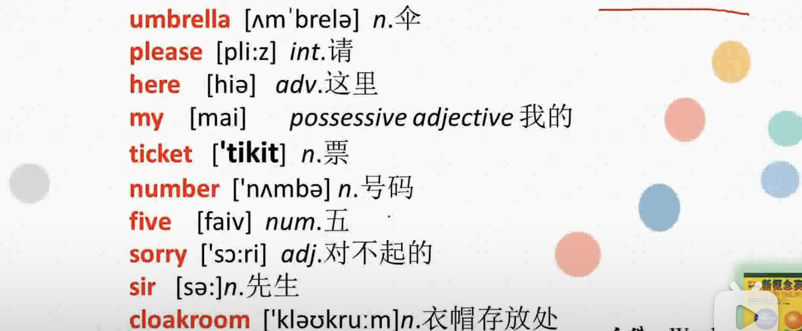

# Sorry sir

## 国际音标和自然拼读

### 国际音标

  
元音发音不会受到其他器官的阻碍  
辅音发音会有阻碍  

### 自然拼读

欧美国家的孩子在正式进入阅读阶段之前，都会通过自然拼读学习法来系统地学习字母的发音，通过字母发音的合成规则来拼读出单词。同样的，通过字母发音和拼读规则对单词进行分割，便可以拼写出单词，而不用死记硬背。因此，自然拼读学习法是儿童英语学习中不可缺少的一步，这种方法真正遵循了英语语言的学习规律，彻底突破了旧的音标学习法，让英语学习变得有趣起来。

自然拼读可以帮助我们认识 85%的单词，剩下的就要交给单独记忆和国际音标了

### letter name 和 letter sound

letter name 为 26 个英文字母的读音，但是在自然拼读的，这些英文字母在单词中的发音会和 letter name 有区别，称之为 letter sound

## New Words

### please

- 请（可以置于居首或句尾）
  Come in please = Please come in  
  Sit down please = Please sit down  

- 求求你（重读）
  Help me ,please! 帮帮我，求求你  

### here

- adv.这里  
  Come here 来这里  

### there

- adv.那里  
  Go there 到那里  

> hear there 置于句首时，后面的主谓要倒装  
> Here is my ticket. 我的票在这里（正常语序：My ticket is here）

### ticket

- n.票  
  an air ticket  
  a train ticket  
  a bus ticket  
  a cinema ticket 电影票  
  Here is my air ticket  

### number

- n 号码  
  telephone number  
  number+ 基数词 第..  
  number one 第一  
  I am number one  

## Article

M:My coat and my umbrella please. (省略形式祈使句，完整：Give me my coat and my umbrella,please)  
M:Here is my ticket  
W:Thank you ,sir  
M:Number five  
M:Here's your umbrella and coat.  
M:This is not my umbrella.  
M:Sorry.sir  
M:Is this your umbrella?  
M:No,isn't  
M:Is this it? 这把是吗？  
M:Yes,It is.  
M:Thank you,very much.  

Mr. (mister) 加在男性的姓氏前面，也是先生的意思，Mr 必须和姓氏连用，不可以单独使用  
Mr.Zhang  

sir: 表示对不相识的男子，年长者或上级的一种尊称，一般单独使用  
Excuse me.sir  
Can I halp you sir  

gentleman 绅士，对男性比较有礼貌的称呼，公众场合使用  

guy 家伙，对男性的不正式的称呼  

boy 男孩，不正式的称呼  

<table role="table">
    <tbody>
        <tr>
            <td>主格</td><td>I</td><td>you</td><td>he</td><td>she</td>
        </tr>
        <tr>
            <td>宾格</td><td>me</td><td>you</td><td>him</td><td>her</td>
        </tr>
        <tr>
            <td>形容词性物主代词</td><td>my</td><td>your</td><td>his</td><td>her</td>
        </tr>
        <tr>
            <td>名词性物主代词</td><td>mine</td><td>your</td><td>his</td><td>hers</td>
        </tr>
    </tbody>
</table>
主格一般做主语，放在句首   
宾格做宾语，放在动词或介词之后  

形容词性物主代词不能单独使用，后边必须跟名词或其他的词  
This is my pen  

名词性物主代词是单独使用的  
This pen is mine  

## 练习一般疑问句的肯定回答和否定回答

### Is this you...?

Is this your pen?  
Yes, it is;  
Is this your watch?  
No ,it isn't  
