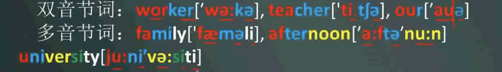

# 5-6 Nice to meet you

## 音节

音节是读音的基本单位，任何单词的读音，都是分解为一个个音节朗读。在英语中元音特别响亮，一
个元音可构成一个音节，一个元音和一个或几个辅音音素结合也可以构成一个音节。一般说来，元音
可以构成音节，辅音不响亮，不能构成音节。

> a e i o u 这五个元音字母是构成单词的灵魂
> 每个元音字母必须包含一个元音字母

### 音节的拆分

一个音节通常由一个元音音素加上一个或几个辅音音素构成  

在一个词中，有几个元音音素（不是元音字母），就有几个音节。上列例词都是只有一个元音音素的单音节词。有两个元音音素的叫双音节词，有三个或三个以上元音音素的叫多音节词
例如：  

此外，有几个发音响亮的辅音，如`[l][m][n]`,在后面没有元音的情况下也可以和它前面的辅音构成一个音节，故可称“成节辅音”。例如：  

## New words and expression
<!--  -->

### Japanese
-  n.日本人 日语
-  adj. 日本的

Japan n.日本

### German
-  n.德国人 德国语
-  adj. 德国的

Germany n.德国

### Chinese
-  n.中国人 汉语
-  adj. 中国的

china n.中国

china is a big country

### Korean 
-  n.韩国人 韩国语
-  adj. 韩国的 

Korea n.韩国

### 其他

Swedish n.瑞典人 adj.瑞典的
Sweden n.瑞典
English n.英国人 adj.英国的
England n.英国
American n.美国人 adj.美国的
America  n.美国
Italian n.意大利人 adj.意大利的
Italy   n.意大利

## Article
Mr: Good morning
H:  Good morning,Mr.Blake
Mr: This is Miss Sophie Dupont.Sophie is a student,she is France
Mr: Sophie,this is Hans,He is German
H:  Nice to meet you.
Mr: And this is NaoKo.she's Japanese
Nao:Nice to meet you,.

### Language Points

Miss 小姐（一般指未婚女士） Miss+姓氏 Miss Lee
Mrs. 太太（已婚女士） Mrs+丈夫姓氏  Mrs.Black 布莱克太太
Ms. 女士（对未知婚姻情况的称呼） Ms.Lee 李女士

morning     n.早晨
afternoon   n.下午
evening     n.晚上
night       n.夜里

in the morning      //在早晨
in the afternoon    //在下午
in the evening      //在晚上
at night            //在夜里

Good morning!       //早晨好
Good afternoon!     //下午好
Good evening!       //晚上好
Good night!         //晚安

This is...可以用来向某人介绍某人
Nice to meet you. 用与非正式场合的第一次见面
Nice to meet you,too 回答

too adv. 也  用在肯定句和疑问句中
either adv 也 用在否定句中
too和either一般放在句尾，用逗号隔开
Miss Dupont is French,too
Mrs.Lee is not German,either

## What make is it?

<!-- 
 -->

### make
- n.牌子
What make is your car?
My shirt is Korean make.
- v.制造，做
Make a car.

### Volvo

What make is it?
It's a Volvo,It is a Swinish car.