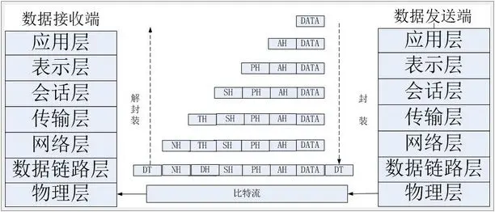
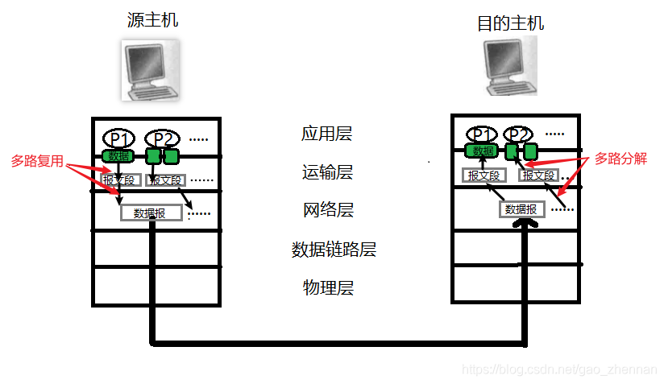
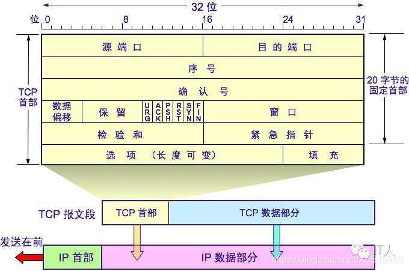
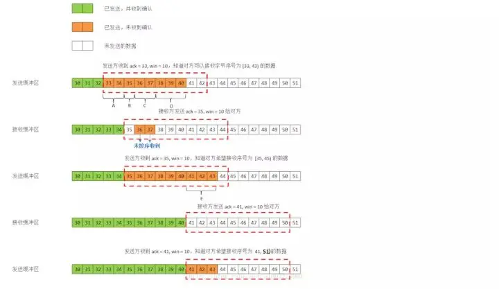
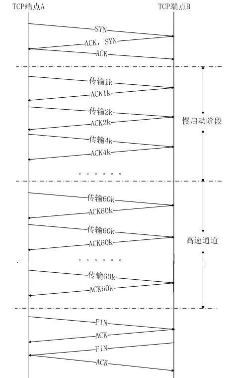
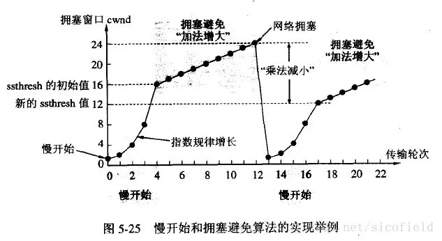
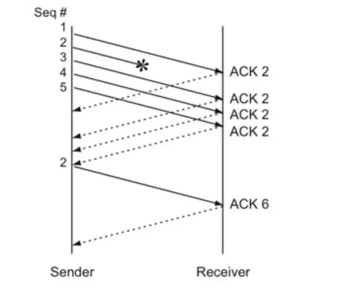

# TCP协议详解

TCP(Transmission Control Protocol 传输控制协议)是一种面向连接 (连接导向) 的、可靠的、 基于 IP 的传输层协议。
    

## 五层协议的体系结构

学习计算机网络时我们一般采用折中的办法，也就是中和 OSI 和 TCP/IP 的优点，采用一种只有五层协议的体系结构，这样既简洁又能将概念阐述清楚。

我们需要知道TCP工作在网络OSI的七层模型中的第四层——传输层，IP在第三层——网络层，ARP 在第二层——数据链路层;同时，我们需要简单的知道，数据从应用层发下来，会在每一层都会加上头部信息，进行封装，然后再发送到数据接收端进行解封

结合互联网的情况，自上而下地，非常简要的介绍一下各层的作用。

### 1 应用层

**应用层 (application-layer）的任务是通过应用进程间的交互来完成特定网络应用。**应用层协议定义的是应用进程（进程：主机中正在运行的程序）间的通信和交互的规则。对于不同的网络应用需要不同的应用层协议。在互联网中应用层协议很多，如**域名系统 DNS**，支持万维网应用的 **HTTP 协议**，支持电子邮件的 **SMTP 协议**等等。我们把应用层交互的数据单元称为报文。

#### 域名系统

> 域名系统 (Domain Name System 缩写 DNS，Domain Name 被译为域名) 是因特网的一项核心服务，它作为可以将域名和 IP 地址相互映射的一个分布式数据库，能够使人更方便的访问互联网，而不用去记住能够被机器直接读取的 IP 数串。（百度百科）例如：一个公司的 Web 网站可看作是它在网上的门户，而域名就相当于其门牌地址，通常域名都使用该公司的名称或简称。例如上面提到的微软公司的域名，类似的还有：IBM 公司的域名是 [www.ibm.com](https://link.juejin.cn?target=http%3A%2F%2Fwww.ibm.com "http://www.ibm.com")、Oracle 公司的域名是 [www.oracle.com](https://link.juejin.cn?target=http%3A%2F%2Fwww.oracle.com "http://www.oracle.com")、Cisco 公司的域名是 [www.cisco.com](https://link.juejin.cn?target=http%3A%2F%2Fwww.cisco.com "http://www.cisco.com") 等。

#### HTTP 协议

> 超文本传输协议（HTTP，HyperText Transfer Protocol) 是互联网上应用最为广泛的一种网络协议。所有的 WWW（万维网） 文件都必须遵守这个标准。设计 HTTP 最初的目的是为了提供一种发布和接收 HTML 页面的方法。（百度百科）

### 2 运输层

**运输层 (transport layer) 的主要任务就是负责向两台主机进程之间的通信提供通用的数据传输服务**。应用进程利用该服务传送应用层报文。“通用的” 是指并不针对某一个特定的网络应用，而是多种网络应用可以使用同一个运输层服务。
#### 多路分解和多路复用
由于一台主机可同时运行多个线程，因此运输层有复用和分解的功能。所谓复用就是指多个应用层进程可同时使用下面运输层的服务，分解和复用相反，是运输层把收到的信息分别交付上面应用层中的相应进程。

**注释**：  
1. 源主机的 P1 表示实现某协议（如 HTTP 协议）的客户进程，目的主机的 P1 表示某协议（如 HTTP 协议）的服务器进程。  
2. 绿色块表示**套接字**，**一个进程可以有一个或者多个套接字，从进程的角度看（应用层以下都属于网络），它相当于从网路向进程传递数据和从进程向网络传递数据的门户。在接受主机（目的主机）中运输层实际上并没有直接将数据交付给进程，而是交付给了一个中间套接字**。  
3. **多路复用：在源主机从不同的套接字（体现多路）收集数据块，并为每个数据块封装首部信息（该信息可用于多路分解）从而生成报文段，然后将报文段传递到网络层。**  
**4. 多路分解：在目的主机中，把网路层获取的报文段中的数据交付到正确的（或者说对应的）套接字中。**  

#### 运输层主要使用以下两种协议

1.  **传输控制协议 TCP**（Transmisson Control Protocol）-- 提供**面向连接**的，**可靠的**数据传输服务。
2.  **用户数据协议 UDP**（User Datagram Protocol）-- 提供**无连接**的，尽最大努力的数据传输服务（**不保证数据传输的可靠性**）。

#### UDP 的主要特点

1.  UDP 是无连接的；
2.  UDP 使用尽最大努力交付，即不保证可靠交付，因此主机不需要维持复杂的链接状态（这里面有许多参数）；
3.  UDP 是面向报文的；
4.  UDP 没有拥塞控制，因此网络出现拥塞不会使源主机的发送速率降低（对实时应用很有用，如 直播，实时视频会议等）；
5.  UDP 支持一对一、一对多、多对一和多对多的交互通信；
6.  UDP 的首部开销小，只有 8 个字节，比 TCP 的 20 个字节的首部要短。

#### TCP 的主要特点

1.  TCP 是面向连接的。（就好像打电话一样，通话前需要先拨号建立连接，通话结束后要挂机释放连接）；
2.  每一条 TCP 连接只能有两个端点，每一条 TCP 连接只能是点对点的（一对一）；
3.  TCP 提供可靠交付的服务。通过 TCP 连接传送的数据，无差错、不丢失、不重复、并且按序到达；
4.  TCP 提供全双工通信。TCP 允许通信双方的应用进程在任何时候都能发送数据。TCP 连接的两端都设有发送缓存和接收缓存，用来临时存放双方通信的数据；
5.  面向字节流。TCP 中的 “流”（Stream）指的是流入进程或从进程流出的字节序列。“面向字节流” 的含义是：虽然应用程序和 TCP 的交互是一次一个数据块（大小不等），但 TCP 把应用程序交下来的数据仅仅看成是一连串的无结构的字节流。

### 3 网络层

**网络层 (network layer) 负责为分组交换网上的不同主机提供通信服务。** 在发送数据时，网络层把运输层产生的报文段或用户数据报封装成分组和包进行传送。在 TCP/IP 体系结构中，由于网络层使用 **IP 协议**，因此分组也叫 **IP 数据报** ，简称 **数据报**。

这里要注意：**不要把运输层的 “用户数据报 UDP” 和网络层的 “ IP 数据报” 弄混**。另外，无论是哪一层的数据单元，都可笼统地用 “分组” 来表示。

网络层的另一个任务就是选择合适的路由，使源主机运输层所传下来的分组，能通过网络层中的路由器找到目的主机。

这里强调指出，网络层中的 “网络” 二字已经不是我们通常谈到的具体网络，而是指计算机网络体系结构模型中第三层的名称.

互联网是由大量的异构（heterogeneous）网络通过路由器（router）相互连接起来的。互联网使用的网络层协议是无连接的网际协议（Intert Prococol）和许多路由选择协议，因此互联网的网络层也叫做**网际层**或 **IP 层**。

### 4 数据链路层

**数据链路层 (data link layer) 通常简称为链路层。两台主机之间的数据传输，总是在一段一段的链路上传送的，这就需要使用专门的链路层的协议。** 在两个相邻节点之间传送数据时，**数据链路层将网络层交下来的 IP 数据报组装程帧**，在两个相邻节点间的链路上传送帧。每一帧包括数据和必要的控制信息（如同步信息，地址信息，差错控制等）。

在接收数据时，控制信息使接收端能够知道一个帧从哪个比特开始和到哪个比特结束。这样，数据链路层在收到一个帧后，就可从中提出数据部分，上交给网络层。 控制信息还使接收端能够检测到所收到的帧中有误差错。如果发现差错，数据链路层就简单地丢弃这个出了差错的帧，以避免继续在网络中传送下去白白浪费网络资源。如果需要改正数据在链路层传输时出现差错（这就是说，数据链路层不仅要检错，而且还要纠错），那么就要采用可靠性传输协议来纠正出现的差错。这种方法会使链路层的协议复杂些。

### 5 物理层

在物理层上所传送的数据单位是比特。 **物理层 (physical layer) 的作用是实现相邻计算机节点之间比特流的透明传送，尽可能屏蔽掉具体传输介质和物理设备的差异。** 使其上面的数据链路层不必考虑网络的具体传输介质是什么。“透明传送比特流” 表示经实际电路传送后的比特流没有发生变化，对传送的比特流来说，这个电路好像是看不见的。

在互联网使用的各种协中最重要和最著名的就是 TCP/IP 两个协议。现在人们经常提到的 TCP/IP 并不一定单指 TCP 和 IP 这两个具体的协议，而往往表示互联网所使用的整个 TCP/IP 协议族。

## TCP 报文数据格式
下图是 TCP 报文数据格式。TCP 首部如果不计选项和填充字段，它通常是 20 个字节。
    

下面分别对其中的字段进行介绍：
    
### 源端口和目的端口 
各占 2 个字节，这两个值加上 IP 首部中的源端 IP 地址和目的端 IP 地址唯一确定一个 TCP 连接。有时一个 IP 地址和一个端口号也称为 socket（插口）。
    
### 序号(seq)
占 4 个字节，是本报文段所发送的数据项目组第一个字节的序号。在 TCP 传送的数据流中，每一个字节都有一个序号。例如，一报文段的序号为 300，而且数据共 100 字节，
    
则下一个报文段的序号就是 400；序号是 32bit 的无符号数，序号到达 2^32-1 后从 0 开始。
    
### 确认序号(ack) 
占 4 字节，是期望收到对方下次发送的数据的第一个字节的序号，也就是期望收到的下一个报文段的首部中的序号；确认序号应该是上次已成功收到数据字节序号 + 1。
    
只有 ACK 标志为 1 时，确认序号才有效。
    
### 数据偏移 
占 4 比特，表示数据开始的地方离 TCP 段的起始处有多远。实际上就是 TCP 段首部的长度。由于首部长度不固定，因此数据偏移字段是必要的。数据偏移以 32 位为长度单位，
    
  
也就是 4 个字节，因此 TCP 首部的最大长度是 60 个字节。即偏移最大为 15 个长度单位 = 1532 位 = 154 字节。
    
### 保留 
---  
6 比特，供以后应用，现在置为 0。
    
6 个标志位比特
    

> 1、URG：当 URG=1 时，注解此报文应尽快传送，而不要按本来的列队次序来传送。与 “紧急指针” 字段共同应用，紧急指针指出在本报文段中的紧急数据的最后一个字节的序号， 使接管方可以知道紧急数据共有多长。 
> 
> 2、ACK：只有当 ACK=1 时，确认序号字段才有效； 
> 
> 3、PSH：当 PSH=1 时，接收方应该尽快将本报文段立即传送给其应用层。 
> 
> 4、RST：当 RST=1 时，表示出现连接错误，必须释放连接，然后再重建传输连接。复位比特还用来拒绝一个不法的报文段或拒绝打开一个连接； 
> 
> 5、SYN：连接建立时用于同步序号。当 SYN=1，ACK=0 时表示：这是一个连接请求报文段。若同意连接，则在响应报文段中使得 SYN=1，ACK=1。因此，SYN=1 表示这是一个连接请求，或连接接受报文。SYN 这个标志位只有在 TCP 建产连接时才会被置 1，握手完成后 SYN 标志位被置 0。 
> 
> 6、FIN：用来释放一个连接。FIN=1 表示：此报文段的发送方的数据已经发送完毕，并要求释放运输连接

### 窗口 
TCP 通过滑动窗口的概念来进行流量控制。设想在发送端发送数据的速度很快而接收端接收速度却很慢的情况下，为了保证数据不丢失，显然需要进行流量控制， 协调好
    
通信双方的工作节奏。所谓滑动窗口，可以理解成接收端所能提供的缓冲区大小。TCP 利用一个滑动的窗口来告诉发送端对它所发送的数据能提供多大的缓 冲区。窗口大小为
    
字节数起始于确认序号字段指明的值（这个值是接收端正期望接收的字节）。窗口大小是一个 16bit 字段，因而窗口大小最大为 65535 字节。
    
### 检验和 
检验和覆盖了整个 TCP 报文段：TCP 首部和数据。这是一个强制性的字段，一定是由发端计算和存储，并由收端进行验证。
    
### 紧急指针 
只有当 URG 标志置 1 时紧急指针才有效。紧急指针是一个正的偏移量，和序号字段中的值相加表示紧急数据最后一个字节的序号。

## TCP 三次握手和四次挥手

在谢希仁著《[计算机网络](https://www.zhihu.com/search?q=%E8%AE%A1%E7%AE%97%E6%9C%BA%E7%BD%91%E7%BB%9C&search_source=Entity&hybrid_search_source=Entity&hybrid_search_extra=%7B%22sourceType%22%3A%22answer%22%2C%22sourceId%22%3A63668444%7D)》第四版中讲 “三次握手” 的目的是 “为了防止已失效的连接请求报文段突然又传送到了服务端，因而产生错误”。在另一部经典的《计算机网络》一书中讲“三次握手” 的目的是为了解决 “网络中存在延迟的重复分组” 的问题。这两种不用的表述其实阐明的是同一个问题。

谢希仁版《计算机网络》中的例子是这样的，“已失效的连接请求报文段”的产生在这样一种情况下：client 发出的第一个连接请求报文段并没有丢失，而是在某个网络结点长时间的滞留了，以致延误到连接释放以后的某个时间才到达 server。本来这是一个早已失效的报文段。但 server 收到此失效的连接请求报文段后，就误认为是 client 再次发出的一个新的连接请求。于是就向 client 发出确认报文段，同意建立连接。假设不采用 “三次握手”，那么只要 server 发出确认，新的连接就建立了。由于现在 client 并没有发出建立连接的请求，因此不会理睬 server 的确认，也不会向 server 发送数据。但 server 却以为新的运输连接已经建立，并一直等待 client 发来数据。这样，server 的很多资源就白白浪费掉了。采用“三次握手” 的办法可以防止上述现象发生。例如刚才那种情况，client 不会向 server 的确认发出确认。server 由于收不到确认，就知道 client 并没有要求建立连接。”

这个例子很清晰的阐释了 “三次握手” 对于建立可靠连接的意义。

### 三次握手

PS：TCP 协议中，主动发起请求的一端称为『[客户端](https://www.zhihu.com/search?q=%E5%AE%A2%E6%88%B7%E7%AB%AF&search_source=Entity&hybrid_search_source=Entity&hybrid_search_extra=%7B%22sourceType%22%3A%22answer%22%2C%22sourceId%22%3A254224088%7D)』，被动连接的一端称为『[服务端](https://www.zhihu.com/search?q=%E6%9C%8D%E5%8A%A1%E7%AB%AF&search_source=Entity&hybrid_search_source=Entity&hybrid_search_extra=%7B%22sourceType%22%3A%22answer%22%2C%22sourceId%22%3A254224088%7D)』。不管是客户端还是服务端，TCP 连接建立完后都能发送和接收数据。

起初，服务器和客户端都为 CLOSED 状态。在通信开始前，双方都得创建各自的传输控制块（TCB）。  
服务器创建完 TCB 后遍进入 LISTEN 状态，此时准备接收客户端发来的连接请求。

**第一次握手**  
客户端向服务端发送连接请求报文段。该报文段的头部中 SYN=1，ACK=0，seq=x。请求发送后，客户端便进入 SYN-SENT 状态。

*   PS1：SYN=1，ACK=0 表示该报文段为连接请求报文。
*   PS2：x 为本次 TCP 通信的[字节流](https://www.zhihu.com/search?q=%E5%AD%97%E8%8A%82%E6%B5%81&search_source=Entity&hybrid_search_source=Entity&hybrid_search_extra=%7B%22sourceType%22%3A%22answer%22%2C%22sourceId%22%3A254224088%7D)的初始序号。  
    TCP 规定：SYN=1 的报文段不能有数据部分，但要消耗掉一个序号。

**第二次握手**  
服务端收到连接请求报文段后，如果同意连接，则会发送一个应答：SYN=1，ACK=1，seq=y，ack=x+1。  
该应答发送完成后便进入 SYN-RCVD 状态。

*   PS1：SYN=1，ACK=1 表示该报文段为连接同意的应答报文。
*   PS2：seq=y 表示服务端作为发送者时，发送字节流的初始序号。
*   PS3：ack=x+1 表示服务端希望下一个数据报发送序号从 x+1 开始的字节。

**第三次握手**  
当客户端收到连接同意的应答后，还要向服务端发送一个确认报文段，表示：服务端发来的连接同意应答已经成功收到。  
该报文段的头部为：ACK=1，seq=x+1，ack=y+1。  
客户端发完这个报文段后便进入 ESTABLISHED 状态，服务端收到这个应答后也进入 ESTABLISHED 状态，此时连接的建立完成！

**为什么连接建立需要三次握手，而不是两次握手？**  
在谢希仁著《[计算机网络](https://www.zhihu.com/search?q=%E8%AE%A1%E7%AE%97%E6%9C%BA%E7%BD%91%E7%BB%9C&search_source=Entity&hybrid_search_source=Entity&hybrid_search_extra=%7B%22sourceType%22%3A%22answer%22%2C%22sourceId%22%3A63668444%7D)》第四版中讲 “三次握手” 的目的是 “为了防止已失效的连接请求报文段突然又传送到了服务端，因而产生错误”。在另一部经典的《计算机网络》一书中讲“三次握手” 的目的是为了解决 “网络中存在延迟的重复分组” 的问题。这两种不用的表述其实阐明的是同一个问题。

谢希仁版《计算机网络》中的例子是这样的，“已失效的连接请求报文段”的产生在这样一种情况下：client 发出的第一个连接请求报文段并没有丢失，而是在某个网络结点长时间的滞留了，以致延误到连接释放以后的某个时间才到达 server。本来这是一个早已失效的报文段。但 server 收到此失效的连接请求报文段后，就误认为是 client 再次发出的一个新的连接请求。于是就向 client 发出确认报文段，同意建立连接。假设不采用 “三次握手”，那么只要 server 发出确认，新的连接就建立了。由于现在 client 并没有发出建立连接的请求，因此不会理睬 server 的确认，也不会向 server 发送数据。但 server 却以为新的运输连接已经建立，并一直等待 client 发来数据。这样，server 的很多资源就白白浪费掉了。采用“三次握手” 的办法可以防止上述现象发生。例如刚才那种情况，client 不会向 server 的确认发出确认。server 由于收不到确认，就知道 client 并没有要求建立连接。”

**如果已经建立了连接，但是客户端突然出现故障了怎么办**

TCP 还设有一个保活计时器，显然，客户端如果出现故障，服务器不能一直等下去，白白浪费资源。服务器每收到一次客户端的请求后都会重新复位这个计时器，时间通常是设置为 2 小时，若两小时还没有收到客户端的任何数据，服务器就会发送一个探测报文段，以后每隔 75 秒钟发送一次。若一连发送 10 个探测报文仍然没反应，服务器就认为客户端出了故障，接着就关闭连接。
### 四次挥手
  

TCP 连接的释放一共需要四步，因此称为『四次挥手』。  
我们知道，TCP 连接是双向的，因此在四次挥手中，前两次挥手用于断开一个方向的连接，后两次挥手用于断开另一方向的连接。

**第一次挥手**  
若 A 认为数据发送完成，则它需要向 B 发送连接释放请求。该请求只有报文头，头中携带的主要参数为：  
FIN=1，seq=u。此时，A 将进入 FIN-WAIT-1 状态。

*   PS1：FIN=1 表示该报文段是一个连接释放请求。
*   PS2：seq=u，u-1 是 A 向 B 发送的最后一个字节的序号。

**第二次挥手**  
B 收到连接释放请求后，会通知相应的应用程序，告诉它 A 向 B 这个方向的连接已经释放。此时 B 进入 CLOSE-WAIT 状态，并向 A 发送连接释放的应答，其报文头包含：  
ACK=1，seq=v，ack=u+1。

*   PS1：ACK=1：除 TCP 连接请求报文段以外，TCP 通信过程中所有数据报的 ACK 都为 1，表示应答。
*   PS2：seq=v，v-1 是 B 向 A 发送的最后一个字节的序号。
*   PS3：ack=u+1 表示希望收到从第 u+1 个字节开始的报文段，并且已经成功接收了前 u 个字节。

A 收到该应答，进入 FIN-WAIT-2 状态，等待 B 发送连接释放请求。

第二次挥手完成后，A 到 B 方向的连接已经释放，B 不会再接收数据，A 也不会再发送数据。但 B 到 A 方向的连接仍然存在，B 可以继续向 A 发送数据。

**第三次挥手**  
当 B 向 A 发完所有数据后，向 A 发送连接释放请求，请求头：FIN=1，ACK=1，seq=w，ack=u+1。B 便进入 LAST-ACK 状态。

**第四次挥手**  
A 收到释放请求后，向 B 发送确认应答，此时 A 进入 TIME-WAIT 状态。该状态会持续 2MSL 时间，若该时间段内没有 B 的重发请求的话，就进入 CLOSED 状态，撤销 TCB。当 B 收到确认应答后，也便进入 CLOSED 状态，撤销 TCB。

**为什么 A 要先进入 TIME-WAIT 状态，等待 2MSL 时间后才进入 CLOSED 状态？**  
为了保证 B 能收到 A 的确认应答。  
若 A 发完确认应答后直接进入 CLOSED 状态，那么如果该应答丢失，B 等待超时后就会重新发送连接释放请求，但此时 A 已经关闭了，不会作出任何响应，因此 B 永远无法正常关闭。

## TCP流量控制(滑动窗口协议) 
TCP 流量控制主要是针对接收端的处理速度不如发送端发送速度快的问题，消除发送方使接收方缓存溢出的可能性。
    
TCP 流量控制主要使用滑动窗口协议，滑动窗口是接受数据端使用的窗口大小，用来告诉发送端接收端的缓存大小，以此可以控制发送端发送数据的大小，从而达到流量控制的目的。这个窗口大小就是我们一次传输几个数据。对所有数据帧按顺序赋予编号，发送方在发送过程中始终保持着一个发送窗口，只有落在发送窗口内的帧才允许被发送；
    
同时接收方也维持着一个接收窗口，只有落在接收窗口内的帧才允许接收。这样通过调整发送方窗口和接收方窗口的大小可以实现流量控制。
    
我们可以通过下图来分析:
    

> 1. 发送方接收到了对方发来的报文 ack = 33, win = 10，知道对方收到了 33 号前的数据，现在期望接收 [33, 43) 号数据。那我们开始发送[33, 43) 号的数据。 2.[33, 43) 号的数据你是已经发送了, 但接受方并没有接受到 [36,37] 数据。所以接收方发送回对报文段 A 的确认：ack = 35, win = 10。 3. 发送方收到了 ack = 35, win = 10，对方期望接收 [35, 45) 号数据。那么发送方在发送[35, 45) 。

这里面需要思考一个问题？
    
第一步发送了 [33, 43), 如果这次发送 [35, 45), 那中间重叠部分不是发送了两次, 所以这里要思考: 是全部重新发送还是只发送接收端没有收到的数据, 如果全部发送那么重复
    
发送的数据接收端怎么处理。这个下面快速重传会讲。
    

> 4. 接收方接收到了报文段 [35, 41)，接收方发送：ack = 41, win = 10. （这是一个累积确认） 5. 发送方收到了 ack = 41, win = 10，对方期望接收 [41, 51) 号数据。 6.   .......

这样一直传输数据, 直到数据发送完成。这么一来就保证数据数据的可靠性, 因为如果某数据没有获取到, 那么 ack 永远不会跳过它。
    
这里也要思考一个问题, 如果某一数据一只没有获取到, 总不能一直这样堵塞在这里吧, 这里就要讲接下来有关堵塞的解决方法。
    
## TCP拥塞控制 
流量控制是通过接收方来控制流量的一种方式；而拥塞控制则是通过发送方来控制流量的一种方式。
    
TCP 发送方可能因为 IP 网络的拥塞而被遏制，TCP 拥塞控制就是为了解决这个问题（注意和 TCP 流量控制的区别）。
    
TCP 拥塞控制的几种方法：慢启动，拥塞避免，快重传和快恢复。
    
这里先理解一个概念: 拥塞窗口
    
拥塞窗口：发送方维持一个叫做拥塞窗口 cwnd 的状态变量。拥塞窗口的大小取决于网络的拥塞程度，并且动态变化。
    
发送方的让自己的发送窗口 = min(cwnd，接受端接收窗口大小）。说明: 发送方取拥塞窗口与滑动窗口的最小值作为发送的上限。
    
发送方控制拥塞窗口的原则是：只要网络没有出现拥塞，拥塞窗口就增大一些，以便把更多的分组发送出去。但只要网络出现拥塞，拥塞窗口就减小一些，以减少
    
注入到网络中的分组数。
    
下面将讨论拥塞窗口 cwnd 的大小是怎么变化的。
    
### 慢启动 
TCP 在连接过程的三次握手完成后，开始传数据，并不是一开始向网络通道中发送大量的数据包。因为假如网络出现问题，很多这样的大包会积攒在路由器上，很容易导致网
    
络中路由器缓存空间耗尽，从而发生拥塞。因此现在的 TCP 协议规定了，新建立的连接不能够一开始就发送大尺寸的数据包，而只能从一个小尺寸的包开始发送，在发送和数据被
    
对方确认的过程中去计算对方的接收速度，来逐步增加每次发送的数据量（最后到达一个稳定的值，进入高速传输阶段。相应的，慢启动过程中，TCP 通道处在低速传输阶段），
    
以避免上述现象的发生。这个策略就是慢启动。
    
画个简单的图从原理上粗略描述一下
    

我们思考一个慢启动引起的性能问题？
    
在海量用户高并发访问的大型网站后台，有一些基本的系统维护需求。比如迁移海量小文件，就是从一些机器拷贝海量小碎文件到另一些机器，来完成一些系统维护的基本需求。
    
慢启动为什么会对拷贝海量小文件的需求造成重大性能损失？
    
举个简单的例子，我们对每个文件都采用独立的 TCP 连接来传输（循环使用 scp 拷贝就是这个例子的实际场景，很常见的用法）。那么工作过程应该是，每传输一个文件建立一个连接，然后连接处于慢启动阶段，传输小文件，每个小文件几乎都处于独立连接的慢启动阶段被传输，这样传输过程所用的 TCP 包的总量就会增多。更细致的说一说这个事，如果在慢启动过程中传输一个小文件，我们可能需要 2 至 3 个小包，而在一个已经完成慢启动的 TCP 通道中（TCP 通道已进入在高速传输阶段），我们传输这个文件可能只需要 1 个大包。
    
网络拷贝文件的时间基本上全部消耗都在网络传输的过程中（发数据过去等对端 ACK，ACK 确认归来继续再发，这样的数据来回交互相比较本机的文件读写非常耗时间），撇开三次握手和四次握手那些包，如果文件的数量足够大，这个总时间就会被放大到需求难以忍受的地步。
    
因此，在迁移海量小文件的需求下，我们不能使用 “对每个文件都采用独立的 TCP 连接来传输（循环使用 scp 拷贝）“这样的策略，它会使每个文件的传输都处于在一个独立 TCP 的慢启动阶段。
    

如何避免慢启动，进而提升性能？
    
很简单，尽量把大量小文件放在一个 TCP 连接中排队传输。起初的一两个文件处于慢启动过程传输，后续的文件传输全部处于高速通道中传输，用这样的方式来减少发包的数目，进而降低时间消耗。同样，实际上这种传输策略带来的性能提升的功劳不仅仅归于避免慢启动，事实上也避免了大量的 3 次握手和四次握手，这个对海量小文件传输的性能消耗也非常致命。
    
### 拥塞避免 
先补充下: 慢启动中拥塞窗口的 cwnd 值, 开始是 1, 接下开是指数型增涨的。1、2、4、8、16..... 这样涨太快了吧。那么就有了堵塞避免。
    
cwnd 不能一直这样无限增长下去，一定需要某个限制。TCP 使用了一个叫慢启动门限 (ssthresh) 的变量，一旦 cwnd>=ssthresh（大多数 TCP 的实现，通常大小都是 65536），慢启动过程结束，拥塞避免阶段开始；
    
拥塞避免：cwnd 的值不再指数级往上升，开始加法增加。此时当窗口中所有的报文段都被确认时，cwnd 的大小加 1，cwnd 的值就随着 RTT 开始线性增加，这样就可以避免增长过快导致网络拥塞，慢慢的增加调整到网络的最佳值。(它逻辑很简单就是到一定值后, cwnd 不在是指数增长, 而是 + 1 增长。这样显然慢多了）。
    
非 ECN 环境下的拥塞判断，发送方 RTO 超时，重传了一个报文段，它的逻辑如下：
    

1.  把 ssthresh 降低为 cwnd 值的一半。
    
2.  把 cwnd 重新设置为 1。
    
3.  重新进入慢启动过程。
    

上面的图还是蛮好理解的。
    
### 快速重传 
TCP 要保证所有的数据包都可以到达，所以，必需要有重传机制。
    
注意:  接收端给发送端的 Ack 确认只会确认最后一个连续的包，比如，发送端发了 1,2,3,4,5 一共五份数据，接收端收到了 1，2，于是回 ack 3，然后收到了 4（注意此时 3 没收到）此时的 TCP 会怎么办？我们要知道，因为正如前面所说的，SeqNum 和 Ack 是以字节数为单位，所以 ack 的时候，不能跳着确认，只能确认最大的连续收到的包，不然，发送端就以为之前的都收到了。
    

3.1）超时重传机制

一种是不回 ack，死等 3，当发送方发现收不到 3 的 ack 超时后，会重传 3。一旦接收方收到 3 后，会 ack 回 4——意味着 3 和 4 都收到了。
    
但是，这种方式会有比较严重的问题，那就是因为要死等 3，所以会导致 4 和 5 即便已经收到了，而发送方也完全不知道发生了什么事，因为没有收到 Ack，所以，发送方可能会悲观地认为也丢了，所以有可能也会导致 4 和 5 的重传。
    
对此有两种选择：
    

1.  一种是仅重传 timeout 的包。也就是第 3 份数据。
    
2.  另一种是重传 timeout 后所有的数据，也就是第 3，4，5 这三份数据。
    

这两种方式有好也有不好。第一种会节省带宽，但是慢，第二种会快一点，但是会浪费带宽，也可能会有无用功。但总体来说都不好。因为都在等 timeout，timeout 可能会很长。
    

3.2）快速重传机制

于是，TCP 引入了一种叫 Fast Retransmit 的算法，不以时间驱动，而以数据驱动重传。也就是说，如果，包没有连续到达，就 ack 最后那个可能被丢了的包，如果发送方连续收到 3 次相同的 ack，就重传。Fast Retransmit 的好处是不用等 timeout 了再重传, 而是只是三次相同的 ack 就重传。
    
比如：如果发送方发出了 1，2，3，4，5 份数据，第一份先到送了，于是就 ack 回 2，结果 2 因为某些原因没收到，3 到达了，于是还是 ack 回 2，后面的 4 和 5 都到了，但是还是 ack 回 2 因为 2 还是没有收到，于是发送端收到了三个 ack=2 的确认，知道了 2 还没有到，于是就马上重转 2。然后，接收端收到了 2，此时因为 3，4，5 都收到了，于是 ack 回 6。
    
示意图如下
    

Fast Retransmit 只解决了一个问题，就是 timeout 的问题，它依然面临一个艰难的选择，就是重转之前的一个还是重装所有的问题。对于上面的示例来说，是重传 #2 呢还是重传 #2，#3，#4，#5 呢？因为发送端并不清楚这连续的 3 个 ack(2) 是谁传回来的？也许发送端发了 20 份数据，是 #6，#10，#20 传来的呢。这样，发送端很有可能要重传从 #2 到 #20 的这堆数据（这就是某些 TCP 的实际的实现）。可见，这是一把双刃剑。
    
总结: 不管是超时重传还是快速重传确实能保证数据的可靠性, 但它无法解决的问题就是：比如发送端发了 1、2、3、4、5, 而接收端收到了 1、3、4、5, 那么这个时候它发送的 ack 是 2。那么发送端发送的是重传 #2 呢还是重传 #2，#3，#4，#5 的问题。如果在发送 #2，#3，#4，#5, 本身资源是一种浪费, 因为接受方 #3，#4，#5 已经缓存下来, 只需 #2, 所以在发一遍是无意义的。
    

参考：
一篇看懂【TCP协议】---TCP协议详解（值得收藏）https://www.bilibili.com/read/cv15560163