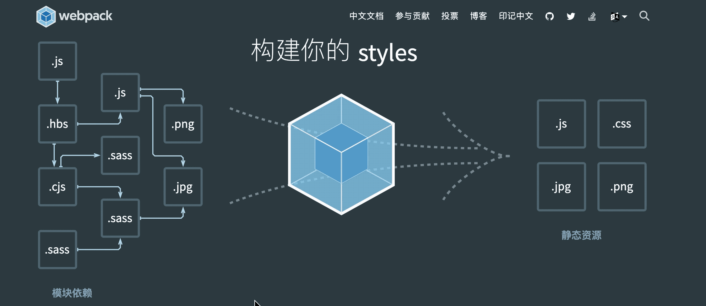
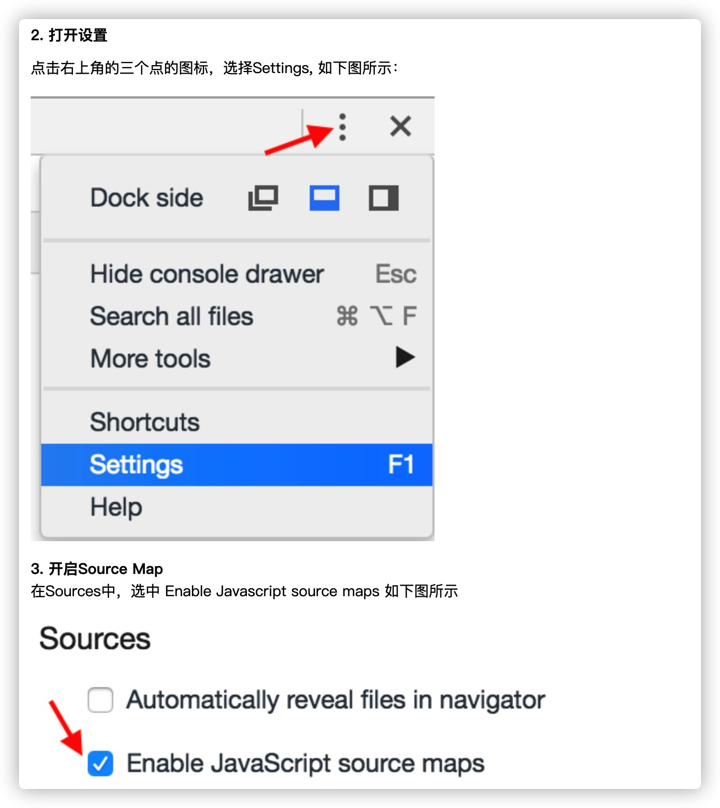

## 熟悉Webpack


## 目的

1. 为什么需要用webpack，webpack解决了什么痛点。
2. 熟悉Webpack常用功能配置，进入现代化前端工程，模块化开发。
3. 能够快速入手搭建一个Webpack工程环境。
   
#### 拓展
4. Webpack引入React环境，实现一个基础的React项目。 
5. Webpack引入Vue环境，实现一个基础的Vue模块化项目。
6. Webpack 优化方案。

## 传统的H5项目

运用HTML，CSS，Javascript开发一个H5网页应用，将所有静态资源CSS、图片和JS手动引入HTML页面中，展现生动页面，实现产品的功能。

```javascript
<!DOCTYPE html> 
<html> 
  <head>
    <style>
    .login-box{
      position: fixed;
      display: none;
      left: 50%;
      top: 50%;
    }
    </style>
  </head>
 	<body>  
    <h1>My Web Page</h1>
    <p id="myPar">I am a paragraph.</p>
    <div id="myDiv">I am a div.</div>
    <p> 
      <button type="button" onclick="myFunction()">点击这里</button>
    </p>  
    <p>当您点击上面的按钮时，两个元素会改变。</p> 
  </body>
	<script src="https://dlswbr.baidu.com/heicha/mw/abclite-2034-s.js"></script>
  <script>
      function myFunction() {
       	document.getElementById("myPar").innerHTML="Hello World"; 	
        document.getElementById("myDiv").innerHTML="How are you?"; 
      } 
  </script>
</html>
```

这并没有什么不好，想要什么就引入什么。所见即所得，开发好的项目文件直接就可以上传服务器，很方便。


## [Webpack](https://v4.webpack.docschina.org/)是什么？

**webpack** 是一个用于**现代 JavaScript 应用程序**的静态模块打包工具。

可以看做是**模块打包机**：它做的事情是，分析你的项目结构，找到JavaScript模块以及其它的一些浏览器不能直接运行的拓展语言（Scss，TypeScript等），并将其转换和打包为合适的格式供浏览器使用。

当 **webpack** 处理应用程序时，它会在内部构建一个 [依赖图(dependency graph)](https://webpack.docschina.org/concepts/dependency-graph/)，此依赖图对应映射到项目所需的每个模块，并生成一个或多个 ***bundle***。打包后置于依赖关系中，使你可以按照需求引用依赖来使用资源。



### WebPack和Grunt以及Gulp相比有什么特性

其实Webpack和另外两个并没有太多的可比性，Gulp/Grunt是一种能够优化前端的开发流程的工具，而WebPack是一种模块化的解决方案，不过Webpack的优点使得Webpack在很多场景下可以替代Gulp/Grunt类的工具。

[Grunt](https://www.w3cschool.cn/grunt/)和[Gulp](https://www.w3cschool.cn/qtaitm/)的工作方式是：在一个配置文件中，指明对某些文件进行类似编译，组合，压缩等任务的具体步骤，工具之后可以自动替你完成这些任务。

Webpack的工作方式是：把你的项目当做一个整体，通过一个给定的主文件（如：index.js），Webpack将从这个文件开始找到你的项目的所有依赖文件，使用loaders处理它们，最后打包为一个（或多个）浏览器可识别的JavaScript文件


## 什么时候用Webpack

近年来 Web 应用变得更加复杂与庞大，Web 前端技术的应用范围也更加广泛。 从复杂庞大的管理后台到对性能要求苛刻的移动网页，再到类似 ReactNative 的原生应用开发方案，Web 前端工程师在面临更多机遇的同时也会面临更大的挑战。 通过直接编写 JavaScript、CSS、HTML 开发 Web 应用的方式已经无法应对当前 Web 应用的发展。如果你正在用许多非代码的静态资源（比如CSS，图像，字体等）构建一个复杂的前端应用程序，那么Webpack会给你带来很大的好处。

如果你的应用程序非常小，并且你没有什么的静态资源，并且你只需要一个JS文件就足够客户端需求，那么Webpack就没有必要使用。

非得用嘛?仁者见仁智者见智。


## Webpack的优点与缺点

优点

1. 模块化开发。[CommonJS](https://www.w3cschool.cn/zobyhd/1ldb4ozt.html) 、[AMD](https://www.w3cschool.cn/webpackguide/webpackguide-1o94277g.html) 、[ES6](https://www.runoob.com/w3cnote/es6-tutorial.html) ......模块化规范都支持。
2. 主流框架友好。React、Vue、Angular...都支持。
3. 预处理。ES6、[TypeScript](https://www.typescriptlang.org/) 、CoffeeScript 、Scss 、Less...... 新语言都支持
4. 通过 Plugin 扩展，完整好用又不失灵活。
5. 使用场景不仅限于 Web 开发
6. 社区庞大活跃，经常引入紧跟时代发展的新特性，能为大多数场景找到已有的开源扩展（资源丰富)

缺点

1. 对新手不友好。
2. 只能用于采用模块化开发的项目。
3. 因为社区庞大，工具众多。他们对版本依赖极强，若版本过高会出现不兼容(有坑)。
4. 单纯的webpack功能很有限，需要社区的很多工具配合完成工作，会有一定学习成本。


## 安装 Webpack

在安装 Webpack 前请确保你的系统安装了5.0.0及以上版本的 [Node.js](https://nodejs.org/)。

在开始给项目加入构建前，你需要先新建一个 Web 项目，方式包括：

- 新建一个目录，再进入项目根目录执行 `npm init` 来初始化最简单的采用了模块化开发的项目；
- 用脚手架工具 [Yeoman](http://yeoman.io/) 直接快速地生成一个最符合你的需求的项目

要安装 Webpack 到本项目，可按照你的需要选择以下任意命令运行：

```bash
# npm i -D 是 npm install --save-dev 的简写，是指安装模块并保存到 package.json 的 devDependencies
# 安装最新稳定版
npm i -D webpack

# 安装指定版本
npm i -D webpack@<version>

# 安装最新体验版本
npm i -D webpack@beta
```

安装完后你可以通过这些途径运行安装到本项目的 Webpack：

- 在项目根目录下对应的命令行里通过 `node_modules/.bin/webpack` 运行 Webpack 可执行文件。

- 在 [Npm Script](http://webpack.wuhaolin.cn/1入门/常见的构建工具及对比/npm_script.md) 里定义的任务会优先使用本项目下的 Webpack，代码如下：

  ```json
  "scripts": {
      "start": "webpack --config webpack.config.js"
  }
  ```


## 使用 Webpack

下面通过 Webpack 构建一个采用 CommonJS 模块化编写的项目，该项目有个网页会通过 JavaScript 在网页中显示 `Hello,Webpack`。

运行构建前，先把要完成该功能的最基础的 JavaScript 文件和 HTML 建立好，需要如下文件：

在`src`目录下创建页面入口文件 `src/index.html`

```html
<html>
<head>
  <meta charset="UTF-8">
</head>
<body>
<div id="app"></div>
<!--导入 Webpack 输出的 JavaScript 文件-->
<script src="../dist/bundle.js"></script>
</body>
</html>
```

在 `src/module`目录下创建 JS 工具函数文件 `src/module/show.js`

```js
// 操作 DOM 元素，把 content 显示到网页上
function show(content) {
  window.document.getElementById('app').innerText = 'Hello,' + content;
}

// 通过 CommonJS 规范导出 show 函数
module.exports = show;
```

在`src`目录下创建 JS 执行入口文件 `src/main.js`

```js
// 通过 CommonJS 规范导入 show 函数
const show = require('./module/show.js');
// 执行 show 函数
show('Webpack');
```

Webpack 在执行构建时默认会从项目根目录下的 `webpack.config.js` 文件读取配置，所以你还需要新建它，其内容如下：

```js
const path = require("path");

module.exports = {
  // JavaScript 执行入口文件
  entry: path.resolve("./src/main.js"),
  output: {
    // 把所有依赖的模块合并输出到一个 bundle.js 文件
    filename: "bundle.js",
    // 输出文件都放到 dist 目录下
    path: path.resolve(__dirname, "./dist"),
  }
};
```

由于 Webpack 构建运行在 Node.js 环境下，所以该文件最后需要通过 CommonJS 规范导出一个描述如何构建的 `Object` 对象。

此时项目目录如下：

```
├── package.json
├── src
│   ├── index.html
│   ├── main.js
│   └── module
│       └── show.js
└── webpack.config.js
```


> 如果是webpack4+版本， 还需要安装 cli，因为webpack 4将 cli 分离出来了。

```bash
npm i webpack-cli -D
```


webpack@4  webpack-cli@3（[NPM依赖包版本号~和^和*的区别](https://blog.csdn.net/p358278505/article/details/78247700)）


## 核心概念

- [**Entry**](#Entry)：入口，Webpack 执行构建的第一步将从 Entry 开始，可抽象成输入。
- [**Output**](#Output)：输出结果，在 Webpack 经过一系列处理并得出最终想要的代码后输出结果。
- [**Module**](#Module)：模块，在 Webpack 里一切皆模块，一个模块对应着一个文件。Webpack 会从配置的 Entry 开始递归找出所有依赖的模块。
- [**Loader**](#Loader)：模块转换器，用于把模块原内容按照需求转换成新内容。
- [**Plugin**](#Plugin)：扩展插件，在 Webpack 构建流程中的特定时机注入扩展逻辑来改变构建结果或做你想要的事情。


### Entry

entry是配置模块的入口，可抽象成输入，Webpack 执行构建的第一步将从入口开始搜寻及递归解析出所有入口依赖的模块。

entry 配置是必填的，若不填则将导致 Webpack 报错退出。

**webpack.config.js**

```javascript
module.exports = {
  entry: './src/main.js'
};
```

`entry` 属性的单个入口语法，参考下面的简写：

**webpack.config.js**

```javascript
module.exports = {
  entry: {
    main: './src/main.js'
  }
};
```

我们也可以将一个文件路径数组传递给 `entry` 属性，这将创建一个所谓的 **"multi-main entry"**。在你想要一次注入多个依赖文件，并且将它们的依赖关系绘制在一个 "chunk" 中时，这种方式就很有用。

**webpack.config.js**

```javascript
module.exports = {
  entry: [ 
    './src/main.js',
    './src/app.js'
  ],
  output: {
    filename: 'bundle.js'
  }
};
```

当你希望通过一个入口（例如一个库）为应用程序或工具快速设置 webpack 配置时，单一入口的语法方式是不错的选择。然而，使用这种语法方式来扩展或调整配置的灵活性不大。

**webpack.config.js**

```javascript
module.exports = {
  entry: {
    app: './src/main.js',
    adminApp: './src/main2.js'
  }
};
```

对象语法会比较繁琐。然而，这是应用程序中定义入口的最可扩展的方式。

```javascript
output: {
    filename: '[name].js',
    path: path.resolve(__dirname, "./dist")
}
```


### Output

`output` 配置如何输出最终想要的代码。`output` 是一个 `object`，里面包含一系列配置项，下面分别介绍它们。

#### filename

`output.filename` 配置输出文件的名称，为string 类型。 如果只有一个输出文件，则可以把它写成静态不变的：

```js
filename: 'bundle.js'
```

但是在有多个 Chunk 要输出时，就需要借助模版和变量了。前面说到 Webpack 会为每个 Chunk取一个名称，可以根据 Chunk 的名称来区分输出的文件名：

```js
filename: '[name].js'
```

代码里的 `[name]` 代表用内置的 `name` 变量去替换`[name]`，这时你可以把它看作一个字符串模块函数， 每个要输出的 Chunk 都会通过这个函数去拼接出输出的文件名称。

```javascript
output: {
    // 把所有依赖的模块合并输出到一个 bundle.js 文件
    filename: "bundle.js",
    // 编译生成的js文件存放到根目录下面的js目录下面,如果js目录不存在则自动创建
    // filename:"js/bundle.js",
    // filename: "bundle.[hash:8].js",
    // filename: "[name].js",
},
```

内置变量除了 `name` 还包括：

| 变量名    | 含义                       |
| --------- | -------------------------- |
| id        | Chunk 的唯一标识，从0开始  |
| name      | Chunk 的名称               |
| hash      | Chunk 的唯一标识的 Hash 值 |
| chunkhash | Chunk 内容的 Hash 值       |

其中 `hash` 和 `chunkhash` 的长度是可指定的，`[hash:8]` 代表取8位 Hash 值，默认是20位。

> 注意 [ExtractTextWebpackPlugin](https://github.com/webpack-contrib/extract-text-webpack-plugin) 插件是使用 `contenthash` 来代表哈希值而不是 `chunkhash`， 原因在于 ExtractTextWebpackPlugin 提取出来的内容是代码内容本身而不是由一组模块组成的 Chunk。

#### path

`output.path` 配置输出文件存放在本地的目录，必须是 string 类型的绝对路径。通常通过 Node.js 的 `path` 模块去获取绝对路径：

```js
path: path.resolve(__dirname, 'dist_[hash]')
```

#### publicPath

output项告诉webpack怎样存储输出结果以及存储到哪里。output的两个配置项“path”和“publicPath”可能会造成困惑。

“path”仅仅告诉Webpack结果存储在哪里，

然而“publicPath”项则被许多Webpack的插件用于在生产模式下更新内嵌到css、html文件里的url值。

> 开发环境：Server和图片都是在localhost（域名）下
>
> 生产环境：Server部署下HeroKu但是图片在CDN上

在复杂的项目里可能会有一些构建出的资源需要异步加载，加载这些异步资源需要对应的 URL 地址。

`output.publicPath` 配置发布到线上资源的 URL 前缀，为string 类型。 默认值是空字符串 `''`，即使用相对路径。

这样说可能有点抽象，举个例子，需要把构建出的资源文件上传到 CDN 服务上，以利于加快页面的打开速度。配置代码如下：

```js
filename:'[name]_[chunkhash:8].js'
publicPath: 'https://cdn.example.com/assets/'
```

这时发布到线上的 HTML 在引入 JavaScript 文件时就需要：

```html
<script src='https://cdn.example.com/assets/a_12345678.js'></script>
```

使用该配置项时要小心，稍有不慎将导致资源加载404错误。

`output.path` 和 `output.publicPath` 都支持字符串模版，内置变量只有一个：`hash` 代表一次编译操作的 Hash 值。

> publicPath默认值""


#### chunkFilename

`output.chunkFilename` 配置无入口的 Chunk 在输出时的文件名称。 chunkFilename 和上面的 filename 非常类似，但 chunkFilename 只用于指定在运行过程中生成的 Chunk 在输出时的文件名称。 常见的会在运行时生成 Chunk 场景有在使用 CommonChunkPlugin、使用 `import('path/to/module')` 动态加载等时。 chunkFilename 支持和 filename 一致的内置变量

**webpack.config.js**

```javascript
module.exports = {
  //...
  output: {
    //...
    /*
     * chunkFilename用来打包require.ensure方法中引入的模块,如果该方法中没有引入任何模块则不会生成任何	chunk块文件
     * 比如在main.js文件中,require.ensure([],function(require){alert(11);}),这样不会打包块文件
     * 只有这样才会打包生成块文件require.ensure([],function(require){alert(11);require('./greeter')})
     * 或者这样require.ensure(['./greeter'],function(require){alert(11);})
     * chunk的hash值只有在require.ensure中引入的模块发生变化,hash值才会改变
     * 注意:对于不是在ensure方法中引入的模块,此属性不会生效,只能用CommonsChunkPlugin插件来提取
     * */
    // 这里可以看到，包含.chunk使我们进行代码分割的js
    chunkFilename: '[name].[hash:8].chunk.js',
    // chunkFilename: (pathData) => {
    //   return pathData.chunk.name === 'main' ? '[name].js': '[name]/[name].js';
    // },
  }
};
```

`webpack`中的`require.ensure()`可以实现按需加载资源包括js,css等，它会给里面`require`的文件单独打包，不和主文件打包在一起，`webpack`会自动配置名字，如`0.js`,`1.js`。

但是这样看着不是很直观，我们来验证下在`index.html`中添加代码：

```html
<!DOCTYPE html>
<html lang="en">
<head>
  <meta charset="UTF-8">
  <title>Title</title>
</head>
<body>
<div id="myBtn">click me</div>
<div id="app"></div>
<!--导入 Webpack 输出的 JavaScript 文件-->
<script src="../dist/js/bundle.js"></script>
</body>
</html>
```

将`app.js` 和 `main.js` 改造一下：

`app.js`

```javascript
let btn = document.getElementById("myBtn");
btn.addEventListener("click", function () {
  require.ensure([], function () {
    const show = require("./module/show.js");
    
    show("Webpack");
  }, "showModule");
}, false);

```

`main.js`

```javascript
// 通过 CommonJS 规范导入 show 函数
// const show = require("./module/show.js");

// 通过 CommonJS 规范导入 CSS 模块
require("./style/main.css");

// show("Webpack");

```

[`require-ensure`](https://github.com/DylanPiercey/require-ensure/)

> - 说明: require.ensure在需要的时候才下载依赖的模块，当参数指定的模块都下载下来了（下载下来的模块还没执行），便执行参数指定的回调函数。require.ensure会创建一个chunk，且可以指定该chunk的名称，如果这个chunk名已经存在了，则将本次依赖的模块合并到已经存在的chunk中，最后这个chunk在webpack构建的时候会单独生成一个文件。
> - 语法:require.ensure(dependencies: String[], callback: function([require]), [chunkName: String])
> - - dependencies: 依赖的模块数组
>  - callback: 回调函数，该函数调用时会传一个require参数
>   - chunkName: 模块名，用于构建时生成文件时命名使用
> - 注意点：require.ensure的模块只会被下载下来，不会被执行，只有在回调函数使用require(模块名)后，这个模块才会被执行。

`import().then(result=>{})`

> `es6`懒加载写法
>
> `react`，`vue` ... 都是这种实现方法


### optimization

这里的配置都是和优化相关的

**webpack.config.js**

```js
module.exports = {
  //...
  optimization: {
    // 关闭压缩
    minimize: false
  }
};
```

允许你通过提供一个或多个定制过的 [TerserPlugin](https://webpack.docschina.org/plugins/terser-webpack-plugin/) 实例，或其它在 [`optimization.minimizer`](https://webpack.docschina.org/configuration/optimization/#optimizationminimizer) 定义的插件压缩 bundle,  覆盖默认压缩工具(minimizer)。

**webpack.config.js**

```js
const TerserPlugin = require('terser-webpack-plugin');

module.exports = {
  optimization: {
    minimize: true,
    minimizer: [
      new TerserPlugin({
        cache: true,
        parallel: true,
        sourceMap: true, // 如果在生产环境中使用 source-maps，必须设置为 true
        terserOptions: {
          // https://github.com/webpack-contrib/terser-webpack-plugin#terseroptions
        }
      }),
    ],
  }
};
```


> 以上只是 `output` 里常用的配置项，还有部分几乎用不上的配置项没有一一列举
>
> 你可以在 [Webpack 官方文档](https://webpack.js.org/configuration/output/) 上查阅它们。


### bail

在第一个错误出现时抛出失败结果，而不是容忍它。默认情况下，当使用 HMR 时，webpack 会将在终端以及浏览器控制台中，以红色文字记录这些错误，但仍然继续进行打包。要启用它：

**webpack.config.js**

```javascript
module.exports = {
  //...
  bail: true
};
```

这将迫使 webpack 退出其打包过程。

### stats

`stats` 选项让你更精确地控制 bundle 信息该怎么显示。 如果你不希望使用 `quiet` 或 `noInfo` 这样的不显示信息，而是又不想得到全部的信息，只是想要获取某部分 bundle 的信息，使用 stats 选项是比较好的折衷方式。

**webpack.js.org**

```js
module.exports = {
  //...
  stats: 'errors-only'
};
```

`webpack` 有一些特定的预设选项给统计信息输出 [详情](https://webpack.docschina.org/configuration/stats/#root)


### Devtool

此选项控制是否生成，以及如何生成 source map。

使用 [`SourceMapDevToolPlugin`](https://webpack.docschina.org/plugins/source-map-dev-tool-plugin) 进行更细粒度的配置。查看 [`source-map-loader`](https://webpack.docschina.org/loaders/source-map-loader) 来处理已有的 source map。

默认值是 `false` 即不生成 Source Map

生产环境：**`cheap-module-source-map`**，

> 1. **使用 `cheap`模式可以大幅提高 `souremap`生成的效率。**大部分情况我们调试并不关心列信息，而且就算 `sourcemap`没有列，有些浏览器引擎（例如 `v8`） 也会给出列信息。
> 2. **使用 `eval` 方式可大幅提高持续构建效率。**参考官方文档提供的速度对比表格可以看到 `eval`模式的编译速度很快。
> 3. **使用 `module`可支持 babel 这种预编译工具**（在 `webpack`里做为 `loader`使用）。
> 4. **使用 `eval-source-map` 模式可以减少网络请求。**这种模式开启 `DataUrl`本身包含完整 `sourcemap`信息，并不需要像 `sourceURL`那样，浏览器需要发送一个完整请求去获取 `sourcemap`文件，这会略微提高点效率。而生产环境中则不宜用 `eval`，这样会让文件变得极大。

开发环境：**`cheap-module-eval-source-map`**

> 既管业务代码，也会管引入的第三方模块或者库错误

```javascript
module.export = {
  devtool: 'cheap-module-source-map'
}
```

注意调试时设置打开源码映射：




### Module

module 配置如何处理模块。


#### 配置项 Loader

`rules` 配置模块的读取和解析规则，通常用来配置 Loader。其类型是一个数组，数组里每一项都描述了如何去处理部分文件。 配置一项 `rules` 时大致通过以下方式：

1. 条件匹配：通过 `test` 、 `include` 、 `exclude` 三个配置项来命中 Loader 要应用规则的文件。
2. 应用规则：对选中后的文件通过 `use` 配置项来应用 Loader，可以只应用一个 Loader 或者按照从后往前的顺序应用一组 Loader，同时还可以分别给 Loader 传入参数。
3. 重置顺序：一组 Loader 的执行顺序默认是从右到左执行，通过 `enforce` 选项可以让其中一个 Loader 的执行顺序放到最前或者最后。

在上面使用 Webpack 构建了一个采用 CommonJS 规范的模块化项目，现在续优化这个网页的 UI，为项目引入 CSS 代码让文字居中显示，`src/style/main.css` 的内容如下：

```css
#app{
  text-align: center;
  color: darkseagreen;
}
```

Webpack 把一切文件看作模块，CSS 文件也不例外，要引入 `main.css` 需要像引入 JavaScript 文件那样，修改入口文件 `main.js` 如下：

```js
// 通过 CommonJS 规范导入 CSS 模块
require('.style/main.css');
// 通过 CommonJS 规范导入 show 函数
const show = require('./show.js');
// 执行 show 函数
show('Webpack');
```

但是这样修改后去执行 Webpack 构建是会报错的，因为 Webpack 不原生支持解析 CSS 文件。要支持非 JavaScript 类型的文件，需要使用 Webpack 的 Loader 机制。Webpack的配置修改使用如下：

```js
module: {
    rules: [
      {
        // 用正则去匹配要用该 loader 转换的 CSS 文件
        test: /\.css$/,
        // 排除 node_modules 目录下的文件
      	exclude: path.resolve(__dirname, 'node_modules'),
        // 只命中src目录里的js文件，加快 Webpack 搜索速度
        // include: path.resolve(__dirname, 'src')
        // include:[
        //   path.resolve(__dirname, 'src'),
        //   path.resolve(__dirname, 'tests'),
        // ],
        // exclude:[
        //   path.resolve(__dirname, 'node_modules'),
        //   path.resolve(__dirname, 'bower_modules'),
        // ],
        // 处理顺序为从后到前，即先交给 css-loader 处理，再把结果交给 style-loader
        use: ['style-loader', 'css-loader'],
      }
    ]
  }
```

在重新执行 Webpack 构建前要先安装新引入的 Loader：

```bash
npm i -D style-loader css-loader
```

图片也是可以解析的：

```javascript
{
  // 用正则去匹配要用该 loader 转换的 图片 文件
  test: /\.(png|jpe?g|gif|svg)(\?.*)?$/,
  loader: "url-loader",
  // 排除 node_modules 目录下的文件
  exclude: resolve(__dirname, "node_modules"),
  include: resolve(__dirname, "src/assets"),
  options: {
    // 配置压缩阈值
    limit: false,
    // 配置打包路径
    // name: 'images/[name].[hash:7].[ext]',
  }
}
```

> 给图片配了 url-loader 在配置里面就不要再给图片配 file-loader 了 ，因为 url-loader 默认会使用 file-loader 来处理图片的路径关系的，只是加了个当图片太大把路径转成了base64的功能

在重新执行 Webpack 构建前要先安装新引入的 Loader：

```bash
npm i url-loader file-loader -D
```


在 Loader 需要传入很多参数时，你还可以通过一个 Object 来描述，例如在上面的 babel-loader 配置中有如下代码：

```js
use: [
  {
    loader:'babel-loader',
    options:{
      cacheDirectory:true,
    },
    // enforce:'post' 的含义是把该 Loader 的执行顺序放到最后
    // enforce 的值还可以是 pre，代表把 Loader 的执行顺序放到最前面
    enforce:'post'
  },
  // 省略其它 Loader
]
```

webpack优化系列-oneOf

> 优化点: 每个不同类型的文件在loader转换时，都会被命中，遍历module中rules中所有loader

```javascript
module: {
    rules: [
      {
        oneOf: [
          {
            // 用正则去匹配要用该 loader 转换的 CSS 文件
            test: /\.css$/,
            // 排除 node_modules 目录下的文件
            exclude: resolve(__dirname, "node_modules"),
            // 处理顺序为从后到前，即先交给 css-loader 处理，再把结果交给 style-loader
            use: ["style-loader", "css-loader"],
          },
          {
            // 用正则去匹配要用该 loader 转换的 图片 文件
            test: /\.(png|jpe?g|gif|svg)(\?.*)?$/,
            loader: "url-loader",
            // 排除 node_modules 目录下的文件
            exclude: resolve(__dirname, "node_modules"),
            include: resolve(__dirname, "src/assets"),
            options: {
              // 配置压缩阈值
              limit: false,
              // 配置打包路径
              name: "images/[name].[hash:7].[ext]",
            }
          },
          {
            // 用正则去匹配要用该 loader 转换的 文字 文件
            test: /\.(woff|woff2|eot|ttf|otf)$/,
            loader: "file-loader",
            // 排除 node_modules 目录下的文件
            exclude: resolve(__dirname, "node_modules"),
            include: resolve(__dirname, "src/assets"),
            options: {
              // 配置打包路径
              name: "font/[name].[hash:7].[ext]",
            }
          }
        ]
      }
    ]
  },
```


#### 配置项noParse

`noParse` 配置项可以让 Webpack 忽略对部分没采用模块化的文件的递归解析和处理，这样做的好处是能提高构建性能。 原因是一些库例如 jQuery 、ChartJS 它们庞大又没有采用模块化标准，让 Webpack 去解析这些文件耗时又没有意义。

`noParse` 是可选配置项，类型需要是 `RegExp`、`[RegExp]`、`function` 其中一个。

例如想要忽略掉 jQuery 、ChartJS，可以使用如下代码：

**webpack.config.js**

```javascript
module.exports = {
  //...
  module: {
  	// 使用正则表达式
    noParse: /jquery|chartjs|lodash/,
    // 使用函数，从 Webpack 3.0.0 开始支持
    // noParse: (content)=> {
    //  // content 代表一个模块的文件路径
    //  // 返回 true or false
    //  // return /jquery|chartjs/.test(content);
    // }
  }
};
```

> 注意被忽略掉的文件里不应该包含 `import` 、 `require` 、 `define` 等模块化语句，不然会导致构建出的代码中包含无法在浏览器环境下执行的模块化语句。


#### 配置项parser

因为 Webpack 是以模块化的 JavaScript 文件为入口，所以内置了对模块化 JavaScript 的解析功能，支持 AMD、CommonJS、SystemJS、ES6。 `parser` 属性可以更细粒度的配置哪些模块语法要解析哪些不解析，和 `noParse` 配置项的区别在于 `parser` 可以精确到语法层面， 而 `noParse` 只能控制哪些文件不被解析。 `parser` 使用如下

```js
module: {
  rules: [
    {
      test: /\.js$/,
      use: ['babel-loader'],
      parser: {
        amd: false, // 禁用 AMD
        commonjs: false, // 禁用 CommonJS
        system: false, // 禁用 SystemJS
        harmony: false, // 禁用 ES6 import/export
        requireInclude: false, // 禁用 require.include
        requireEnsure: false, // 禁用 require.ensure
        requireContext: false, // 禁用 require.context
        browserify: false, // 禁用 browserify
        requireJs: false, // 禁用 requirejs
      }
    },
  ]
}
```


### Resolve

Webpack 在启动后会从配置的入口模块出发找出所有依赖的模块，Resolve 配置 Webpack 如何寻找模块所对应的文件。 Webpack 内置 JavaScript 模块化语法解析功能，默认会采用模块化标准里约定好的规则去寻找，但你也可以根据自己的需要修改默认的规则。

#### 配置项alias

`resolve.alias` 配置项通过别名来把原导入路径映射成一个新的导入路径。例如使用以下配置：

```js
// Webpack alias 配置
resolve:{
  alias:{
    "@src": resolve(__dirname, "src"),
    "@components": resolve(__dirname, "src/components"),
  }
}
```

当你通过 `import Button from '@components/button'` 导入时，实际上被 `alias` 等价替换成了 `import Button from './src/components/button'`。

以上 alias 配置的含义是把导入语句里的 `components` 关键字替换成 `./src/components/`。

这样做可能会命中太多的导入语句，alias 还支持 `$` 符号来缩小范围到只命中以关键字结尾的导入语句：

```js
resolve:{
  alias:{
    'react$': '/path/to/react.min.js'
  }
}
react$` 只会命中以 `react` 结尾的导入语句，即只会把 `import 'react'` 关键字替换成 `import '/path/to/react.min.js'
```

我们测试下：

在`src/module`下创建`test_es6.js`

```javascript
export default (value) => {
  console.log(`es6::${value}`);
  
  const $div = document.createElement("div");
  $div.innerText = "我是ES6";
  
  const $app = document.getElementById("app");
  
  $app.appendChild($div);
}
```

在`main.js`中引入

```javascript
// import Test_es6 from "./module/test_es6";
import Test_es6 from "@src/module/test_es6";

Test_es6("你好ES6");
```

运行webpack查看结果。


#### 配置项mainFields

有一些第三方模块会针对不同环境提供几分代码。 例如分别提供采用 ES5 和 ES6 的2份代码，这2份代码的位置写在 `package.json` 文件里，如下：

```json
{
  "jsnext:main": "es/index.js",// 采用 ES6 语法的代码入口文件
  "main": "lib/index.js" // 采用 ES5 语法的代码入口文件
}
```

Webpack 会根据 `mainFields` 的配置去决定优先采用那份代码，`mainFields` 默认如下：

```js
mainFields: ['browser', 'main']
```

Webpack 会按照数组里的顺序去`package.json` 文件里寻找，只会使用找到的第一个。

假如你想优先采用 ES6 的那份代码，可以这样配置：

```js
mainFields: ['jsnext:main', 'browser', 'main']
```


#### 配置项extensions

在导入语句没带文件后缀时，Webpack 会自动带上后缀后去尝试访问文件是否存在。 `resolve.extensions` 用于配置在尝试过程中用到的后缀列表，默认是：

```js
extensions: ['.js', '.json']
```

也就是说当遇到 `require('./data')` 这样的导入语句时，Webpack 会先去寻找 `./data.js` 文件，如果该文件不存在就去寻找 `./data.json` 文件， 如果还是找不到就报错。

假如你想让 Webpack 优先使用目录下的 TypeScript 文件，可以这样配置：

```js
extensions: ['.ts', '.js', '.json']
```


#### 配置项modules

`resolve.modules` 配置 Webpack 去哪些目录下寻找第三方模块，默认是只会去 `node_modules` 目录下寻找。 有时你的项目里会有一些模块会大量被其它模块依赖和导入，由于其它模块的位置分布不定，针对不同的文件都要去计算被导入模块文件的相对路径， 这个路径有时候会很长，就像这样 `import '../../../components/button'` 这时你可以利用 `modules` 配置项优化，假如那些被大量导入的模块都在 `./src/components` 目录下，把 `modules` 配置成

```js
modules:['./src/components','node_modules']
```

后，你可以简单通过 `import 'button'` 导入。


#### 配置项descriptionFiles

`resolve.descriptionFiles` 配置描述第三方模块的文件名称，也就是 `package.json` 文件。默认如下：

```js
descriptionFiles: ['package.json']
```


#### 配置项enforceExtension

`resolve.enforceExtension` 如果配置为 `true` 所有导入语句都必须要带文件后缀， 例如开启前 `import './foo'` 能正常工作，开启后就必须写成 `import './foo.js'`。


#### 配置项enforceModuleExtension

`enforceModuleExtension` 和 `enforceExtension` 作用类似，但 `enforceModuleExtension` 只对 `node_modules` 下的模块生效。 `enforceModuleExtension` 通常搭配 `enforceExtension` 使用，在 `enforceExtension:true` 时，因为安装的第三方模块中大多数导入语句没带文件后缀， 所以这时通过配置 `enforceModuleExtension:false` 来兼容第三方模块。


### [Plugin](https://webpack.docschina.org/plugins/)

[Plugin](https://www.npmjs.com/search?q=webpack-plugin) 用于扩展 Webpack 功能，各种各样的 Plugin 几乎让 Webpack 可以做任何构建相关的事情。

Plugin 的配置很简单，`plugins` 配置项接受一个数组，数组里每一项都是一个要使用的 Plugin 的实例，Plugin 需要的参数通过构造函数传入。

```javascript
const HtmlWebpackPlugin = require('html-webpack-plugin'); // 插件的基本作用就是生成html文件,重点devServer对最新版本对webpack5 兼容文件未处理，用webpack@4 webpack-cli@3开发
const MiniCssExtractPlugin = require("mini-css-extract-plugin");  // css指定打包路径，在外面引入
const webpack = require('webpack'); // 访问内置的插件
const {CleanWebpackPlugin} = require("clean-webpack-plugin"); //用于在构建前清除dist目录中的内容
const FriendlyErrorsWebpackPlugin = require("friendly-errors-webpack-plugin"); //用于在构建中识别某些webpack错误，并清理和聚合优先级，以提供更好的开发人员体验
const Notifier = require("node-notifier"); // node提醒通知
// const WebpackBar = require("webpackbar"); // 进度条美化
// const CopyWebpackPlugin = require("copy-webpack-plugin"); // 拷贝插件
// const ls = require("log-symbols"); // 输出美化
// const ora = require("ora"); // node 加载动画
const path = require('path');

// const spinner = ora("waiting");
// spinner.text = "loading";
// spinner.color = "yellow";
// spinner.spinner = {
//   frames: ["=", "==", "===", "===="]
// };

// console.log(ls.info, "正在构建");
// spinner.start();
// 
// setTimeout(() => {
//   spinner.stop();
// }, 8000);

module.exports = {
  output: {
    // 把所有依赖的模块合并输出到一个 bundle.js 文件
    filename: 'bundle.js',
    // 输出文件都放到 dist 目录下
    path: path.resolve(__dirname, './dist'),
  },
  module: {
    rules: [
      {
        // 用正则去匹配要用该 loader 转换的 CSS 文件
        test: /\.css$/,
        // 排除 node_modules 目录下的文件
      	exclude: path.resolve(__dirname, 'node_modules'),
        // include:[
        //   path.resolve(__dirname, 'src'),
        //   path.resolve(__dirname, 'tests'),
        // ],
        // exclude:[
        //   path.resolve(__dirname, 'node_modules'),
        //   path.resolve(__dirname, 'bower_modules'),
        // ],
        // 处理顺序为从后到前，即先交给 css-loader 处理，再把结果交给 style-loader
        use: [{
              loader: MiniCssExtractPlugin.loader,
              options: {
                publicPath: "../"
              }
            }, 'css-loader'],
        // 只命中src目录里的js文件，加快 Webpack 搜索速度
        // include: path.resolve(__dirname, 'src')
      }
    ]
  },
  plugins: [
    new CleanWebpackPlugin(['dist']),
    new MiniCssExtractPlugin({
      filename: "css/[name].[hash:8].css",
    }),
    // new FriendlyErrorsWebpackPlugin({
    //   onErrors: (severity, errors) => {
    //     let error = errors[0];
    //     Notifier.notify({
    //       title: "webpack编译失败",
    //       subtitle: error.file || "",
    //       message: `${severity}：${error.name}`,
    //       // icon:""
    //     });
    //   }
    // })
    // new CopyWebpackPlugin([
    //   {
    //     from: resolve(__dirname, "public"),
    //     to: resolve(__dirname, "dist/public"),
    //   }
    // ]),
    // new webpack.ProgressPlugin(),
    // new WebpackBar({
       // name: "Client",
       // // profile: true,
       // color: "yellow",
       // reporter: {
       //   start(context) {
       //     // Called when (re)compile is started
       //     console.log(">>>>>>>>>>start")
       //   },
       // }
    // }),
    // new webpack.HotModuleReplacementPlugin(),
   	new HtmlWebpackPlugin({
      template: resolve(__dirname, "./src/index.html"), // 输入文件
      // filename:'index.html',  // 输出文件
    }),
  ]
};
```

`ProgressPlugin` 用于自定义编译过程中的进度报告，`HtmlWebpackPlugin` 将生成一个 HTML 文件，并在其中使用 `script` 引入一个名为 `bundle.js` 的 JS 文件。

使用 Plugin 的难点在于掌握 Plugin 本身提供的配置项，而不是如何在 Webpack 中接入 Plugin。

几乎所有 Webpack 无法直接实现的功能都能在社区找到开源的 Plugin 去解决，你需要善于使用搜索引擎去寻找解决问题的方法。


### devServer

使用devServer用来提高开发效率 ，它提供了一些配置项可以改变 DevServer 的默认行为。 要配置 DevServer ，除了在配置文件里通过 `devServer` 传入参数外，还可以通过命令行参数传入。 注意只有在通过 DevServer 去启动 Webpack 时配置文件里 `devServer` 才会生效，因为这些参数所对应的功能都是 DevServer 提供的，Webpack 本身并不认识 `devServer` 配置项。

下面为之前的小项目 `Hello,Webpack` 继续集成 DevServer。 首先需要安装 DevServer，此处我们演示使用webpack-dev-server@^3：

```bash
npm i -D webpack-dev-server
```

安装成功后执行 `webpack-dev-server` 命令， DevServer 就启动了，这时你会看到控制台有一串日志输出：

```
Project is running at http://localhost:8080/
webpack output is served from /
```

> webpack4又内置了，此处作为了解


#### 配置项 hot

`devServer.hot` 配置是否启用 devServer 中提到的模块热替换功能。 DevServer 默认的行为是在发现源代码被更新后会通过自动刷新整个页面来做到实时预览，开启模块热替换功能后将在不刷新整个页面的情况下通过用新模块替换老模块来做到实时预览。


#### 配置项 inline

DevServer 的实时预览功能依赖一个注入到页面里的代理客户端去接受来自 DevServer 的命令和负责刷新网页的工作。 `devServer.inline` 用于配置是否自动注入这个代理客户端到将运行在页面里的 Chunk 里去，默认是会自动注入。 DevServer 会根据你是否开启 `inline` 来调整它的自动刷新策略：

- 如果开启 `inline`，DevServer 会在构建完变化后的代码时通过代理客户端控制网页刷新。
- 如果关闭 `inline`，DevServer 将无法直接控制要开发的网页。这时它会通过 iframe 的方式去运行要开发的网页，当构建完变化后的代码时通过刷新 iframe 来实现实时预览。 但这时你需要去 `http://localhost:8080/webpack-dev-server/` 实时预览你的网页了。

如果你想使用 DevServer 去自动刷新网页实现实时预览，最方便的方法是直接开启 `inline`。


#### 配置项 historyApiFallback

`devServer.historyApiFallback` 用于方便的开发使用了 [HTML5 History API](https://developer.mozilla.org/en-US/docs/Web/API/History) 的单页应用。 这类单页应用要求服务器在针对任何命中的路由时都返回一个对应的 HTML 文件，例如在访问 `http://localhost/user` 和 `http://localhost/home` 时都返回 `index.html` 文件， 浏览器端的 JavaScript 代码会从 URL 里解析出当前页面的状态，显示出对应的界面。

配置 `historyApiFallback` 最简单的做法是：

```js
historyApiFallback: true
```

这会导致任何请求都会返回 `index.html` 文件，这只能用于只有一个 HTML 文件的应用。

如果你的应用由多个单页应用组成，这就需要 DevServer 根据不同的请求来返回不同的 HTML 文件，配置如下：

```js
historyApiFallback: {
  // 使用正则匹配命中路由
  rewrites: [
    // /user 开头的都返回 user.html
    { from: /^\/user/, to: '/user.html' },
    { from: /^\/game/, to: '/game.html' },
    // 其它的都返回 index.html
    { from: /./, to: '/index.html' },
  ]
}
```


#### 配置项 contentBase

`devServer.contentBase` 配置 DevServer HTTP 服务器的文件根目录。 默认情况下为当前执行目录，通常是项目根目录，所有一般情况下你不必设置它，除非你有额外的文件需要被 DevServer 服务。 例如你想把项目根目录下的 `public` 目录设置成 DevServer 服务器的文件根目录，你可以这样配置：

```js
devServer:{
  contentBase: path.join(__dirname, 'public')
}
```

这里需要指出可能会让你疑惑的地方，DevServer 服务器通过 HTTP 服务暴露出的文件分为两类：

- 暴露本地文件。
- 暴露 Webpack 构建出的结果，由于构建出的结果交给了 DevServer，所以你在使用了 DevServer 时在本地找不到构建出的文件。

`contentBase` 只能用来配置暴露本地文件的规则，你可以通过 `contentBase:false` 来关闭暴露本地文件


#### 配置项 headers

`devServer.headers` 配置项可以在 HTTP 响应中注入一些 HTTP 响应头，使用如下：

```js
devServer:{
  headers: {
    'X-foo':'bar'
  }
}
```


#### 配置项 host

`devServer.host` 配置项用于配置 DevServer 服务监听的地址。 例如你想要局域网中的其它设备访问你本地的服务，可以在启动 DevServer 时带上 `--host 0.0.0.0`。 `host` 的默认值是 `127.0.0.1` 即只有本地可以访问 DevServer 的 HTTP 服务。


#### 配置项 port

`devServer.port` 配置项用于配置 DevServer 服务监听的端口，默认使用 8080 端口。 如果 8080 端口已经被其它程序占有就使用 8081，如果 8081 还是被占用就使用 8082，以此类推。


#### 配置项 allowedHosts

`devServer.allowedHosts` 配置一个白名单列表，只有 HTTP 请求的 HOST 在列表里才正常返回，使用如下：

```js
allowedHosts: [
  // 匹配单个域名
  'host.com',
  'sub.host.com',
  // host2.com 和所有的子域名 *.host2.com 都将匹配
  '.host2.com'
]
```


#### 配置项 disableHostCheck

`devServer.disableHostCheck` 配置项用于配置是否关闭用于 DNS 重绑定的 HTTP 请求的 HOST 检查。 DevServer 默认只接受来自本地的请求，关闭后可以接受来自任何 HOST 的请求。 它通常用于搭配 `--host 0.0.0.0` 使用，因为你想要其它设备访问你本地的服务，但访问时是直接通过 IP 地址访问而不是 HOST 访问，所以需要关闭 HOST 检查


#### 配置项 https

DevServer 默认使用 HTTP 协议服务，它也能通过 HTTPS 协议服务。 有些情况下你必须使用 HTTPS，例如 HTTP2 和 Service Worker 就必须运行在 HTTPS 之上。 要切换成 HTTPS 服务，最简单的方式是：

```js
devServer:{
  https: true
}
```

DevServer 会自动的为你生成一份 HTTPS 证书。

如果你想用自己的证书可以这样配置：

```js
devServer:{
  https: {
    key: fs.readFileSync('path/to/server.key'),
    cert: fs.readFileSync('path/to/server.crt'),
    ca: fs.readFileSync('path/to/ca.pem')
  }
}
```


#### 配置项 open

`devServer.open` 用于在 DevServer 启动且第一次构建完时自动用你系统上默认的浏览器去打开要开发的网页。 同时还提供 `devServer.openPage` 配置项用于打开指定 URL 的网页。

#### 配置项 proxy

当拥有单独的API后端开发服务器并且希望在同一域上发送API请求时，代理某些URL可能会很有用。

开发服务器使用功能强大的 [http-proxy-middleware](https://github.com/chimurai/http-proxy-middleware) 软件包。 查看其 [documentation](https://github.com/chimurai/http-proxy-middleware#options) 了解更多高级用法。 请注意，`http-proxy-middleware` 的某些功能不需要`target`键，例如 它的 `router` 功能，但是仍然需要在此处的配置中包含`target`，否则`webpack-dev-server` 不会将其传递给 `http-proxy-middleware`）。

使用后端在 `localhost:3000` 上，可以使用它来启用代理：

```js
 proxy: {
   "/api": {
     // 现在，对 /api/users 的请求会将请求代理到 http://localhost:3000/api/users
     target: "http://localhost:3000",
     // 默认情况下，将不接受在 HTTPS 上运行且证书无效的后端服务器。 如果需要，可以这样修改配置
     // target: 'https://other-server.example.com',
     // secure: false,
     // 默认情况下，代理时会保留主机头的来源，可以将 changeOrigin 设置为 true 以覆盖此行为
     changeOrigin: true,
     // 如果不希望传递/api，则需要重写路径
     pathRewrite: {
       "^/api": ""
     },
     // 对于浏览器请求，想要提供 HTML 页面，但是对于 API 请求，想要代理它。 可以执行以下操作
     bypass: function(req) {
       if(req.url === "/api/nope") {
         return "/bypass.html";
       }
     }
   }
 }
```

如果想将多个特定路径代理到同一目标，则可以使用一个或多个带有 `context` 属性的对象的数组：

**webpack.config.js**

```javascript
module.exports = {
  //...
  devServer: {
    proxy: [{
      context: ['/auth', '/api'],
      target: 'http://localhost:3000',
    }]
  }
};
```

### 其它配置项

除了前面介绍到的配置项外，Webpack 还提供了一些零散的配置项。下面来介绍它们中常用的部分。

#### Target

JavaScript 的应用场景越来越多，从浏览器到 Node.js，这些运行在不同环境的 JavaScript 代码存在一些差异。 `target` 配置项可以让 Webpack 构建出针对不同运行环境的代码。 `target` 可以是以下之一：

| target值            | 描述                                              |
| ------------------- | ------------------------------------------------- |
| `web`               | 针对浏览器 **(默认)**，所有代码都集中在一个文件里 |
| `node`              | 针对 Node.js，使用 `require` 语句加载 Chunk 代码  |
| `async-node`        | 针对 Node.js，异步加载 Chunk 代码                 |
| `webworker`         | 针对 WebWorker                                    |
| `electron-main`     | 针对 [Electron](http://electron.atom.io/) 主线程  |
| `electron-renderer` | 针对 Electron 渲染线程                            |

例如当你设置 `target:'node'` 时，源代码中导入 Node.js 原生模块的语句 `require('fs')` 将会被保留，`fs` 模块的内容不会打包进 Chunk 里。


#### Watch 和 WatchOptions

前面介绍过 Webpack 的监听模式，它支持监听文件更新，在文件发生变化时重新编译。在使用 Webpack 时监听模式默认是关闭的，想打开需要如下配置：

```js
module.export = {
  watch: true
}
```

在使用 DevServer 时，监听模式默认是开启的。

除此之外，Webpack 还提供了 `watchOptions` 配置项去更灵活的控制监听模式，使用如下：

```js
module.export = {
  // 只有在开启监听模式时，watchOptions 才有意义
  // 默认为 false，也就是不开启
  watch: true,
  // 监听模式运行时的参数
  // 在开启监听模式时，才有意义
  watchOptions: {
    // 不监听的文件或文件夹，支持正则匹配
    // 默认为空
    ignored: /node_modules/,
    // 监听到变化发生后会等300ms再去执行动作，防止文件更新太快导致重新编译频率太高
    // 默认为 300ms  
    aggregateTimeout: 300,
    // 判断文件是否发生变化是通过不停的去询问系统指定文件有没有变化实现的
    // 默认每隔1000毫秒询问一次
    poll: 1000
  }
}
```

#### Externals

Externals 用来告诉 Webpack 要构建的代码中使用了哪些不用被打包的模块，也就是说这些模版是外部环境提供的，Webpack 在打包时可以忽略它们。

有些 JavaScript 运行环境可能内置了一些全局变量或者模块，例如在你的 HTML HEAD 标签里通过以下代码：

```html
<script src="path/to/jquery.js"></script>
```

引入 jQuery 后，全局变量 `jQuery` 就会被注入到网页的 JavaScript 运行环境里。

如果想在使用模块化的源代码里导入和使用 jQuery，可能需要这样：

```js
import $ from 'jquery';
$('.my-element');
```

构建后你会发现输出的 Chunk 里包含的 jQuery 库的内容，这导致 jQuery 库出现了2次，浪费加载流量，最好是 Chunk 里不会包含 jQuery 库的内容。

Externals 配置项就是为了解决这个问题。

通过 `externals` 可以告诉 `Webpack JavaScript` 运行环境已经内置了那些全局变量，针对这些全局变量不用打包进代码中而是直接使用全局变量。 要解决以上问题，可以这样配置 `externals`：

```js
module.export = {
  externals: {
    // 把导入语句里的 jquery 替换成运行环境里的全局变量 jQuery
    jquery: 'jQuery'
  }
}
```

#### ResolveLoader

ResolveLoader 用来告诉 Webpack 如何去寻找 Loader，因为在使用 Loader 时是通过其包名称去引用的， Webpack 需要根据配置的 Loader 包名去找到 Loader 的实际代码，以调用 Loader 去处理源文件。

ResolveLoader 的默认配置如下：

```js
module.exports = {
  resolveLoader:{
    // 去哪个目录下寻找 Loader
    modules: ['node_modules'],
    // 入口文件的后缀
    extensions: ['.js', '.json'],
    // 指明入口文件位置的字段
    mainFields: ['loader', 'main']
  }
}
```

该配置项常用于加载本地的 Loader。


### 导出一个 Function

```js
module.exports = function (env = {}, argv) {
  const plugins = [];

  const isProduction = env['production'];

  // 在生成环境才压缩
  if (isProduction) {
    plugins.push(
      // 压缩输出的 JS 代码
      new UglifyJsPlugin()
    )
  }

  return {
    plugins: plugins,
    // 在生成环境不输出 Source Map
    devtool: isProduction ? undefined : 'source-map',
  };
}
```

在运行 Webpack 时，会给这个函数传入2个参数，分别是：

1. `env`：当前运行时的 Webpack 专属环境变量，`env` 是一个 Object。读取时直接访问 Object 的属性，设置它需要在启动 Webpack 时带上参数。例如启动命令是 `webpack --env.production --env.bao=foo`时，则 `env` 的值是 `{"production":"true","bao":"foo"}`。
2. `argv`：代表在启动 Webpack 时所有通过命令行传入的参数，例如 `--config`、`--env`、`--devtool`，可以通过 `webpack -h` 列出所有 Webpack 支持的命令行参数。

就以上配置文件而言，在开发时执行命令 `webpack` 构建出方便调试的代码，在需要构建出发布到线上的代码时执行 `webpack --env.production` 构建出压缩的代码。

DefinePlugin

`DefinePlugin` 允许在 **编译时** 创建配置的全局常量，这在需要区分开发模式与生产模式进行不同的操作时，非常有用。例如，如果想在开发构建中进行日志记录，而不在生产构建中进行，就可以定义一个全局常量去判断是否记录日志。这就是 `DefinePlugin` 的发光之处，设置好它，就可以忘掉开发环境和生产环境的构建规则。

```javascript
new webpack.DefinePlugin({
  // 定义...
  "env": JSON.stringify(env)
})
```

```javascript
// 通过 CommonJS 规范导入 show 函数
const show = require("./show.js");
// 执行 show 函数
show("Webpack");

console.log(env);
```


### 导出多份配置

除了只导出一份配置外，Webpack 还支持导出一个数组，数组中可以包含每份配置，并且每份配置都会执行一遍构建。

> 注意本特性从 Webpack 3.1.0 版本才开始支持。

使用如下：

```js
module.exports = [
  // 采用 Object 描述的一份配置
  {
    // ...
  },
  // 采用函数描述的一份配置
  function() {
    return {
      // ...
    }
  },
  // 采用异步函数描述的一份配置
  function() {
    return Promise();
  }
]
```

以上配置会导致 Webpack 针对这三份配置执行三次不同的构建。

这特别适合于用 Webpack 构建一个要上传到 Npm 仓库的库，因为库中可能需要包含多种模块化格式的代码，例如 CommonJS、UMD。


### 环境变量设置

- 命令行中配置 `--mode=development`来设置模块内的`process.env.NODE_ENV`
- 打包命令中配置 `--env=development`，来设置`webpack`配置文件的参数
- `cross-env` 来设置`node`环境的 `process.env.NODE_ENV`
- `webpack.DefinePlugin`配置在`编译时`的`全局常量`
- `require('dotenv').config()`，按需加载不同的环境变量文件，例如项目.env文件中的配置项


### 整体配置结构

下面通过一份代码来描述清楚它们所处的位置和数据结构：

```js
const path = require('path');

module.exports = {
  // entry 表示 入口，Webpack 执行构建的第一步将从 Entry 开始，可抽象成输入。
  // 类型可以是 string | object | array   
  entry: './app/entry', // 只有1个入口，入口只有1个文件
  entry: ['./app/entry1', './app/entry2'], // 只有1个入口，入口有2个文件
  entry: { // 有2个入口
    a: './app/entry-a',
    b: ['./app/entry-b1', './app/entry-b2']
  },

  // 如何输出结果：在 Webpack 经过一系列处理后，如何输出最终想要的代码。
  output: {
    // 输出文件存放的目录，必须是 string 类型的绝对路径。
    path: path.resolve(__dirname, 'dist'),

    // 输出文件的名称
    filename: 'bundle.js', // 完整的名称
    filename: '[name].js', // 当配置了多个 entry 时，通过名称模版为不同的 entry 生成不同的文件名称
    filename: '[chunkhash].js', // 根据文件内容 hash 值生成文件名称，用于浏览器长时间缓存文件

    // 发布到线上的所有资源的 URL 前缀，string 类型
    publicPath: '/assets/', // 放到指定目录下
    publicPath: '', // 放到根目录下
    publicPath: 'https://cdn.example.com/', // 放到 CDN 上去

    // 导出库的名称，string 类型
    // 不填它时，默认输出格式是匿名的立即执行函数
    library: 'MyLibrary',

    // 导出库的类型，枚举类型，默认是 var
    // 可以是 umd | umd2 | commonjs2 | commonjs | amd | this | var | assign | window | global | jsonp ，
    libraryTarget: 'umd', 

    // 是否包含有用的文件路径信息到生成的代码里去，boolean 类型
    pathinfo: true, 

    // 附加 Chunk 的文件名称
    chunkFilename: '[id].js',
    chunkFilename: '[chunkhash].js',

    // JSONP 异步加载资源时的回调函数名称，需要和服务端搭配使用
    jsonpFunction: 'myWebpackJsonp',

    // 生成的 Source Map 文件名称
    sourceMapFilename: '[file].map',

    // 浏览器开发者工具里显示的源码模块名称
    devtoolModuleFilenameTemplate: 'webpack:///[resource-path]',

    // 异步加载跨域的资源时使用的方式
    crossOriginLoading: 'use-credentials',
    crossOriginLoading: 'anonymous',
    crossOriginLoading: false,
  },

  // 配置模块相关
  module: {
    rules: [ // 配置 Loader
      {  
        test: /\.jsx?$/, // 正则匹配命中要使用 Loader 的文件
        include: [ // 只会命中这里面的文件
          path.resolve(__dirname, 'app')
        ],
        exclude: [ // 忽略这里面的文件
          path.resolve(__dirname, 'app/demo-files')
        ],
        use: [ // 使用那些 Loader，有先后次序，从后往前执行
          'style-loader', // 直接使用 Loader 的名称
          {
            loader: 'css-loader',      
            options: { // 给 html-loader 传一些参数
            }
          }
        ]
      },
    ],
    noParse: [ // 不用解析和处理的模块
      /special-library\.js$/  // 用正则匹配
    ],
  },

  // 配置插件
  plugins: [
  ],

  // 配置寻找模块的规则
  resolve: { 
    modules: [ // 寻找模块的根目录，array 类型，默认以 node_modules 为根目录
      'node_modules',
      path.resolve(__dirname, 'app')
    ],
    extensions: ['.js', '.json', '.jsx', '.css'], // 模块的后缀名
    alias: { // 模块别名配置，用于映射模块
       // 把 'module' 映射 'new-module'，同样的 'module/path/file' 也会被映射成 'new-module/path/file'
      'module': 'new-module',
      // 使用结尾符号 $ 后，把 'only-module' 映射成 'new-module'，
      // 但是不像上面的，'module/path/file' 不会被映射成 'new-module/path/file'
      'only-module$': 'new-module', 
    },
    alias: [ // alias 还支持使用数组来更详细的配置
      {
        name: 'module', // 老的模块
        alias: 'new-module', // 新的模块
        // 是否是只映射模块，如果是 true 只有 'module' 会被映射，如果是 false 'module/inner/path' 也会被映射
        onlyModule: true, 
      }
    ],
    symlinks: true, // 是否跟随文件软链接去搜寻模块的路径
    descriptionFiles: ['package.json'], // 模块的描述文件
    mainFields: ['main'], // 模块的描述文件里的描述入口的文件的字段名称
    enforceExtension: false, // 是否强制导入语句必须要写明文件后缀
  },

  // 输出文件性能检查配置
  performance: { 
    hints: 'warning', // 有性能问题时输出警告
    hints: 'error', // 有性能问题时输出错误
    hints: false, // 关闭性能检查
    maxAssetSize: 200000, // 最大文件大小 (单位 bytes)
    maxEntrypointSize: 400000, // 最大入口文件大小 (单位 bytes)
    assetFilter: function(assetFilename) { // 过滤要检查的文件
      return assetFilename.endsWith('.css') || assetFilename.endsWith('.js');
    }
  },

  devtool: 'source-map', // 配置 source-map 类型

  context: __dirname, // Webpack 使用的根目录，string 类型必须是绝对路径

  // 配置输出代码的运行环境
  target: 'web', // 浏览器，默认
  target: 'webworker', // WebWorker
  target: 'node', // Node.js，使用 `require` 语句加载 Chunk 代码
  target: 'async-node', // Node.js，异步加载 Chunk 代码
  target: 'node-webkit', // nw.js
  target: 'electron-main', // electron, 主线程
  target: 'electron-renderer', // electron, 渲染线程

  externals: { // 使用来自 JavaScript 运行环境提供的全局变量
    jquery: 'jQuery'
  },

  stats: { // 控制台输出日志控制
    assets: true,
    colors: true,
    errors: true,
    errorDetails: true,
    hash: true,
  },

  devServer: { // DevServer 相关的配置
    proxy: { // 代理到后端服务接口
      '/api': 'http://localhost:3000'
    },
    contentBase: path.join(__dirname, 'public'), // 配置 DevServer HTTP 服务器的文件根目录
    compress: true, // 是否开启 gzip 压缩
    historyApiFallback: true, // 是否开发 HTML5 History API 网页
    hot: true, // 是否开启模块热替换功能
    https: false, // 是否开启 HTTPS 模式
    },

    profile: true, // 是否捕捉 Webpack 构建的性能信息，用于分析什么原因导致构建性能不佳

    cache: false, // 是否启用缓存提升构建速度

    watch: true, // 是否开始
    watchOptions: { // 监听模式选项
    // 不监听的文件或文件夹，支持正则匹配。默认为空
    ignored: /node_modules/,
    // 监听到变化发生后会等300ms再去执行动作，防止文件更新太快导致重新编译频率太高
    // 默认为300ms 
    aggregateTimeout: 300,
    // 判断文件是否发生变化是不停的去询问系统指定文件有没有变化，默认每隔1000毫秒询问一次
    poll: 1000
  },
}
```

这里 `package.json` 项目依赖的版本做参考，注意导入不同版本的依赖的兼容问题，需要谨慎使用最新版本：

```json
{
  "name": "webpack_test",
  "version": "1.0.0",
  "description": "",
  "main": "index.js",
  "scripts": {
    "build": "webpack --config webpack.config.js",
    "dev": "webpack-dev-server"
  },
  "keywords": [],
  "author": "",
  "license": "ISC",
  "devDependencies": {
    "@babel/core": "^7.12.10",
    "@babel/preset-env": "^7.12.11",
    "babel-loader": "^8.2.2",
    "chalk": "^4.1.0",
    "clean-webpack-plugin": "^3.0.0",
    "css-loader": "^5.0.1",
    "file-loader": "^6.2.0",
    "html-webpack-plugin": "^4.5.1",
    "progress-bar-webpack-plugin": "^2.1.0",
    "style-loader": "^2.0.0",
    "url-loader": "^4.1.1",
    "webpack": "^4.46.0",
    "webpack-cli": "^3.3.12"
  }
}

```


## 使用 React 框架

使用了 React 项目的代码特征有 JSX 和 Class 语法，例如：

```jsx
class Button extends Component {
  render() {
    return <h1>Hello,Webpack</h1>
  }
}
```

> 在使用了 React 的项目里 JSX 和 Class 语法并不是必须的，但使用新语法写出的代码看上去更优雅。

其中 JSX 语法是无法在任何现有的 JavaScript 引擎中运行的，所以在构建过程中需要把源码转换成可以运行的代码，例如：

```jsx
// 原 JSX 语法代码
return <h1>Hello,Webpack</h1>

// 被转换成正常的 JavaScript 代码
return React.createElement('h1', null, 'Hello,Webpack')
```

目前 Babel 和 TypeScript 都提供了对 React 语法的支持，下面来介绍如何在使用 Babel 的项目中接入 React 框架。

要在使用 Babel 的项目中接入 React 框架是很简单的，只需要加入 React 所依赖的 babel-loader @babel/core @babel/preset-env @babel/preset-react，为其接入 React 框架。

通过以下命令：

```bash
# 安装 React 基础依赖
npm i -D react react-dom
# 安装 babel 完成语法转换所需依赖
npm i -D babel-loader @babel/core @babel/preset-env @babel/preset-react
```

安装新的依赖后，再修改 `.babelrc` 配置文件加入 React Presets

```json
{
  "presets": [
    "@babel/preset-env",
    "@babel/preset-react"
  ],
  "plugins": [
    "@babel/plugin-proposal-class-properties",
  ]
}
```

还需要修改webpack.config.js中的loader去设置解析：

```javascript
module: {
  rules: [
    {
      test: /\.jsx?$/,
      include: resolve(__dirname, "src"),
      loader: "babel-loader",
    },
  ]
}
```


就完成了一切准备工作。

新建`app.js`

```javascript
import React, {PureComponent} from "react";

class Btn extends PureComponent {
  btnClickHandler = () => {
    console.log("btn click", env);
  };
  
  render() {
    const {
      text,
    } = this.props;
    return <button onClick={this.btnClickHandler.bind(this)}>{text}</button>;
  }
}

class App extends PureComponent {
  render() {
    return <div>
      <h1>React Dom</h1>
      <Btn text={"React Btn Text"}/>
    </div>;
  }
}

export default App;
```

在`main.js`中引用`app.js`

```javascript
import App from "./app";

import React from "react";
import {render} from "react-dom";

render(<App/>, window.document.getElementById("app"));
```

查看页面变化。


## 使用Vue框架

要在使用项目中接入 `Vue` 框架是很简单的，只需要加入 `Vue` 所依赖的 ，`vue，vue-loader，vue-template-compiler` 为其接入 `Vue` 框架。

通过以下命令：

```bash
npm i vue vue-loader vue-template-compiler -D
```


配置`webpack.config.js`

```js
// webpack.config.js
const VueLoaderPlugin = require("vue-loader/lib/plugin"); // vue webpack 解释器插件

module.exports = (env, argv) => {
  return {
    // ...
    module: {
      rules: [
        //  使用vue-loader 加载 .vue 结尾的文件
        {
          test: /\.vue$/,
          loader: "vue-loader",
          exclude: /node_modules/
        },
      ]
    },
    plugins: [
      new VueLoaderPlugin(),
    ]
  }
}

```


新建 文件 `app.vue`

```vue
<!-- app.vue -->
<template>
  <div>
    <h1>{{ test }}</h1>
  </div>
</template>

<script>
export default {
  name: "app",
  components: {},
  mixins: [],
  data() {
    return {
      test: "hello world!"
    };
  },
  computed: {},
  mounted() {

  },
  methods: {},
};
</script>
```


修改`main.js`

```js
// main.js
import Vue from "vue";
import App from "./app.vue";

new Vue({
  render: h => h(App)
}).$mount("#app");
```

查看页面变化。


## 性能优化 - 查看 webpack 打包后所有的依赖关系（webpack 可视化工具）

查看 webpack 打包后所有组件与组件间的依赖关系，针对多余的包文件过大，

剔除首次影响加载的效率问题进行剔除修改，本次采用的是webpack-bundle-analyzer（可视化视图查看器）

**安装和使用**

```bash
npm i webpack-bundle-analyzer -D
```

在`webpack.config.js`中：

```javascript
const {BundleAnalyzerPlugin} = require('webpack-bundle-analyzer');

module.exports = {
    plugins: [new BundleAnalyzerPlugin()]
}
```

构造函数可以采用默认的可选配置对象：

```javascript
new BundleAnalyzerPlugin({
  //  可以是`server`，`static`或`disabled`。
  //  在`server`模式下，分析器将启动HTTP服务器来显示软件包报告。
  //  在“static”模式下，会生成带有报告的单个HTML文件。
  //  在`disabled`模式下，你可以使用这个插件来将`generateStatsFile`设置为`true`来生成Webpack Stats JSON文件。
  analyzerMode: 'server',
  //  将在“服务器”模式下使用的主机启动HTTP服务器。
  analyzerHost: '127.0.0.1',
  //  将在“服务器”模式下使用的端口启动HTTP服务器。
  analyzerPort: 8888, 
  //  路径捆绑，将在`static`模式下生成的报告文件。
  //  相对于捆绑输出目录。
  reportFilename: 'report.html',
  //  模块大小默认显示在报告中。
  //  应该是`stat`，`parsed`或者`gzip`中的一个。
  //  有关更多信息，请参见“定义”一节。
  defaultSizes: 'parsed',
  //  在默认浏览器中自动打开报告
  openAnalyzer: true,
  //  如果为true，则Webpack Stats JSON文件将在bundle输出目录中生成
  generateStatsFile: false, 
  //  如果`generateStatsFile`为`true`，将会生成Webpack Stats JSON文件的名字。
  //  相对于捆绑输出目录。
  statsFilename: 'stats.json',
  //  stats.toJson（）方法的选项。
  //  例如，您可以使用`source：false`选项排除统计文件中模块的来源。
  //  在这里查看更多选项：https：  //github.com/webpack/webpack/blob/webpack-1/lib/Stats.js#L21
  statsOptions: null,
  logLevel: 'info' 日志级别。可以是'信息'，'警告'，'错误'或'沉默'。
})
```

**启动服务：**

生产环境查看：`npm run build --report` 或 正常build 即可启动查看器

开发环境查看：`webpack -p --progress` 或启动正常devServer服务即可启动查看器!


