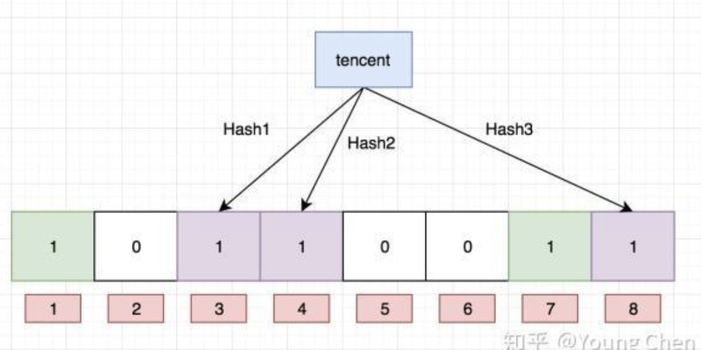
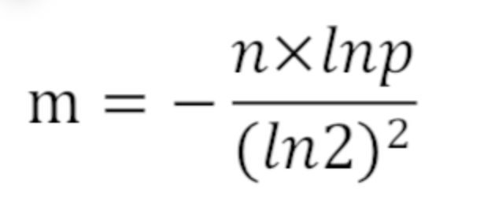
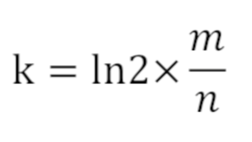
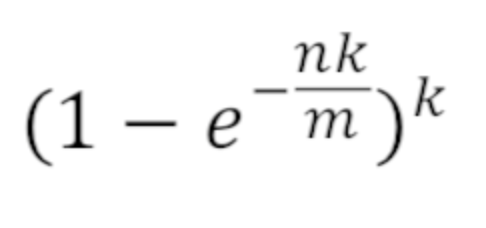

# 哈希表

## 认识哈希函数和哈希表的实现

### 哈希函数

1)输入域 ∞(可以输入任意数量字符)，输出域（输出字符必须有限）必须有限，比如说 md5,sha1
md5 的输出范围是 0-`2的64次幂-1` 假设加密后的 md5 为`49ba59abbe56e057`，每一位都是 16 进制，一共 16 位，`16的16次幂` = `2的64次幂`
sha1 的输出范围是 0-`2的128次幂-1`

2）相同的输入一定有相同的输出值，没有任何随机成分

3）不同的输入也可能是相同的输出值，也称哈希碰撞（由于输入域特别大，输出域小，出现的概率极低）

4）输出值具有均匀性和离散型
解释：假设输入域是一个圆，每次输入一个值，对应园中有一个点，则当输入数量较多后，用一个随机固定大小的小圆圈放到大圆中的任何一个位置，小圆圈中的点的数量都是差距不大的，这就是均匀性和离散性

例：
假设我们有一个文件中有 40 亿个数据，每个数据的大小是 0-`2的32次幂-1`,现在给你 1G 的空间，请问如何找到出现次数最多的数？

我们可以用哈希表进行最多的数查找，key 用来存储数据占用 4B（`2的32次幂`），value 用来存储出现次数占用 4B（最大占用 40 亿个数都一样的），不考虑其他哈希占用空间的影响，所以一个值就是占用 8B，最多可能占用 32G（40 亿\*8B）的内容，会撑爆我们的 1G 空间

解决办法：我们可以利用哈希函数对 4 亿个数据进行处理，然后用 100 取模，分配到 100 个不同的文件中，由于离散性每个文件分配的数量是差不多的（32G/100），由于相同的输入一定有相同的输出，所以相同的数会被分配到同一个文件中，最后根据哈希表找到每个文件的最大值，再根据 100 个文件找出最大值

## 哈希表

哈希表是基于哈希函数实现的
实现原理：任意输入一个字符，根据哈希函数转换为哈希值，假设哈希表中桶的长度是 5，用哈希值用 5 取模，当输入的数量多的时候，根据哈希函数的离散特性，最终每个桶中的链表长度都是近乎相同的，如果想要查询速度近似 O(1),则就要链的长度是常量级别的，所以我们可以假设每个桶的链表长度是固定的， 当链表的数量大于这个固定长度时，对这个桶的数量进行扩展，达到近似 O(1)的效果

哈希表的查询，删除，插入，近似 O(1),但是扩展的消耗近似 O(N\*logN)

题目 1:设计一种结构，该结构有以下三个功能
1.insert(key),将某个 key 加入到该结构中，做到不重复加入
2.delete(key),将原本结构中的 key 删除
3.getRandom(),等概率随机返回结构中的任意一个 key
【要求】insert，delete，getRandom 的时间复杂度为 O(1)

```js
class hashCons {
  constructor() {
    this.map1 = new Map();
    this.map2 = new Map();
    this.size = 0;
  }
  insert(key) {
    if (!this.map1.has(key)) {
      this.map1.set(key, this.size);
      this.map2.set(this.size++, key);
    }
  }
  getRandom() {
    if (this.size == 0) {
      return null;
    }
    const num = parseInt(Math.random() * this.size);
    return this.map2.get(num);
  }
  delete(key) {
    if (this.map1.has(key)) {
      const index = this.map1.get(key);
      //删除key位置的数据
      this.map1.delete(key);
      this.map2.delete(index);
      const lastKey = --this.size;
      const value = this.map2.get(lastKey);
      //迁移最后一位的数据到key位置，保证数据的连续性，这样才能保证getRandom可用
      this.map1.delete(value);
      this.map2.delete(lastKey);
      this.map1.set(value, index);
      this.map2.set(index, value);
    }
  }
}
```

应用二：布隆过滤器
布隆过滤器(BloomFilter)是由一个叫“布隆”的小伙子在 1970 年提出的，它是一个很长的二进制向量，主要用于判断一个元素是否在一个集合中。通过将元素转化成哈希函数再经过一系列的计算，最终得出多个下标，然后在长度为 n 的数组中该下标的值修改为 1。

题：我们有一个 100 亿个 url(假设每个 url64byte)组成的黑名单，我们不希望别人用我们服务的时候可以访问这些 url，常规做法我们使用 hashSet 存储这些 url 数据到内存中,当用户输入一个 url 时，从 hashSet 中进行查找，但是这个 hashSet 的最小空间是 640G（64byte\*100 亿），所以我们至少也要需要十几台 64G 内存的服务器才能实现此需求

如果我们借助布隆过滤器，一台服务器就可以实现此需求，但是需要允许一定的失误率，而且不允许删除某一个 url，只允许加入和查询

失误会有两种：
黑名单误报为白名单(这种失误不会发生)
白名单误报为黑名单（这种失误可能会发生，通过人为设计，可以让其很低）

设计开始：
我们先设计一个 0 ～ m-1 个 bit 的位图，每个位的初始值是 0，我们随机拿一个 url,通过 k 个哈希函数把 url 转换为 k 个哈希值然后用 m 取模，把得到的值的位置置为 1
我们先把 baidu 通过这三个哈希函数取模后放到相应位置

然后我们先把 tencent 再次通过这三个哈希函数取模后放到相应位置

一直把 100 亿个数据放到里面

当我们查找某一个 url 是否在黑名单中，我们对 url 通过三个哈希函数处理后通过对 m 取模，如果得到的三个值都为 1，我们就认为是在黑名单中

所以，根据这种特性我们可以确定黑名单误报为白名单是不可能的，但是白名单误报为黑名单是有可能的
位图向量 m 越长，映射函数越多，误判率越低，所以误判率是由样本量和位图长度决定，如果提前可以确定误判率，也可以反推出来布隆过滤器的长度

而且因为多个数据经过运算后可能会映射到同一个位置，所以布隆过滤器很难做到删除

在存储空间和插入查询的时间复杂度都有巨大优势

假设我们失误率允许为 0.01%
使用样本数量 n 和失误率 p 可以算出 m，公式为：

求得 m = 19.19n，向上取整为 20n。所以 2000 亿 bit，约为 25G。
所使用哈希函数个数 k 可以由以下公式求得：

所以 k = 14，即需要 14 个哈希函数。
通过 m = 20n， k = 14，可以通过以下公式算出设计的布隆过滤器的真实失误率为 0.006%


[示例](https://blog.csdn.net/gaoyueace/article/details/90410735)


## 一致性哈希原理

[一致性哈希原理](./一致性哈希算法.md)