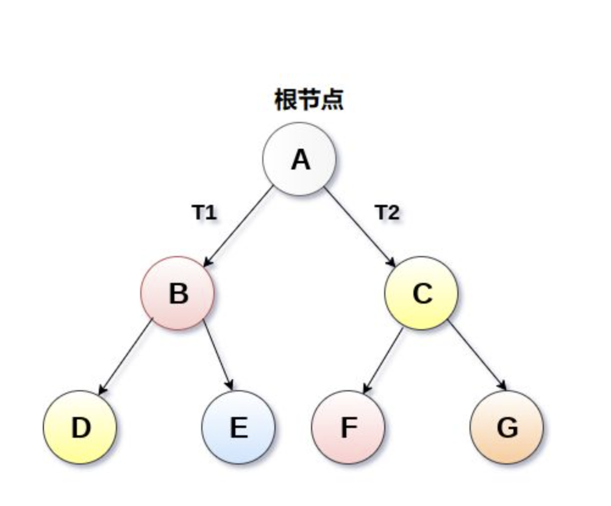
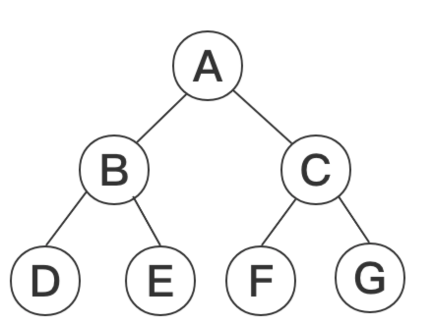
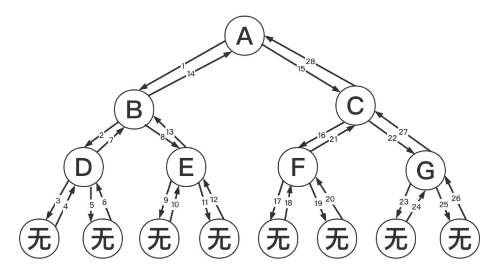

# 二叉树

## 基本概念

结构描述

```ts
class Node{
    value:any,
    left:Node,
    right:Node
}
```

二叉树（Binary tree）是树形结构的一个重要类型，二叉树特点是每个结点最多只能有两棵子树，且有左右之分,形态如下图



## 二叉树的深度优先遍历

- 先序遍历

任何子树的处理顺序都是，先头节点，再左子树，再右子树

- 中序遍历

任何子树的处理顺序都是，先左子树，再头节点，再右子树

- 后序遍历

任何子树的处理顺序都是，先左子树，再右子树，再头节点

exp:


先序遍历（根左右）：A B D H E I C F J K G

中序遍历（左根右） : D H B E I A J F K C G

后序遍历（左右根） : H D I E B J K F G C A

以后(根)序遍历为例，每次都是先遍历树的`左子树`，然后再遍历树的`右子树`，最后再遍历`根节点`，以此类推，直至遍历完整个树。

代码实现

```js
//先序遍历
function pre(node){
    if(node == null){
        return
    }
    console.log(node.value)
    pre(node.left)
    pre(node.right)
}
//中序遍历
function in(node){
   if(node == null){
        return
    }
    in(node.left)
    console.log(node.value)
    in(node.right)
}
//后序遍历
function pos(node){
    if(node == null){
        return
    }
    pos(node.left)
    pos(node.right)
    console.log(node.value)
}
```

## 二叉树的递归序

```js
function pos(node) {
  if (node == null) {
    return;
  }
  // console.log(node.value)放这里是先序遍历
  pos(node.left);
  // console.log(node.value)放这里是中序遍历
  pos(node.right);
  // console.log(node.value) 放这里是后序遍历
}
```

通过上面代码我们发现 console.log 放到不同的位置，就会触发不同的打印结果,假设我们要遍历的二叉树如下图



上述代码运行，递归序列：A B D D D B E E E B A C F F F C G G G C A
递归顺序如下图所示


先序遍历：第一次经过时打印，先序序列：A B D E C F G

中序遍历：第二次经过时打印，中序序列：D B E A F C G

后序遍历：第三次经过时打印，后序序列：D E B F G C A

从上面过程可以发现每个节点都会返回三次

## 非递归方式实现二叉树的先序，中序，后序遍历

任何递归函数都可以改成非递归

通过自己设计压栈（后进先出）来实现

- 先序遍历(头左右)
  1）弹打印
  2）如有右，压入右
  3）如有左，压入左

```ts
function pre(node: Node) {
  if (node == null) return;
  const stack: Node[] = [];
  stack.push(node);
  while (stack.length !== 0) {
    const stackTop = stack.pop();
    console.log(stackTop.value);
    if (stackTop.right) {
      stack.push(node.right);
    }
    if (stackTop.left) {
      stack.push(node.left);
    }
  }
}
```



- 后序遍历

1）弹打印
2）如有左，压入左
3）如有右，压入右

头右左的逆序就是左右头

```ts
function pos(node: Node) {
  if (node == null) return;
  const stack1: Node[] = [];
  const stack2: Node[] = [];
  stack1.push(node);
  while (stack1.length !== 0) {
    const stackTop = stack1.pop();
    stack2.push(stackTop);
    if (stackTop.left) {
      stack1.push(node.left);
    }
    if (stackTop.right) {
      stack1.push(node.right);
    }
  }

  while (stack2.length !== 0) {
    console.log(stack2.pop().value);
  }
}
```

- 中序遍历

1）整个左边界依次进栈
2）左边界无法进站，弹出栈顶打印该节点，在该节点右树继续左边界依次进栈，如果不成立继续执行条件 2

```ts
function in(head:Node){
    if(head==null)return;
    const stack:Node[] = [];
    while(head!=null&&stack.length!=0){
        if(head!=null){
            stack.push(head)
            head = head.left
        }else{
            head = stack.pop();
            console.log(head.value);
            head = head.right;
        }
    }
}
```


## 二叉树的按层遍历（广度优先遍历）

> 用队列实现，可以通过设置 flag 变量的方式，来发现某一层的结束

```ts
function level(node: Node) {
  const queue: Node[] = [];
  queue.push(node);
  while (queue.length > 0) {
    const queueHead = queue.shift();
    console.log(queueHead.value);
    if (queueHead.left) {
      queue.push(queueHead.left);
    }
    if (queueHead.right) {
      queue.push(queueHead.right);
    }
  }
}
```

实例：获取二叉树的最大宽度
使用 Map 方式：

```ts
function getTreeMaxWidth(node: Node) {
  if (node == null) return;
  const queue: Node[] = [];
  queue.push(node);
  const max = 0; //最大宽度
  const curEnd = node; //当前层的最后节点
  const nextEnd = null; //下一层的最后节点
  const curLevelNum = 0; //当前层的数量
  while (queue.length !== 0) {
    const queueHead = queue.shift();
    console.log(queueHead.value);
    if (queueHead.left) {
      queue.push(queueHead.left);
      nextEnd = queueHead.left;
    }
    if (queueHead.right) {
      queue.push(queueHead.right);
      nextEnd = queueHead.right;
    }
    curLevelNum++;
    if (queueHead == curEnd) {
      //如果当前弹出节点是当前的最后节点，代表本层结束
      max = Math.max(max, curLevelNum);
      curEnd = nextEnd;
      curLevelNum = 0;
    }
  }
  return max;
}
```

## 二叉树的序列化和反序列化

1）可以用先序，中序，后序或者按层遍历，实现二叉树的序列化

2）用了什么方式序列化，就要通过什么方式反序列化

> 如果树不全，一定要用 null 进行补全

- 深度优先遍历的序列化

```ts
//先序遍历的实现
function serialize(node: Node) {
  const serial: any[] = [];
  function pre(node) {
    if (node == null) {
      serial.push(null);
    } else {
      serial.push(node.value);
      pre(node.left);
      pre(node.right);
    }
  }
  pre();
  return serial;
}
```

- 深度优先遍历的反序列化

```ts
function deSerialization(serial: any[]) {
  const value = serial.pop();
  if (value == null) {
    return null;
  }
  const head = new Node(value);
  head.left = deSerialization(serial);
  head.right = deSerialization(serial);
  return head;
}
deSerialization(serial);
```

- 广度优先遍历的序列化

```ts
function serialize(node: Node) {
  const serialList: any[] = [];
  const stack: Node[] = [];
  stack.push(node);
  function level(node) {
    while (stack.length > 0) {
      const stackHead = stack.pop();
      if (!stackHead) {
        serialList.push(null);
      } else {
        serialList.push(stackHead.value);
        stack.push(stackHead.left);
        stack.push(stackHead.right);
      }
    }
  }
  pre();
  return serialList;
}
```

- 广度优先遍历的反序列化

```ts
function deSerialize(serialList: any[]) {
  if (serialList == null || serialList.length == 0) return null;

  const head = generateNode(serialList.pop());
  const queue: Node[] = [];
  if (head !== null) {
    queue.add(head);
  }
  let node = null;
  while (queue.length > 0) {
    node = queue.pop();
    node.left =generateNode(serialList.pop());
    node.right = generateNode(serialList.pop());
    if (node.left != null) {
      queue.push(node.left);
    }
    if (node.right != null) {
      queue.push(node.right);
    }
  }
  return head;
}

function generateNode(val:string){
    if(val==null) return null;
    return new Node(val)
}
deSerialize(serialList);
```
