# 第一节

## 常数操作

在计算机中固定时间的操作叫常数操作

常见的常数操作：
算数运算：+ - \* / %
位运算： >> >>> << ^ & |
赋值，自增，自减，比较
数组寻址

非常数操作：链表查找某一位

## 时间复杂度

时间复杂度是衡量一个算法快慢的指标，指的是随着数据量 N 的扩大，算法执行时间的变化曲线

判断时间复杂度时一定要精确到常数操作才可以，再讨论时我们常常忽略常数项和低次幂项

## 选泡插排序

复杂度都为 O(n^2)
用两个数实现交换

```js
function swap(arr, i, j) {
  arr[i] = arr[i] ^ arr[j];
  arr[j] = arr[i] ^ arr[j];
  arr[i] = arr[i] ^ arr[j];
}
```

上面这种写法不能用于 i 和 j 的下标相同的情况，如果相同，则指向同一块内存区域，会被刷成 0
上面的写法在底层语言中是非常常见的，但是在上层语言中不一定要比直接赋值要快

## 额外空间复杂度

实现该算法所用的额外的空间

例如： 1.计算数组中出现最多的数字
由于最终结果是返回一个数字，一般我们用 Map 的方式来做，遍历数组，存入 Map 和数量，其中 Map 就是额外要开辟的空间，我们用最差的情况，就是里面没有重复的数字，所以复杂度是 O(n)

2.写一个函数，传入一个数组，返回这个数组的拷贝

```js
function copy(arr) {
  let copyArr = [];
  for (let i = 0; i < arr.length; i++) {
    copyArr[i] = arr[i];
  }
  return copyArr;
}
```

由于算法要实现的功能就是返回数组的拷贝，copyArr 不属于额外的空间，所以空间复杂度是 O(1)

## 常数项 pk

当两个复杂度相同的算法进行比较时，就可以拼常数项的操作

如何拼？
放弃理论分析，生成随机数直接测试
为何放弃理论，因为有些常数项操作的时间是不好估计的，比如过异或操作的时间肯定要比加法操作的快，加法操作的常数时间肯定要比除法的常数时间快

## 最优解

最优解就是在实现功能让我们算法的时间复杂度尽量的低，在满足足够低的时间复杂度的基础上再让我们的空间复杂度尽可能的低，最优解是通常不包括常数操作

## 常见时间复杂度排名

O(1)>O(logN)>O(N)>O(NlogN)>O(N^2)>O(2^N)>O(N!)

## 算法和数据结构的大脉络

- 知道怎么算的算法
- 知道怎么试的算法

## 对数器

如何写对数器

## 二分法

二分法，在有序数组中找到 num
docs/pages/算法/技巧/二分法/二分法.js

有序数组中找到>=num 最左侧位置

有序数组中找到<=num 最右侧位置

# 第二节

## 异或

异或就是无尽位相加

0^N = N
N^N = 0
a^b = b^a //满足交换律
(a^b)^c = a^(b^c) //满足结合律

题目： 1.如何不用额外变量交换两个数？

```js
//a和b的值可以一样，但是必须要是两个独立的内存区域，如果指向同一个内存区域，会让该内存区域中的值变为0，以后怎么操作都是0
function swap(a, b) {
  a = a ^ b;
  b = a ^ b;
  a = a ^ b;
}
```

2.一个数组中有一个数出现了基数次，其他数都出现了偶数次，怎么找到并打印这个数

```js
const arr = [1, 1, 1, 1, 5, 5, 7, 7, 9, 10, 10];
function findOddNum(arr) {
  let num = 0;
  arr.map((item) => (num = num ^ item));
  return num;
}
console.log(findOddNum(arr));
```

3.怎么把一个 int 类型的树，提取出最右侧的 1 来

4.一个数组中有两种数出现了基数次，其他数都出现了偶数次，怎么找到这两种数

5.一个数组中有一种数出现了 k 次，其他数都出现了 m 次，m>1,m>k，要求空间复杂度 O(1),时间复杂度 O(n)

# 第三节

## 单向链表

所有的结构在内存中就两种表现形式，紧密结构和跳转结构，数组属于紧密结构，可以很快的寻址，链表就属于跳转结构

单链表结构：

```ts
class Node {
  value: any;
  next: Node;
  construction(value) {
    this.value = value;
  }
}
```

双链表结构：

```ts
class DoubleNode {
  value: any;
  last: Node;
  next: Node;
  construction(value) {
    this.value = value;
  }
}
```

练习（与链表相关的问题基本上都是 coding 问题）：

1.单链表和双链表的反转

2.在单链表中把给定的值删除

## 队列和栈

栈：后进先出，好似弹夹
队列：先进先出，好似排队

题： 1.用数组实现栈和队列 2.用双向链表实现栈和队列 3.如何只用栈结构实现队列结构
用两个栈来实现（push 栈和 pop 栈），来回倒腾数据 4.如何只用队列结构实现栈结构

## 理解递归

执行上下文环境和执行栈

## master 公式

master 公式用来分析递归函数的复杂度

对于子问题规模一致的递归函数可以用 T(N) = a * T(N/b) +O(N^d)来表示，其中 abd 都是常数，最终可用 master 公式来计算其复杂度
如果 log(b,a) < d 复杂度为 O(N^d)
如果 log(b,a) > d 复杂度为 O(N^log(b,a))
如果 log(b,a) = d 复杂度为 O(N^d*logN)

## 哈希表和有序表

哈希表的增删改查的复杂度都是 O(1)，只是复杂度常数很大而已

有序表（key,value）的增删改查的复杂度都是 O(logN),虽然复杂度要比哈希表要大，但是有了一些排序，可以查最小最大的索引，有序表默认只能排序基本类型，如果是自定义类型的数需要写构造函数，有序表排序后不会保存相同的 key 值，只会保留第一次加入的值

# 第五节

## 归并排序

递归版本 和 非递归版本
用 master 公式计算递归版本的复杂度为 T(N) = 2\*T(N/2) +O(1) 所以复杂度为 O(NlogN)

面试题： 1.小和问题：给定一个数组，求每个索引前面比他小的数的累加和的所有索引的累加和 2.逆序对:在一个数组中，假设左边的数和右边的数是降序关系则称为逆序对，求一个数组中有多少逆序对 3.大于两倍:在一个数组中，如果数组中某个索引的数大于其右边某个数的二倍称为两倍数，求数组中有多少个两倍数 4.给定一个数组 arr 和两个整数 lower，upper，返回数组 arr 中有多少个子数组累加和在`[lower,upper]`之间

# 第六节

## 快速排序

### 荷兰国旗问题

版本 1:在数组中给定一个数 x，要求小于等于 x 的数放在左边，大于 x 的数放在右边
版本 2:在数组中给定一个数 x,要求小于 x 的数放在左边，等于 x 的数放中间，大于 x 的数放在右边

### 快速排序

版本 1:在数组以最后一个数作为 x,要求小于 x 的数放在左边，等于 x 的数放中间，大于 x 的数放在右边，然后选取小于 x 的数和大于 x 的数继续做这件事情
复杂度 O(N^2) 例如`[1,2,3,4,5,6,7]` 最大的数永远在后面，要和前面每一个数做对比

版本 2:在每次 process 中，首部添加 swap(arr,L+Math.floor(Math.random()_(R-L+1)),R)，随机选出一个位置，放到最右边作为 x，版本 1 的划分池打到了边上，非常偏，如果我们的划分池打的很正可以形成`T(N) = O(N)+2_(N/2)`也就是 O(NLogN),所以科学家计算出的复杂度是趋于 O(NLogN)

快速排序的非递归版本

## 第 7 节

### 比较器

比较器可以传入一个函数,自动比较，不用写排序  
比较器接受两个参数 a,b  
如果返回一个负数 第一个参数在前
如果返回值一个正数 第二个参数在前
如果等于 0 不变

### 堆

1. 堆结构就是用数组实现的完全二叉树（每一层都是满的，或者最后一层是在满的路上）
   从 0 开始的一段连续的数组可以认为（臆想）是完全二叉树  
   数组形成的完全二叉树规律：  
    对任意一个位置 i,其 左孩子是 `2*i+1` 右孩子：`2*i+2` 父节点： `(i-1)/2`

我们可以用一个变量 heapSize 来臆想有多少个数已经可以是堆结构

2. 堆分为大根堆和小根堆
   大根堆：在完全二叉树中，每棵子树的最大值都在顶部
   小根堆：在完全二叉树中，每棵子树的最小值都在顶部

题：给你一个随机生成一个数字的方法，实现一个大根堆
题：在上题基础上拿出大根堆中的最大值，然后保证剩余的数依旧是一个大根堆

4. 堆结构的 HeapInsert 与 Heapify 操作
   HeapInsert 和 Heapify 的复杂度都为 O(LogN)
   > 如何估算变化的复杂度，比如说 HeapInsert，第一次插入是 log1,第二次插入是 log2...第 N 次插入的复杂度是 logN
   > 所以 HeapInsert 的复杂度应该是 log1+log2+...+logN 而不是 N\*logN
   > 我们可以用数据量增加常数法
   > 当数据量为 N 时，最大复杂度为 NLogN,当数据量为 2N 时最小的复杂度时 NLogN 所以最终的复杂度是 NLogN

如果要排序，数组一次性都给完，我们可以让 HeapInsert 趋于 O(N)

```

```

5. 堆的增大与减少
6. 优先级队列结构就是堆结构

堆排序

#### 手写堆

1. 最大线段重合问题
   给定多条线段，每格线段都有两个数组[start,end],表示线段的开始和结束位置，左右都是闭区间
   规定：
   线段开始和结束一定都是整数值
   线段重合区域长度必须>=1
   返回线段重合最多重合区域中，包含几条线段

# 树

递归树

# 第十四节

## 贪心算法

### 贪心算法求解的标准过程

1. 分析业务
2. 根据业务逻辑找到不同的贪心策略
3. 对于能举出反例的策略直接跳过，不能举出反例的策略要证明有效性，这往往是特别困难的，要求数学能力很高且不具有统一的技巧性

### 贪心算法的解题套路

1. 实现一个不依靠贪心策略的解法 X,可以用最暴力的尝试
2. 脑补出贪心策略 A，贪心策略 B，贪心策略 C...
3. 用解法 X 和对数器，用实验的方式得知哪个贪心策略正确
4. 不要去纠结贪心策略的证明

# 第八节

## 经验：通过给定运行时间反推要实现的复杂度是否可以通过笔试

在刷题的过程中，一般 java 的给定时间是 2-4 秒，对应的指令条数为 10^8-10^9 范围内，如果给定的数据长度，比如说数组是 10^3,我们就可以反推出来实现 O(N^5)（3+5<=8）范围内的算法便可以通过笔试

## 堆练习

题目一：

一些项目要占用一个会议室宣讲，会议室不能同时容纳两个项目的宣讲。
给你每一个项目开始的时间和结束的时间
你来安排宣讲的日程，要求会议室进行的宣讲的场次最多。
返回最多的宣讲场次。

### 改写堆

一般系统提供的堆，不会提供反向索引，所以当某一个堆中的值改变的时候，我们无法对堆进行重新的排序，

1. 实现加强堆
2. 给定一个整形数组，int[] arr,和一个 boolean 形数组 bool[] op,两个数组一定等长，假设长度为 N，arr[i]表示客户编号，op[i]表示客户操作
   arr =[3,3,1,2,1,2,5...]
   op =[T,T,T,T,F,T,F...]
   依次表示 3 用户买了一件商品，3 用户买了一件商品，1 用户买了一件商品，2 用户买了一件商品，1 用户退货一件商品，2 用户买了一件商品，5 用户退货一件商品...
   一对 arr[i]和 op[i]就代表一个事件
   用户号为 ar[i],op[i]==T 就代表这个用户购买了一件商品
   op[i]==F 就代表这个用户退货了一件商品
   现在你作为电商平台负责人，你想在每一个事件到来的时候，都给购买次数最多的前 K 名用户颁奖所以每个事件发生后，你都需要一个得奖名单（得奖区）。

得奖系统的规则：
1,如果某个用户购买商品数为 0，但是又发生了退货事件，则认为该事件无效，得奖名单和之前事件时一致，比如例子中的 5 用户
2,某用户发生购买商品事件，购买商品数+1，发生退货事件，购买商品数-1
3,每次都是最多 K 个用户得奖，K 也为传入的参数
如果根据全部规则，得奖人数确实不够 K 个，那就以不够的情况输出结果
4,得奖系统分为得奖区和候选区，任何用户只要购买数>0，一定在这两个区域中的一个
5,购买数最大的前 K 名用户进入得奖区，在最初时如果得奖区没有到达 K 个用户，那么新来的用户直接进入得奖区
6,如果购买数不足以进入得奖区的用户，进入候选区
7,如果候选区购买数最多的用户，已经足以进入得奖区，
该用户就会替换得奖区中购买数最少的用户（大于才能替换）
如果得奖区中购买数最少的用户有多个，就替换最早进入得奖区的用户
如果候选区中购买数最多的用户有多个，机会会给最早进入候选区的用户
8,候选区和得奖区是两套时间
因用户只会在其中一个区域，所以只会有一个区域的时间，另一个没有
从得奖区出来进入候选区的用户，得奖区时间删除进入候选区的时间就是当前事件的时间（可以理解为 arr[i]和 op[i]中的 i)
从候选区出来进入得奖区的用户，候选区时间删除进入得奖区的时间就是当前事件的时间（可以理解为 arr[i]和 op[i]的 i)
9,如果某用户购买数==0，不管在哪个区域都离开，区域时间删除,离开是指彻底离开，哪个区域也不会找到该用户,如果下次该用户又发生购买行为，产生>0 的购买数,会再次根据之前规则回到某个区域中，进入区域的时间重记

# 第九节

## 前缀树

前缀树又名字典树，单词查找树，Trie 树，是一种多路树形结构，是哈希树的变种，和 hash 效率有一拼，是一种用于快速检索的多叉树结构。

典型应用是用于统计和排序大量的字符串（但不仅限于字符串），所以经常被搜索引擎系统用于文本词频统计。它的优点是：最大限度地减少无谓的字符串比较，查询效率比哈希表高。

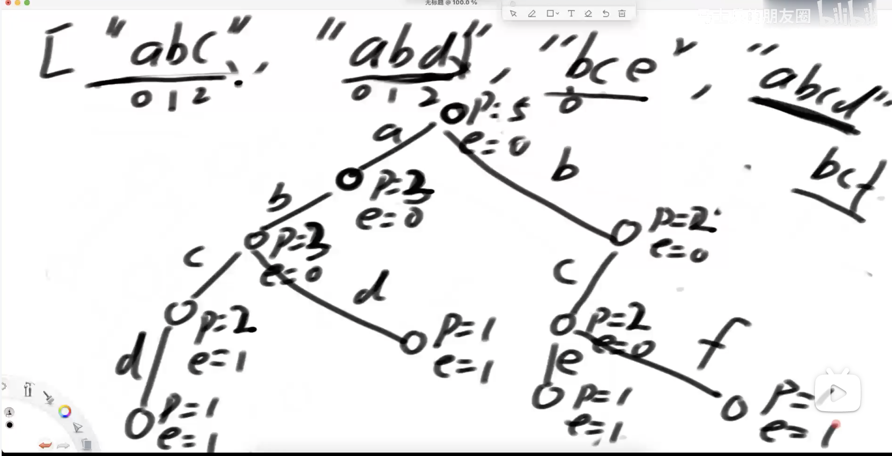

前缀树功能：
查找某个字符串出现几次，查询以某个字符串前缀
前缀树和哈希表的比较：

哈希表忽略掉单样本大小的情况下复杂度是 O(1),如果哈希表要加入一个很长的字符串，要先把所有的字符都遍历一遍，算出哈希值，这个过程是 O(字符串长度)，如果把字符串数组放到 hash 表中，复杂度是 O(M),M 为所有字符串的总长度

前缀树的复杂度是 O(M),M 为所有字符串的总长度

前缀树和哈希表，两者查询的复杂度都是 O(K),K 为查询的长度

前缀树的实现

## 桶排序

- 基于比较的排序：选泡插，快排，归并，堆,最快能到 O(NlogN)
- 不基于比较的排序：以桶排序为主，不基于比较的排序都是受限制的，最快能到 O(N)

### 计数排序

- 题目： 按照年龄进行排序

### 基数排序（一般是非负的能表达为十进制的数）

步骤：

1. 找最大位，其余不够补 0
2. 准备 10 个桶，编号 0-9，先按照个位数大小进桶，按顺序倒出，再按照十位进桶。按循序倒出...

> 基数排序不用桶版本，对于个位，先准备一个桶 0-9，记录每位出现的次数，在准备一个桶，算第一个桶的累加和，准备一个和原始数组相同长度的数组，原始数组从右向左遍历，第二个桶的每个累加位即为在新数组中的位置

## 排序算法稳定形

定义：同样的值在排序前后相对次序是否改变
稳定性对基本类型的排序基本无用，主要是针对引用类型（比如物品先按照价格排序，再次根据好评度排序）

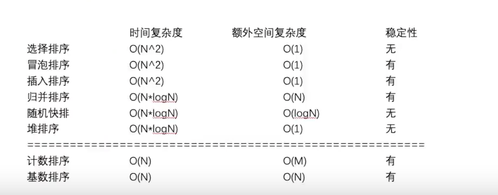

### 总结

1)不基于比较的排序，对样本数据有严格要求，不易改写  
2)基于比较的排序，只要规定好两个样本怎么比大小就可以直接复用  
3)基于比较的排序，时间复杂度的极限是 ON*QgN)  
4)时间复杂度 ON*ogN)、额外空间复杂度低于 O(N)、且稳定的基于比较的排序是不存在的。  
5)归并和快排，堆的时间复杂度都是 O(N\*logN),但是常数项最小的是快排，为了绝对的速度选快排、为了省空间选堆排、为了稳定性选归并

### 工程上对排序的改进

1.对稳定性的考虑

在 Java 中，内部的 sort 方法，如果是基础类型内部使用快排实现，非基础类型，使用归并实现，就是考虑稳定性

2.充分利用 O(N\*logN)和 O(N^2)各自的优势

v8 是 Chrome 的 JavaScript 引擎，其中关于数组的排序完全采用了 JavaScript 实现。排序采用的算法跟数组的长度有关，当数组长度小于等于 10 时，采用插入排序，大于 10 的时候，采用快速排序。
虽然插入排序的时间复杂度要大于快排，但是插入排序的常数项小，所以 N 比较小的时候，插入实际运行时间比较快

# 第十节

## 链表问题（链表大部分是考你的边界处理能力）

### 快慢指针

1)输入链表头节点，奇数长度返回中点，偶数长度返回上中点 2)输入链表头节点，奇数长度返回中点，偶数长度返回下中点 3)输入链表头节点，奇数长度返回中点前一个，偶数长度返回上中点前一个 4)输入链表头节点，奇数长度返回中点前一个，偶数长度返回下中点前一个

### 面试时链表解题的方法论

1)对于笔试，不用太在乎空间复杂度，一切为了时间复杂度 2)对于面试，时间复杂度依然放在第一位，但是一定要找到空间最省的方法

常见面试题

1. 划分单链表，将单向链表按某值划分成左边小、中间相等、右边大的形式

   1)把链表放入数组里，在数组上做 partition(笔试用)  
   2)分成小、中、大三部分，再把各个部分之间串起来（面试用）

2. 拷贝特殊链表，一种特殊的单链表节点类描述如下

   ```
   class Node{
       int value;
       Node next;
       Node rand;
       Node(int val){value val};
   }
   ```
   rand 指针是单链表节点结构中新增的指针，rand 可能指向链表中的任意一个节点，也可能指向 null。
   给定一个由 Node 节点类型组成的无环单链表的头节点 head,请实现一个函数完成这个链表的复制，并返回复制的新链表的头节点。
   【要求】时间复杂度 O(N),额外空间复杂度 O(1)

3. 一个链表。如果有环，返还第一个入环节点。否则返回空
   解答：不用容器方法，如果有环，用快慢指针一定会在环内相遇，在相遇后快指针回到起点一次走一步，慢指针从当前位置一次走一步，必在环相交的地方相遇
4. 给定两个可能有环也可能无环的单链表，头节点 head1 和 head2。
   请实现一个函数，如果两个链表相交，请返回相交的第一个节点。如果不相交，返回 null
   【要求】如果两个链表长度之和为 N,时间复杂度请达到 ON),额外空间复杂度请达到 0(1)。


...未来补上


# 第十六节

## 并查集
如果有N个样本，分别放在自己的集合中，要实现以下两个非常的频繁操作：  
1.返回一个boolean值来查询两个集合是否在一个样本中--isSameSet(a,e)  
2.union(a,e)--a所在的全体和e所在的全体合并成一个集合  
如果以上两个操作均摊下来，如何做到单次的时间复杂度时O(1)  

假设：如果我们使用数组结构或者哈希结构，当我们实现union方法的时候需要把某一个集合中的数据全部放到另外一个集合中，无法做到O(1)  

引入并查集实现：  
假设有a,b,c,d,e,f几个样本，让每个样本都指向自己，这样的节点叫代表节点  
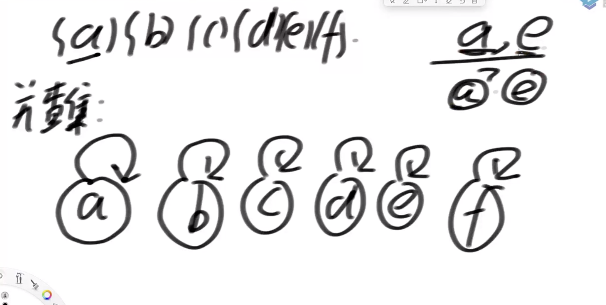  
当我们要把union(a,e)两个节点的时候，把短的链代表节点直接指向长的代表节点，这样在查询的时候就会知道a和e的代表节点都是a，属于同一个集合  
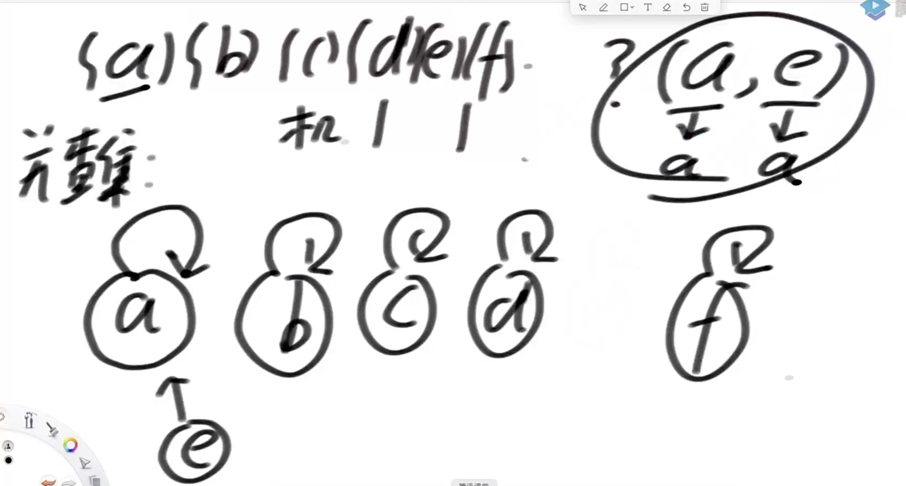


要实现isSameSet 和 union 都是O(1),必须要有两个优化：  
1.小的链挂到大的链上面  
2.在查找代表节点的时候把整条链变扁平，直接挂到代表节点下，这样虽然痛苦一次，但是整体下来可以做到O(1)  


并查集代码实现：  
```js
1.用Map实现
//用户传入list  
//我们需要node->listItem的对应Map  
//需要每个节点指向父亲节点的Map  
//需要每个链的对应的长度Map  

2.用数组实现（更快）
parent[] parent[i]=k  i的父亲节点是k
size[]  size[i] = k 如果i是代表节点，size[i]为代表节点的长度，否则无意义
help[] //辅助数组，用来扁平化使用
```


练习：
1.  求省份数量，有 n 个城市，其中一些彼此相连，另一些没有相连。如果城市 a 与城市 b 直接相连，且城市 b 与城市 c 直接相连，那么城市 a 与城市 c 间接相连。省份 是一组直接或间接相连的城市，组内不含其他没有相连的城市。
https://leetcode-cn.com/problems/number-of-provinces/（547题）
2. 岛屿数量,给你一个由 '1'（陆地）和 '0'（水）组成的的二维网格，请你计算网格中岛屿的数量。岛屿总是被水包围，并且每座岛屿只能由水平方向和/或竖直方向上相邻的陆地连接形成。此外，你可以假设该网格的四条边均被水包围

可以用三种方式解答：
(1) 感染方式，找到1，把上下左右的位置都感染成2
(2) 正常的并查集方式
(3) 二维数组变成一维数组的并查集方式 i,j位置对应一维数组中的`i*列+j`位置

3. 岛屿数量，一次给定一个数，求岛屿数量

4. `并查集可以很好的解决连通性的问题`，假设还是岛屿问题，用两个cpu处理，一分为二，问最后有几个岛屿，如下图  
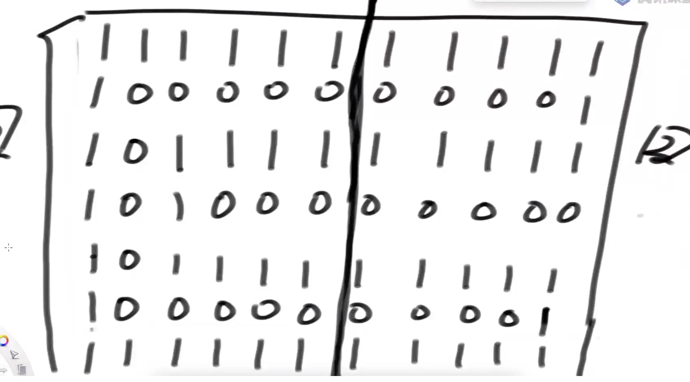  
我们可以记录每个边界节点数据哪个集合
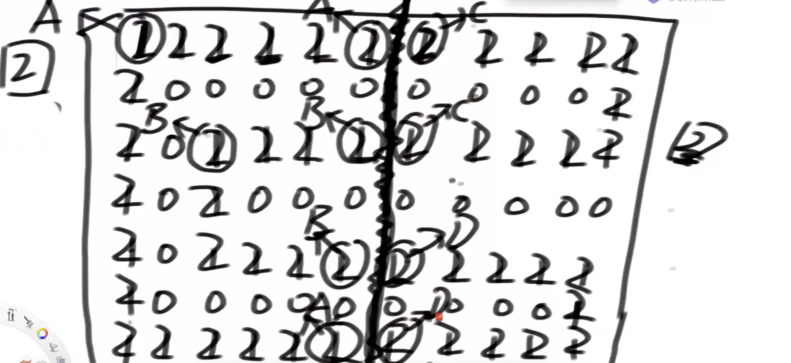  
最终A,B,C,D 通过并查集求得是一个点


# 第十七节

## 图

有向图：有方向的图
无向图（可以认为是两个节点双向的有向图）

### 图的表示方法

#### 临街表法
<!--    -->
#### 临界矩阵法
<!--    -->

> 面试上对图的表达方式可能有很多，我们可以抽象出自己熟悉的图结构，把其他类型表示的图结构转换为我们自己熟悉的图结构节行解答

图表示
```ts
//点
class Node{
  value=null;  //值
  in=0; //指向该点的个数
  out=0;  //该点指出的个数
  nexts:Node[]=[]; //该点的指向的邻居节点
  edges:Edge[]=[]; //该点指向的线关系
}
//线
class Edge{
  weight=0; //权重
  form:Node=null; //来自节点
  to:Node=null;//指向节点
}
//图结构
class Graph{
  nodes:HashMap<Number,Node>; //值和对应节点的对应关系，用于区分相同的值
  edges:HashSet<Edge>;
}

```


#### 图的宽度优先遍历和深度优先遍历

##### 宽度优先遍历
1.利用队列实现
2.从源节点开始依次按照宽度进队列，然后弹出
3.每弹出一个点，便把没有进过队列的邻接点进入队列（一般加入set结构来判断是否是已经加入过队列中）
4.直到队列变空

##### 深度优先遍历（选择一个邻接节点，往下找，一直找到最后一个点，不可重复，找到后往回找，再次深入）
1.利用栈实现
2.从源节点开始把节点按照深度放入栈中，然后弹出
3.每弹出一个点，把该点的下一个没有进入过栈中的邻接点放入栈
4.直到栈变空

##### 图拓扑结构

工程上的应用：
依赖包：假设包A依赖B,C,D 包B依赖C,D  包C依赖D 包D依赖E,F,则编译打包的顺序为

1.E,F->D
2.D->C
3.C,D->B
4,B,C,D->A

根据先后顺序可以依次把工作做完而且不缺依赖的一个顺序，就是拓扑顺（有向无环图）


图的拓扑排序算法：
1.在图中找到所有入度为0的点输出
2.把所有入度为0的点在图中删除，继续找入度为0的点，周而复始
3.图中所有点都被删除后，依次输入的顺序就是拓扑排序


假设拓扑结构如下：  
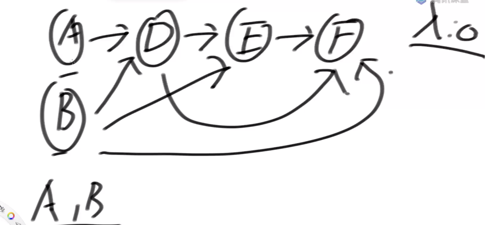 
答案：ABDEF 和BADEF 都是正确的


##### 最小生成树（无向图） Kruskal 算法

最小生成树是指在不影响所有点都连通的情况下，所有边的权重加起来最小值是多少  
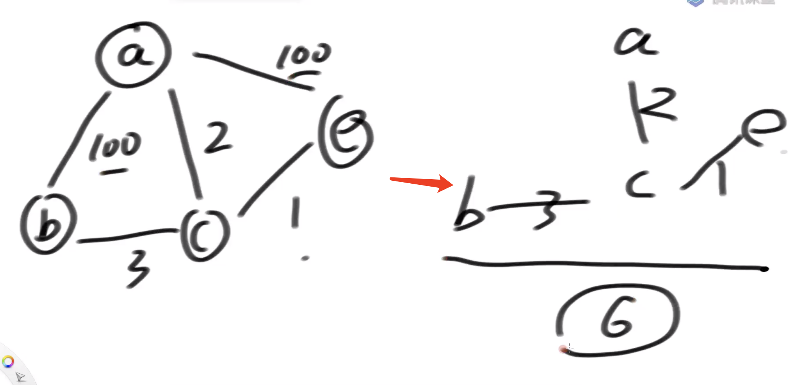 
上图的最小值是6

解答过程：

1)总是从权值最小的边开始考虑，依次考察权值依次变大的边
2)当前的边要么进入最小生成树的集合，要么丢弃
3)如果当前的边进入最小生成树的集合中不会形成环，就要当前边
4)如果当前的边进入最小生成树的集合中会形成环，就不要当前边
5)考察完所有边之后，最小生成树的集合也得到了

>通过小根堆，每次弹出权重最小的边
>通过并查集，如果两个点都在并查集中，必定会生成环

##### 最小生成树（无向图） Prim 算法

1)可以从任意节点出发来寻找最小生成树
2)某个点加入到被选取的点中后，解锁这个点出发的所有新的边，加入小跟堆
3)在所有解锁的边中选最小的边，然后看看这个边会不会形成环
4)如果会，不要当前边，继续考察剩下解锁的边中最小的边，重复3)
5)如果不会，要当前边，将该边的指向点加入到被选取的点中，重复2)
6)当所有点都被选取，最小生成树就得到了

>通过小根堆，每次弹出权重最小的边
>通过setMap，如果两个点都在setMap中，必定会生成环

当点特别多的时候用P算法 


##### 迪杰特斯拉算法
Dijkstra 算法，用于对有权图进行搜索，找出图中两点的最短距离

假设求从a到e的最短路径

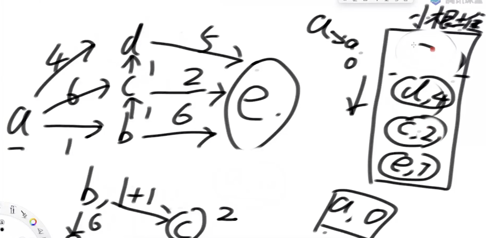 

求结过程:
假设求从a到e的最短路径，我们需要找到所有从a出发所有的点的路径距离distanceMap,再找到我们需要的a,x点
用加强堆实现
先把（a,0）加入加强堆中，弹出堆最小的值，也就是a
然后把a的最小路径next(b,0+1)(c,0+6)(d,0+4)放入加强堆中，弹出最小值(b,0+1)
然后把从b的最小路径next(e,1+6)放入加强堆，并且修改(c,1+1)
周而复始，直到加强堆中无数据


# 第十八节 暴力递归（需要一些宏观的认识）

暴力递归就是尝试
1.把问题转换为规模缩小的同类子问题
2.有明确的不需要继续进行递归的条件（base case）
3.有当得到了子问题结果之后的决策过程
4.不记录每一个子问题的解

熟悉什么叫尝试

1. 打印n层汉诺塔从最左边移动到最右边的全部过程
两种解答方式：
 方式1:递归6种， 左->右  左->中 中->左 中-右 右->中 右->左
 方式2:6合并1版本， 从from to other

复杂度：O(2^N-1) 
2. 打印一个字符串的全部子序列
例如123
打印结果为["","1","2","3","12","13","23","123"]

3. 打印一个字符串的全部子序列，要求不要出现重复字面值的子序列
题目2用setMap格式存储，会自动去重

4. 打印一个字符串的全部排列
比如“abcd”全排列，0位置在4个字符中选一个，1位置在剩余的三个位置选一个，2位置在剩余的两个位置选一个，3位置为最后剩余的一个
两种实现方式：
- 数组移除项实现
- 自身交换实现

5. 打印一个字符串的全部排列，要求不要出现重复的排列
> 剪枝策略要比set过滤快

6. 给你一个栈，请你逆序这个栈，不能申领额外的数据结构，只能使用递归函数，如何实现


#### 动态规划
动态规划就是如果发现有重复调用的过程，动态规划在算过一次之后把答案记下来，下次再遇到的时候直接拿之前的答案，是一种空间换时间的策略

>动态规划一定要学会尝试

练习：
1. 尝试斐波那契数列普通法和加缓存法（加缓存办法的时间复杂度是O(N)）

2. 假设有排成一行的N个位置，记为1~N,N一定大于或等于2，开始时机器人在其中的M位置上(M一定是1~N中的一个)，如果机器人来到1位置，那么下一步只能往右来到2位置；如果机器人来到N位置，那么下一步只能往左来到N-1位置；如果机器人来到中间位置，那么下一步可以往左走或者往右走；规定机器人必须走K步，最终能来到P位置(P也是1~N中的一个)的方法有多少种给定四个参数N、M、K、P,返回方法数。

  方案1: 普通的暴力递归
  方案2: 用一个Arr[][] 记录重复次数
  方案3: 动态规划
  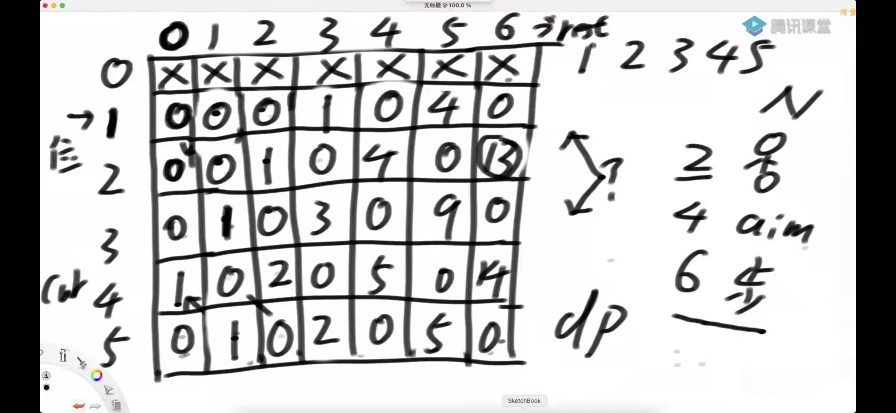 

3. 给定一个整型数组arr,代表数值不同的纸牌排成一条线,玩家A和玩家B依次拿走每张纸牌,规定玩家A先拿，玩家B后拿,但是每个玩家每次只能拿走最左或最右的纸牌,玩家A和玩家B都绝顶聪明, 请返回最后获胜者的分数。


4. 背包问题，给你一个数组W:number[] 和 V:number[],长度都是N,在W和N的第i项表示重量为 W[i] 的货物价值为 V[i] ,假设我的背包可以接受的重量为Bag:number,你可以自由挑选货物放到背包中，但是不能超过背包的可承受重量，返回背包的最大价值

5. 规定1和A对应、2和B对应、3和C对应.那么一个数字字符串比如"111”就可以转化为："AAA"、"KA"和"AK"；给定一个只有数字字符组成的字符串sr,返回有多少种转化结果

6. 给定一个字符串str,给定一个字符串类型的数组r,出现的字符都是小写英文，arr每一个字符串，代表一张贴纸，你可以把单个字符剪开使用，目的是拼出str来,返回需要至少多少张贴纸可以完成这个任务。
  例子：str="babac",arr="ba","c","abcd"}
  至少需要两张贴纸"ba"和"abcd",因为使用这两张贴纸，把每一个字符单独剪开，含
  有2个a、2个b、1个c。是可以拼出str的。所以返回2。

  解题方法：
  - 暴力解：每个贴纸依次递归，找到最小
  - 剪枝解：找包含第一个str值的数进行递归
  - 存储剪枝解：使用一个map存储已经求过的解（str="aabcd" 贴纸["aa","aaa","bcd"],当用“aa”和“aaa”剪枝后得到的最优解都是一样的）


7. 求两个字符串的最长公共子序列

8. 给定一个字符串sr,返回这个字符串的最长回文子序列长度，比如：str=“a12b3c43def2ghi1kpm"，最长回文子序列是“1234321”或者“123c321”,返回长度7

> 字符串的逆序和该字符串的最长公共子序列就是最长回文序列

9. 请同学们自行搜索或者想象一个象棋的棋盘，然后把整个棋盘放入第一象限，棋盘的最左下角是(0,0)位置,那么整个棋盘就是横坐标上9条线、纵坐标上10条线的区域,给你三个参数x,y,k,返回“马”从(0,0)位置出发，必须走k步,最后落在（x,y)上的方法数有多少种？

10. *(业务限制模型)给定一个数组arr,arr[i]代表第i号咖啡机泡一杯咖啡的时间,给定一个正数N,表示N个人等着咖啡机泡咖啡，每台咖啡机只能轮流泡咖啡,只有一台咖啡机，一次只能洗一个杯子，时间耗费a,洗完才能洗下一杯,每个咖啡杯也可以自己挥发干净，时间耗费b,咖啡杯可以并行挥发,假设所有人拿到咖啡之后立刻喝干净,返回从开始等到所有咖啡机变干净的最短时间,三个参数：int[] arr、int N,int a、int b

  分析：使用小根堆实现N个人最短时间可以喝到咖啡问题，用两个字段决定{咖啡机什么时候可以在用+泡一杯咖啡需要多久}

>业务限制模型：你设计的可变参数无法直观的得到变化范围


动态规划模型：
1.从左到右模型：某个位置有两种可能（可以选，也可以不选），算rest
2.范围模型（【L...R】）
3.样本对应模型
4.业务限制模型 


# 第二十一节 动态规划的数组压缩技巧

1. 给定一个二维数组matrⅸ，一个人必须从左上角出发，最后到达右下角，沿途只可以向下或者向右走，沿途的数字都累加就是距离累加和，返回最小距离累加和

  解法：普通的dp[N][M]就可以，每一个位置依赖左侧位置和上侧位置，由于dp太大，我们可以利用省空间的做法，利用两个数组A[] ,B[], A代表第一行，B根据第一行的信息算第二行，A清空，然后根据B第二行信息算第三行，依次可省大量空间，也可以利用一个数组进行实现自我更新

2. arr是货币数组，其中的值都是正数。再给定一个正数aim。每个值都认为是一张货币，即便是值相同的货币也认为每一张都是不同的，返回组成aim的方法数
  例如：arr={1,1,1},aim=2
  第0个和第1个能组成2，第1个和第2个能组成2，第0个和第2个能组成2
  一共就3种方法，所以返回3
  
  解法：正常的从左往右模型

3. arr是面值数组，其中的值都是正数且没有重复。再给定一个正数aim。每个值都认为是一种面值，且认为张数是无限的。返回组成aim的方法数
  例如：arr={1,2},aim=4
  方法如下：1+1+1+1、1+1+2、2+2
  一共就3种方法，所以返回3

  解法：每一个index位置进行循环，最大不超过rest的从左往右模型
  1》暴力 2》动态规划 3》去除依赖枚举动态规划
   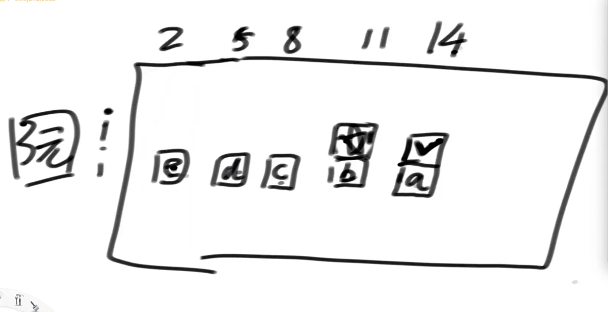 
   假设第14行i列,面值是3元，也就是对号位置，依赖枚举位置为a,b,c,d,e，则星号位置就依赖b,c,d,e；由于我们建立好了空间感，就可以优化用a+星号去除枚举行为

4. arr是货币数组，其中的值都是正数。再给定一个正数aim。每个值都认为是一张货币，认为值相同的货币没有任何不同，返回组成aim的方法数
  例如：arr={1,2,1,1,2,1,2},aim=4
  方法：1+1+1+1、1+1+2、2+2
  一共就3种方法，所以返回3
>动态规划：记忆化搜索-》在暴力递归过程中，算过的直接保存，下次用到时候从表中直接拿，没有严格的依赖关系
>动态规划：严格表格式-》严格的整理好每个点的依赖关系，从表的简单位置填到复杂位置，比记忆化搜索进一步的梳理了依赖的关系，进而求出所有表的过程


5. 给定5个参数，N,M,row,col,k，表示在N * M的区域上，醉汉Bob初始在(row,col)位置，Bob一共要迈出k步，且每步都会等概率向上下左右四个方向走一个单位，任何时候Bob只要离开N * M的区域，就直接死亡，返回k步之后，Bob还在N*M的区域的概率

>复杂度：如果没有枚举行为（for循环类），记忆化搜索和严格表结构同样的好
>如果有枚举行为用严格表格式推相互的依赖关系，清除枚举


# 第二十三节

1. 给定3个参数，N,M,K，怪兽有N滴血，等着英雄来砍自己，英雄每一次打击，都会让怪兽流失[0~M]的血量，每一次在[0~M]上等概率的获得一个值，求K次打击之后，英雄把怪兽砍死的概率
  >当砍到没血的时候，还可以砍的次数公式为Math.pow(M+1,K) K为剩余刀数
  解答：样本对应模型（N和K为样本），暴力方法；动态规划方式；去除枚举的动态递归方式

2. arr是面值数组，其中的值都是正数且没有重复。再给定一个正数aim。每个值都认为是一种面值，且认为张数是无限的。返回组成aim的最少货币数
  解答：从左往右的模型

3. 整数拆分问题：给定一个正整数，要求列出可以得到正数累加和的方法数，条件：后面的数必须比前面的数大
  例如：3=1+1+1  3=1+2 3=3  共有三种方法 3=2+1不满足条件
  解法：暴力递归，动态规划，去除枚举的动态规划


# 第二十四节

1. 给定一个正数数组arr,请把arr中所有的数分成两个集合，尽量让两个集合的累加和接近
  返回：最接近的情况下，较小集合的累加和
  解答：假设和为sum, 递归求[i...arr.length]从i到arr.length过程中最接近于sum/2的值

2. 给定一个正数数组arr,请把arr中所有的数分成两个集合，如果arr长度为偶数，两个集合包含数的个数要一样多，如果arr长度为奇数，两个集合包含数的个数必须只差一个，请尽量让两个集合的累加和接近
  返回：最接近的情况下，较小集合的累加和


暴力递归总结：

- 什么暴力递归可以继续优化？
  有重复调用同一个子问题的解，这种递归可以优化
  如果每一个子问题都是不同的解，无法优化也不用优化

- 暴力递归和动态规划的关系
  某一个暴力递归，有解的重复调用，就可以把这个暴力递归优化成动态规划
  任何动态规划问题，都一定对应着某一个有重复过程的暴力递归
  但不是所有的暴力递归，都一定对应着动态规划

- 如何找到某个问题的动态规划方式？
  1)设计暴力递归：重要原则+4种常见尝试模型！重点！
  2)分析有没有重复解：套路解决
  3)用记忆化搜索->用严格表结构实现动态规划：套路解决
  4)看看能否继续优化：套路解决

- 面试中设计暴力递归过程的原则
  1)每一个可变参数的类型，一定不要比int类型更加复杂
  2)原则1)可以违反，让类型突破到一维线性结构，那必须是单一可变参数
  3)如果发现原则1)被违反，但不违反原则2)，只需要做到记忆化搜索即可
  4)可变参数的个数，能少则少

- 知道了面试中设计暴力递归过程的原则，然后呢？
  一定要逼自己找到不违反原则情况下的暴力尝试！
  如果你找到的暴力尝试，不符合原则，马上舍弃！找新的！
  如果某个题目突破了设计原则，一定极难极难，面试中出现概率低于5%！

- 常见的4种尝试模型
  1)从左往右的尝试模型
  2)范围上的尝试模型
  3)多样本位置全对应的尝试模型
  4)寻找业务限制的尝试模型

- 暴力递归到动态规划的套路
  1)你已经有了一个不违反原则的暴力递归，而且的确存在解的重复调用
  2)找到哪些参数的变化会影响返回值，对每一个列出变化范围
  3)参数间的所有的组合数量，意味着表大小
  4)记忆化搜索的方法就是傻缓存，非常容易得到
  5)规定好严格表的大小，分析位置的依赖顺序，然后从基础填写到最终解
  6)对于有枚举行为的决策过程，进一步优化

- 动态规划的进一步优化
  1)空间压缩
  2)状态化简
  3)四边形不等式
  4)其他优化技巧


不可以使用动态规划题目：
  N皇后问题是指在N*N的棋盘上要摆N个皇后，要求任何两个皇后不同行、不同列，也不在同一条斜线上，给定一个整数n,返回n皇后的摆法有多少种。n=1,返1；n=2或3,2皇后和3皇后问题无论怎么摆都不行，返回0；n=8,返回92
  解题：方式一：暴力尝试  方式2:位运算方式
  两种方式的复杂度都是O(Math.pow(n,n)),但是常数项的时间方式二要比方式一要快的多


# 第二十四节 窗口内最大值最小值的更新结构

## 滑动窗口
1. 什么是滑动窗口？
  规定左窗口是L,右窗口是R,默认值都是-1，并且L不能大于R,在任何数组中就可以移动L,R的位置来包含数组中的一部分

2. 如何求得滑动窗口中的局部最大值问题？
  准备一个双端队列（存放数组的下标，存放值的话并不清楚是哪个位置的值）：如果队列中的数量依次缩小（L走动），哪些位置的数回成为我的最大值；如果进入的话从右侧进入，如果新进入的数比原来队列中的值大，删除比其小的值，这样做的复杂度是O(N)

练习：
1） 假设一个固定大小为W的窗口，依次划过arr,返回每一次滑出状况的最大值
例如，arr=[4,3,5,4,3,3,6,7],W=3
返回：[5,5,5,4,6,7]

2）给定一个整型数组arr,和一个整数num，某个arr中的子数组sub,如果想达标，必须满足：
sub中最大值-sub中最小值<=num,返回arr中达标子数组的数量
  解答：如果[L...R]中满足Max-Min<=num,则其中任何两个位置都满足
       如果[L...R]中不满足Max-Min<=num，则[L+1...R]或[L...R+1]的也不满足

3）加油站的良好出发点问题；假设我有gas[], cost[],第I个位置 gas[i]表示某一个加油站有多少油，cost[i]标志从当前位置出发到下一个位置需要消耗多少油，假设油箱无限大，问车从每个点出发是否可以跑完全程；

例如gas = [1,1,3,1] cost= [2,2,1,1] 返回[F,F,T,F]
求解思路：通过gas[i]和cost[i]每一个i位置的数相减求的新数组[-1,-1,2,0],然后求2倍的累加和[-1,-2,0,0,-1,-2,0,0],我们可以用窗口的范围是4，求得窗口内的最小值，如果窗口内的最小值减去前一个数>=0,表示是可以跑完全程的

>是否可用滑动窗口要找题目是否和滑动窗口有相似行为（L和R都不回退），如果有相似性，就要想如何把题目求解的标准向窗口上靠近


4)arr是货币数组，其中的值都是正数。再给定一个正数aim。每个值都认为是一张货币，返回组成aim的最少货币数
注意：因为是求最少货币数，所以每一张货币认为是相同或者不同就不重要了

解法：1.暴力方式
    2.动态规划，假设arr=[1,2,3,5,1,2,3,5] 我们可以变成两个数组[1,2,3,5](面值数组)，[2,2,2,2](面值对应数量数组)，这样就可以用枚举的动态规划实现
    3.去除枚举的动态规划，因为每个位置依赖于i+1的两个位置的最小值，所以要用窗口移动来实现当前位置的最小值
    
# 第二十六节 单调栈结构

## 单调栈是什么？
一种特别设计的栈结构，为了解决如下的问题：
给定一个可能含有重复值的数组arr,i位置的数一定存在如下两个信息
1)arr的左侧离i最近并且小于（或者大于）arr[i]的数在哪？
2)arr的右侧离i最近并且小于（或者大于）arr[i]的数在哪？
如果想得到arr中所有位置的两个信息，怎么能让得到信息的过程尽量快。
那么到底怎么设计呢？

利用栈来实现，栈中每个位置存放一个链表，如果是求i位置左右侧的最小的最近位置：
栈中的数据要从栈底到栈顶从小往大的顺序存放（存放的是值对应的索引链表）
如果下一个位置的值比栈顶的值大，创建一个链表，存入当前索引，直接放到栈顶
如果下一个位置的值比栈顶链表的值小，则弹出栈顶，并且统计弹出的值的左侧比自己小的第一个位置是栈中栈顶的下一个位置的链表的尾端索引，右侧比自己小的数为将要放入的值的索引
如果下一个位置的值与栈顶相等，直接把该值的位置i放到栈顶链表的尾端即可

练习：

1. 给定一个只包含正数的数组arr,arr中任何一个子数组sub,一定都可以算出(sub累加和)*(sub中的最小值)是什么，那么所有子数组中，这个值最大是多少？
  思路：当数组中第i项作为最小值的时候，由于包含的都是正数，如何让累加和最大，也就是求i位置左侧和右侧离自己第一个最小的位置的区间，即为累加和最大的空间

2. 给定一个非负数组arr,代表直方图，返回直方图的最大长方形面积
  假设arr=[3,2,4,2,5],组成的直方图如下图，其中最大长方形的面积为圈中位置
  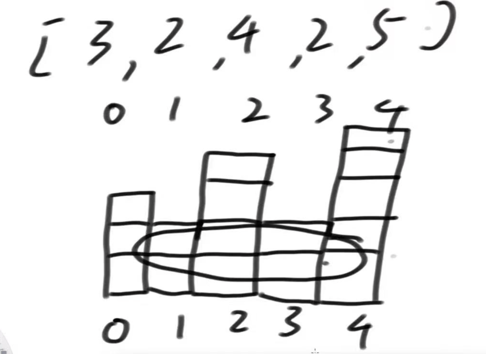  

  解题思路：以数组中的某一项i作为基础，求距离i左右离自己最小的位置的区间大小，区间大小 * i = 区间i的最大面积

3. 给定一个二维数组matrixⅸ，其中的值不是0就是1，返回全部由1组成的最大子矩形，内部有多少个1？
   假设二维数组如下图，则最大的矩阵为arr[0-3][0-2]组成的矩阵，返回12
   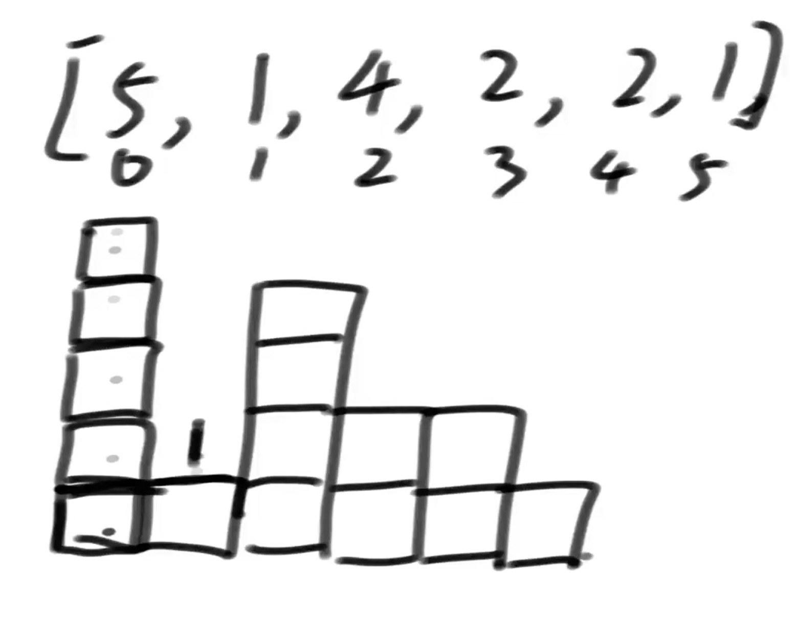 

   解题思路：二维数组压缩技巧，以某一行作为地基的话，哪个直方图的面积最大，假设以第一行为地基直方图为[1,1,1,1,0,1]最大面积为1*4=4,根据上题求出最大长方形面积，以第二行为地基直方图为[2,2,2,2,0,2]最大面积为2 * 4=8,第三行为地基[3,3,3,3,1,3]最大面积为3 * 4=12,第四行为地基[0,4,4,4,2,4]最大面积为4 * 3=12,第五行为地基[1,5,0,5,3,5]最大面积为3 * 3=9，所以最终的最大面积为12，返回12个1

>N*N的矩阵可以形成多少个小的矩阵O(N^4):for(x->N){for(x->N){for(y->N){for(y->N){}}}}

4. 给定一个二维数组matrixⅸ，其中的值不是0就是1，返回全部由1组成的子矩形数量
   解题思路：二维数组压缩技巧，必须以第i行为地基的情况下子矩阵有多少个，所有的行累加后即为最终结果
   假设某一行的为地基的基础下，直方图为[5,1,4,2,2,1]
     
      高度为5矩阵的左右最近的最小值的索引为（-1，1）所以长度为1（len），横向数量为(len*(len+1))/2=1；纵向数量找左右第一个最小值中的最大的一个max(l,r)高度为1，所以纵向数量为4，所以矩阵数量为1*4=4，为何找左右第一个最小值中的最大的一个max(l,r)高度？因为如果算等于1的数量就会在后期真正找到高度为1的情况重复
      以高度为4矩阵的长度为1，横向数量(len*(len+1))/2=1;纵向数量找左右第一个最小值中的最大的一个max(l,r)为2，所以纵向只能4，3两个，最终矩阵数量是1*2=2
      以最后一个高度为1的矩阵长度是6，横向组成的矩阵数量是(len*(len+1))/2（等差数列：0-0，0-1..0-5,1-1..1-5,...5-5）
  注：如果有重复高度，并且高度在同一个连同区域内，则前面的高度可以不算，只算连通区域内最后一个值即可
   
5. 给定一个数组arr,返回所有子数组最小值的累加和
  解题思路：以某个i位置的数作为最小值的时候，也就是找i位置左右第一个比i小的位置l,r,在[l+1,r-1]位置是以i位置作为最小值的，在其中从[l+1,i]->[i,r-1]两个位置中任选一个都是以i作为最小值的，共有(i-l)*(r-i)个以arr[i]为最小值的数量，求数组中以所有位置为最小值的时候的累加和即可
  当数组中在同一个连通取内有重复值时，有两种方式去重
  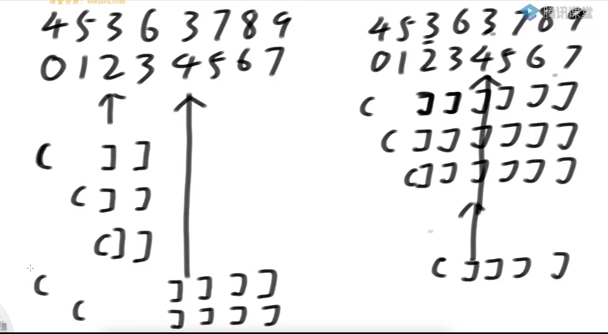
  方式一：i位置左侧第一个数为< a[i] 右边第一个位置为 <= a[i]
  方式二：i位置左侧第一个数为<=a[i] 右边第一个位置为 < a[i]


> 套路：思维传统，有时候题中不会给一个好的套路，可以以某个数作为某个条件的情况下，从这个思路去出发求解
# 第二十七节 斐波那契数列矩阵乘法

求斐波那契数列

[1,1,2,3,5,8,13,...,M],求低N项的复杂度是O(N),而最优的复杂度是O(logN)

斐波那契数列是给定第1项和第2项，每个位置是F(N)=F(N-1)+F(N-2),每个位置都是这个依赖
>只要求某个数都是严格的递推公式，就像F(N)=F(N-1)+F(N-2)每个位置都是严格的公式，都有O(logN)的方法

什么是不严格的递推公式，比如[T,T,F,F,T],第一个数是1，如果某个数为T,则F(N)=F(N-1),如果是F，则F(N)=F(N-1)+F(N-2)，则这种是有有条件转移，无法O(logN),斐波那契数列是没有条件转移的

通过线性代数的方式（线性代数就是为了解决严格递推第几项的问题发明的）
F(N)=F(N-1)+F(N-2)


题目：

1. 有无数块1*2的瓷砖，要铺满高度为2，长度为N的墙有几种方式
  假设长度为2，N=2，则有两种方式（横着两块方式和纵着两块方式）


# 第二十八节 KMP算法

> KMP类似js中的indexOf方法
假设有一个字符串，如果该字符串中包含子串X,则返回字符串中字串第一次出现的位置，如果没有则返回-1

暴力方法：验证每一个位置是否都和子串第一个位置相同，若相同，则判断第二个位置是否相同。
暴力方法的缺点：假如字符串是 aaaaaaaaaab 查找子串aab,先验证字符串第一个位置，匹配，然后验证字符串第二个位置和子串的第二个位置，也匹配，字符串的第三个位置和子串的第三个位置不匹配，所以最终字符串第一个位置是不匹配的，然后验证字符串的第二个位置是否和子串的第一个位置匹配...,假设字符串的长度是N,子串的长度是M,则最坏情况下的复杂度是O(N*M)
 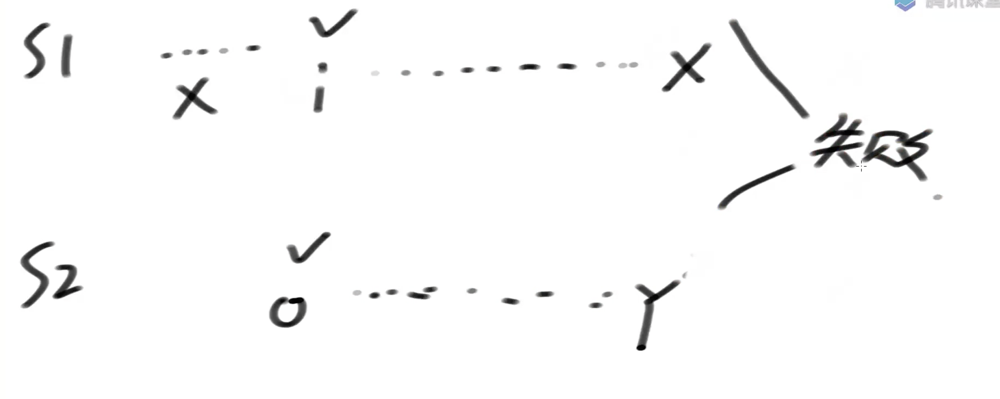 
假设字符串前i-1个位置都匹配不上，从第i个位置出发，如果和子串B第一个位置匹配，一直匹配到字符串的X位置和子串的Y位置发现不匹配，则i位置舍弃，从第i+1位置和子串B第一个位置重新匹配，其中有大量的重复比对过程

-  前缀和后缀的最长匹配长度即最长前缀串和最长后缀串的相等长度（限定前缀长度和后缀长度都不能到达整体）
  假设字符串为abcabck, 求k的前缀和后缀的最长匹配长度
  以下为表格：
  长度：1     2     3     4     5
  前缀：a     ab   abc  abca  abcab
  后缀：c     bc   abc  cabc  bcabc
  所以最长匹配长度是3


KMP的复杂度可以做到O(N)
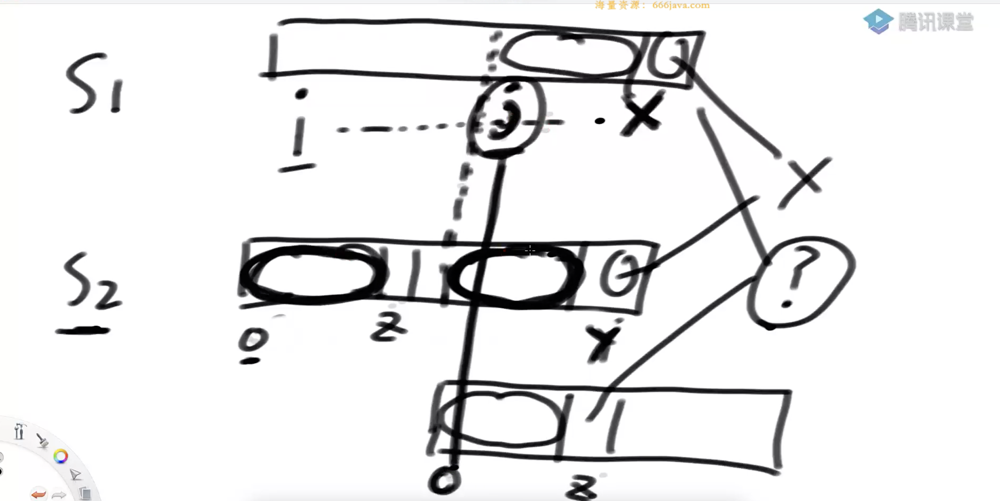 
假设字符串前i-1个位置都匹配不上，从第i个位置出发，如果和子串B第一个位置匹配，一直匹配到字符串的X位置和子串的Y位置发现不匹配，子串B找到Y位置最长前缀串和最长后缀串的相等长度（M）最长后缀字符的第一个位置对应字符串的位置j，从j位置出发和子串B的第一个位置比对，注意，从j位置出发，直接从M+1位置进行比对
其中有两个实质：
  1. 从j位置出发相等长度（M）的后最串不用验证，因为对称，上一次已经验证过，直接从N+1位置开始验证即可
  2.从i到j位置不用验证，因为i+1...j位置肯定匹配不上


假设字符串为 ababt 子串为ababb 子串的每一个位置的前缀和后缀的最长匹配长度数组为[-1,0,0,1,2],当t和b不匹配的时候，比对子串最后一个b的最长匹配长度对应2，也就相当于t和子串下标为2的位置比对

代码如下：
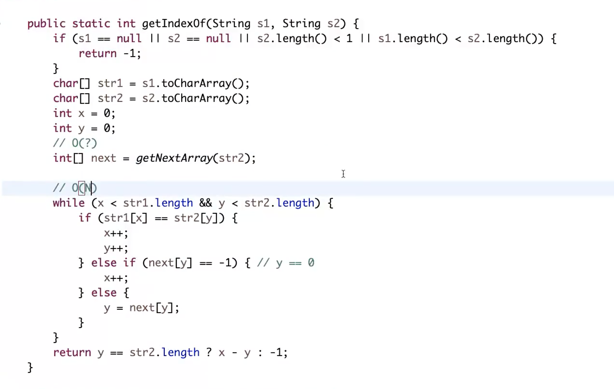
如何验证while中的复杂度是O(N),假设str1的长度是K,所以x.max=K  (x-y).max=K
针对于while的每一个条件分支
表格
分支                        对x的影响           对x-y的影响
分支1(str[x]==str[y])       上升（x++）        不变（x++,y++）
分支2(next[y]=-1)           上升（x++）        上升（x++）
分支3                       不变              上升（y缩小）

由于对x和对x-y的影响都是上升的，且最大都是可以达到K,所以总次数会<=2K,最终的复杂度是O(N)
> 不可以用对x的影响和对y的影响去分析，因为分支3是缩小的，无法求得复杂度，有的增加，有的减少，在数学上用做差的方式进行计算


如何求某个位置的前缀和后缀的最长匹配长度
假设 

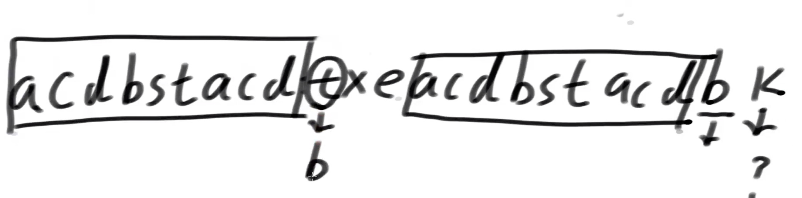
假设字符如上图所示，求k的前后缀最长匹配长度，已知倒数第二个b位置的前后缀的最长匹配长度是9，所以从0-8位置都是b的最长前缀长度，如果第9个位置也是b的话，则k的最长匹配长度为10，现在第9个位置是t，不与b匹配

第9个位置为t的前后缀的最长匹配长度是3，也就是从0-2位置是t的最长前缀长度，第3个位置正好是b，与倒数第二个位置的b匹配，所以k的前后缀最大匹配长度是3+1=4
代码：
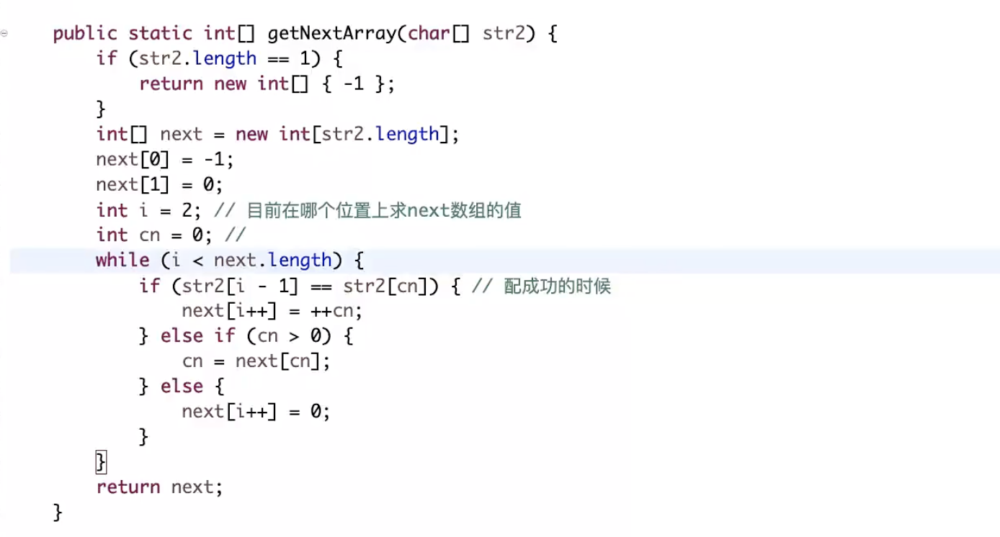

练习：
1. 给定两个字符串str1和str2，判断是否互为旋转串
> 旋转串：假设字符串是abcdef 当把第一个位置放到最后为bcdefa 当把前两个放到最后为cdefab 前五个放到最后为fabcde 则这四个串都是互为旋转串

解题思路，str1拼接str1为sstr1后判断str2是否是sstr1的子串，如果是，则互为旋转串

2. 如果有两棵树，tree1和tree2，如何判断tree2是tree1的子树，先把tree1和tree2先序序列化一下，然后判断tree2是否是tree1的子串即可

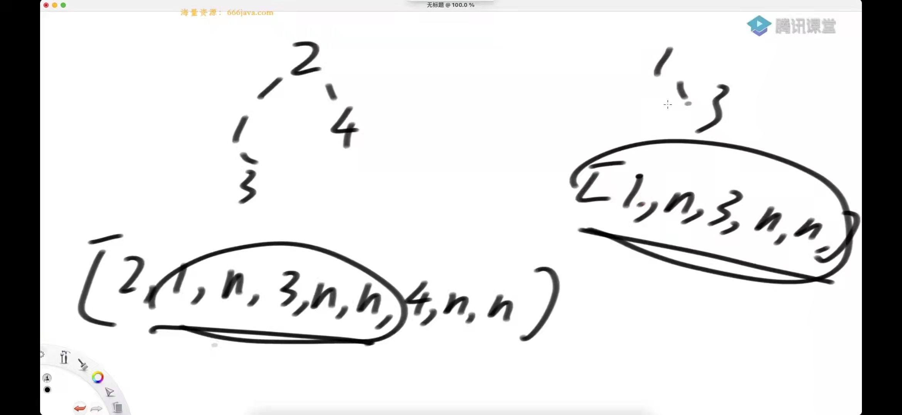

# 第二十九节 Manacher 算法

求字符串中的最长回文子串（子串一定是连续的），例如字符串为 abc123321bcs的最长回文子串是123321

暴力方式：
  方式1:以某个位置作为中心点，向左右两边扩展，找到第一个不想等的位置即为长度限制位置
  假设字符串为
  表格
  字符串   a b a 1 2 3 2 1 a c
  回文长度 1 3 1 1 1 7 1 1 1 1  ---》所以最长回文子串是7

  但是当最长回文子串是偶数个的时候，这种方式并不适用
  表格
  字符串   a b a c c k k e t e
  回文长度 1 3 1 1 1 1 1 1 3 1  ---》最终的最大值为3，但是真正的回文长度是cckk 答案为4才正确，如果中心点是ck中间的位置，即可求得答案

  方式2:所有的字符串的两边都加上一个特殊字符
  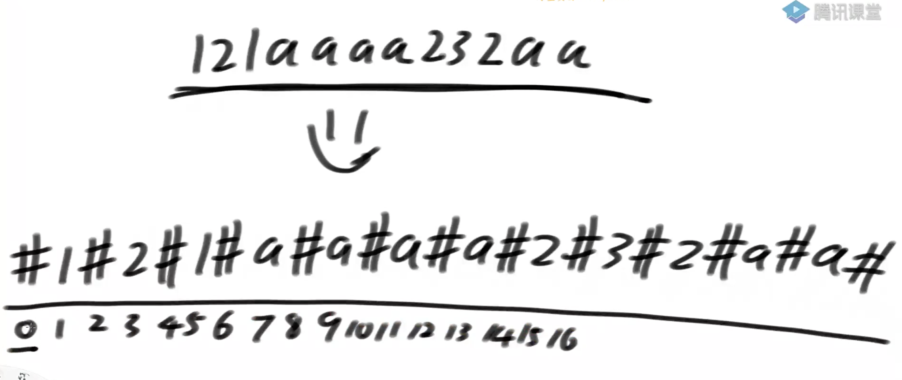
  原始的回文长度是加上特殊字符后的回文长度/2向下取整
  >就算特殊字符和字符串中的字符一样也没有关系，因为特殊字符只和特殊字符比较，不参与原始字符比较逻辑
  复杂度分析（最坏情况）：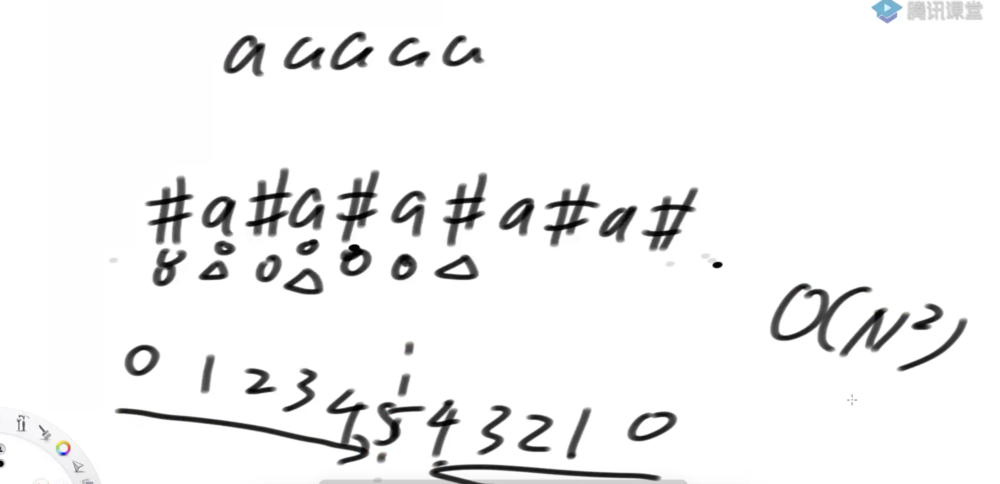


manager方式：
先了解几个概念
1. 回文半径，回文直径 a12321n 最长回文子串是12321 回文直径是5半径是3
2. 回文半径数组，记录每一个位置的回文半径
3. 最右回文边界 开始R=-1,不管现在是在以哪个位置为中心开始扩展，只要扩出来的回文区域的右边界比R更大了，就把R赋予新的最右边界 比如字符 #1#2#3  当以第0个为中心开始，回文区域是0-0，所以R从-1变为0，当以第1个位置为中心开始，回文区域是0-2，所以R=2
4. 导致最右回文边界变化的中心位置C=-1, C和R是伴生关系，R更新C才会更新

manager:以暴力方式2为基础进行优化
1）当i位置没有被R罩住的时候（i>R），正常两边扩，不做任何优化
2）当i被R罩住的时候(i<=R)
 分为三种情况：
 1. 当i的相对于C的对称点i'的回文范围在[L,R]内部，则以i为中心的回文区域长度一定等于i‘为中心的回文区域长度
  假设字符如下图，以t位置为中心的回文区域是0-14,第i个位置相对于C的对称点是i',i'的回文区域是2-4,在0-14内，则第i个位置的回文区域长度一定是3 
              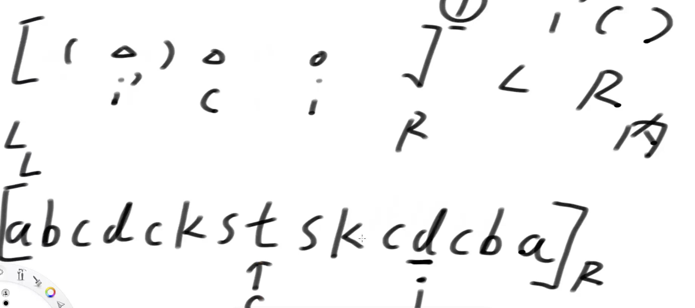

  2. 当i‘的回文区域已经不在[L,R]内部,则i的回文区域一定是 [R-2(R-i),R]
   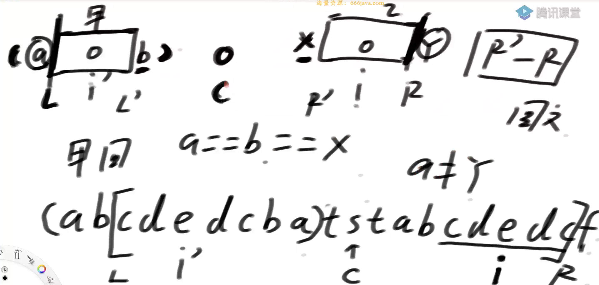
   上图字符串中C的位置是10的s，回文区域是[2-18],求i位置（16）的回文区域，因为i'(位置4)对应的回文区域是[0-8],不完全在C的回文区间中，所以i对应的回文区域大小是（4-2）*2+1 = 5

  3. 当i'的左回文区域正好等于L的时候，则i的回文区域至少是i'回文区域长度
  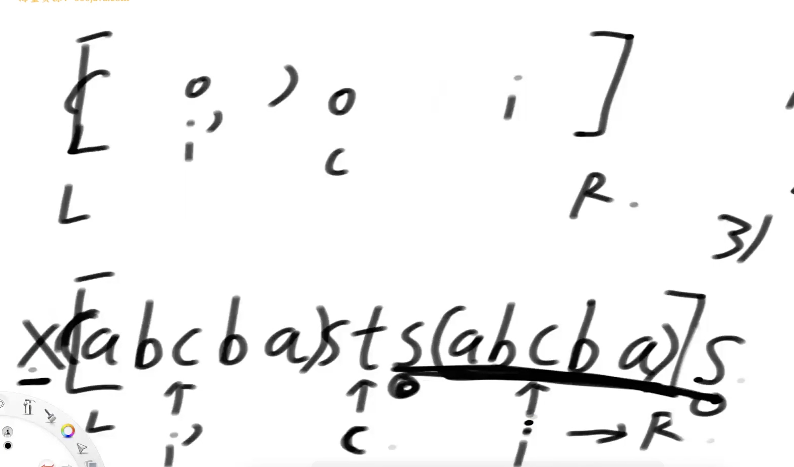

manager复杂度分析：
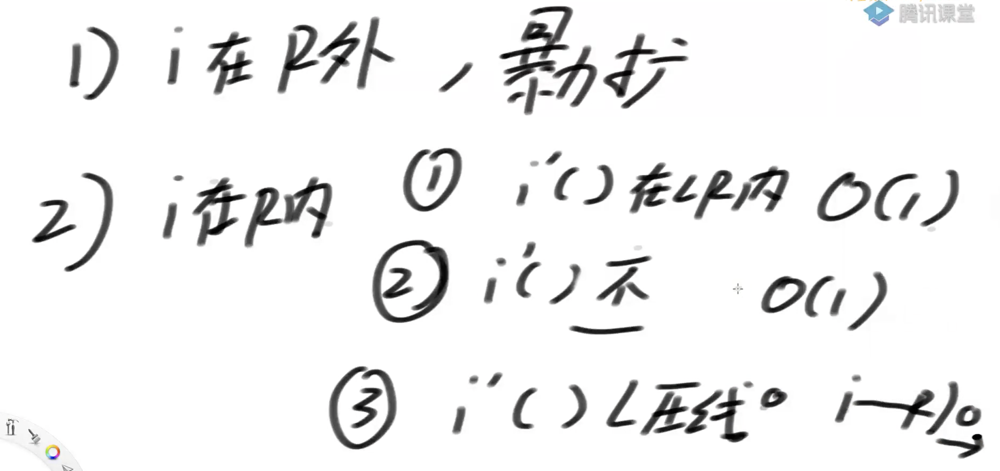
每一个位置只会失败一次，所以N个位置会失败N次，当i在R外，会让R上升，当i在R内，命中条件1，2复杂度都是O(1),命中条件3，可能会让R上升，而R的变化返回时0- N，所以复杂度时O(N)

> 以C为中心i的对应位置i' = 2*C-i

练习： 
1. 在一个字符串中至少添加几个字符可以让字符串变成回文结构
  假设字符串是 abc12321 至少需要添加cba三个字符串才能让其变成回文结构
  > 其实是求必须包含最后一个数的情况下最长回文是多长，也就是求某个中心点第一次把R推到右边届的时候
  例如abcb22加上特殊字符后如下图，第一个推到最右届的位置是第10个位置的#，对应的原始位置是(10-1)/2=4，所以要加4个字符也就是bcba
  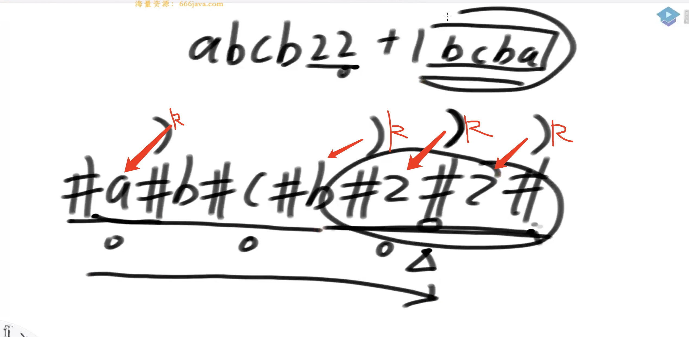
  
# 第三十一节 bfprt 算法  蓄水池算法


在一个无序数组中求第k小的数
1. 快速排序方式(递归方式和迭代方式)
对所有的数随机选择一个数，大于该数的放右边，等于放中间，小于放左边，可以只要等于的区间范围，如果k在此范围内直接返回，不在此范围内，如果比等于的数小，求左边范围，大求右边范围，在剩余的范围内继续随机选一个数进行此过程 复杂度为O(N)
>为何在数组中随机选择一个数作为标准？因为如果是123456，选边上的或许很偏，会O(N^2)
2. bfprt 算法 时间复杂度O(N) 空间复杂度O(1) 《面试提升B格的方式，快排的方式其实就是最优解》
暂时先不学习，未来再学

练习：
1. 给定一个无序数组arr中，长度为N,给定一个正数K,返回前K个最大的数,并且是排好顺序的情况
  不同时间复杂度三个方法：
  1)O(N*logN)  快速排序->截取前k个数
  2)O(N+K*logN) 把数组变成大根堆O(N) 从大根堆中依次弹出K个数O(K * logN)
  3)O(N+K*logK)  在无序数组中求第K大的数O(N),准备一个k长度数组，重新过一遍无序数组，只要比K大的数就进行收集，然后对k长度数组进行排序O(K * logK)


##  蓄水池算法
解决的问题：
假设有一个源源吐出不同球的机器，只有装下10个球的袋子，每一个吐出的球，要么放入袋子(袋子只能装10个球，超过10个后会随机扔掉一个)，要么永远扔掉，如何做到机器吐出每一个球之后，所有吐出的球都等概率被放进袋子里？

解答：如果小于10，则进入的概率是100%；如果大于10，以10/i的概率放入袋子中，即可满足每个球可以等概率的放入袋子中

例如，当我放入11号球的时候，以10/11的概率放入，则袋子中某一个球被挤出的概率是（1/10）*（10/11）=1/11，所以某个球存活的概率是10/11

当我放入12号球的时候，以10/12的概率放入，则袋子中某一个球被挤出的概率是（1/10）*（10/12）=1/12，所以某个球存活的概率是11/12，某个球总存活的概率是10/11 * 11/12   = 10/12

当我放入1230号球的时候，以10/1230的概率放入，则袋子中某一个球被挤出的概率是（1/10）*（10/1230）=1/1230，所以某个球存活的概率是1229/1230，某个球总存活的概率是10/11 * 11/12 * ... * 1229/1230  = 10/1230

代码：
 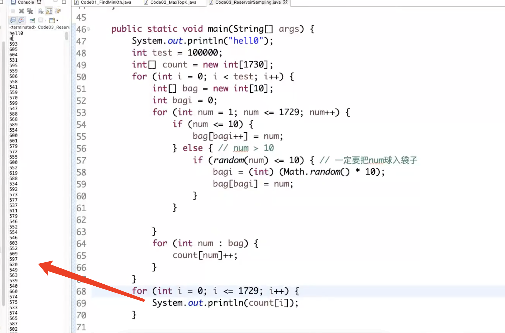

工程上的应用：假设有一个国际类型的游戏，用户很多，每个地区都有服务器，要做一次抽奖活动，规则是所有1月1日00:00-23:59登录过的用户（第一次登录）进行抽奖一次，中奖用户有100名（等概率），并于1月2日00:00进行公布得奖名单

如果不用蓄水池就要把所有的服务器的所有名单拿到手，抽取100人，非常耗大的工程，无法在1月2日00:00进行公布

有蓄水池，全球所有的服务器只和一台服务器交互，全球所有的服务器只有在1月1日00:00-23:59第一次登录的时候，唯一一台服务器记录每个用户是第几个登录的，超过100后以100/i的概率进入即可做到等概率

# 第三十二节 Mirrors 遍历

二叉树的遍历（先中后）时间复杂度为O(N)(因为每个节点都会有限的访问几次)，空间复杂度为O(tree的高度)（系统会自动进行压栈出栈操作）

Mirrors是为了解决二叉树遍历空间复杂度是O(tree的高度)的问题，Mirrors遍历的空间复杂度是O(1)

`未来进行学习`

# 第三十三节 线段树

解决问题：
假设我有一个数组长度为N,我想要做到以下区间操作
1. add(rangeStart,rangeEnd,num):选中一个区间范围，对区间上对每个数都加上一个数值
2. update(rangeStart,rangeEnd,num):选中一个区间范围，更新每一个位置为一个具体数值
3. querySum(rangeStart,rangeEnd):选中一个区间范围，返回范围内的累加和

常规做法每个方法都是O(N)的复杂度
线段树可以达到O(logN)的复杂度

做法：
向准备一个累加和树，假设数组为[3,2,1,4,1,6],我们假设数组的下标从1开始，则该数组的累加和树对应的数组如下图所示
 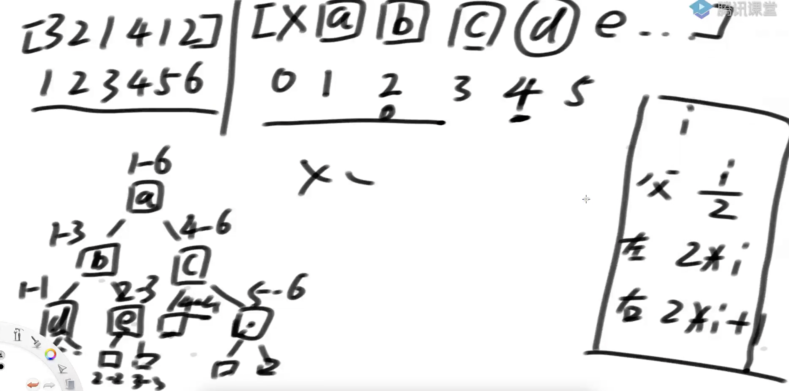
> 树中某个节点父节点对应累加和数组的索引下标为i/2,树中某个节点在数组中的位置i对应的左右孩子的下标为i*2和i * 2+1

>新的累加和数组准备的大小是原数组的4*N倍即可
>二叉树最后一层的数量等于上面所有的格子数量

 假设数组[0,0,0,0](下标从1开始),再准备一个累加和数组和一个懒更新数组，0位置舍弃不用，初始化状态如下图
 <!--  -->
 我们要在1-4位置上，每个位置加上3
  <!--  -->
 只需要在懒更新数组中1-4位置，也就是数组的第1个下标从0变为3即可，再来个任务，1-2范围上所有的数加4
 如果原来的懒更新数组上有数，则清0，当前数在树中向下移一位，所以懒更新数组1位置为0，懒更新数组2，3位置为原来的3
   <!--  -->
 因为要更新1-2范围的数每个数要加4，并且树中1-2会把此任务全包，并且有数，所以先把树中1-2位置的数在懒数组中向下移动，懒数组中4，5位置的值变成3，1-2位置的数清零，因为全包，所以又由0变成4
   