UML 图有很多种，但是并非必须掌握所有的 UML 图，才能完整系统分析和设计工作。一般说来，在 UML 图中，只要掌握类图、用例图、时序图的使用，就能完成大部分的工作。也就是说，掌握 UML 的 20%，就能做 80% 的事情。对于程序员来说，最频繁使用的莫过于类图。因此，这里我们只讲解 UML 类图。至于其它 UML 图，请在以后的工作中参阅更多 UML 学习资料继续学习。

类图是面向对象系统建模中最常用和最重要的图，是定义其它图的基础。类图主要是用来显示系统中的类、接口以及它们之间的静态结构和关系的一种静态模型。类图中最基本的元素是类、接口。软件设计师设计出类图后，程序员就可以用代码实现类图中包含的内容。

## 类图中具体类、抽象、接口和包的表示法

UML 类图中具体类、抽象类、接口和包有不同的表示方法。

### 1）在 UML 类图中表示具体类

具体类在类图中用矩形框表示，矩形框分为三层：第一层是类名字。第二层是类的成员变量；第三层是类的方法。成员变量以及方法前的访问修饰符用符号来表示：

- “+” 表示 `public`；
- “-” 表示 `private`；
- “#” 表示 `protected`；
- 不带符号表示 `default`。

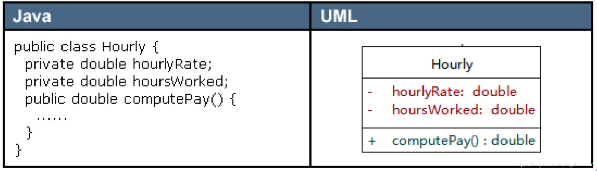

### 2）在 UML 类图中表示抽象类

抽象类在 UML 类图中同样用矩形框表示，但是抽象类的类名以及抽象方法的名字都用斜体字表示，如图 2 所示。

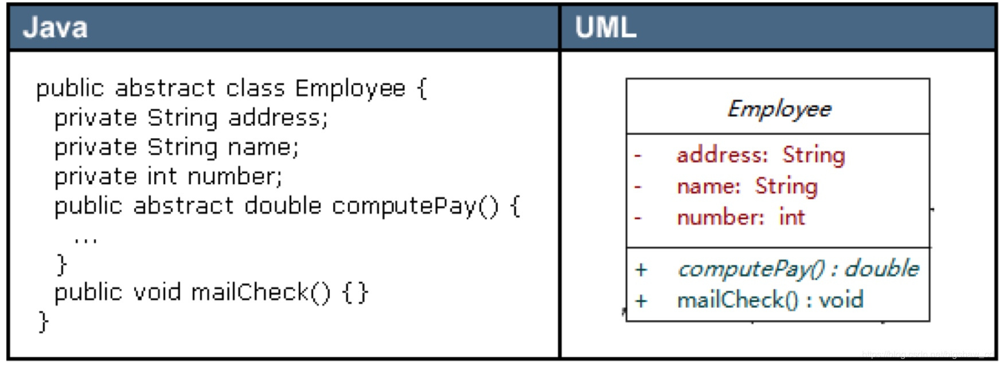

### 3）在 UML 类图中表示接口

接口在类图中也是用矩形框表示，但是与类的表示法不同的是，接口在类图中的第一层顶端用构造型 <<interface>> 表示，下面是接口的名字，第二层是方法，如图 3 所示。此外，接口还有另一种表示法，俗称棒棒糖表示法，就是类上面的一根棒棒糖（圆圈 + 实线）。圆圈旁为接口名称，接口方法在实现类中出现。

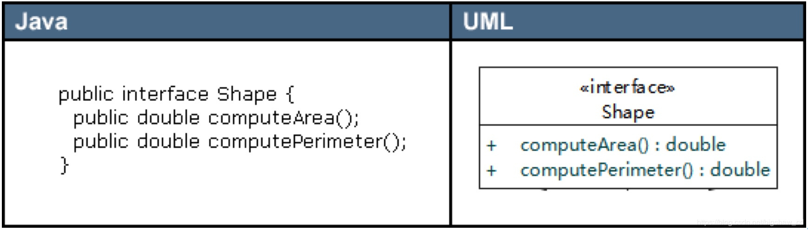

### 4）在 UML 类图中表示包

类和接口一般都出现在包中，UML 类图中包的表示形式如图 4 所示。

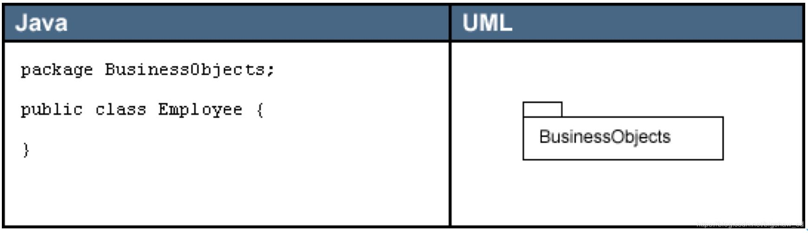

## 在类图中表示关系

类和类、类和接口、接口和接口之间存在一定关系，UML 类图中一般会有连线指明它们之间的关系。关系共有六种类型，分别是实现关系、泛化关系、关联关系、依赖关系、聚合关系、组合关系，如图 6 所示。

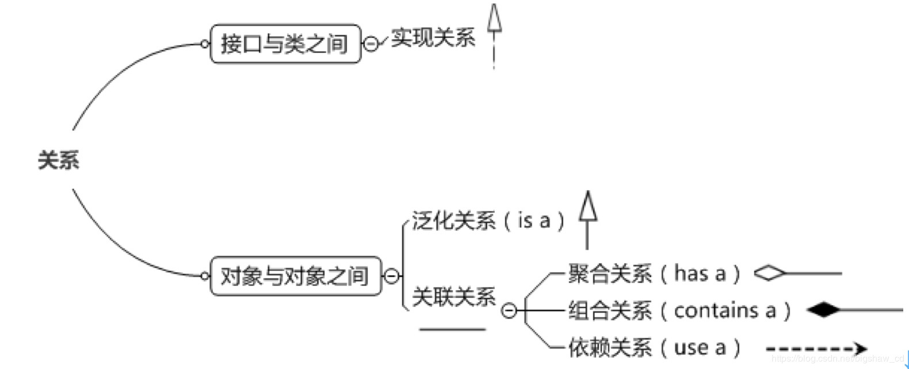

下面我们详细讲述这些关系，以及在 UML 类图中如何表示这些关系。

### 1）实现关系

实现关系是指接口及其实现类之间的关系。在 UML 类图中，实现关系用空心三角和虚线组成的箭头来表示，从实现类指向接口，如图 1.9 所示。在 Java 代码中，实现关系可以直接翻译为关键字 `implements`。

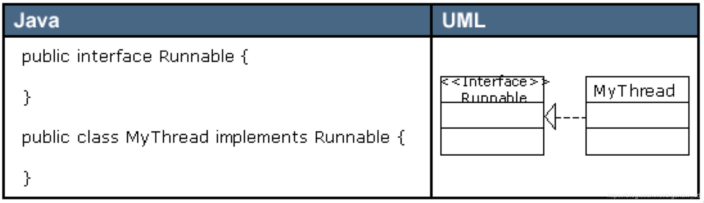

### 2）泛化关系

泛化关系（Generalization）是指对象与对象之间的继承关系。如果对象 A 和对象 B 之间的 “is a” 关系成立，那么二者之间就存在继承关系，对象 B 是父对象，对象 A 是子对象。例如，一个年薪制员工 “is a” 员工，很显然年薪制员工 Salary 对象和员工 Employee 对象之间存在继承关系，Employee 对象是父对象，Salary 对象是子对象。

在 UML 类图中，泛化关系用空心三角和实线组成的箭头表示，从子类指向父类，如图 8 所示。在 Java 代码中，对象之间的泛化关系可以直接翻译为关键字 `extends`。

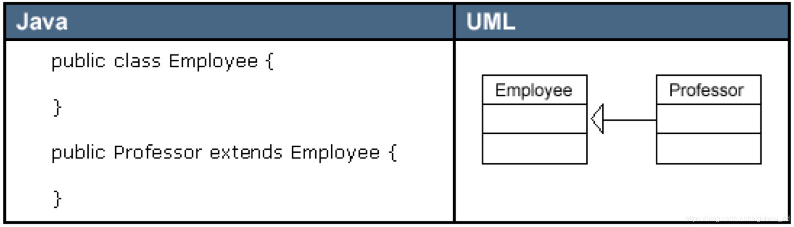

### 3）关联关系

关联关系（Association）是指对象和对象之间的连接，它使一个对象知道另一个对象的属性和方法。在 Java 中，关联关系的代码表现形式为一个对象含有另一个对象的引用。也就是说，如果一个对象的类代码中，包含有另一个对象的引用，那么这两个对象之间就是关联关系。

关联关系有单向关联和双向关联。如果两个对象都知道（即可以调用）对方的公共属性和操作，那么二者就是双向关联。如果只有一个对象知道（即可以调用）另一个对象的公共属性和操作，那么就是单向关联。大多数关联都是单向关联，单向关联关系更容易建立和维护，有助于寻找可重用的类。

在 UML 图中，双向关联关系用带双箭头的实线或者无箭头的实线双线表示。单向关联用一个带箭头的实线表示，箭头指向被关联的对象，如图 9 所示。这就是导航性（Navigatity）。

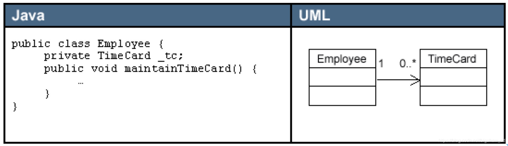

一个对象可以持有其它对象的数组或者集合。在 UML 中，通过放置多重性（multipicity）表达式在关联线的末端来表示。多重性表达式可以是一个数字、一段范围或者是它们的组合。多重性允许的表达式示例如下：

- 数字：精确的数量
- `*`或者`0..*`：表示 0 到多个
- `0..1`：表示 0 或者 1 个，在 Java 中经常用一个空引用来实现
- `1..*`：表示 1 到多个

关联关系又分为依赖关联、聚合关联和组合关联三种类型。

### 4）依赖关系

依赖（Dependency）关系是一种弱关联关系。如果对象 A 用到对象 B，但是和 B 的关系不是太明显的时候，就可以把这种关系看作是依赖关系。如果对象 A 依赖于对象 B，则 A “use a” B。比如驾驶员和汽车的关系，驾驶员使用汽车，二者之间就是依赖关系。

在 UML 类图中，依赖关系用一个带虚线的箭头表示，由使用方指向被使用方，表示使用方对象持有被使用方对象的引用，如图 10 所示。

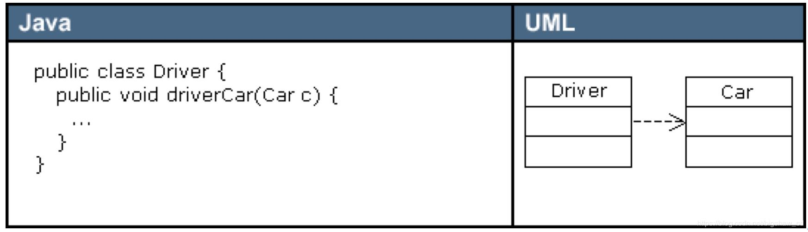

依赖关系在 Java 中的具体代码表现形式为 **B 为 A 的构造器**或**方法中的局部变量**、**方法或构造器的参数**、**方法的返回值**，或者 **A 调用 B 的静态方法**。

下面我们用代码清单 1 和代码清单 2 所示的 Java 代码来演示对象和对象之间的依赖关系。

代码清单 1 所示的`B`类定义了一个成员变量 `field1`，一个普通方法 `method1()` 和一个静态方法 `method2()`。

```
//代码清单1 B.java
public class B {
  public String field1;   //成员变量

  public void method1() {
    System.println("在类B的方法1中");
  }

  public static void method2() {                 //静态方法
    System.out.println("在类B的静态方法2中");
  }
}
```

代码清单 2 所示的`A`类依赖于`B`类，在`A`类中定义了四个方法，分别演示四种依赖形式。

```
/* 代码清单2 A.java
  A依赖于B
*/

public class A {
  public void method1() {
    //A依赖于B的第一种表现形式：B为A的局部变量
    B b = new B();
    b.method1();
  }

  public void method2() {
    //A依赖于B的第二种表现形式： 调用B的静态方法
    B.method2();
  }

  public void method3(B b)  {
    //A依赖于B的第三种表现形式：B作为A的方法参数
    String s = b.field1;
  }

  //A依赖于B的第四种表现形式：B作为A的方法的返回值
  public B method4() {
    return new B();
  }
}
```

### 5）聚合关系与组合关系

聚合（Aggregation）是关联关系的一种特例，它体现的是整体与部分的拥有关系，即 “has a” 的关系。此时整体与部分之间是可分离的，它们可以具有各自的生命周期，部分可以属于多个整体对象，也可以为多个整体对象共享，所以聚合关系也常称为共享关系。例如，公司部门与员工的关系，一个员工可以属于多个部门，一个部门撤消了，员工可以转到其它部门。

在 UML 图中，聚合关系用空心菱形加实线箭头表示，空心菱形在整体一方，箭头指向部分一方，如图 11 所示。

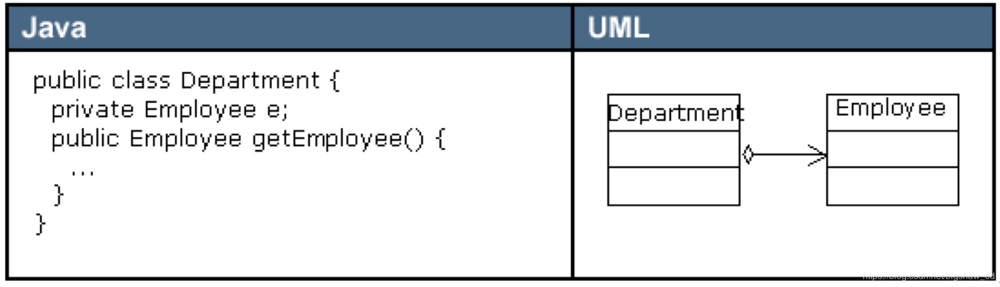

组合（Composition）也是关联关系的一种特例，它同样体现整体与部分间的包含关系，即 “contains a” 的关系。但此时整体与部分是不可分的，部分也不能给其它整体共享，作为整体的对象负责部分的对象的生命周期。这种关系比聚合更强，也称为强聚合。如果`A`组合`B`，则`A`需要知道`B`的生存周期，即可能`A`负责生成或者释放`B`，或者`A`通过某种途径知道`B`的生成和释放。

例如，人包含头、躯干、四肢，它们的生命周期一致。当人出生时，头、躯干、四肢同时诞生。当人死亡时，作为人体组成部分的头、躯干、四肢同时死亡。

在 UML 图中，组合关系用实心菱形加实线箭头表示，实心菱形在整体一方，箭头指向部分一方，如图 12 所示。

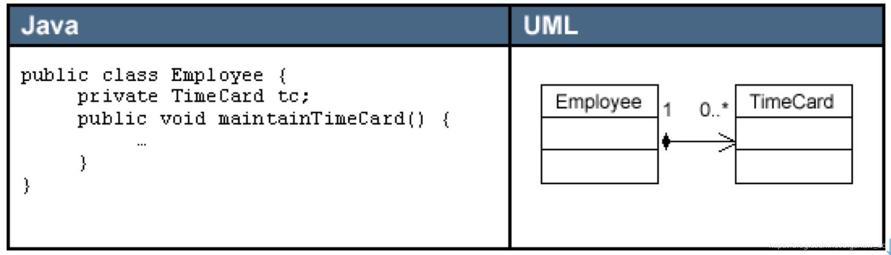

在 Java 代码形式上，聚合和组合关系中的部分对象是整体对象的一个成员变量。但是，在实际应用开发时，两个对象之间的关系到底是聚合还是组合，有时候很难区别。在 Java 中，仅从类代码本身是区分不了聚合和组合的。如果一定要区分，那么如果在删除整体对象的时候，必须删掉部分对象，那么就是组合关系，否则可能就是聚合关系。从业务角度上来看，如果作为整体的对象必须要部分对象的参与，才能完成自己的职责，那么二者之间就是组合关系，否则就是聚合关系。

例如，汽车与轮胎，汽车作为整体，轮胎作为部分。如果用在二手车销售业务环境下，二者之间就是聚合关系。因为轮胎作为汽车的一个组成部分，它和汽车可以分别生产以后装配起来使用，但汽车可以换新轮胎，轮胎也可以卸下来给其它汽车使用。如果用在驾驶系统业务环境上，汽车如果没有轮胎，就无法完成行驶任务，二者之间就是一个组合关系。再比如网上书店业务中的订单和订单项之间的关系，如果订单没有订单项，也就无法完成订单的业务，所以二者之间是组合关系。而购物车和商品之间的关系，因为商品的生命周期并不被购物车控制，商品可以被多个购物车共享，因此，二者之间是聚合关系。
